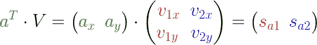
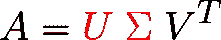

# 你不知道 SVD(奇异值分解)

> 原文：<https://towardsdatascience.com/svd-8c2f72e264f?source=collection_archive---------1----------------------->

## 真正理解 SVD——直观的核心思想

回到基础力学，你知道任何力矢量都可以分解成沿 *x* 和 *y* 轴的分量:

(Animation by author)

> ***祝贺。*** *现在你知道什么是奇异值分解了。*

令人失望的是，几乎 SVD **的每个教程都把它变得比必要的更复杂，而核心思想却非常简单。**

由于数学只是为同一概念赋予不同名称的艺术， **SVD 只不过是将向量分解到正交轴上**——我们只是决定它可能需要一个更豪华的名称。

我们来看看这是怎么回事。

当向量( ***a*** )被分解时，我们得到 3 条信息:

(Image by author)

1.  投影的**方向**—**单位**矢量( ***v* ₁** 和 ***v* ₂** ) **代表我们投影(分解)的方向**。在上面，它们是 x 轴*和 y 轴*和*，但是可以是任何其他正交轴。*
2.  投影的**长度**(线段**s***ₐ***₁和 s***ₐ***₂)——它告诉我们**在每个投影方向上包含了**多少矢量(更多的矢量 ***a*** 是向 ***v* ₁** 倾斜的)**
3.  投影的**个矢量**(***pₐ*₁**和***pₐ*₂**)——用于将**个原始矢量*相加(作为矢量和)， 而对于这一点很容易验证，***pₐ***= s***ₐ***₁****v*₁**和***pₐ*₂**= s***ₐ₂*******v*—*****

# *关键结论:*

> *任何向量都可以表示为:*
> 
> *1.投影方向单位向量(v₁、v₂……)。*
> 
> *2.投影到它们上面的长度(sₐ₁，sₐ₂，…)。*

*SVD 所做的就是**将这个结论**扩展到不止一个向量(或点)和所有维度:*

**

*An example of a dataset (**a point can be considered a vector through the origin**). (Image by author)*

*现在的问题是知道如何处理这个烂摊子。*

# *如何处理这个烂摊子*

*如果不先处理一个向量，我们就无法处理这些混乱！*

*如果你观察数学中的许多概括，你会发现它们主要利用**矩阵。***

> *所以我们必须找到一种方法，用矩阵来表达向量分解的运算。*

*这是一件很自然的事情:*

**

*Same figure as before, but tilting the axes of projection to convince you they aren’t confined to x and y. (aₓ and aᵧ are the coordinates of vector **a**, put into a column matrix (aka column vector), as per convention. Same for v₁ and v₂). (Image by author)*

*我们要分解(投影)矢量 ***a*** 沿着单位矢量 ***v* ₁** 和 ***v* ₂** 。*

*你可能已经知道(特别是如果你已经看过这个)投影是由**点积**完成的——它给出了投影的**长度**(s***ₐ***₁和 s ***ₐ*** ₂):)*

**

*Projecting (a) onto v1 and v2\. (Image by author)*

*但那是多余的。我们可以利用矩阵的效率…*

**

*…to write both equations in one go, by adding an **extra column** for each unit vector. (Image by author)*

*我们甚至可以添加更多的点…*

**

*…by adding an **extra row** for each point. **S** is the matrix containing the lengths of projections. (Image by author)*

*下面是添加那个点 ***b*** 后的样子:*

**

*(Image by author)*

*现在很容易推广到任意数量的点和维度:*

**

***n** = no. of points, **d** = no. of dimensions, **A** = matrix containing points, **V** = matrix containing the decomposition axes, **S** = matrix containing lengths of projection. (Image by author)*

*最佳的数学优雅。*

**

*(Animation by author)*

# *概述:-*

**

*The dot product in this case is just **ordinary matrix multiplication**. (Image by author)*

*这就相当于说:*

**

*Because **V** contains orthonormal columns, its inverse = its transpose (property of orthogonal matrices). (Image by author)*

*SVD 就是这么说的(记住关键结论):*

> *任何一组向量(A)都可以用它们在某一组正交轴(V)上的投影长度(S)来表示。*

*然而，我们还没有到达那一步。常规的奇异值分解公式表示:*

**

*但这只是意味着我们想看看:*

**

*这就是我们要做的。*

*如果你仔细观察矩阵 ***S*** ，你会发现它包括:*

**

*(Image by author)*

*事实证明(原因将在后面看到)，如果我们能够**规格化**这些列向量，也就是说，使它们成为单位长度的**，那是最好的。***

*这是通过做相当于**将每个列向量除以其大小来完成的，但是以矩阵形式**。*

*但是首先，用一个数字例子来看看这个“除法”是怎么做的。*

**

*假设我们要将 ***M*** 的 ***第 1***列除以 **2** 。我们肯定要**乘以另一个矩阵**才能保持等式:*

**

*验证未知矩阵无非是**个单位矩阵，用除数** **= 2** 代替*个第 1 个*元素:*

**

*将 ***2nd*** 列除以 **3** 现在变成了一件直接的事情——只需将单位矩阵的 ***2nd*** 元素替换为 **3** :*

**

*It should be obvious how this operation can be generalized to any matrix of any size.*

*我们现在要把上面的“除法”概念应用到矩阵 ***S*** 上。*

*为了归一化 ***S*** 的列，我们按照它们的大小来划分…*

**

*(Image by author)*

*…通过对上例中的 ***S*** 做我们对 ***M*** 做的事情:*

**

*(Image by author)*

# *最后…*

**

*Singular Value Decomposition (Compact or Thin version)*

*当然，一些精细的细节和严谨的数学被无可非议地掩盖起来，以便*而不是*偏离核心概念。*

# *解释*

*先说这个 ***U*** 和**σ**…*

**

*(Image by author)*

*西格玛夫妇呢。为什么我们要用正常化的*来寻找它们呢？**

**我们已经看到，(σ ***ᵢ*** )是投影长度平方之和的**平方根，所有点的**，到第 *i* 个单位矢量 ***vᵢ*** 。**

**那是什么意思？**

****

**Red segments = projections on v1\. Blue segments = projections on v2\. **The closer the points to a specific axis of projection, the larger the value of the corresponding σ.** (Animation by author)**

**由于 sigmas 在其定义中包含了特定轴上投影长度的总和，**它们代表了所有点离该轴有多近。****

**例如，如果σ₁ > σ₂，那么大多数点数更接近于 ***v* ₁** 而不是 ***v* ₂** ，反之亦然。**

**这在 SVD 的无数应用中有着巨大的用途。**

# **主要应用程序**

**求矩阵的奇异值分解的算法不是随机选择投影方向(矩阵的列 ***V*** )。**

> **他们选择它们作为数据集的主要组成部分(矩阵 A)。**

**如果你读过我的第一篇文章，你会很清楚主要成分是什么…**

****

**…they’re the lines of largest variation (largest variance). (Image by author)**

**从[同样的](/https-medium-com-abdullatif-h-dimensionality-reduction-for-dummies-part-1-a8c9ec7b7e79)你也知道**降维**的目标是**将数据集投影到方差最大**的直线(或平面)上:**

****

**Magenta: points before projection. Violet: points after projection (reduced dimensionality). (Image by author)**

**现在，使用 SVD 投影数据集的行为变得轻而易举，因为**所有的点都已经*投影*** (分解)在所有的主成分上(即 ***vᵢ*** 单位向量):**

****

**(Image by author)**

**例如，要将数据集投影到第一个主成分上…**

****

****…all we have to do is remove all columns not related to the 1st principal component**. The projected dataset in now **A’**. (Image by author)**

**将两个矩阵(上面的 s 和 V *ᵀ* 相乘得到矩阵 a ’,其包含最后一个图中的投影点(紫色)。**

**仅此而已…暂时如此。**