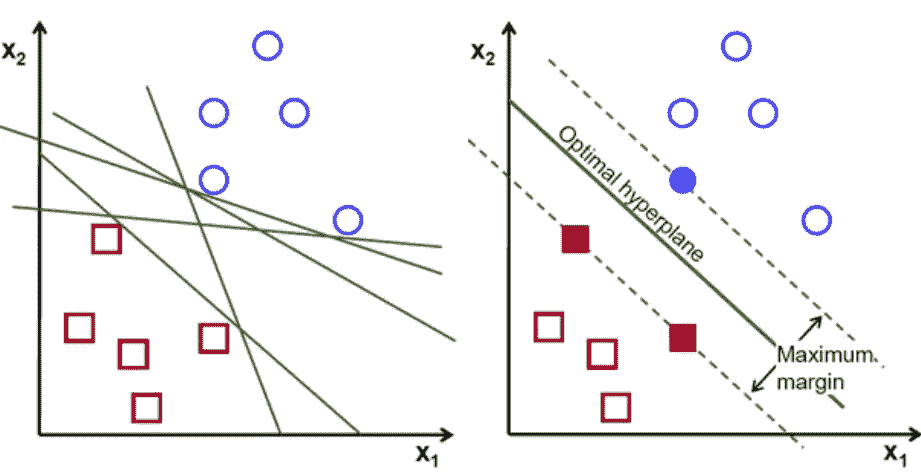
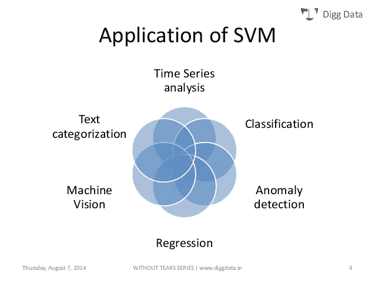
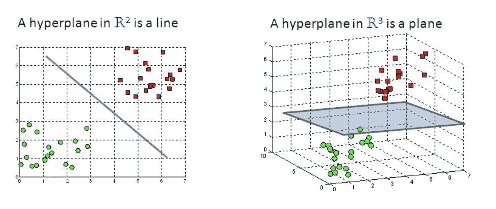
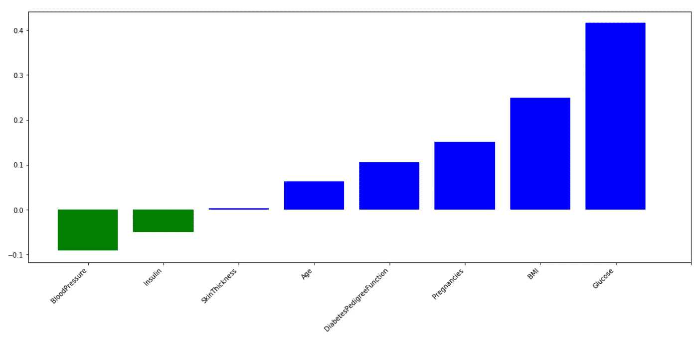

# SVM:特征选择和内核

> 原文：<https://towardsdatascience.com/svm-feature-selection-and-kernels-840781cc1a6c?source=collection_archive---------5----------------------->



(Source: [https://towardsdatascience.com/support-vector-machine-vs-logistic-regression-94cc2975433f](/support-vector-machine-vs-logistic-regression-94cc2975433f))

> 支持向量机(SVM)是一种受监督的机器学习算法，可用于分类和回归目的。
> 
> 诺埃尔·班布里克。

# 介绍

支持向量机(SVM)是一种机器学习算法，可用于许多不同的任务(图 1)。在本文中，我将解释数学基础，以演示该算法如何用于二进制分类目的。



Figure 1: SVM Applications [1]

SVM 的主要目标是找到最佳超平面，以便在不同类别的数据点之间进行正确分类(图 2)。超平面维度等于输入特征的数量减一(例如，当处理三个特征时，超平面将是一个二维平面)。



Figure 2: SVM Hyperplane [2]

超平面一侧的数据点将被分类到某个类别，而超平面另一侧的数据点将被分类到不同的类别(例如，如图 2 中的绿色和红色)。超平面和该超平面任一侧上的第一点(对于所有不同的类)之间的距离是该算法关于其分类决策的确信度的度量。距离越远，我们就越有信心 SVM 做出的决定是正确的。

最接近超平面的数据点称为支持向量。支持向量确定超平面的方向和位置，以便最大化分类器余量(并因此最大化分类分数)。SVM 算法应该使用的支持向量的数量可以根据应用任意选择。

使用 Scikit-Learn Python 库，只需几行代码就可以轻松实现基本的 SVM 分类。

```
from sklearn import svm
trainedsvm = svm.SVC().fit(X_Train, Y_Train)
predictionsvm = trainedsvm.predict(X_Test)
print(confusion_matrix(Y_Test,predictionsvm))
print(classification_report(Y_Test,predictionsvm))
```

有两种主要的分类 SVM 算法硬边界和软边界:

*   **硬边界:**旨在寻找最佳超平面，而不容忍任何形式的错误分类。
*   **软利润:**我们在 SVM 增加了一定程度的宽容。以这种方式，我们允许模型自愿错误分类一些数据点，如果这可以导致识别能够更好地概括看不见的数据的超平面。

通过在`svm.SVC`中添加一个 C 惩罚项，可以在 Scikit-Learn 中实现软余量 SVM。C 越大，算法在进行错误分类时得到的惩罚越多。

# 内核技巧

如果我们正在处理的数据不是线性可分的(因此导致较差的线性 SVM 分类结果)，可以应用一种称为核技巧的技术。这种方法能够将我们的非线性可分数据映射到一个更高维的空间，使我们的数据线性可分。使用这个新的维度空间，SVM 可以很容易地实现(图 3)。


Figure 3: Kernel Trick [3]

有许多不同类型的核可用于创建这种高维空间，一些例子是线性、多项式、Sigmoid 和径向基函数(RBF)。在 Scikit-Learn 中，可以通过在`svm.SVC`中添加一个内核参数来指定一个内核函数。可以包含一个称为 gamma 的附加参数来指定内核对模型的影响。

如果数据集中的要素数量大于观测值数量，通常建议使用线性核(否则 RBF 可能是更好的选择)。

当使用 RBF 处理大量数据时，速度可能会成为一个需要考虑的约束。

# 特征选择

一旦拟合了我们的线性 SVM，就可以使用训练模型上的`.coef_`来访问分类器系数。这些权重表示与超平面正交的正交向量坐标。相反，它们的方向代表预测的类。

因此，可以通过相互比较这些系数的大小来确定特征重要性。因此，通过查看 SVM 系数，可以识别分类中使用的主要特征，并去除不重要的特征(方差较小)。

减少机器学习中的特征数量非常重要，尤其是在处理大型数据集时。这实际上可以:加速训练，避免过度拟合，并且由于数据中噪声的减少，最终导致更好的分类结果。

图 4 显示了我在皮马印第安人糖尿病数据库上使用 SVM 识别的主要特征。绿色表示对应于负系数的所有特征，蓝色表示正系数。如果你想了解更多，我所有的代码都可以在我的 [Kaggle](https://www.kaggle.com/pierpaolo28/pima-indians-diabetes-database) 和 [GitHub](https://github.com/pierpaolo28/Companies-Data-set-Challenges/blob/master/Microsoft%20Workshop%20-%20Deep%20Learning%20Data%20Analysis%20in%20Azure.ipynb) 个人资料中免费获得。



Figure 4: Feature Importance using SVM

# 数学

如果你想深入研究 SVM 背后的数学，我在这里留下了 Patrick Winston 的演讲，可以在麻省理工学院开放课程 YouTube 频道上找到。这个讲座说明了如何推导 SVM 决策规则，以及哪些数学约束是适用于使用拉格朗日乘数。

Video 1: [MIT OpenCourseWare](https://www.youtube.com/channel/UCEBb1b_L6zDS3xTUrIALZOw) [4]

# 联系人

如果你想了解我最新的文章和项目[，请通过媒体](https://medium.com/@pierpaoloippolito28?source=post_page---------------------------)关注我，并订阅我的[邮件列表](http://eepurl.com/gwO-Dr?source=post_page---------------------------)。以下是我的一些联系人详细信息:

*   [Linkedin](https://uk.linkedin.com/in/pier-paolo-ippolito-202917146?source=post_page---------------------------)
*   [个人博客](https://pierpaolo28.github.io/blog/?source=post_page---------------------------)
*   [个人网站](https://pierpaolo28.github.io/?source=post_page---------------------------)
*   [中等轮廓](https://towardsdatascience.com/@pierpaoloippolito28?source=post_page---------------------------)
*   [GitHub](https://github.com/pierpaolo28?source=post_page---------------------------)
*   [卡格尔](https://www.kaggle.com/pierpaolo28?source=post_page---------------------------)

# 文献学

[1]无泪支持向量机，Ankit Sharma。访问地点:[https://www.slideshare.net/ankitksharma/svm-37753690](https://www.slideshare.net/ankitksharma/svm-37753690)

[2]支持向量机—机器学习算法介绍，[罗希斯·甘地](https://towardsdatascience.com/@grohith327)。访问:[https://towardsdatascience . com/support-vector-machine-introduction-to-machine-learning-algorithms-934 a 444 FCA 47](/support-vector-machine-introduction-to-machine-learning-algorithms-934a444fca47)

[3]支持向量机，杰瑞米·乔登。访问地点:[https://www.jeremyjordan.me/support-vector-machines/](https://www.jeremyjordan.me/support-vector-machines/)

[4]麻省理工学院开放式课程，16。学习:支持向量机。访问地点:[https://www.youtube.com/watch?v=_PwhiWxHK8o](https://www.youtube.com/watch?v=_PwhiWxHK8o)