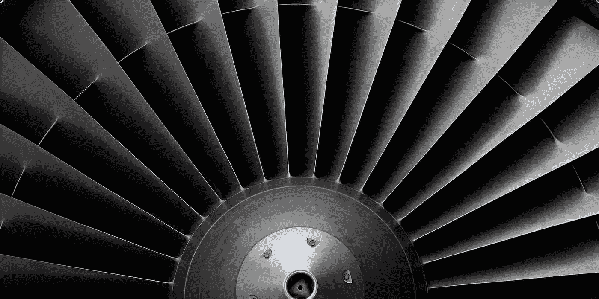
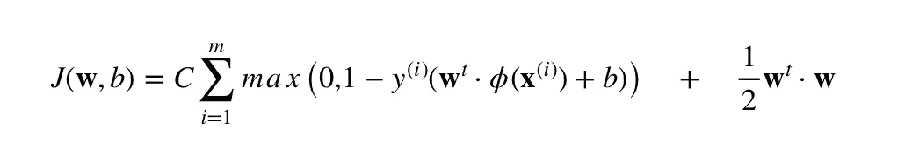
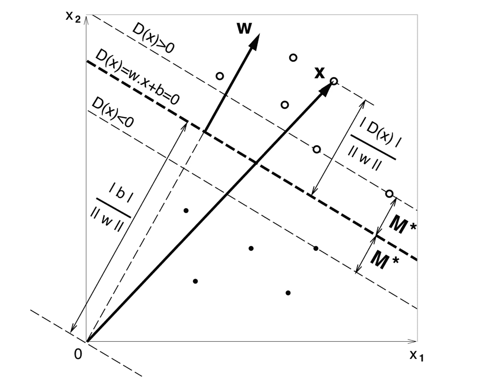

# 基于内核的图形处理器 SVM 优化

> 原文：<https://towardsdatascience.com/svm-optimization-on-a-gpu-with-kernelml-acb3d17856cd?source=collection_archive---------24----------------------->

## 使用 GPU 训练健壮的分类器

本[笔记本](https://colab.research.google.com/drive/1AptayjRoDITNLmyfCc0T7z_xKFBlg2l-)展示了使用基于模拟的优化器对多类线性支持向量机的优化。任何基于模拟的优化器都可以与本笔记本中的 Cuda 内核一起使用。在这个例子中，我使用了我的定制优化器 KernelML。这个脚本的运行时应该设置为使用 GPU: Runtime- >改变运行时类型。

最初的 SVM 公式可以在 [Vapnik 1992](https://www.svms.org/training/BOGV92.pdf) 中找到。自那以后，该算法的鲁棒性有所提高。请参见[鲁棒分类器 2019 第 6.1 节](https://www.mit.edu/~dbertsim/papers/Machine%20Learning%20under%20a%20Modern%20Optimization%20Lens/Robust_Classification.pdf)。健壮的实现看起来非常繁琐。如果您对实现它感兴趣，请考虑给我发电子邮件以及查看 KernelML 的文档。电子邮件:rohankotwani@gmail.com。

SVM 通常使用语言乘数和二次规划来优化。然而，这个优化过程可能不够快，我们希望利用 GPU。:)我们将用蛮力方法优化 SVM 原始形式。实际上，使用基于模拟的方法并不是一个坏主意，因为训练 SVM 的计算复杂度是 O(N)，其中 N 是数据点的数量。

SVM Primal Form

损失函数根据到类边界的距离对错误分类的数据点进行惩罚。容限损失 C 被限制为 C>0。目标 y 包含-1 或 1，其中 1 表示目标类。请参见下图，了解*最大余量线性决策函数*的直观表示。

Vapnik 1992

Iris 数据集用于测试使用 GPU 进行基于模拟的优化的可行性。数据集有 150 行和 4 列。这是一个小数据集，但这很好，因为 Google/Colab 倾向于禁止使用太多计算时间的用户。这个算法的并行 CPU 实现可以在[这里](https://github.com/freedomtowin/kernelml/blob/master/kernelml-support-vector-machine.py)找到。

我鼓励您在 Google 的 Colab 环境中运行这个脚本，我希望这会让您感兴趣。我很高兴看到 GPU 和基于模拟的优化器可以实现什么惊人的事情。这是创造性的内容，所以没有人被允许专利的任何工作；)