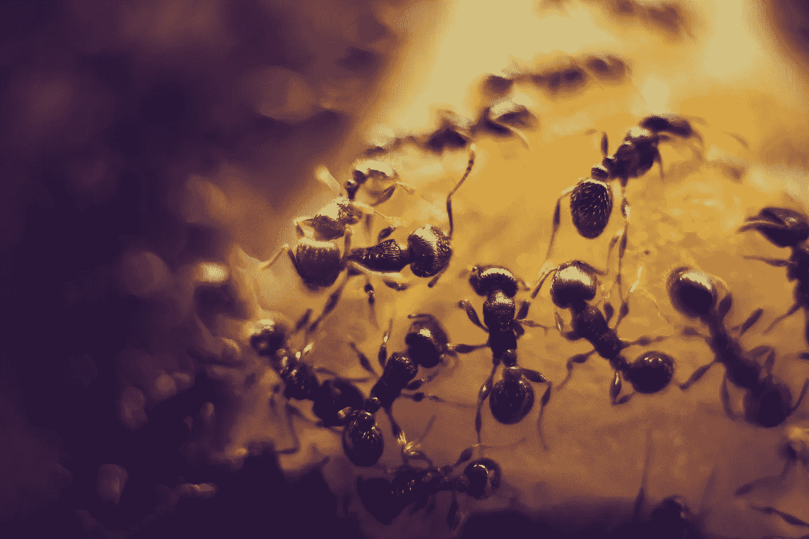
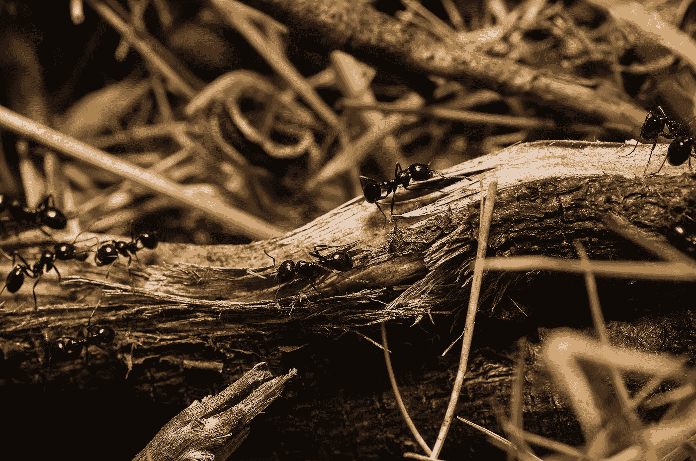
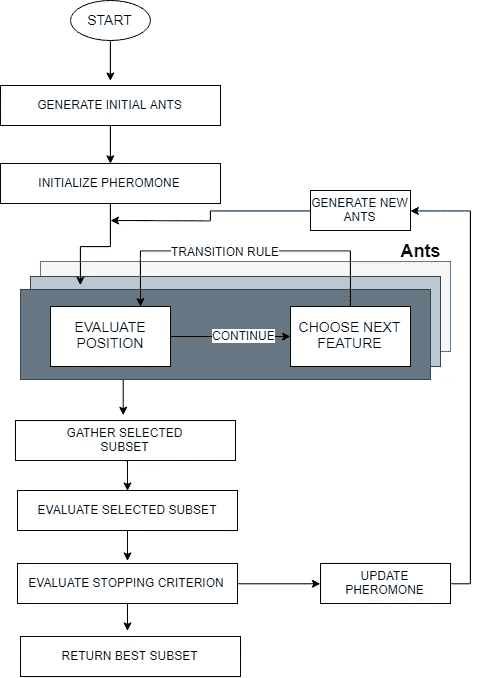

# 群体智能:蚁群内部

> 原文：<https://towardsdatascience.com/swarm-intelligence-inside-the-ant-colony-9ffbce22a736?source=collection_archive---------16----------------------->

## 蚁群优化导论

*“整体大于其部分之和”*是一句众所周知的名言，根据格式塔心理学，它总结了一个系统的概念——*整体*——是一种更复杂的东西，不同于其基本元素的集合。

换句话说，试图理解一个复杂的系统，试图把它分解成基本的部分，这种尝试不可避免地会失败，会遗漏一些单个部分无法单独表达的东西。

抛开格式塔心理学不谈，开篇引文将有助于理解本文的主题:蚁群优化算法(ACO)。

蚂蚁社会是一个组织良好的等级结构，有特定的角色和规范的行为。



尽管有许多种类的蚂蚁，而且每一种都有自己的特点，但我们可以确定一个共同的组织结构:蚁后和工蚁。

工蚁执行蚁群的各种任务:觅食、维护巢穴、照料幼虫、防御等等。

正是通过对蚂蚁觅食行为的观察，Marco Dorigo 在 1992 年提出了蚁群优化算法，为元启发式研究以及后来被定义为**群体智能**做出了贡献。

这个想法来自于对觅食蚂蚁行为的观察:当一只蚂蚁离开巢穴寻找食物时，她会留下一条信息素痕迹，其他蚂蚁可以跟着走；如果她找到了一些食物，她会返回巢穴——使用相同的路径——在回来的路上留下更多的信息素。

如果她没有找到任何食物，她不会在返回巢穴的路上放下任何信息素，先前的踪迹会消失。

如果其他觅食蚂蚁会沿着这些路径追逐，它们中的大多数会沿着这些路径寻找食物**并将它们的信息素**添加到路径中。

另一群蚂蚁将找不到任何踪迹，或者决定沿着其他路径前进，而其他蚂蚁将在到达路径尽头之前分散开来。

如果我们将这种行为应用于一个大的群体，我们会看到强烈的信息素痕迹出现，将巢穴与食物来源联系起来。

这种基于信息素的间接交流机制是蚁群内部知识共享的基础，并允许蚂蚁找到更好的食物路径。



**Black garden ants** (*Lasius niger*)

# 吸取教训 ACO

从 90 年代早期开始，蚁群的生物学例子第一次被转化为解决组合优化问题的真正方法。

这类问题包括在约束框架内寻找给定函数的全局最大值。

组合优化问题可以用模型来描述:

**P=(S，ω，ф)**

其中 *S* 是具有特定有限域的有限变量集，ω是变量间的一组约束，而是目标函数:最小化\最大化。

一个可行的解决方案是简单地收集所有决策变量，并从它们的域中分配一个值，这样就不会违反 omega 约束。

求解算法将为每个变量分配一个称为求解分量的特定值；
单一解决方案是所有解决方案组件的集合。

最优解的搜索和大量的约束使得这类问题难以解决，也因为穷举搜索通常是不可能的。

例如，让我们考虑旅行推销员问题(TSP)。

问题如下:
*“给定一个城市列表和每对城市之间的距离，访问每个城市并返回出发城市的最短可能路线是什么？”*。


这是组合优化的一个明显的例子，由于数学模型必须产生和处理大量的约束，该组合优化经常不能用穷举搜索来解决，并且数学精确方法不能在可接受的时间内收敛。

多年来，许多启发式算法被开发并应用于这类 NP 难问题。

回到 ACO，我们可以使用前面介绍的 P 模型来形式化 TSP 问题:

首先，我们将代表 *n* 个城市的每个节点与一个变量 X(i)相关联，该变量的域有 n-1 个值: *j = {1，…，n}其中 j！=一.*

在一对城市之间的每条边上，我们关联一个代表信息素值的数值τ。

具有指定域值的所有 X(i)的集合是一个解，当且仅当对应于这些值的边的集合形成哈密尔顿循环(这个约束可以被引入蚂蚁选择行为)。

最后，函数(minimize)计算每个解的边长之和。

# 算法——元启发式

自从引入以来，ACO 算法已经被提出了许多不同的版本；以下是 ACO 的一般算法思想:

```
begin
    initialization();
    while (termination condition not met) do
      ConstructAntSolutions();
      LocalSearch();
      GlobalPheromoneUpdate();
    end
end
```

最初，我们从一系列解决方案组件开始，这些组件将允许我们建立构造图、要考虑的约束列表以及将在算法中使用的一些参数。

在初始化步骤中，设置所有参数并布置构造图，并为每个变量(边)分配初始信息素值。

在构造解决方案阶段，一组蚂蚁一个接一个地开始，通过遍历图来构造解决方案。

每只蚂蚁存储自己的解决方案，并在沿着图行进时更新它。

一开始，所有的蚂蚁都从一个空的解开始，在每个构建步骤中，通过选择一个代表可行组件的节点来扩展当前的解。

理想情况下，选择组件和更新部分解决方案的这一过程是在保持解决方案可行性的情况下进行的，如果这不可能或太难保持，则部分解决方案一旦完成，就可以根据违反约束的程度而被丢弃或处罚。

实施选择过程时，计算每个解决方案组件被选择的可能性:


其中τ是弧上的信息素，η是启发式信息，就目前而言，我们可以把它定义为每个分量解的特殊值。(将在下面几行描述)。

*N(s(p))* 是可以添加以保持可行性的解决方案组件集。

α和是在初始化步骤中具有固定值的参数，其确定信息素值和启发式信息的相对重要性。

一旦计算出 p，我们就可以应用所谓的伪随机比例规则:


其中 *r* 是一个介于 0 和 1 之间的随机数，q0 是一个也介于 0 和 1 之间的固定参数，它作为 r 的一个阈值，允许我们更加重视勘探或开采。

事实上，如果 r 大于或等于 q0，蚂蚁将根据 p(探索)的概率分布在解决方案组件之间随机选择。

启发式信息是在组件解决方案(节点)上计算的数值，代表该组件在问题特定知识方面的质量或重要性。

启发式信息可以在初始化步骤中预先计算*或者可以在运行时计算。*

对于大多数 NP-hard 问题，启发式信息是先验已知的，并且在整个算法执行过程中不会改变。

在其他情况下，启发式信息取决于到目前为止构建的部分解决方案，因此在每一步都进行计算。

例如，在 TSP 中， **η** 由边的长度定义:d(ij)的负一次方。

LocalSearch 步骤是可选的；这一阶段的目的是通过利用问题知识来改进蚂蚁获得的解决方案，即移动和替换一些解决方案组件。

最后，在全局信息素更新中，信息素沉积和蒸发过程被应用到图中。

这个阶段的目标是使好的解决方案更适合下一次迭代。

这是通过两种方式实现的，首先通过增加属于最佳解决方案或良好解决方案列表的边上的信息素值，然后通过模拟信息素蒸发。

在过程的这一点上，我们已经有了由蚂蚁产生的完整解决方案的列表；此外，我们可以通过所谓的*评估函数*或*目标函数*来评估这种解决方案，该目标函数确定给定的完整解决方案的质量(在 TSP 的情况下是距离的总和)。

此外，对于这个阶段，存在许多信息素更新方法，例如，我们可以决定加强迄今为止的单个最佳解决方案的信息素。

对于当前迭代的每个完整解决方案，通用的方法更通用；我们使用以下公式更新每个信息素变量:


其中 **1** 是在边缘
(0 < **ρ** < 1)上保留的旧信息素的分数，而 **2** 是包含该特定成分的所有评估函数的总和。

因此，如果当前边 i-j 没有被任何解考虑，则公式的第二项为零，并且使用简单蒸发机制更新信息素( **1** )。

在信息素更新后，检查终止条件以查看结果是否足够好，例如，如果在 100 次连续迭代中最佳解没有改善，我们可以决定停止。

# 应用和结果

> 现在我知道了什么是蚁群优化，我从中获得了什么？

蚁群算法的应用很多，涉及不同的领域，以下是一些例子:

-路线问题

-分配和调度问题

-分类规则

-蛋白质折叠

- DNA 测序

-贝叶斯网络

…还有许多其他的

其广泛的潜在应用来源于整个方法的灵活性，以便在信息素机制的同时，在信息素分布和评估阶段引入特定的问题知识。

# 最后一个示例:特征选择

在总结 ACO 元启发式算法之前，有必要展示一个它在数据科学中一个常见研究领域的应用示例:特征选择。

高维空间问题是一个常见的问题，它影响着许多用于数值分析、机器学习、数据挖掘等的数据集。

抛开高维空间可能带来的问题([了解更多信息](/curse-of-dimensionality-2092410f3d27))，ACO 如何被用作特征约简方法是很有趣的。

从 n 个特征的列表开始，我们希望减少整个集合，搜索包含最重要和最有代表性的特征的子集。

首先，由于 ACO 是一个基于图的元启发式算法，我们需要布局整个图。

图的每个节点代表初始 n 个特征集合中的一个特征，每个边代表从实际特征到另一个特征的选择。

每个蚂蚁将从一个空的特征集开始，遍历图，访问满足遍历停止准则的最小数量的节点，并最终输出一个候选子集。


**Dotted lines**: possible feature to add, **Bold lines**: ant feature selection

如图所示，从节点 A 开始的蚂蚁执行直到节点 F 的路由，然后在建立了满足遍历停止准则(例如，适当高的分类精度)的以下子集{A，B，C，D，F}之后停止。

启发式信息可以通过任何适当的度量函数来计算，例如，基于熵的度量可能非常有效。

蚂蚁选择过程和信息素更新用所描述的相同方法来执行。



整个过程遵循以下步骤: *m* 只蚂蚁被生成并随机放置在图中。
从这些随机位置开始，每只蚂蚁通过遍历边开始构建路径，直到满足遍历停止标准。

收集并评估所有子集；如果这些子集中有一个足够好，或者迭代已经执行了一定次数，则过程停止，并返回找到的最佳子集。

如果这些停止条件都不成立，那么信息素被更新，一个新的蚂蚁群体产生，新的迭代开始。

# 结论

如上所述，蚁群算法诞生于对动物世界的观察，特别是对大群单一简单生物如蚂蚁的观察。

这种直接来源于自然的直觉证明了动物世界可以成为灵感和知识的来源。

ACO 元启发式算法代表了现今一种众所周知的解决多重问题的可靠方法；它以简单或非常复杂的形式存在于各种风格中。

蚁群算法的最大优点之一是能够快速发现好的解决方案；这种优势有时会被过早的收敛所抵消。

尽管 ACO 不适用于连续问题，但它确实是许多优化/离散问题的有效解决方案，值得包含在数据科学家工具箱中。