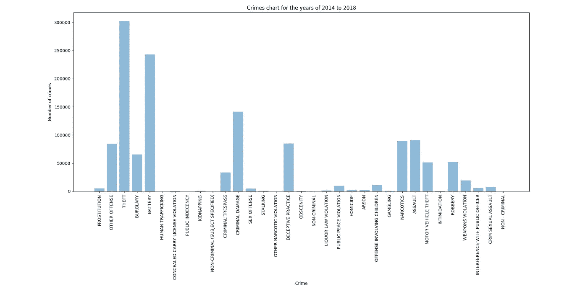
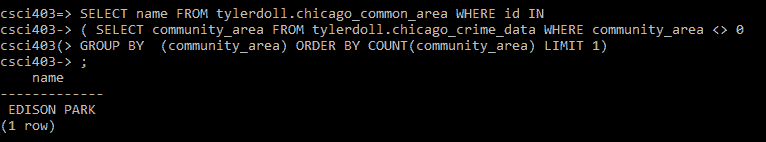
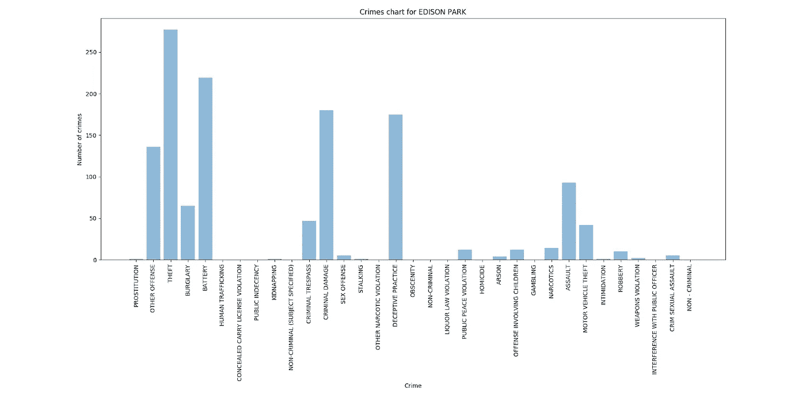
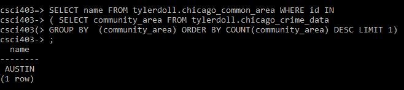
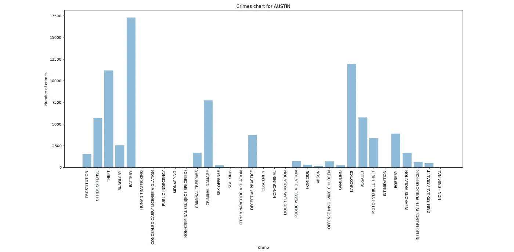
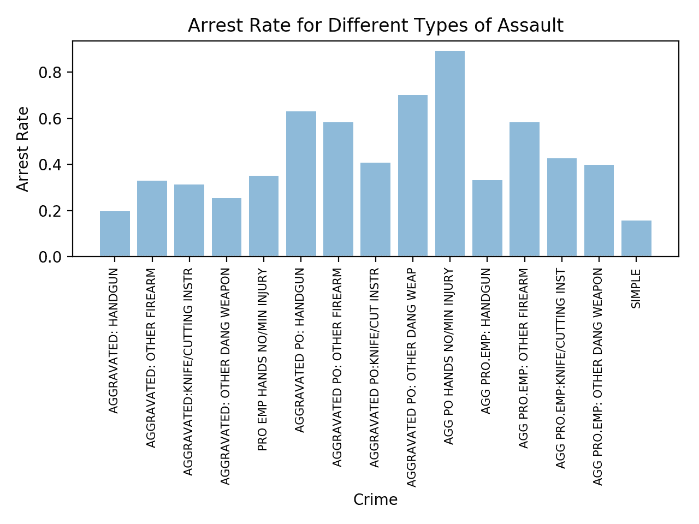
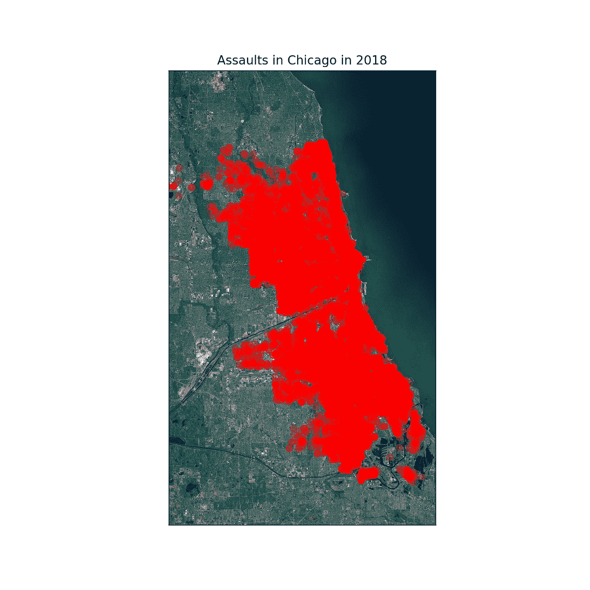
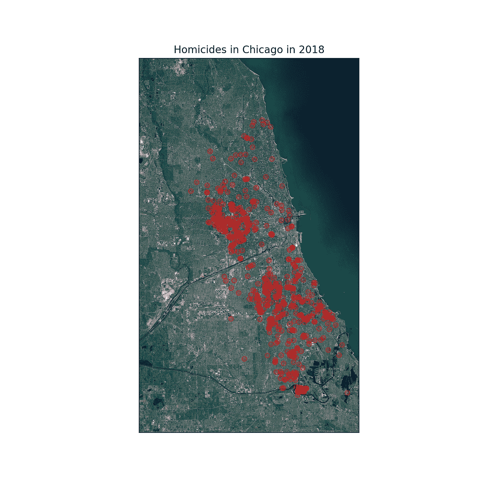

# 甜蜜的家乡芝加哥:审视芝加哥市的犯罪

> 原文：<https://towardsdatascience.com/sweet-home-chicago-examining-crime-in-the-city-of-chicago-5c80f1e23875?source=collection_archive---------21----------------------->

## 数据驱动的方法。

由泰勒娃娃，杰夫格林，加齐莫舍德

> 这篇论文最初是为我大学的数据库课提交的。我们发现它很有趣，我们在它上面花了很多时间，所以我想在这里分享一下。它已被编辑成这种格式。

## **简介**

芝加哥市通常被称为“风城”或“第二大城市”。它经常以它的食物而闻名，包括深盘比萨饼和芝加哥热狗。不幸的是，芝加哥也因其高犯罪率而臭名昭著，而且经常发生暴力性质的犯罪。由于芝加哥市各种犯罪的数据的可用性，我们选择检查芝加哥的犯罪，以确定我们可以从分析数据集得出什么信息。我们很想知道这个城市最常见的犯罪是什么，如果那些高犯罪率每年都有变化，以及不同犯罪的逮捕率是多少。虽然这个数据集可能不包含最令人振奋的信息，但我们认为分析并尝试确定芝加哥是否真的像媒体描绘的那样暴力是有趣的。

## **数据**

我们选择的数据是一个数据集，包含了芝加哥市过去 5 年的犯罪信息。我们认为这将是一个有趣的数据集，因为除了观察芝加哥市的犯罪情况外，我们还可能发现数据中令人信服的趋势。这些数据包括但不限于犯罪日期、犯罪发生的街区、社区区域、伊利诺伊州统一犯罪报告代码(IUCR)、联邦调查局统一报告代码以及报告犯罪的警官的巡逻。该数据集是在 Kaggle 上发现的，该数据集被认为是在知识共享许可 CC0 1.0 公共领域下获得许可的，这意味着我们可以使用这些数据而无需任何进一步的批准。我们总共有四个表，但是其中一个表是用于保存非标准化数据的临时表。在检查完数据并开始对其进行规范化之后，我们最终得到了 3 个主表:芝加哥犯罪数据、芝加哥 IUCR 代码、芝加哥公共区域(邻域)和一个自动生成的 chicago_crime_data 序列表。芝加哥犯罪数据表中的信息和属性在很大程度上是不言自明的。然而，IUCR 表的属性可能需要一点解释。该表中的 id 与 Chicago crime 数据表中使用的 IUCR 代码相匹配。此 id 附加到犯罪的主要描述和次要描述。例如，基于主要描述和次要描述的组合有不同的 id。下面的例子是凶杀案。虽然这三种犯罪都有相同的主要类型，但它们有不同的次要类型和 id。

```
 id | primary_desc | secondary_desc
 — — — + — — — — — — — -+ — — — — — — — — — — — — — 
 0110 | HOMICIDE | FIRST DEGREE MURDER
 0141 | HOMICIDE | INVOLUNTARY MANSLAUGHTER
 0142 | HOMICIDE | RECKLESS HOMICIDE
```

为了便于解释每个表所使用的属性和数据类型，我们在下面包含了两个表模式，它们也包含主键和外键:

```
 Table “chicago_crime_data” Column                | Type                         
 — — — — — — — — — — — + — — — — — — — — — — — — — — — 
 id                    | integer 
 date                  | timestamp without time zone 
 block                 | text 
 iucr                  | text 
 location_description  | text 
 arrest                | boolean 
 domestic              | boolean 
 community_area        | integer 
 fbi_code              | text 
 latitude              | double precision 
 longitude             | double precision 
Indexes:
 “chicago_crime_data_pkey” PRIMARY KEY, btree (id)
Foreign-key constraints:
 “chicago_crime_data_community_area_fkey” FOREIGN KEY (community_area) REFERENCES chicago_common_area(id)
 “chicago_crime_data_iucr_fkey” FOREIGN KEY (iucr) REFERENCES chicago_iucr_code(id) Table “chicago_iucr_code”
 Column          | Type  
 — — — — — — — — + — — — 
 id              | text
 primary_desc    | text
 secondary_desc  | text
Indexes:
 “chicago_iucr_code_pkey” PRIMARY KEY, btree (id)
Referenced by:
 TABLE “chicago_crime_data” CONSTRAINT “chicago_crime_data_iucr_fkey” FOREIGN KEY (iucr) REFERENCES chicago_iucr_code(id)
```

## **结果**

我们在数据库上执行的大多数查询都与特定犯罪的数量和不同犯罪的地点有关。尽管我们希望对数据执行各种各样的查询，但总的来说，我们希望将重点放在犯罪数量上，并使用这些信息来确定哪些犯罪发生得最频繁。我们还调查了哪些犯罪的被捕率最高，以及它们在芝加哥的位置。

[](https://flic.kr/p/2gHucJH)

Figure 1: Chicago’s Crimes 2014–2018

在这里，我们希望发现犯罪的总数，而不考虑其严重性或细节。从图表中我们可以看出，在过去的几年里，盗窃是芝加哥最严重的犯罪，其次是殴打。

[](https://flic.kr/p/2gHtty9)

Figure 2: Chicago’s Crimes in 2018

[](https://flic.kr/p/2gHucLb)

Figure 3: Chicago’s Crimes 2017

从图 2 和图 3 中，我们可以看出，在过去的两年中，盗窃是芝加哥犯罪率最高的犯罪。除了这些可视化，我们还查看了从 2014 年开始的前几年的图表。我们可以利用这些图表得出结论，事实上盗窃是最常见的犯罪，并且在过去几年中没有出现激增。

我们也想看看这些犯罪在芝加哥附近的分布情况。这一数据对芝加哥的新来者很有用，他们试图找到一个犯罪率较低的社区居住，同时远离犯罪率最高的社区。描述每个社区遭受的犯罪类型也是有用的。我们在下面的查询中找到了犯罪最少和最多的区域，我们还查看了犯罪分布。

[](https://flic.kr/p/2gHucLG)

Figure 4: Chicago’s least crime prone neighborhood query and its crime distribution

[](https://flic.kr/p/2gHucM3)

Figure 5: Chicago’s most crime prone neighborhood query and its crime distribution

此外，我们还可以根据用户的请求查询和显示特定社区的犯罪分布情况。



Figure 6: Arrest rate for different types of assault

根据这些数据，我们可以准确计算出人们因特定犯罪而被捕的频率。例如，我们可以看到，对于不同类型的攻击指控，超过 80%的人被指控严重藏毒:手无/分钟伤害被逮捕。这与类似持枪恶意攻击的情况相比很有意思，后者的逮捕率只有 20%左右。



Figure 7: Assaults in Chicago in 2018

我们也可以看到犯罪的具体地点。图 7 显示了自 2017 年 1 月 1 日以来所有已知地点的袭击事件。然而，图表没有区分不同类型和严重性的攻击。不管怎样，可以肯定地说芝加哥存在人身攻击问题。



Figure 8: Homicides in Chicago in 2018

利用位置数据，我们可以确定整个芝加哥凶杀案高度集中的区域。这里的杀人罪包括一级，二级，过失杀人。


Figure 9: Prostitution in Chicago since 2014

一个相当有趣的图表是整个芝加哥与卖淫有关的犯罪。我们在这里可以看到，相关的犯罪似乎是在独特的线模式，最有可能代表整个城市的各种街道。

## **技术挑战**

获得数据后，我们遇到的唯一主要问题是将数据集从 Kaggle 加载到数据库中。数据集作为 BigQuery 数据集存储在 Kaggle 中，这要求我们使用 Kaggle 内核从数据库中下载有限的数据集。我们选择下载过去 5 年的数据，因为这给了我们一个大数据集来处理。在我们成功地获得数据之后，我们在将数据插入临时表时遇到了问题。我们认为这里的大部分问题源于数据集的大小，它包含了超过 130 万行。当尝试接收如此大量的数据时，我们使用的 Windows 机器出现了内存错误，并且没有确定补救的方法。然而，当数据在 Mac 上接收时，我们没有遇到这些问题。为了解决内存错误问题，我们使用 Mac 将数据集加载到数据库中，然后通过我们在 Piazza 上找到的方法向团队的其他成员提供对表的访问。当试图只关注月份而忽略其他月份时，我们还遇到了时间戳字段查询的问题。幸运的是，我们能够使用 EXTRACT 命令做到这一点。

## **结论**

在分析了图表和其他图像后，我们可以得出这样的结论:芝加哥是一个非常危险的城市，实际上就像媒体描述的那样暴力。光是袭击的数量就已经相当惊人了，更不用说杀人率了。在项目中使用这些数据使作业变得有趣，尽管它不是最令人愉快的数据集。我们觉得使用这个数据集将类似于我们在可能的行业就业中可能必须处理的数据，所以这个任务给了我们对未来就业有帮助的经验。