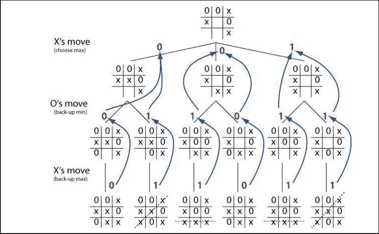
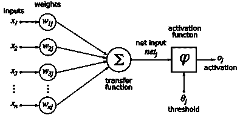

# 符号 vs 连接主义人工智能。

> 原文：<https://towardsdatascience.com/symbolic-vs-connectionist-a-i-8cf6b656927?source=collection_archive---------7----------------------->

随着神经网络等连接主义技术的流行，主要竞争对手符号人工智能被证明是需要动态适应、可验证性和可解释性的任务关键型应用程序的正确战略补充。

Photo by [Pablo Rebolledo](https://unsplash.com/@prvelasco89?utm_source=medium&utm_medium=referral) on [Unsplash](https://unsplash.com?utm_source=medium&utm_medium=referral)

似乎只要有两种类型，人们就会很快选择其中一种，然后将两者对立起来。*人工智能*技术传统上分为两类；象征性人工智能和连接主义人工智能。后一种人工智能随着[最近的成功故事](https://www.forbes.com/sites/bernardmarr/2017/08/08/the-amazing-ways-how-google-uses-deep-learning-ai/#7e23d5b83204)和媒体炒作而变得非常受欢迎，没有人会因为认为它们就是人工智能的全部而受到责备。甚至有一些人[散布虚假信息](https://twitter.com/jackclarkSF/status/1070732718357528577)来转移对更经典的人工智能研发的注意力和资金。

事实是，每一套技术都有它的位置。目前还没有一种银弹人工智能算法，试图对所有问题使用相同的算法是非常愚蠢的。每种工具都有自己的优点和缺点，选择合适的工具是关键。

# 什么是象征性人工智能？

这类技术有时被称为 GOFAI(传统的人工智能)。这并不意味着这些技术已经过时或停滞不前。更经典的方法是**对问题的模型**进行编码，并期望系统根据该模型处理输入数据以提供解决方案。

随着人们认识到基于人工智能的系统要在某些高风险领域被接受，它们的行为需要是可验证的和可解释的，对符号技术的需求最近引起了新一轮的兴趣。这通常很难通过*连接主义者*算法来实现。

属于这一类的系统通常涉及演绎推理、逻辑推理和某种搜索算法，这种算法在特定模型的约束下找到解决方案。这些包括*专家系统*，它使用规则和[决策树](https://en.wikipedia.org/wiki/Decision_tree)从输入数据中推导出结论，*约束解算器*，它在可能性空间内搜索解决方案，以及*计划系统*，它试图找到一系列行动，以从某个初始状态实现明确定义的目标。他们通常还有能够处理不确定性和风险的变种。

A MiniMax Game Tree for Tic-Tac-Toe. ([Image Source](https://www.researchgate.net/figure/Game-tree-for-Tic-Tac-Toe-game-using-MiniMax-algorithm_fig1_262672371))

这种算法通常具有算法复杂性，即 [**NP-hard**](https://en.wikipedia.org/wiki/NP-hardness) **或** [**更糟的是**](https://en.wikipedia.org/wiki/List_of_PSPACE-complete_problems) **，**在试图解决现实世界的问题时面临超大规模的搜索空间。这意味着经典的穷举盲搜索算法将不起作用，除了小的人为限制的情况。相反，最不可能找到解决方案的路径被从搜索空间中剔除，或者尽可能长时间不被探索。

这一类别中有太多的技术。[分支定界](https://web.stanford.edu/class/ee364b/lectures/bb_slides.pdf)算法处理启发式算法不可用的优化或约束满足问题，通过上限和下限划分解决方案空间，并在该分区内搜索解决方案。[局部搜索](https://en.wikipedia.org/wiki/Local_search_(optimization))着眼于一个解决方案的相近变体，并试图逐步改进它，偶尔执行[随机跳跃，试图逃离局部最优](https://en.wikipedia.org/wiki/Simulated_annealing)。[元启发式](https://en.wikipedia.org/wiki/Metaheuristic)包含了这种技术的更广阔的前景，其中[进化算法](https://en.wikipedia.org/wiki/Evolutionary_algorithm)模仿自然界中发现的分布式或协作机制，例如[自然选择](https://en.wikipedia.org/wiki/Genetic_algorithm)和[群体启发行为](https://en.wikipedia.org/wiki/Swarm_intelligence)。

[启发式搜索](https://en.wikipedia.org/wiki/Heuristic_(computer_science))使用评估函数来确定一个状态与目标的*接近度*，使用比试图找到完整解决方案更便宜的估计值来计算。一个值得注意的独立于领域的启发式方法是 [*松弛*](http://citeseerx.ist.psu.edu/viewdoc/download?doi=10.1.1.686.9250&rep=rep1&type=pdf) *，*其中算法忽略了一些约束或可能的现实世界*挫折*以在更*松弛的*世界中找到更快的解决方案。这被用作在搜索的每个决策点做出更明智选择的指导。一个既 [*可接受*](https://en.wikipedia.org/wiki/Admissible_heuristic) (永远不会高估成本)又*信息丰富*的好的启发式算法可以引导诸如 [A*](https://en.wikipedia.org/wiki/A*_search_algorithm) 的算法找到最优解，但不幸的是这样的启发式算法通常不容易获得。对于复杂的问题，找到一个满足所有约束的*可行的*解决方案，尽管不是最优的，也已经是一个很大的壮举了。

A* Heuristic Search for finding Shortest Path (Image Source: [Wikipedia](https://en.wikipedia.org/wiki/A*_search_algorithm))

虽然有些技术也可以处理[部分可观测性和概率模型](https://en.wikipedia.org/wiki/Partially_observable_Markov_decision_process)，但是它们通常不适合有噪声的输入数据，或者模型没有很好定义的情况。它们在这样的场景中更有效，即在某些情况下采取特定的行动可能是有益的或灾难性的，并且系统需要提供正确的机制来*显式编码*和*执行*这样的规则。

符号算法消除了违反指定模型的选项，并且可以被*验证*总是比它们的连接主义对应物更容易产生满足所有约束的解决方案。由于通常很少或没有算法训练，模型可以是动态的，并根据需要快速变化。

# 什么是连接主义者人工智能？

Connectionist A.I .的名字来源于典型的网络拓扑，这一类中的大多数算法都采用这种拓扑。这一类别中最流行的技术是人工神经网络(ANN)。这由多层节点组成，称为*神经元*，它们处理一些输入信号，用一些权重系数将它们组合在一起，然后[挤压它们](https://en.wikipedia.org/wiki/Sigmoid_function)以馈送到下一层。支持向量机也属于连接主义范畴。

人工神经网络有各种形状和大小，包括卷积神经网络(成功用于图像识别和位图分类)，以及长短期记忆网络(通常用于时间序列分析或时间是重要特征的问题)。[深度学习](https://en.wikipedia.org/wiki/Deep_learning)本质上也是人工神经网络的同义词。

A neuron of an Artificial Neural Network. (Image source: [Wikipedia](https://en.wikipedia.org/wiki/Backpropagation))

这类技术的关键方面是用户不指定建模领域的规则。网络*从训练数据中发现*规则。用户提供输入数据和样本输出数据(数据集越大越多样化越好)。然后，连接主义算法应用统计回归模型来调整中间变量的权重系数，直到找到最佳拟合模型。使用[梯度下降](https://en.wikipedia.org/wiki/Gradient_descent)等技术，在最小化所有训练数据点的累积误差的方向上调整权重。

由于这些技术是有效的误差最小化算法，它们对噪声具有固有的弹性。它们将消除异常值，并汇聚成一个解决方案，在一定的误差范围内对数据进行分类。

这些算法*不需要一个世界的模型*。他们只需要足够的样本数据，从这些数据中可以统计性地推断出世界的模型。这是一个非常强大的特点，但也是一个弱点。必须非常仔细地选择输入特征。还必须对它们进行标准化或[缩放](https://en.wikipedia.org/wiki/Feature_scaling)，以避免一个特征压倒其他特征，并对其进行预处理，使其对分类更有意义。

*特征工程*本身就是一项神秘的技术，通常是决定机器学习项目成功的关键因素。拥有太多的特征，或者没有一个覆盖这些特征的大多数排列的代表性数据集，会导致[过拟合或欠拟合](https://machinelearningmastery.com/overfitting-and-underfitting-with-machine-learning-algorithms/)。即使有最熟练的数据科学家的帮助，您仍然受到可用数据质量的支配。这些技术也不能免受[维数灾难](/curse-of-dimensionality-2092410f3d27)的影响，随着输入特征数量的增加，无效解决方案的风险就越高。

A Data Scientist sifting for Features — Photo by [Artem Maltsev](https://unsplash.com/@art_maltsev?utm_source=medium&utm_medium=referral) on [Unsplash](https://unsplash.com?utm_source=medium&utm_medium=referral)

数据驱动算法隐含地假设它们所捕捉的世界模型是相对稳定的。这使得它们对于游戏规则没有显著改变或者改变的速度慢到足以允许收集足够的新数据样本用于重新训练和适应新现实的问题非常有效。图像识别是教科书式的成功故事，因为从现在起一年后[热狗很可能看起来还是一样的](https://itunes.apple.com/us/app/not-hotdog/id1212457521?mt=8)。

Photo by HBO / Twitter.com/TechatBloomberg

# 那么应该选择什么呢？

选择正确的算法很大程度上取决于你要解决的问题。一项技术因错误的原因而被选择，这变得非常普遍，通常是因为围绕该技术的炒作，或者缺乏对人工智能算法更广阔前景的认识。当你拥有的工具是一把锤子时，所有的东西看起来都像钉子。

随着人工智能扩散到我们生活的各个方面，需求变得更加复杂，一个应用程序很可能需要不止一种这样的技术。通过传感器收集的噪声数据可以通过人工神经网络进行处理，以推断出关于环境的离散信息，而符号算法使用这些信息来搜索可能的行动空间，这些行动可以在更抽象的逻辑级别上实现某些目标。

在一定概率水平内，机器学习算法在推断自动驾驶汽车的周围环境方面可能非常有效，但如果它可能使汽车驶下悬崖，那么这种错误的可能性是不可接受的，因为这种情况从未在样本训练数据中正确捕捉到。此外，将深度学习引入任务关键型应用程序被证明是具有挑战性的，特别是当[一辆摩托车仅仅因为翻倒而被混淆为降落伞](https://arxiv.org/pdf/1811.11553.pdf)时。

覆盖一个符号约束系统可以确保逻辑上显而易见的东西仍然得到执行，即使底层的深度学习层由于一些统计偏差或[嘈杂的传感器读数](https://www.heraldnet.com/nation-world/not-just-the-737-angle-of-attack-sensors-have-had-problems/)而另有说法。这对于高风险应用变得越来越重要，如管理发电站、调度火车、自动驾驶系统和空间应用。在这样的系统中错误分类的含义比[推荐错误的电影](https://medium.com/@Hector_27685/netflix-recommendations-are-broken-theres-an-alternative-58d2ab435488)要严重得多。

利用*连接主义者*和*符号算法*的混合系统将利用两者的优势，同时抵消彼此的弱点。单独使用一种技术的局限性[已经被发现](https://arxiv.org/abs/1801.00631)，最新的研究已经开始表明将两种方法结合起来[可以产生更加智能的*解决方案*](https://www.technologyreview.com/s/613270/two-rival-ai-approaches-combine-to-let-machines-learn-about-the-world-like-a-child/)。

Josef Bajada 拥有计算机科学博士学位，专门研究规划和调度的人工智能技术。他是一名技术顾问，为物流和油田技术应用开发人工智能解决方案。上述文章中表达的任何观点纯属其个人观点，不一定代表任何附属机构的观点。