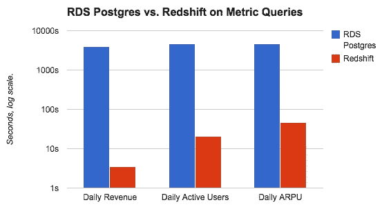
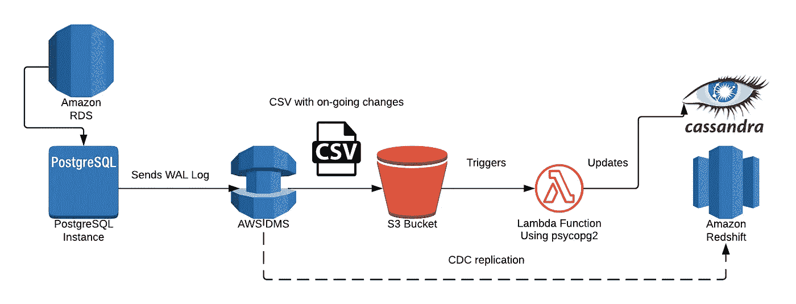
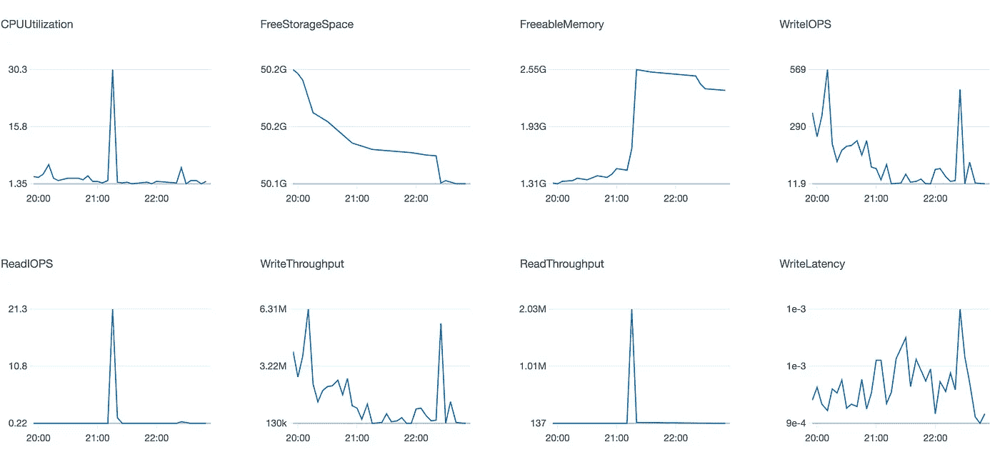
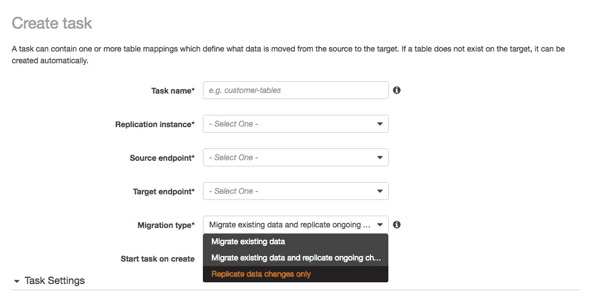
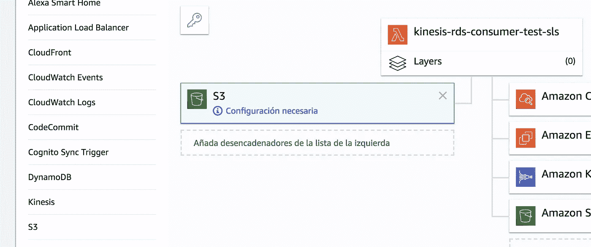

# 使用 AWS DMS 将 AWS RDS Postgres 同步到红移

> 原文：<https://towardsdatascience.com/synching-your-rds-postgresql-database-and-your-redshift-warehouse-using-dms-or-really-any-ea8907aa53ca?source=collection_archive---------9----------------------->

## 实时仓库更新指南

免责声明:这篇文章假设你对编程有所了解。


Photo by [Shahadat Rahman](https://unsplash.com/@hishahadat?utm_source=medium&utm_medium=referral) on [Unsplash](https://unsplash.com?utm_source=medium&utm_medium=referral)

# 问题是

当我们第一次开始了解 AWS 红移时，我们爱上了[快速聚合查询处理](https://aws.amazon.com/es/blogs/big-data/performance-matters-amazon-redshift-is-now-up-to-3-5x-faster-for-real-world-workloads/)。这种强大的优势意味着**在执行统计研究或简单的数据提取时，我们的生产力和速度**突飞猛进。所以，当然，我们把它变成了我们管理的所有数据源(Adwords、Salesforce、FBAds、Zendesk 等)的主数据仓库。)—所有这些，使用[缝合](https://www.stitchdata.com)作为我们主要的 ETL 工具。



RDS Postgres instance vs Redshift on the company’s everyday aggregated query performance time.

Stitch 有一个不错的 100 美元的[订阅计划](https://www.stitchdata.com/pricing/)，为 500 万行提供处理能力，每增加 100 万行收费 20 美元。缝合日志和账单发票告诉我们，在一个非常繁忙的月份，使用上面提到的所有数据源，我们勉强达到了 180 美元。这些月份中的大部分只是普通的 100 美元(没有使用额外的百万行)。

我们公司开发、维护和销售其核心 SaaS 产品[增卡](https://increasecard.com/)。我们的生产数据库托管在 AWS 云中，驻留在 AWS RDS 中，**每月存储 1000 万到 2000 万行新数据**，并且还在大幅增长。
因此，通常情况下，对于一家第三世界的初创公司来说，使用 Stitch 将我们的生产数据库同步到红移仓库会被证明是**极其昂贵的**。另外考虑到我们国家的货币[最近对美元贬值了很多。](https://en.wikipedia.org/wiki/Historical_exchange_rates_of_Argentine_currency)


Argentina’s Congress — Photo by [Sander Crombach](https://unsplash.com/@sandercrombach?utm_source=medium&utm_medium=referral) on [Unsplash](https://unsplash.com?utm_source=medium&utm_medium=referral)

我们还有另一个限制。该公司正在开发其第二个主要产品[*increacenconcicion*](https://increasecard.com/conciliacion/)。这一个使用 NoSQL [Apache Cassandra 数据库](http://cassandra.apache.org/)来存储和处理其庞大的数据。问题是，两个产品必须同步，以便*会议*使用*卡*提取的交易。换句话说，我们必须**建立一个可供任何服务消费的数据湖，以按需执行同步操作。**

很多事情要考虑，对吧？

# 测试解决方案

作为一个 2 人的小团队，强大的“数据团队”，我们很容易尝试和测试新事物，尤其是**架构**。

我们从使用 AWS 数据管道开始，这是一种基于 UI 的服务，用于在一堆数据源之间构建 ETL。尽管构建 ETL 的**过程相当简单**，但是为了使它有效，我们必须采取一系列的变通方法——记住我们必须更新每一个变化，不管是插入、删除还是更新。由于这里不能使用代码，很快就变成了**不可维护**。此外，对于这项服务，IMO 没有太多详细的文档或清晰的示例。

我们尝试设置一个 Lambda，每 15 分钟消耗一次 Postgres 数据库的复制槽的日志，并将其发送到 Kinesis Firehose 数据流。在一个生产过程更新了比通常预期更多的行之前，它看起来似乎是安全可靠的。我们发现，在这些情况下，记录来自逻辑解码的方式是充满所涉及的表的大块更改的巨大行，导致**函数每次试图加载它时都会因内存不足而死亡**。我们通过将`true`设置为逻辑解码插件的属性`write_in_chunks`来解决这个问题，我们使用([*wa*l*2json*](https://github.com/eulerto/wal2json)*)*，使我们能够对传入的 json 日志进行分区。长话短说，由于没有足够的时间来处理巨额交易，该功能仍可能**终止不成功。不好的消息。**

# 你来这里做什么

好吧，让我们开始吧。



Architecture diagram — Made with [Lucidchart](http://lucidchart.com/)

我们当前的架构包括以下内容:

*   DMS(数据库迁移服务)实例复制对红移和 S3 的持续更改。
*   红移源端点。
*   DMS 使用 S3 桶作为*目标端点*。
*   每次在上述 S3 桶中创建对象时触发的 Lambda。
*   (可选)订阅同一对象创建事件的 SNS 主题。这使您能够订阅该主题的任何内容，例如，多个 lambdas。更多信息，请点击此[链接](https://docs.aws.amazon.com/AmazonS3/latest/dev/ways-to-add-notification-config-to-bucket.html?shortFooter=true)。

为了让这篇文章更“民主”，我会把它分成两部分。第一个是将变化直接复制到红移的步骤。第二，建立 S3 数据湖供其他服务使用。你可以随意阅读其中一个，或者更好的是，两个都读😄。

## 首先，启用逻辑解码

由于我不认为自己比编写 AWS 文档的人聪明，我将复制粘贴他们的一些说明如下🤷‍♂.

找到您的 RDS 实例，查找该实例应用的参数组。使用以下命令直接复制或修改参数组。

> 1.-将`*rds.logical_replication*`静态参数设置为 1。作为应用该参数的一部分，我们还设置了参数`*wal_level*`、`*max_wal_senders*`、`*max_replication_slots*`和`*max_connections*`。这些参数更改会增加 WAL 生成，因此您应该只在使用逻辑插槽时设置`*rds.logical_replication*`参数。
> 
> 2.-重新启动 DB 实例以使静态`*rds.logical_replication*`参数生效。

重启后，我们应该准备好了。测试一切是否正常的一个好方法是在数据库控制台上运行下面一行。

```
increasecard=> show wal_level;
 wal_level
-----------
 logical
(1 row)
```

# 将变化直接复制到红移

首先，我们必须创建任务将要使用的资源。创建端点(源和目标)和复制实例(基本上是负责所有脏工作的 EC2 实例)。

创建复制实例的过程非常简单，所以我不赘述，只需确保使用能够访问您打算使用的源和目标的 VPC。

对于源端点，勾选类似“*选择一个 RDS 实例”*的选项，并有效地选择您的源数据库并填充凭证字段。

对于目标端点，选择*红移*并在所有文本框中填入主机、端口和凭证。

太好了，现在我们已经有了我们需要的一切，让我们创建一个任务来迁移和复制*的东西*。

在 DMS 中，按下 C*create Task*按钮，给它起一个有趣的名字，并开始选择我们之前创建的所有资源。对于*迁移类型*选择*迁移现有数据并复制正在进行的更改*，这将首先执行完全迁移，然后开始复制目标数据库上正在进行的 *CRUD* 操作。

在选择部分，选择您想要使用的任何模式/表，在我的例子中，我将只复制一个模式中的每个更改——此外，检查表是否有主键，如果它们没有主键，DMS 可能会出错。使用 *%* 字符作为通配符(即*“所有包含单词‘foo’的表格都将是* `*table = %foo%*`)。

该任务还可以有*转换*规则，它使您能够，例如，在目标目的地上更改模式或表名。

准备好让*给*松绑了吗？点击*创建任务*按钮并等待它开始——或者如果您选择在创建时不*开始，则启动它。现在的任务是将表完全加载到目的地，然后开始复制更改。当完成迁移时，您应该看到*加载完成，复制正在进行*作为其状态。*

*aaaaaaand…*


Image by [pasja1000](https://pixabay.com/es/users/pasja1000-6355831/?utm_source=link-attribution&utm_medium=referral&utm_campaign=image&utm_content=4369865) on [Pixabay](https://pixabay.com/es/?utm_source=link-attribution&utm_medium=referral&utm_campaign=image&utm_content=4369865)

*瞧，*搞定！。你的红移仓库现在被你的生产 RDS 数据丰富了，干得好！。此时，如果出现任何问题，您可以随时启用 DMS 任务的日志记录功能来查看发生了什么😄，只要考虑到 Cloudwatch [计费](https://aws.amazon.com/cloudwatch/pricing/)。

您还可以查看 DMS 任务提供给我们的一些有用的图表。



Screenshot of dashboard of migrating task metrics — AWS DMS

下一节将讨论为其他服务创建 S3 数据湖，以消耗数据库更改。如果你现在要离开，感谢你的阅读，我希望这篇文章对你有用。

# 构建你的 S3 数据湖

## 创建和测试 DMS 任务以创建我们的 S3 数据湖

和以前一样，创建一个任务，它不是作为目标目的地的*红移*，而是一个 S3 桶。

对于目标端点，预先创建一个 S3 存储桶，只需输入存储桶的名称和相应的角色就可以访问它。考虑到服务角色应该有以下策略。

```
{
    "Version": "2012-10-17",
    "Statement": [
       {
            "Effect": "Allow",
            "Action": [
                "s3:PutObject",
                "s3:DeleteObject"
            ],
            "Resource": [
                "arn:aws:s3:::<name-of-bucket>"
            ]
        },
        {
            "Effect": "Allow",
            "Action": [
                "s3:ListBucket"
            ],
            "Resource": [
                "arn:aws:s3:::<name-of-bucket>"
            ]
        }
    ]
}
```

在*附加参数*部分，输入以下`addColumnName=true;`，包括之前的参数或您可能想要使用的其他参数。

在这种情况下，选择*仅复制数据更改*作为迁移类型，我们不想让以前的数据充斥我们的 S3 存储桶。



Screenshot of AWS DMS task creation

有关使用 S3 作为 DMS 目标的更多信息，请单击此处的。


Image by [Etienne Marais](https://pixabay.com/es/users/maraisea-2989330/?utm_source=link-attribution&utm_medium=referral&utm_campaign=image&utm_content=1648250) on [Pixabay](https://pixabay.com/es/?utm_source=link-attribution&utm_medium=referral&utm_campaign=image&utm_content=1648250)

好了，**真相时刻**，运行你的小*弗兰肯斯坦*宝贝。

任务的状态应该是*正在复制*。否则，检查与复制实例相关的日志，查看 Cloudwatch 服务中的错误。

从现在开始，如果您正在使用一个临时数据库实例(我希望您是这样)，那么创建、更新和删除一些行，以便任务能够复制更改。这将有望以您在目的地端点中指定的 S3 存储桶中的 *csv* 文件结束。

该文件应该类似于:

```
Op, id, field..fields
I, 1, ...
D, 2
U, 3, ...
```

如果你不是，这里我们称之为 *salame，*你会意识到 *I* 代表插入， *D* 代表删除， *U* 代表更新。

## 构建 Lambda 函数

你期待已久的时刻。这是我们编写函数的地方，该函数将解析在我们的 bucket 上创建的 *CSV* 文档。

对于这一部分，我建议您使用[无服务器](https://serverless.com/)，这是一个很好的工具，可以使用您的 AWS CLI 凭证轻松部署 Lambda 函数。就像写一个`.yml`文件，点击`serverless deploy`和*瞧*那么简单。

现在，让我们创建我们的 Lambda 函数，然后添加 S3 桶事件，以便在每次创建对象时触发该函数。另外，如果你已经指定了文件将被创建在一个特定的文件夹中，你可能想要添加一个前缀，只要把`folder/`放在前缀文本框中，你就可以开始了。



Screenshot of AWS Lambda

让我们编写一部分函数，它将从 bucket 中上传的文件中接收和提取数据。

所以，我们首先要做的是构建我们的*处理程序*函数，你知道，通常的`main()`但是*委婉地说*。

这个主函数将接收 Cloudwatch 处理的 JSON 事件作为参数，基本上是说"*哟，桶中创建了一个新文件，这是访问它的键。"*

这是 AWS 给我们的示例事件。

下面我粘贴了 Python 代码，用来获得在 S3 创建的文件的最终内容。

现在在`file_content`变量中有了 *CSV* 的数据。如果你有使用解析器的经验，这应该是小菜一碟，如果你没有，我推荐你查看这个[链接](https://realpython.com/python-csv/#parsing-csv-files-with-pythons-built-in-csv-library)。

从现在开始，就看你的了。使用 python 驱动程序来处理 *CRUD* 操作，处理 *CSV* 中影响红移变化的每一行。在这种情况下，我建议使用像`execute_values()` (psycopg2)这样的函数来最小化执行时间，如这里的[所解释的](https://billyfung.com/blog/2017/06/psycopg2-multiple-insert/)。使用 Lambda 环境变量来处理函数要使用的凭证机密，记住硬编码它们不是一个好主意。

# 一般性结论

我呈现给你的，只是实现数据库同步目标的千万种可能中的一种。如果你不介意花几百块💸在为你处理 ETL 过程的服务上，去做吧。不，真的，去吧。

这个架构给我们带来了两个积极的副作用。首先，拥有关于生产数据库变化的*跟踪信息*，这是绝对不必要的。如今有了像 [AWS Athena 和 Glue](https://aws.amazon.com/es/athena/) 这样的服务，你可以直接通过控制台查询数据。第二个是通过 S3 桶*对象创建*事件连接/触发任何过程的能力——在我们的例子中，*increase cilica ción*团队复制他们自己的 *Cassandra* 数据库中的变更。

我们已经结束了，希望你喜欢我的第一篇文章😄