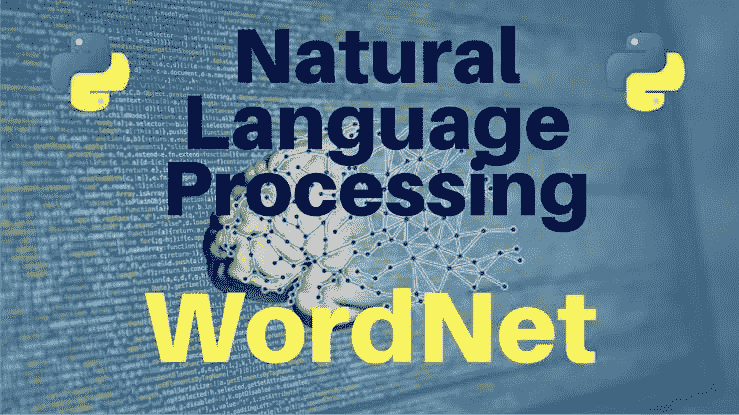

# Python 中的同义词和反义词

> 原文：<https://towardsdatascience.com/synonyms-and-antonyms-in-python-a865a5e14ce8?source=collection_archive---------4----------------------->

## 文本挖掘—提取同义词和反义词


Photo by [micah boswell](https://unsplash.com/@micahboswell?utm_source=unsplash&utm_medium=referral&utm_content=creditCopyText) on [Unsplash](https://unsplash.com/s/photos/text?utm_source=unsplash&utm_medium=referral&utm_content=creditCopyText)

语言分析可以通过多种方式进行。在这篇博客中，我们将看到如何使用自然语言处理(NLTK) WordNet 库从文本中提取同义词和反义词。



Source: [Vincent Russo](https://vprusso.github.io/)

WordNet 是 Python 自然语言工具包的一部分。它是英语中大量单词和词汇的集合，这些单词和词汇相互关联，并以某种方式进行分组。相似词的集合称为词条。此外，它是字典和同义词库的结合。它用于自动文本分析和人工智能应用。它在其集合中支持许多其他语言。请点击查看更多关于 WordNet [的信息](https://www.nltk.org/_modules/nltk/corpus/reader/wordnet.html)

名词、动词、形容词和副词被分成认知同义词组(同义词组)，每个同义词组表达一个不同的概念。同素集通过概念语义和词汇关系相互联系。让我们看一些例子

## 找到这个词的意思

## 密码

导入 NLTK 库并安装 Wordnet

```
import nltk
nltk.download('wordnet')
```

在这个例子中，我们将看到 wordnet 如何返回单词的含义和其他细节。让我们继续查找单词“旅行”

有时，如果有一些例子，它也可以提供。

```
**#Checking the word "Teaching"**syn = wordnet.synsets(“teaching”)
syn
```

## 输出

```
[Synset('teaching.n.01'),
 Synset('teaching.n.02'),
 Synset('education.n.01'),
 Synset('teach.v.01'),
 Synset('teach.v.02')]
```

我们可以看到，“教”有五层含义。让我们找到第一种感觉，以便更好地理解每个 synset 包含的信息种类。我们可以通过在其名称处索引第一个元素来做到这一点。n，v 代表词性标注。

## 密码

```
**# Printing the Synonym, meaning and example of "teaching" for the first two indexes****#First Index**print(‘Word and Type : ‘ + syn[0].name())
print(‘Synonym of teaching is: ‘ + syn[0].lemmas()[0].name())
print(‘The meaning of the teaching: ‘ + syn[0].definition())
print(‘Example of teaching : ‘ + str(syn[0].examples()))**#Second Index**
print(‘Word and Type : ‘ + syn[1].name())
print(‘Synonym of teaching is: ‘ + syn[1].lemmas()[0].name())
print(‘The meaning of the teaching : ‘ + syn[1].definition())
print(‘Example of teaching : ‘ + str(syn[1].examples()))
```

## 输出

```
**# Output for first index**Word and Type : teaching.n.01
Synonym of Teaching is: teaching
The meaning of the Teaching: the profession of a teacher
Example of Teaching : ['he prepared for teaching while still in college', 'pedagogy is recognized as an important profession']**# Output for second index**Word and Type : teaching.n.02
Synonym of Teaching is: teaching
The meaning of the Teaching : a doctrine that is taught
Example of Teaching : ['the teachings of religion', 'he believed all the Christian precepts']
```

## 同义词

我们可以使用 synset 的`**lemmas()**`函数。它返回该特定同义词集的同义词和反义词。

## 密码

```
**#Checking synonym for the word "travel"**
from nltk.corpus import wordnet#Creating a list 
synonyms = []for syn in wordnet.synsets("travel"):
    for lm in syn.lemmas():
             synonyms.append(lm.name())#adding into synonyms
print (set(synonyms))
```

## 输出

```
{'trip', 'locomote', 'jaunt', 'change_of_location', 'go', 'traveling', 'travelling', 'locomotion', 'travel', 'move', 'journey', 'move_around'}
```

我们可以从上面的输出中看到单词“travel”的同义词。

## 反义词

## 密码

```
**#Checking antonym for the word "increase"**
from nltk.corpus import wordnet
antonyms = []for syn in wordnet.synsets("increase"):
    for lm in syn.lemmas():
        if lm.antonyms():
            antonyms.append(lm.antonyms()[0].name()) #adding into antonymsprint(set(antonyms))
```

## 输出

```
{'decrement', 'decrease'}
```

WordNet 还有另外一个特性叫做单词相似度。这有助于我们检查我在这篇博客中没有提到的两个词之间的相似性。

感谢阅读。请继续学习，并关注更多内容！