# 使用 Scikit Learn 为 ML 生成合成数据集等

> 原文：<https://towardsdatascience.com/synthetic-dataset-generation-for-ml-using-scikit-learn-and-more-beab8cacc8f8?source=collection_archive---------7----------------------->


# 使用 Scikit 生成合成数据集了解更多信息

越来越明显的是，谷歌、脸书和微软等大型科技巨头对他们最新的机器学习算法和软件包非常慷慨(他们免费提供这些)，因为算法世界的准入门槛目前相当低。开源社区和工具(如 Scikit Learn)已经走过了漫长的道路，大量开源项目正在推动数据科学、数字分析和机器学习的发展。站在 2018 年，我们可以有把握地说，[算法、编程框架和机器学习包(甚至是如何学习这些技术的教程和课程)不是稀缺资源，而是高质量的数据。](https://hbr.org/2015/03/data-monopolists-like-google-are-threatening-the-economy)

当涉及到调整和微调这些算法时，这往往成为数据科学(DS)和机器学习(ML)领域从业者的一个棘手问题。从一开始就指出这一点也是明智的，当前的文章是关于算法研究、教学学习和模型原型的数据缺乏，而不是关于扩展和运行商业操作的数据缺乏。这不是关于如何为你正在开发的酷旅行或时尚应用获取高质量数据的讨论。这种消费者、社会或行为数据的收集有其自身的问题。然而，即使是像访问高质量数据集来测试特定算法方法的局限性和不可预测性这样简单的事情，往往也不那么简单。

# 为什么需要合成数据集？

如果您是从零开始学习，最合理的建议是从简单的小规模数据集开始，您可以在二维空间中绘制这些数据集，以便直观地理解模式，并以直观的方式亲自查看 ML 算法的工作情况。

然而，随着数据维度的爆炸式增长，视觉判断必须扩展到更复杂的问题——如*学习和样本复杂性、计算效率、类别不平衡、*等概念。

在这一点上，实验灵活性和数据集的性质之间的权衡开始发挥作用。你总是可以找到一个真实的大型数据集来实践这个算法。但这仍然是一个固定的数据集，具有固定数量的样本、固定的底层模式，以及正负样本之间固定的类别分离度。你也必须调查，

*   测试和训练数据的选定部分如何影响算法的性能和鲁棒性
*   面对不同程度的类别不平衡，这些指标有多稳健
*   必须做出什么样的偏差-方差权衡
*   该算法在训练和测试数据中的各种噪声特征(即标签和特征集中的噪声)下如何执行
*   你是如何实验并梳理出你的 ML 算法的弱点的？

事实证明，使用单个真实数据集很难做到这些，因此，您必须愿意使用合成数据，这些数据足够随机，可以捕捉真实数据集的所有变化，但又足够可控，可以帮助您科学地调查您正在构建的特定 ML 管道的优势和劣势。

虽然我们不会在本文中讨论这个问题，但这种合成数据集的潜在好处可以很容易地在敏感应用程序中衡量出来——医疗分类或金融建模，在这些应用程序中，获得高质量的标记数据集通常是昂贵和令人望而却步的。

# 用于 ML 的合成数据集的基本特征

应当理解，在这一点上，合成数据集是以编程方式生成的，而不是来源于任何种类的社会或科学实验、商业交易数据、传感器读数或图像的手动标记。然而，这样的数据集肯定不是完全随机的，并且用于 ML 的合成数据的生成和使用必须由一些首要的需求来指导。特别是，

*   它可以是数字、二进制或分类(有序或非有序)，并且要素的数量和数据集的长度可以是任意的
*   它必须有一定程度的随机性，但同时，用户应该能够选择各种各样的统计分布作为该数据的基础，即可以精确地控制和调整潜在的随机过程，
*   如果用于分类算法，那么类别分离的程度应该是可控的，以使学习问题容易或困难，
*   可以以可控的方式插入随机噪声
*   生成速度应该非常高，以便能够针对任何特定的 ML 算法对大量这种数据集进行实验，即，如果合成数据是基于真实数据集上的数据扩充，则扩充算法必须在计算上高效
*   对于回归问题，可以使用复杂的非线性生成过程来获取数据——真实的物理模型可能有助于这一努力

在下一节中，我们将展示如何使用一些最流行的 ML 库和编程技术来生成合适的数据集。

# 使用 Scikit learn 和 Numpy 生成标准回归、分类和聚类数据集

Scikit learn 是基于 Python 的数据科学软件栈中最受欢迎的 ML 库。除了优化的 ML 例程和管道构建方法之外，它还拥有用于合成数据生成的实用方法的可靠集合。

# 使用 Scikit 学习进行回归

Scikit learn 的`dataset.make_regression`函数可以创建任意数量的输入特征、输出目标以及它们之间的**可控信息耦合度**的随机回归问题。

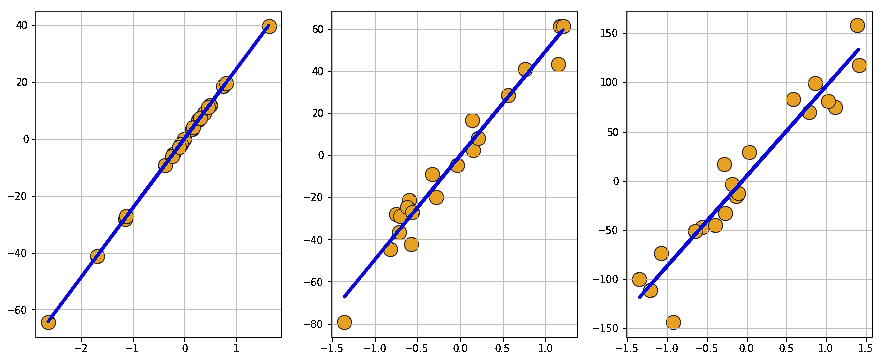

# 使用 Scikit 学习进行分类

类似于上面的回归函数，`dataset.make_classification`生成一个随机的多类分类问题，具有**可控的类分离和添加的噪声**。如果需要，还可以随机翻转任意百分比的输出符号来创建更难的分类数据集。


# 使用 Scikit Learn 进行聚类

Scikit learn 实用程序函数可以产生各种聚类问题。最直接的方法是使用`datasets.make_blobs`，它可以用可控的距离参数生成任意数量的集群。


为了测试基于相似性的聚类算法或高斯混合模型，以特殊形状生成聚类是有用的。我们可以使用`datasets.make_circles`函数来实现。


对于使用**支持向量机(SVM)** 算法测试非线性核方法，像 **k-NN** 这样的最近邻方法，或者甚至测试一个简单的神经网络，通常建议使用某些特定的数据进行实验。我们可以使用噪声可控的`dataset.make_moon`函数生成这样的数据。


# 具有 Scikit 学习高斯混合模型

高斯混合模型(GMM)是文本处理/自然语言处理任务中无监督学习和主题建模的有趣研究对象。下面是一个简单函数的示例，展示了为这种模型生成合成数据是多么容易:

```
import numpy as np import matplotlib.pyplot as plt import random def gen_GMM(N=1000,n_comp=3, mu=[-1,0,1],sigma=[1,1,1],mult=[1,1,1]): """ Generates a Gaussian mixture model data, from a given list of Gaussian components N: Number of total samples (data points) n_comp: Number of Gaussian components mu: List of mean values of the Gaussian components sigma: List of sigma (std. dev) values of the Gaussian components mult: (Optional) list of multiplier for the Gaussian components ) """ assert n_comp == len(mu), "The length of the list of mean values does not match number of Gaussian components" assert n_comp == len(sigma), "The length of the list of sigma values does not match number of Gaussian components" assert n_comp == len(mult), "The length of the list of multiplier values does not match number of Gaussian components" rand_samples = [] for i in range(N): pivot = random.uniform(0,n_comp) j = int(pivot) rand_samples.append(mult[j]*random.gauss(mu[j],sigma[j])) return np.array(rand_samples)
```

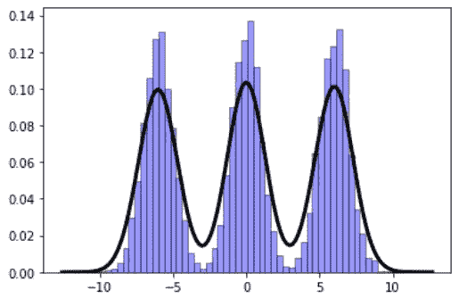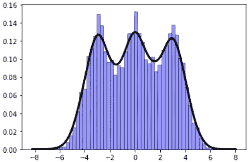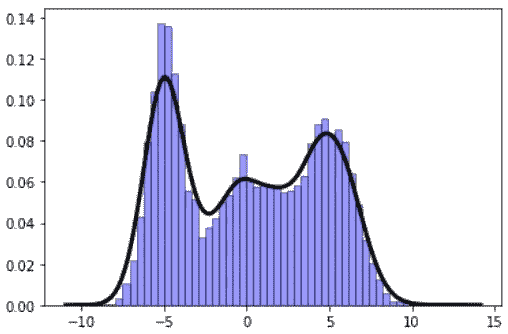

# 超越 Scikit 学习:来自符号输入的合成数据

[**随机回归和分类问题生成用符号表达式**](/random-regression-and-classification-problem-generation-with-symbolic-expression-a4e190e37b8d)


虽然上述函数可能足以解决许多问题，但生成的数据确实是随机的，并且用户对生成过程的实际机制控制较少。在许多情况下，人们可能需要一种可控的方式来基于明确定义的分析函数(涉及线性、非线性、理性甚至超越项)生成回归或分类问题。下面的文章展示了如何**结合 SciPy** 中的符号数学包 SymPy 和函数，从给定的符号表达式中生成综合回归和分类问题。

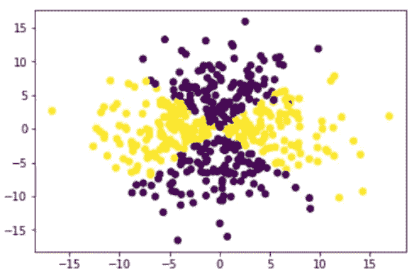

从给定的符号表达式生成的回归数据集。

从给定的符号表达式生成的分类数据集。

# 使用 Scikit-image 的图像数据增强

深度学习系统和算法是数据的贪婪消费者。然而，为了测试深度学习算法的局限性和鲁棒性，人们经常需要向算法提供相似图像的细微变化。 **Scikit image** 是一个令人惊叹的图像处理库，构建在与 scikit learn 相同的设计原则和 API 模式上，提供了数百个很酷的函数来完成这个图像数据增强任务。

[**数据增强|在数据有限的情况下如何使用深度学习。**](https://medium.com/nanonets/how-to-use-deep-learning-when-you-have-limited-data-part-2-data-augmentation-c26971dc8ced)

下面这篇文章很好地提供了这些想法的全面概述:

**色调、饱和度、价值通道**

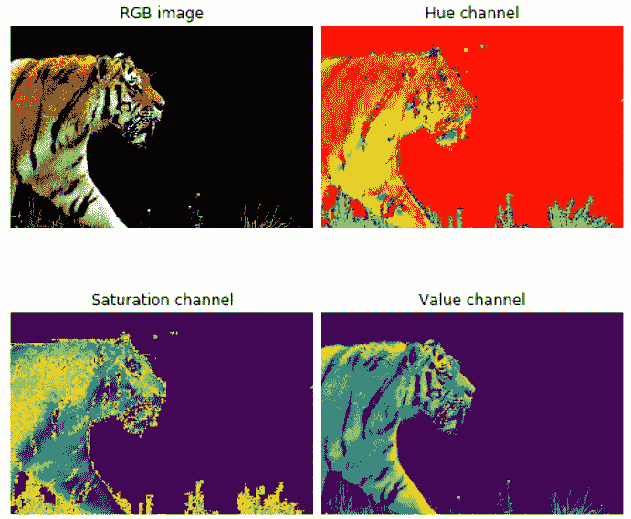

**裁剪**


**随机噪声**

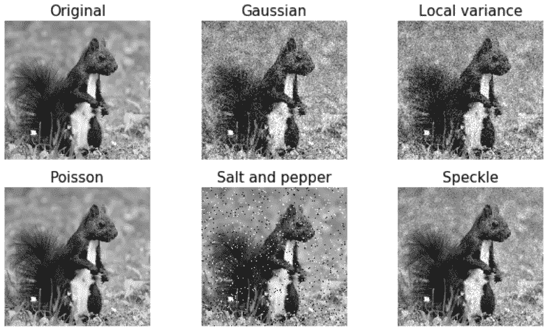

**旋转**

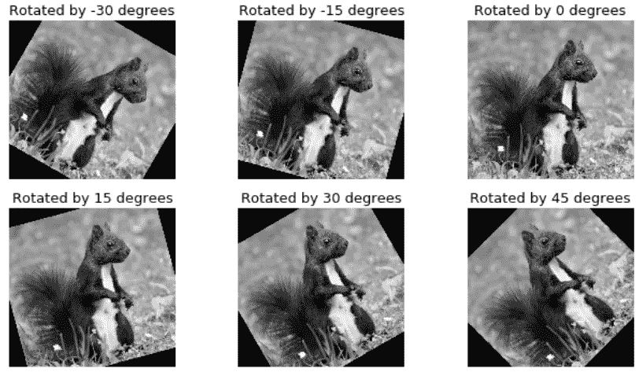

**漩涡**


我们展示了这种增强过程的一些精选示例，从单个图像开始，并在同一图像上创建数十种变化，**有效地将数据集放大许多倍，并创建一个巨大大小的合成数据集**，以稳健的方式训练深度学习模型。

# 具有分割的随机图像合成器

[**英伟达深度学习数据合成器**](https://github.com/NVIDIA/Dataset_Synthesizer)

NVIDIA 提供了一个名为 NDDS 的 UE4 插件，使计算机视觉研究人员能够导出带有元数据的高质量合成图像。它支持图像、分割、深度、对象姿态、边界框、关键点和自定义模板。除了导出器之外，该插件还包括各种组件，能够生成用于数据扩充和对象检测算法训练的随机化图像。随机化工具包括照明、对象、相机位置、姿势、纹理和干扰物。这些组件一起允许深度学习工程师轻松创建随机场景来训练他们的 CNN。这是 Github 的链接，

# 使用 pydbgen 生成分类数据

[介绍 pydbgen:一个随机数据帧/数据库表生成器](/introducing-pydbgen-a-random-dataframe-database-table-generator-b5c7bdc84be5)

`Pydbgen`是一个[轻量级的纯 python 库](https://github.com/tirthajyoti/pydbgen)，用于生成随机有用的条目(如姓名、地址、信用卡号、日期、时间、公司名称、职位、车牌号等)。)并将它们保存在 Pandas dataframe 对象中，或者作为数据库文件中的 SQLite 表，或者保存在 MS Excel 文件中。[你可以在这里阅读文档](https://pydbgen.readthedocs.io/en/latest/)。这里有一篇文章描述了它的使用和效用，

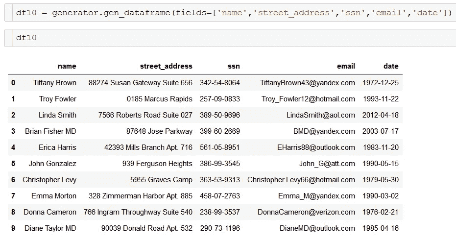

这里有几个说明性的例子，

# 合成时间序列数据集

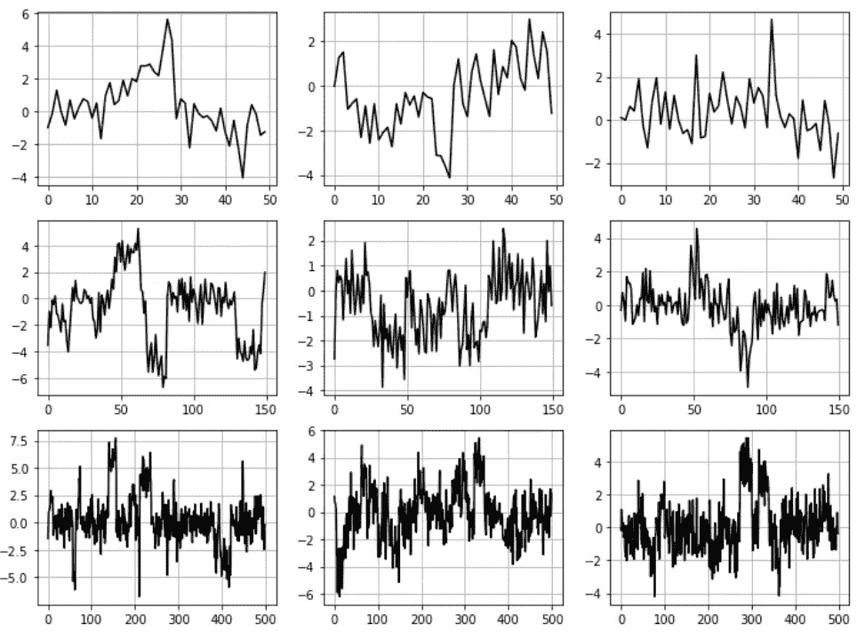

有相当多的论文和代码库使用在现实生活的多元时间序列中观察到的特殊函数和模式来生成合成时间序列数据。下面的 Github 链接给出了一个简单的例子:

# 合成音频信号数据集

音频/语音处理是深度学习实践者和 ML 爱好者特别感兴趣的领域。**谷歌的 NSynth 数据集**是一个由各种乐器发出的短音频文件声音合成生成的(使用神经自动编码器以及人工和启发式标记的组合)库。以下是数据集的详细描述。

# 强化学习的综合环境

# 奥鹏健身馆

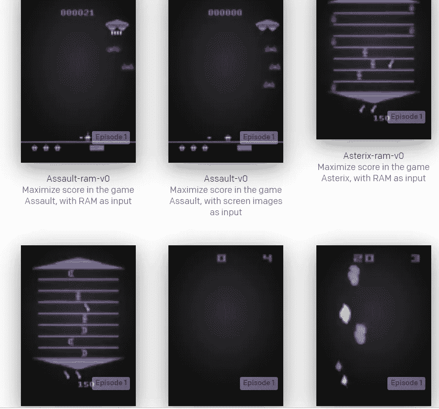

最大的强化 ML 综合学习环境库是 **OpenAI Gym** 。它由大量预先编程的环境组成，用户可以在这些环境上实现自己的强化学习算法，以对性能进行基准测试或对隐藏的弱点进行故障排除。

# 随机网格世界

对于强化学习的初学者来说，在一个简单的网格世界中进行练习和实验通常会有所帮助，在这个世界中，代理必须通过迷宫到达一个终端状态，每个步骤和终端状态都有给定的奖励/惩罚。

只需几行简单的代码，就可以合成任意大小和复杂度的网格世界环境(具有用户指定的终端状态和奖励向量分布)。

[**https://github.com/tirthajyoti/RL_basics**](https://github.com/tirthajyoti/RL_basics)

看看这个 Github repo 的想法和代码示例。

# Scikit 了解更多关于合成数据生成的信息:摘要和结论

在本文中，我们回顾了几个为机器学习生成合成数据的例子。读者应该清楚，这些绝不是数据生成技术的详尽列表。事实上，除了 Scikit Learn 之外，许多商业应用程序都在提供相同的服务，因为用各种数据训练您的 ML 模型的需求正在快速增长。然而，如果作为一名数据科学家或 ML 工程师，您创建了自己的合成数据生成编程方法，这将为您的组织节省投资第三方应用程序的资金和资源，并让您以整体和有机的方式规划 ML 管道的开发。

希望您喜欢这篇文章，并且能够很快在您自己的项目中使用这里描述的一些技术。

# 其他注释

*原载于 2019 年 8 月 28 日*[*【https://blog.exxactcorp.com】*](https://blog.exxactcorp.com/scikit-learn-and-more-synthetic-dataset-generation-for-ml/)*。*