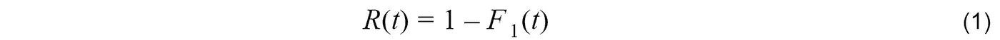
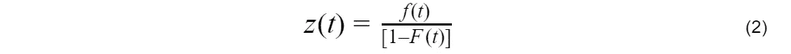
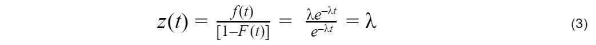
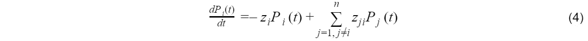

# 系统可用性公式-要记住的假设

> 原文：<https://towardsdatascience.com/system-availability-formula-assumptions-to-remember-34ca55baff01?source=collection_archive---------14----------------------->

Image by Author

系统可用性，即系统在需要时工作的概率，直接影响系统维护策略、效率和系统设计中的冗余。上述公式是描述和计算系统可用性最常用的表达式。这个公式的主要优点是简单。然而，不幸的是，人们经常误解这个公式本身就是可用性的实际定义。它不是。上述公式是一系列数学计算的结果，基于单个独立组件的假设，在稳态条件下故障和修复呈指数分布。

在这篇文章中，我将一步一步地概述这个公式是如何推导出来的。

# 介绍

假设*S(****B****)= 1*表示一个状态( *B* )，或者一个给定系统被定义为可操作的状态的联合( ***B*** )，那么 ***系统可用性*** ， *A(t)，*是在时间 *t* ，*S()* ***系统可靠度*** ， *R(t)* 是到时间 *t，*系统尚未处于故障状态的概率，*S(****B****)= 0*。因此，可靠性可以表示如下:

可靠性与单个部件的故障概率有着简单的关系， *F* ₁ *(t)* 。然而，可用性是一个更复杂的问题。有许多不同的方法来解决这个问题。在这篇文章中，我将介绍马尔可夫方程方法。

# 危险功能和系统工程

在系统工程领域，危险函数*h(x)*描述事件(系统故障)在时间 *t* 发生的概率，假设该事件在该时间点之前尚未发生。风险函数(也称为失效率、风险率或死亡率) *h(x)* 是概率密度函数(PDF)*F(t)*和生存函数*S(t)**1-F(t)*之间的比值。其中 *F(t)* ，是累积分布函数(CDF)。危险函数在系统工程中起着重要的作用，因为只要系统在运行，系统工程中数据集的收集就通过观察系统中的故障来进行
。

等式(2)是使用贝叶斯定理的危险定义公式，其中:

***【F(t)****表示事件(系统故障)在 0 到 t 之间发生的概率*

*1- ***F(t)*** 表示事件直到时间 t *才发生的概率。**

****f(t)dt*** 表示事件在时间 *t* 的小区间 *dt* 内发生的概率。*

****z(t)dt*** 表示某事件在 *t* 的小区间 *dt* 内发生的条件概率，假设该事件在该时间之前尚未发生。*

**z(t)* 采用了危险函数的名称，因为它与故障有关。系统故障是系统工程中的重要事件，但考虑到系统的生命史，它们不是唯一可能的事件。还有许多其他事件，如维修、检查、维护、运行状态的变化，以及许多其他可能具有统计性质的事件。*

# *指数分布*

*指数分布是风险不变的特殊情况。*

**

*因此，指数失效密度对应于一个与时间无关的常数风险函数，换句话说，不会老化。常数风险函数是指数分布的无记忆特性的结果:假设受试者已经存活到时间 *t* 的剩余存活时间的分布不依赖于 *t* 。把
换个说法，一个时间区间内的死亡概率*【t，t+y】*独立于起点，*t*[【1】](http://people.stat.sfu.ca/~raltman/stat402/402L32.pdf)。*

*指数分布是系统工程应用中最广泛使用的分布。这主要是因为它是最简单的函数，而不是因为它是正确的函数。*

# *马尔可夫过程*

*马尔可夫过程是一个随机过程，在这个过程中，给定现在，系统的未来状态独立于过去。在这种模型中，系统的未来状态完全由系统的当前状态决定。**如果系统中的所有组件都具有指数分布**，那么系统是马尔可夫的，未来只取决于现在的状态。*

**

*等式(4)被称为马尔可夫等式[【2】](https://www.amazon.com/Monte-Carlo-Applications-Systems-Engineering/dp/0471981729)。它是一组联立的一阶微分方程，是作为 *n* 单入口状态传输方程的特例而导出的。马尔可夫方程有一个简单的物理解释。 *zᵢ* 代表离开状态 *i* 的比率，因此 *zᵢPᵢ(t)* 代表该状态下人口的减少。同样，组件从其他状态进入状态 *i* 。从任一状态 *j* 转移到状态 *i* 的速率为 *zᵢⱼ* ，导致单位时间内*zᵢⱼpᵢ(t*状态 *i* 的人口增加。马尔可夫链有有限数量的 *n* 个状态，在任何时间处于任何状态的概率是 *1* (这就是所谓的归一化方程)*

**

*对于具有指数分布的两个状态的简单情况，等式(4)采用简单的形式:*

**

*其中λ是失效的危险，通常称为*失效率*，μ称为*修复率*。*

*利用归一化方程 *P₁(t)+P₀(t)=1* ，得出:*

**

*具有边界条件 *P₁(0)=1* 的方程(6)的解产生:*

**

*具有两种状态的单个组件的可用性包含两个术语。第二项是瞬态的，随着时间的增加而变为零。第一项称为*稳态可用性* *A* ∞，注意到 *1/λ* 是**平均无故障时间** (MTTF)和*1/μ***平均修复时间** (MTTR)，可以得到:*

**

*这是描述和计算可用性最常用的表达式之一。等式(7)的主要优点是简单。事实上，许多人很直观地认为这个等式就是可用性的定义。可用性公式为真**当且仅当**故障概率密度函数以及修复 PDF 为指数函数，且仅针对稳态( *t* → ∞时)。*

*这种误用公式的情况，在数值计算领域是很常见的。正如英国统计学家乔治·博克斯的名言:“所有的数字计算模型都是错误的，有些是有用的”。由于模型和公式是基于假设的，所以当试图将这些模型应用到现实生活中以产生现实结果时，不应该忘记这些假设。*