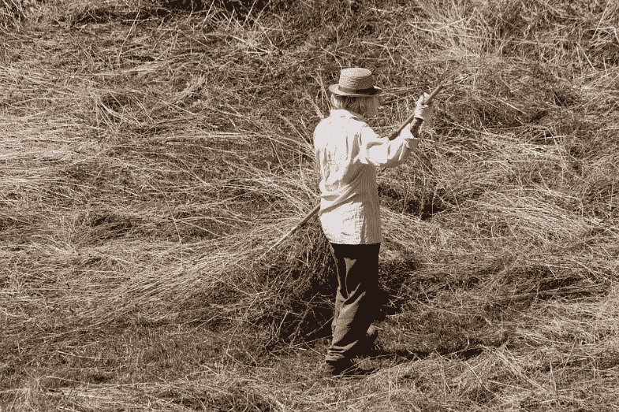
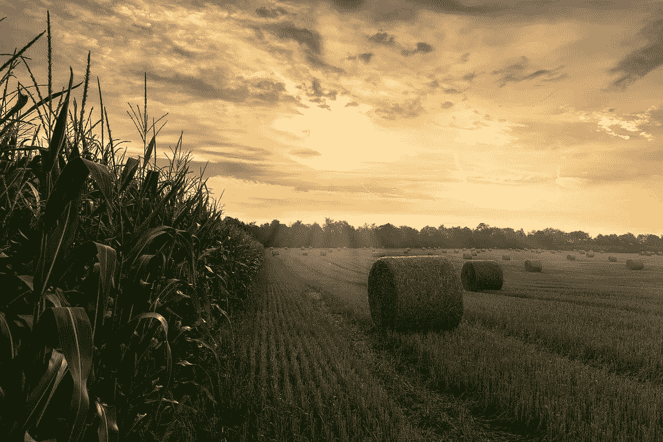

# 系统设计思维:区分人工智能和人工智能

> 原文：<https://towardsdatascience.com/system-design-thinking-distinguishing-ai-from-ml-a584aa00e7e2?source=collection_archive---------23----------------------->

## 人工智能和机器学习有什么不同？

AI 和 ML 的区别有太多松散的定义。大多数定义都比较轻松。我最喜欢的一个是:

***如果是在 PowerPoint 上，很可能是 AI。如果是用代码，就是 ML。***

大多数定义都不严谨，因为这种定义没有明确的预期结果。

**让我们快速给出一个严肃的目的——职业装修。**

问题陈述是这样的。你有两个人，一个在多个系统方面经验丰富，但在 ML 方面经验不足。第二个是非常年轻的有 ML 经验的。对于给定的项目，您应该检查您是否对两者都有角色。如果你只有一个角色，你应该决定保留谁。

由此，我们将深入研究一个案例。随着我们的进步，我们只是概述我们得到的主要思想和我们试图解决的主要问题。由此，我们将分离什么是 ML 和 AI。之后，让我们检查完成它所需的经验和成熟程度。

# 项目案例研究

这是一个农业人工智能的案例研究。这应该有助于玉米田监测。基于图像的系统需要提供关于疾病的警告，以便农民可以迅速处理并控制问题。

一架无人驾驶飞机周期性地飞过田野并收集图像。这些图像将用于疾病症状的预测。假设我们需要提供 3 个标签——健康、早期疾病、晚期疾病。

https://pixabay.com/photos/builder-farmer-hay-apply-computing-4298301/

# 机器学习的范围和重点

对于上面的案例研究，ML 涉及我们在所有教程中看到的机器学习任务。

我们定义模型。

我们有用于训练和测试集的图像。

最后，我们有一些最终客户提供的图片。

在创建好的模型时，我们可能会调整超参数，改变模型架构，改变模型本身。我们也可能会使用合成图像。我们可能会尝试我们所知道的所有人工智能技术。

要求说，我们需要 3 个标签。也许，我们会为各自的图像创建 3 个文件夹。为了简单起见，我们认为每个文件夹名代表各自的标签名。我们会用这些来训练。一切看起来都很好。验证图像预测看起来也不错。

在我们创建了模型并完成测试后，混淆矩阵看起来很好。假阳性和真阴性在统计要求范围内。

如果一切顺利，如果这是机器学习，那么什么是人工智能？

# 现在，人工智能的焦点

在最大似然预测成功后，团队向一位农民展示了最大似然预测演示。但是一个农民给出了另一个形象。这个预测完全错了。它有早期疾病。它无法被检测到。农夫很不高兴。

“先生，即使在健康的情况下，我也不介意去野外会有小麻烦。即使它错误地通知了我，也没关系。但是如果有疾病症状没有被发现，那对我来说就是一个大问题。我有好几公顷的庄稼，我需要知道在任何给定的时间里，我应该把精力集中在哪里。我有时间。你的系统应该给我重点关注的优先区域。”

团队意识到他们根本没有考虑过这样的形象。他们专注于提高现有数据集的准确性。他们关注的是准确率。他们遇到了过度拟合的问题。

可接受准确性的统计数据对该客户来说无关紧要。他不介意我们用低信心预测来提示他。**他希望我们谨慎行事。**

**他们擅长机器学习。但在系统级 AI 方面做得不够。**

*现在，考虑一个完全不同的项目——一个 7-11 商店店主的案例。他想要一个闭路电视监控系统，用于检测商店盗窃和即时报警。这个人想要一个不介意小损失的系统。但他的客户的声誉和假警报是一个更大的问题。如果熟客虚惊一场，一去不返，那损失更大。他只想要非常明确的商店盗窃案件报告。* ***这个客户也希望我们谨慎稳妥，但方向相反。***

我们刚刚讨论了业务影响和准确性。我们也可以看看其他方面。让我们回到玉米地。

# 训练数据的多样性

研究小组发现，另一组图像的假阳性显著增加。经过更深入的检查，研究小组发现这些图像中的玉米更大。只有团队意识到玉米作物的周期是 100 天左右！在这段漫长的时间里，他们只拍摄了一个实例的图像。需要非常频繁地拍摄训练图像——可能每天都拍？健康和不健康的视觉特征每隔几天就会发生剧烈的变化。现在有多重困难。

如果他们把所有健康的图像放在一个文件夹里，模型就学不到任何有用的东西。请看下面的两张图片。

https://pixabay.com/photos/field-cornfield-arable-corn-4280596/

[https://pixabay.com/photos/harvest-cornfield-agriculture-corn-4195417/](https://pixabay.com/photos/harvest-cornfield-agriculture-corn-4195417/)

这两幅图像如此不同。在第一种情况下，庄稼太小，而在第二种情况下，庄稼已经长得很大了。这些图像来自完全不同的角度。很难想象这个模型能学到什么。

看起来，为不同日期的图像设置不同的文件夹是有意义的。以前，一个标签有一个公共文件夹。

还需要定义图像记录的过程。无人机应在相同的高度和相同的预定路线上飞行。此外，一天中的时间也应该是固定的，以确保颜色或其他属性不会因光线变化而受到影响。此外，数据需要考虑云的阴影。

行..现在有了大数据集，按天分隔。那么训练过的模型也应该是白天分开的？即预测第 1 天的疾病可能性，我能为第 1 天训练一个通用模型，一直到第 100 天吗？这将导致过多的模型。

因此，团队可能不得不将模型分成几个不同的模型。可能是每周一次的数据。当图像被发送到模型进行预测时，元数据也应该有作物的日期。没有它，系统就不知道使用哪个模型进行预测。

# 部署和再培训策略

对于本案例研究，为了证明系统开发的投资是合理的，它应该可以在大范围内使用，最好可以在农民、州、国家甚至是大洲之间使用。这也有助于在更大的数据集上学习。如果一个地区出现了新的疾病，我们还应该能够重新训练系统，以适应这种新的疾病信息。

人工智能系统的重要方面是它会随着时间的推移变得更好。单靠 ML 并不能保证。它需要重新培训政策和流程。

假设法默发现了一个真正的负片，有没有简单的方法来制作它，并提供这样的图像？如果他不是一个懂电脑的人，可以通过语音命令来贴标签吗？当他以这种方式向系统发出警报时，系统是否能够标记数据的子集，以便进行手动检查？这将非常有帮助。项目发起人可以雇佣有农业背景的兼职承包商，来制作这些有疾病的图像。一旦这一批完成，再培训就可以进行了。

在 ML 中，我们只是谈论训练、交叉验证和预测。算法中不讨论再训练策略。只有这样端到端的思考，才会产生真正的人工智能系统。

# 更多的系统工程问题

该系统还可以考虑更多的系统工程方面。这可能是相机对焦模式，无人机在捕捉图像时的速度。当查看 ML 模型输入形状时，它对预测时间和所需资源有性能影响。这反过来会影响我们可以提供的用例及系统特性。

如果性能良好，我们可以在无人机飞行时进行实时预测。这可能会让顾客更开心。这可能需要团队降低图像的分辨率，以便更快地进行训练和预测。这可能是 ML 模型调整的一个因素。

# 商业、经济和法律问题

当我们考虑人工智能时，我们会考虑整体业务流程。我们也关心整个项目的经济效益。在涉及人员数据的项目中，还可能涉及法律问题。

在与安全相关的行业中，如作者工作的汽车、工业自动化，甚至需要证明预测是如何工作的，以及预测的可预测性如何！

# 定义人工智能

人工智能更多的是关于整个系统，各种角色、算法、业务需求如何相互作用。ML 主要讲的是机器学习的核心技术部分。

正如你所看到的，当我们讨论人工智能时，我们很少谈论技术细节和算法。我们更关心解决方案、部署、用户体验等等。如果我们将 ML 应用于非常具体的小任务，如在手机中找到重复的图像，ML 和 AI 之间的差异并不显著。

midmanager.com

随着世界走向更高的人工智能采用，这种区别变得越来越重要。

# 最后，职业适应

我们已经定义了 ML 和 AI 之间的焦点差异。

现在让我们回到我们开始思考的最初焦点。这是关于给两个员工安排合适的工作。

对于我们看到的疾病检测示例，ML 工程师可以是接受机器学习培训的人。他或她可以专注于算法、Python、Pytorch、张量流、模型架构、超参数等。

要完成整个系统架构，定义最终使用和部署的业务和技术流程，您需要一个解决方案架构师。即使这样的人可能不知道 ML 非常具体的细节，他应该能够很好地简化解决方案，使其可用，并使其成为一个学习系统。

所以，如果有一个没有 ML 背景的有经验的软件架构师或业务分析师，不要解雇他。也许这样的人更适合项目中的系统级角色。当然，对于 ML 特定的角色，雇佣具有 ML 认证的成员。

# 总而言之，

是的。AI 代表幻灯片，ML 代表代码。

我们对意义看得越深，我们学到的就越多。随着我们了解得越多，我们在系统设计方面就做得越好。