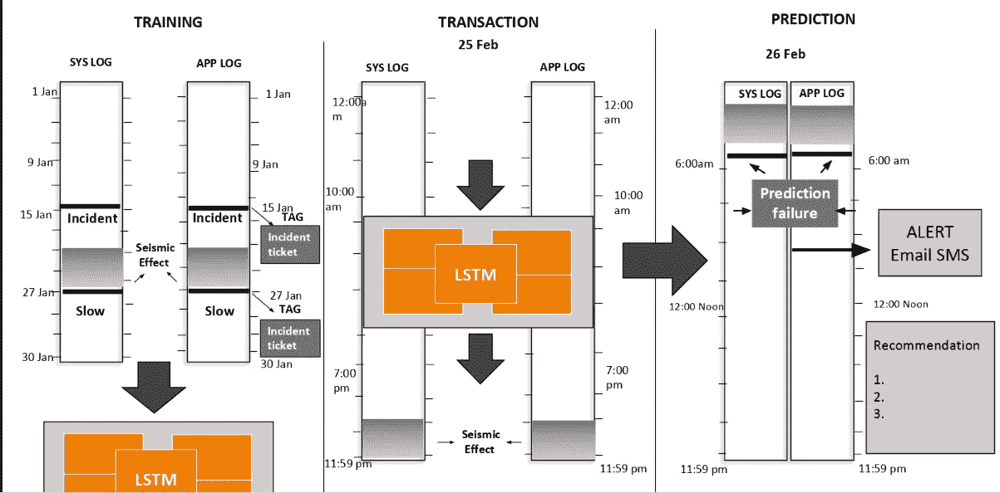
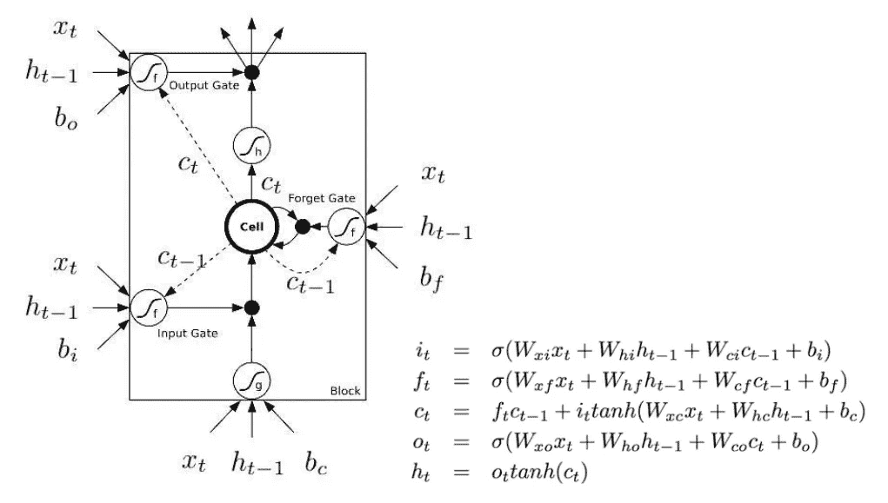
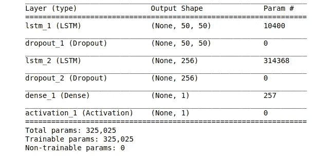
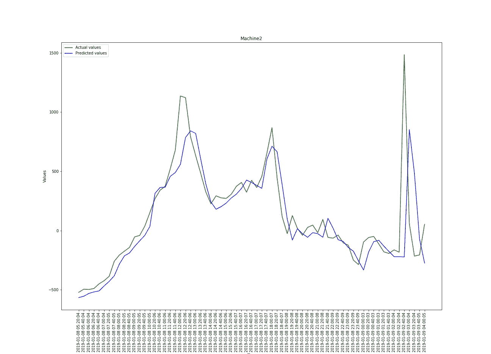

# 使用日志分析的系统故障预测

> 原文：<https://towardsdatascience.com/system-failure-prediction-using-log-analysis-8eab84d56d1?source=collection_archive---------5----------------------->

## 使用递归神经网络预测系统故障的深度学习方法

在现代社会，系统故障是一个严重的问题，需要解决。如果能够获得准确的系统故障预测，IT 公司或各种研究机构将受益匪浅。如果事先作出适当的预测，计算机故障的不利影响会有所减轻。如果这种情况即将发生，则可以限制资源、应用程序和其他消耗内存的进程的使用，从而防止系统崩溃。

在剩余时间充足的情况下实现准确预测相当困难。在这篇博客中，我介绍了一种通过提前解析日志文件来检测故障的简单方法。我们会在故障条件出现之前发出预警。为了达到我们的目的，我们使用了一种循环神经网络，即长短期记忆。本文中的方法使用滑动窗口来获取期望的结果。考虑的重要因素是 RAM、CPU 和硬盘利用率。

下图显示了所使用的方法:

**Methodology**

系统故障预测在许多应用中是必不可少的，例如计算机需要执行高计算。非常高的硬盘使用率或 RAM 崩溃会阻止应用程序在 HPC 上执行。高性能计算是使用并行编程来高效运行复杂的程序。HPC 的恢复可能需要很长时间，有时甚至是不可能的。时间序列预测的使用也很普遍，但它不包括我们接下来要陈述的参数，这些参数可能是有益的。

从系统中获取的日志文件包含有关系统状态和内存消耗的信息。我们知道计算机的三个主要利用率是 CPU、RAM 和硬盘利用率。这些日志文件可以为我们提供时间戳以及在确定的时间戳上资源的确切利用率。我们已经考虑了具有相同间隔的时间戳的值。我们有一个由过去五天中生成的系统日志文件组成的数据。nmon 格式。所考虑的时间戳变化是固定的，并且具有 10 分钟的固定间隔。

我们有过。已转换为的 nmon 文件。csv 适合学习。我们还可以使用 nmon visualizer 工具可视化数据。我们考虑的 CPU、RAM 和硬盘利用率参数如下:

# CPU 利用率:

User%:这表示处理器花费 x%的时间运行用户空间进程。用户空间进程是不使用内核的进程。一些常见的用户空间进程包括外壳、编译器、数据库和所有与桌面相关的程序。如果处理器没有空闲，那么通常大部分 CPU 时间用于运行用户空间进程。

Sys%:这表示处理器花费 x%的时间运行系统进程。系统进程由内核空间程序组成

Wait%:这表示处理器花费 x%的时间运行内核进程。所有的进程和系统资源都由 Linux 内核处理。内核执行的任务包括运行系统进程，管理内核空间中的硬盘等硬件设备。

Idle%:显示等待其他进程完成的 CPU 百分比。有时，处理器可能会启动读/写操作，并需要等待其他进程完成。

**CPU 利用率=用户% +系统% +等待%**

# RAM 利用率:

*   MemTotal:总可用内存
*   MemFree:系统不使用的物理内存量
*   缓冲区:缓冲区高速缓存中的内存，因此相对临时存储原始磁盘块
*   缓存:页面缓存中的内存(磁盘缓存和共享内存)
*   mem used = mem total-mem free-Buffers-Cached

特定时间戳时已用 RAM 的百分比= (MemUsed/MemTotal) * 100

## 硬盘利用率:

硬盘利用率%=(已用硬盘空间/总硬盘空间)*100

## PCA:

现在我们有了时间戳的 CPU、RAM 和硬盘利用率的值。我们应用 PCA 来从这 3 个参数中获得单个缩减值。众所周知，PCA 或主成分分析是一种处理高度相关变量的方法。我们可以得到上述所有利用率的单一值。然后，我们可以应用单变量时间序列预测来预测未来时间戳的单个值。

应用 PCA 的步骤:

a)标准化数据。b)从协方差矩阵计算特征值和特征向量。c)按照降序对特征值进行排序，以对相应的特征向量进行排序。d)选择对应于最大特征值的 1 个特征向量。这为我们提供了每个时间戳的简化参数。

## LSTM 模式:

**LSTM architecture**

我们遵循的步骤:

I)大小为 50 的向前移动窗口，这意味着我们使用前 50 个数据点作为输出输入 X 来预测 Y，即第 51 个数据点。接下来使用从第 1 点到第 51 点的窗口，我们预测第 52 点。

ii)使用结合了密集输出层的两层 LSTM 模型来进行预测。iii)我们使用以下两种方法来预测产量—

a)我们预测了测试数据集中每个项目的值。

b)我们通过向前移动一步将先前做出的预测反馈到输入窗口，并在所需的时间戳做出预测。我们有 LSTM 的 3D 输入向量，包括几个样本、几个时间戳、多个特征。保存训练模型的权重后，我们绘制预测值以可视化数据趋势。我们有一个 2 层 LSTM 模型和一个密集的输出层，如下表 3 所示。我们在两者之间使用 dropout，因为它是一种正则化技术，用于在我们训练 LSTM 模型时防止过拟合。

模型摘要:

Model summary for LSTM

# 结果:

下图显示了预测值和实际值的图形视图，以找出趋势。尽管训练数据量较少，但我们得到了期望的输出变化。我们的模型能够捕捉趋势。有了更多的训练数据，就可以预测更准确的结果。绿线代表实际值，而蓝线代表预测值。在 X 轴上，我们有时间戳间隔为 10 分钟的日期。Y 轴是我们之前获得的 PCA 缩减值。保存的权重帮助我们预测未来时间戳的缩减值。有了故障情况的时间戳和 PCA 缩减值(可以注意到实际系统故障发生的一些情况)，我们可以正确地分类预测值是否属于故障类别。我们使用逻辑回归分类算法来达到我们的目的

该博客将帮助用户防止系统故障，因为它可以在实际故障发生之前向用户发送警告邮件或短信。然后，用户可以通过终止冗余进程来限制系统上正在运行的进程的数量。使用 LSTMs 进行时间序列预测有助于我们获得未来时间戳的缩减值。则可以使用逻辑回归分类模型将这些值用于分类为正常或故障类别。

# 结论:

> 这个项目是作为斋浦尔 Celebal 技术公司实习的一部分完成的。

这种方法将帮助用户防止系统故障，因为它可以在实际故障发生之前向用户发送警告邮件或 SMS。然后，用户可以通过终止冗余进程来限制系统上正在运行的进程的数量。使用 LSTMs 进行时间序列预测有助于我们获得未来时间戳的缩减值。然后使用逻辑回归分类模型将该值分类为正常或故障类别。如果我们可以在现有的列表中添加更多的功能，这项工作可以扩展。我们刚刚在研究中考虑了 CPU、RAM 和硬盘的利用率。也可以考虑诸如输入/输出数据传输(即数据写入硬盘的速率)、特定进程运行的时间等参数，以获得更好的准确性。