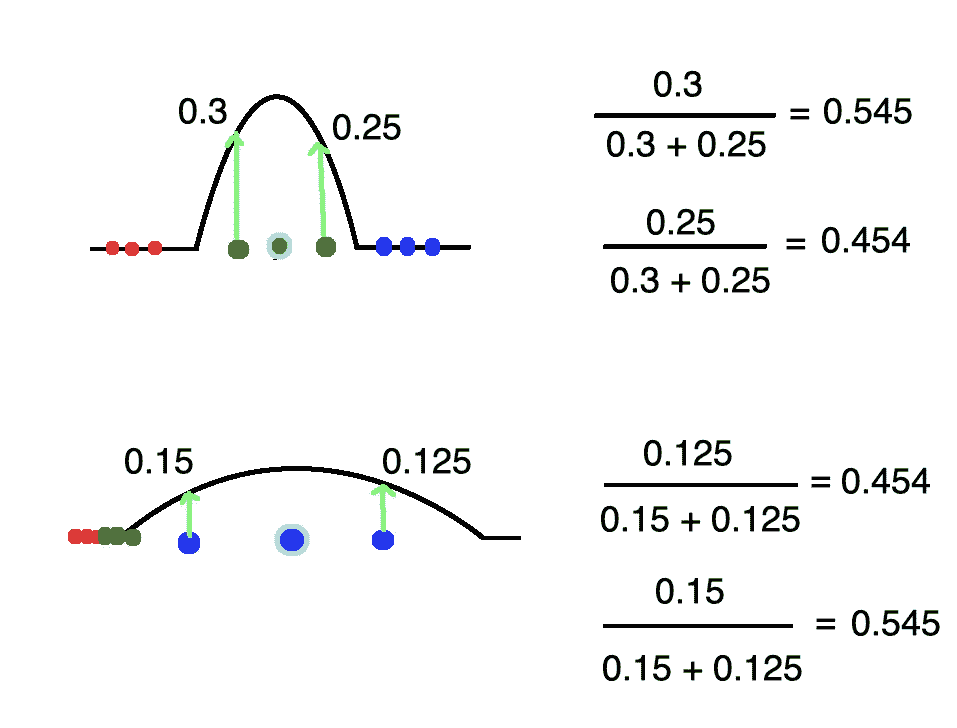

# t-SNE Python 示例

> 原文：<https://towardsdatascience.com/t-sne-python-example-1ded9953f26?source=collection_archive---------1----------------------->


Photo by [Matt Wildbore](https://unsplash.com/@mattixdesign?utm_source=medium&utm_medium=referral) on [Unsplash](https://unsplash.com?utm_source=medium&utm_medium=referral)

t 分布随机近邻嵌入(t-SNE)是一种降维技术，用于在二维或三维的低维空间中表示高维数据集，以便我们可以可视化它。与 PCA 等简单地最大化方差的其他降维算法相比，t-SNE 创建了一个降维的特征空间，其中相似的样本由附近的点建模，不相似的样本由远处的点以高概率建模。

在高层次上，t-SNE 为高维样本构建概率分布，使得相似的样本被挑选的可能性很高，而不相似的点被挑选的可能性极小。然后，t-SNE 为低维嵌入中的点定义了类似的分布。最后，t-SNE 最小化关于嵌入中点的位置的两个分布之间的 kull back-lei bler 散度。

# 算法

如前所述，t-SNE 采用高维数据集，并将其简化为保留大量原始信息的低维图。

假设我们有一个由 3 个不同的类组成的数据集。


我们希望将 2D 图简化为 1D 图，同时保持集群之间的清晰边界。


回想一下，简单地将数据投影到轴上并不是降维的好方法，因为我们丢失了大量的信息。


相反，我们可以使用降维技术(提示:t-SNE)来实现我们想要的。t-SNE 算法的第一步是测量一个点到其他所有点的距离。我们没有直接处理距离，而是将它们映射成概率分布。


在分布中，相对于当前点具有最小距离的点具有高可能性，而远离当前点的点具有非常低的可能性。


再看一下 2D 的图，注意蓝色的星团比绿色的更分散。如果我们不解决这种规模上的差异，绿点的可能性将大于蓝点。为了说明这一事实，我们除以可能性的总和。



因此，尽管两点之间的绝对距离不同，但它们被认为是相似的。

让我们试着将这些概念与基本理论联系起来。从数学上讲，我们将正态分布的方程写成如下。


如果我们抛开指数之前的一切，用另一个点代替平均值，在解决之前讨论的比例问题的同时，我们得到了来自[论文](http://www.jmlr.org/papers/volume9/vandermaaten08a/vandermaaten08a.pdf)的等式。


接下来，让我们来解决我们如何得出减少的特征空间。首先，我们创建一个`n_samples` x `n_components`矩阵(在本例中为:9x1)并用随机值(即位置)填充它。


如果我们采用与上面类似的方法(测量点之间的距离并将它们映射到概率分布)，我们会得到下面的等式。


请注意，像以前一样，我们采用正态分布的方程，去掉前面的所有内容，使用另一个点代替平均值，并通过除以所有其他点的可能性之和来说明规模(不要问我为什么我们去掉了标准偏差)。

如果我们能想出一些办法，使缩减的特征空间中的点的概率分布接近原始特征空间中的点的概率分布，我们就能得到定义良好的聚类。


为了做到这一点，我们利用了一种叫做库尔贝克-莱伯散度的东西。KL 散度是衡量一个概率分布与另一个概率分布的差异程度。


KL 散度值越低，两个分布就越接近。0 的 KL 散度意味着所讨论的两个分布是相同的。

这应该有望带来大量的想法。回想一下，在线性回归的情况下，我们如何通过使用梯度下降来最小化成本函数(即均方误差)来确定最佳拟合线。在 t-SNE 中，我们使用梯度下降来最小化所有数据点上的 Kullback-Leiber 散度之和。


为了给出每次更新的方向，我们对每个点的成本函数取偏导数。


# Python 代码

很多时候，我们利用了一些库，但并没有真正理解库下发生了什么。在下一节中，我将尝试(尽管不成功)用 Python 代码实现算法和相关的数学方程。为了帮助这个过程，我从`scikit-learn`库中的`TSNE`类的[源代码](https://github.com/scikit-learn/scikit-learn/blob/1495f6924/sklearn/manifold/t_sne.py#L481)中提取了一些片段。

首先，我们将导入以下库并设置一些属性，这些属性将在我们绘制数据时发挥作用。

```
import numpy as np
from sklearn.datasets import load_digits
from scipy.spatial.distance import pdist
from sklearn.manifold.t_sne import _joint_probabilities
from scipy import linalg
from sklearn.metrics import pairwise_distances
from scipy.spatial.distance import squareform
from sklearn.manifold import TSNE
from matplotlib import pyplot as plt
import seaborn as sns
sns.set(rc={'figure.figsize':(11.7,8.27)})
palette = sns.color_palette("bright", 10)
```

对于这个例子，我们将使用手绘数字。`scikit-learn`库提供了将它们导入我们程序的方法。

```
X, y = load_digits(return_X_y=True)
```

鉴于 t-SNE 严格用于可视化，我们只能看到最多 3 维的事物，我们将选择 2 或 3 作为组件的数量。另一方面，困惑与算法中使用的最近邻的数量有关。不同的困惑会导致最终结果的剧烈变化。在我们的例子中，我们将其设置为 t-SNE 的`scitkit-learn`实现的默认值(30)。根据`numpy`文档，机器ε是最小的可表示正数，因此`1.0 + eps != 1.0`。换句话说，任何低于机器ε的数字都不能被计算机操纵，因为它缺少必要的位。正如我们将看到的，贡献者使用`np.maximum`来检查矩阵中的值是否小于机器ε，如果它们是，就替换它们。我不明白这背后的原因，所以如果有人能留下评论解释原因，我将不胜感激。

```
MACHINE_EPSILON = np.finfo(np.double).eps
n_components = 2
perplexity = 30
```

接下来，我们定义`fit`函数。当我们转换数据时，我们将调用`fit`函数。

```
def fit(X):
    n_samples = X.shape[0]

    # Compute euclidean distance
    distances = pairwise_distances(X, metric='euclidean', squared=True)

    # Compute joint probabilities p_ij from distances.
    P = _joint_probabilities(distances=distances, desired_perplexity=perplexity, verbose=False)

    # The embedding is initialized with iid samples from Gaussians with standard deviation 1e-4.
    X_embedded = 1e-4 * np.random.mtrand._rand.randn(n_samples, n_components).astype(np.float32)

    # degrees_of_freedom = n_components - 1 comes from
    # "Learning a Parametric Embedding by Preserving Local Structure"
    # Laurens van der Maaten, 2009.
    degrees_of_freedom = max(n_components - 1, 1)

    return _tsne(P, degrees_of_freedom, n_samples, X_embedded=X_embedded)
```

这个函数中发生了很多事情，所以让我们一步一步地分解它。

1.我们将样本数存储在一个变量中，以备将来参考。

2.我们计算每个数据点之间的欧几里德距离。这对应于前面等式中的`||xi — xj||^2`。


3.我们将上一步中计算的欧几里德距离作为参数传递给`_join_probabilities`函数，然后该函数计算并返回一个`p_ji`值的矩阵(使用相同的等式)。

4.我们使用从标准偏差为 1e-4 的高斯分布中随机选择的值来创建缩减的特征空间。

5.我们定义了`degrees_of_freedom`。源代码中有一个注释，告诉你去看看这篇解释他们推理的论文。基本上，经验表明，当我们使用组件数减 1 时，我们会得到更好的结果(粗体)。


Trustworthiness T(12) of low-dimensional representations of the MNIST dataset, the characters dataset, and the 20 newsgroups dataset.

6.最后，我们调用 tsne 函数，其实现如下。

```
def _tsne(P, degrees_of_freedom, n_samples, X_embedded):params = X_embedded.ravel()

    obj_func = _kl_divergence

    params = _gradient_descent(obj_func, params, [P, degrees_of_freedom, n_samples, n_components])

    X_embedded = params.reshape(n_samples, n_components)return X_embedded
```

这个函数并没有太多的内容。首先，我们使用 np.ravel 将向量展平成一个一维数组。

```
>>> x = np.array([[1, 2, 3], [4, 5, 6]])
>>> np.ravel(x)array([1, 2, 3, 4, 5, 6])
```

然后我们使用梯度下降来最小化 kl 散度。一旦完成，我们将嵌入改回 2D 数组并返回它。

接下来，让我们来看看有更多肉的东西。下面的代码块负责计算 kl 散度和梯度形式的误差。

```
def _kl_divergence(params, P, degrees_of_freedom, n_samples, n_components):
    X_embedded = params.reshape(n_samples, n_components)

    dist = pdist(X_embedded, "sqeuclidean")
    dist /= degrees_of_freedom
    dist += 1.
    dist **= (degrees_of_freedom + 1.0) / -2.0
    Q = np.maximum(dist / (2.0 * np.sum(dist)), MACHINE_EPSILON)

    # Kullback-Leibler divergence of P and Q
    kl_divergence = 2.0 * np.dot(P, np.log(np.maximum(P, MACHINE_EPSILON) / Q))

    # Gradient: dC/dY
    grad = np.ndarray((n_samples, n_components), dtype=params.dtype)
    PQd = squareform((P - Q) * dist)
    for i in range(n_samples):
        grad[i] = np.dot(np.ravel(PQd[i], order='K'),
                         X_embedded[i] - X_embedded)
    grad = grad.ravel()
    c = 2.0 * (degrees_of_freedom + 1.0) / degrees_of_freedom
    grad *= creturn kl_divergence, grad
```

同样，让我们一步一步地浏览代码。

1.第一部分计算低维图中点的概率分布。


作者实际上使用了上述方程的一个变体，其中包括自由度。


*其中α表示学生 t 分布的自由度数量*

2.我们计算 KL 散度(提示:每当你看到`np.dot`就想 sum)。


3.我们计算梯度(偏导数)。`dist`实际上是`yi — yj`在:


同样，他们使用上述方程的一个变型，带有自由度。


*其中α代表学生 t 分布的自由度数量*

梯度下降函数通过最小化 KL 散度来更新嵌入中的值。当梯度范数低于阈值时，或者当我们达到最大迭代次数而没有取得任何进展时，我们会提前停止。

```
def _gradient_descent(obj_func, p0, args, it=0, n_iter=1000,
                      n_iter_check=1, n_iter_without_progress=300,
                      momentum=0.8, learning_rate=200.0, min_gain=0.01,
                      min_grad_norm=1e-7):

    p = p0.copy().ravel()
    update = np.zeros_like(p)
    gains = np.ones_like(p)
    error = np.finfo(np.float).max
    best_error = np.finfo(np.float).max
    best_iter = i = it

    for i in range(it, n_iter):error, grad = obj_func(p, *args)grad_norm = linalg.norm(grad)inc = update * grad < 0.0
        dec = np.invert(inc)
        gains[inc] += 0.2
        gains[dec] *= 0.8
        np.clip(gains, min_gain, np.inf, out=gains)
        grad *= gains
        update = momentum * update - learning_rate * grad
        p += updateprint("[t-SNE] Iteration %d: error = %.7f,"
                      " gradient norm = %.7f"
                      % (i + 1, error, grad_norm))

        if error < best_error:
                best_error = error
                best_iter = i
        elif i - best_iter > n_iter_without_progress:
            break

        if grad_norm <= min_grad_norm:
            breakreturn p
```

如果你已经走了这么远，给自己一点鼓励。我们准备用我们的数据调用`fit`函数。

```
X_embedded = fit(X)
```

正如我们所见，该模型在根据像素位置分离不同数字方面做得相当不错。

```
sns.scatterplot(X_embedded[:,0], X_embedded[:,1], hue=y, legend='full', palette=palette)
```


让我们使用 t-SNE 的`scikit-learn`实现做同样的事情。

```
tsne = TSNE()X_embedded = tsne.fit_transform(X)
```

正如我们所看到的，该模型成功地获得了一个 64 维的数据集，并将其投影到一个 2 维空间中，使得相似的样本聚集在一起。

```
sns.scatterplot(X_embedded[:,0], X_embedded[:,1], hue=y, legend='full', palette=palette)
```

