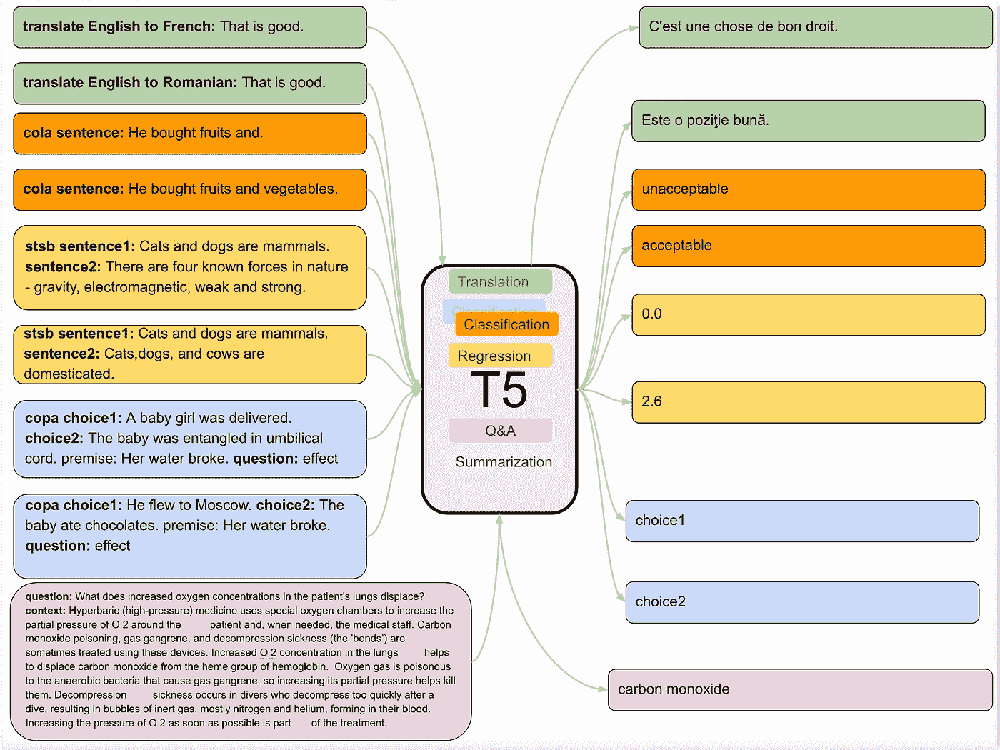
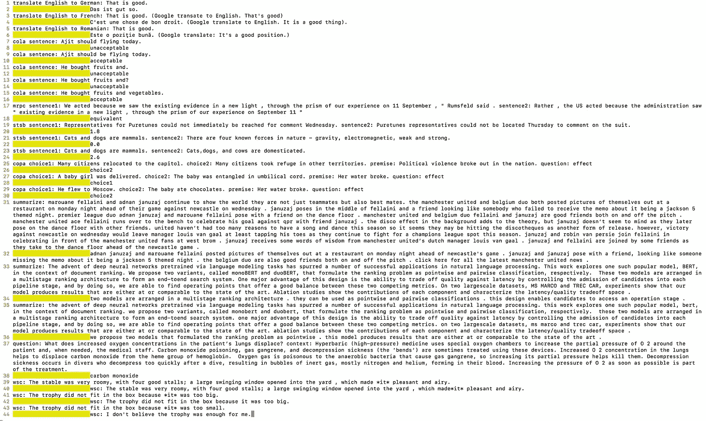

# t5——探索迁移学习极限的模型

> 原文：<https://towardsdatascience.com/t5-a-model-that-explores-the-limits-of-transfer-learning-fb29844890b7?source=collection_archive---------11----------------------->

The [T5 (**T**ext-**T**o-**T**ext **T**ransfer **T**ransformer)](https://arxiv.org/pdf/1910.10683v2.pdf) model. The same model is used for a wide variety of tasks by treating all tasks uniformly as taking some input text and outputting some text where the task type is embedded as descriptors in the input(see bold text in the input on the left above). This approach enables a single model to perform a wide variety of supervised tasks such as translation, classification, Q&A, summarization and even regression (e.g. outputting a similarity score between two sentences in the range 1–5\. This in reality quite similar to a 21 class classification problem as explained below). The model is first pretrained unsupervised (masked objective like BERT) on a large corpus before supervised training with input text representing all these tasks and the associated labeled data which is also text (where specific tokens in the input stream “translate English to French” or “stsb sentence 1:… sentence2”, “question”/”context” etc. encode the task type as shown in figure above and the model is trained to output text matching the labeled data). With this approach of specifying input and output for supervised learning, the model shares its loss function, decoder etc. across all the disparate tasks.

# TL；速度三角形定位法(dead reckoning)

T5 模型通过将不同的任务编码为输入流中的文本指令，以统一的方式处理多种多样的多对多和多对一 NLP 任务。这使得单个模型能够在多种 NLP 任务的监督下进行训练，例如翻译、分类、问答、摘要甚至回归*(尽管实际上它类似于分类)*。

这项工作的主要贡献与其说是模型*(这种编码文本的形式有先例——*[*【gp T2 使用了相同的想法*](https://medium.com/@ajitrajasekharan/gpt-2-a-promising-but-nascent-transfer-learning-method-that-could-reduce-or-even-eliminate-in-some-48ea3370cc21) *【除非在无监督的上下文中，假设它不能完成分类，或者 T5 可以完成的标记问题，给定它的监督学习阶段)*，即使它是 Q & A、摘要等的当前技术状态。，当与规模相结合时。

本文的主要贡献是通过使用 T5 模型的研究结果

*   从纯无监督的预训练到有监督的任务，检查与大规模利用迁移学习相关的因素

在这个过程中，语言理解的迁移学习的一些限制*(在人类的水平)*对于一些任务也在一些任务的性能度量中显现出来。虽然本文将解决这些限制留给了未来的研究，但已经有工作在进行中，以扩展语言理解，不仅仅是文本 *(* [*)例如，基础语言理解- Yoshua Bengio*](https://openreview.net/pdf?id=rJeXCo0cYX) *)。*这些新方法直接从文本着手解决当前迁移学习方法的一些基本问题——样本效率、常识理解、因果推理等。

# 论文中的主要观点

*   本文主要只关注基于变压器的模型*(相对于基于 RNN 的序列模型)*。[基于编码器-解码器的转换器架构](https://arxiv.org/pdf/1706.03762.pdf)最适合 T5 模型中使用的文本到文本方法。通过在编码器和解码器之间共享参数，参数计数保持与仅编码器模型(如 BERT)相同，而性能不会大幅下降*(本文中报告的测试是在没有共享参数的情况下完成的)*。
*   掩蔽目标*(去噪)*与 BERT *中使用的相同(以及其变体，如掩蔽跨度)*的性能优于语言建模目标。
*   预训练最好在大型和多样化的数据集上进行，而不是在小型数据集上进行*(特别是如果数据在预训练中多次出现，这在大型数据集的情况下不是问题)。*此外，对域内数据进行预训练有助于提高下游任务的性能。
*   在微调期间更新预训练模型的所有参数比只更新几个参数产生了更好的性能，尽管计算成本*(见下面的最终想法)*。
*   通过在更多数据上训练模型、训练更大的模型或使用一组方法来进行扩展，所有这些都提高了性能。
*   仅在英语上的预训练方法在翻译(*到法语、德语和罗马尼亚语)上没有产生艺术状态的结果；见下图*)——暗示这不是一种语言不可知的方法。
*   通过使用掩蔽*(去噪)*进行预训练以在下游任务中使用提取的知识的知识提取能力似乎受到模型仅从预测文本的损坏范围中学习的内容的约束。这一发现表明，正如前面提到的，学习方法不仅仅局限于文本*(例如，基础语言理解)*。

# 其他详细信息

*   该模型的初始版本仅支持在 TPU 上运行。此[链接](https://medium.com/@ajitrajasekharan/setting-up-a-tpu-node-in-google-cloud-step-by-step-instructions-2236ac2aacf7)介绍了设置虚拟机和 TPU 节点的步骤。请注意按照安装说明中的[使用正确的 Tensorflow 版本启动 TPU 节点，以避免错误。](https://github.com/google-research/text-to-text-transfer-transformer#setting-up-tpus-on-gcp-for-training-and-evaluation)
*   使用“小”模型解码输入*完成的测试的完整结果如下所示(参见 Github 页面* *中的* [*解码部分的说明)。它也有预先训练好的不同尺寸的模型来进行测试。由于更大的内存需求，我无法让基本型号和大型型号正常工作)。一个 Winograd 模式(WSC)样式测试没有产生论文中报告的结果—不确定问题是什么。*(更新。11 月 6 日。T5 论文中的一位通讯作者**](https://github.com/google-research/text-to-text-transfer-transformer#decode)*[*Colin Raffel*](https://scholar.google.com/citations?hl=en&user=I66ZBYwAAAAJ&view_op=list_works&sortby=pubdate)*【除了指出几处更正之外】优雅地澄清了这个问题。我做的测试和报告都是基于多任务混合训练的模型——对编码不同任务的句子进行监督训练。论文中报告的结果是在模型上进行的测试，这些模型针对特定任务进行了进一步的优化。作者怀疑 WSC 任务可能需要微调——它可能不仅仅适用于预训练的多任务混合，尤其是“小模型”。因此，为了在新领域的特定任务中获得最佳结果，我们首先在该领域的大型语料库中进行无监督训练。然后对输入句子中的多任务混合编码任务进行预训练。最后针对特定任务进行微调，以获得该任务的最佳性能)**

*   这种文本到文本的方法带来的一个挑战是模型可能不输出它在测试阶段期望输出的单词之一。例如，在上面所示的“可乐测试”*(测试句子语法是否可接受)*中，可以想象模型可以输出除“选择 1”或“选择 2”之外的字符串。作者声称这种情况将被视为测试失败，尽管他们没有观察到这种情况。此外，该模型可以为相同的输入产生不同的输出，这在摘要中是显而易见的。
*   最后，现实中回归模型的使用非常类似于分类问题。与输出可以是连续值的真正回归模型不同，该模型仅被定型为预测 1-5 范围内以. 2 为增量的值。这与值 0 一起产生 21 个值，这实质上是一个 21 类分类问题。

# 最后的想法

虽然在较大数据集上训练的较大模型继续提高了一些标准 NLP 任务的性能，但在大型语料库上预训练的通用知识提取似乎仍然没有在像 Winograd Schema challenge (WSC)这样的任务中带来接近人类水平(100%)的性能。似乎至少有两种不同的方法来解决这个问题。

*   第一种方法是继续增加 T5 论文和其他相关工作所建议的规模和训练策略，例如通过不[用替代物(由生成器网络输出)](https://openreview.net/forum?id=r1xMH1BtvB)替换标记来改变掩蔽词的当前预训练程序，并让鉴别器预测替换。然而，所有这些方法仍然通过在单词空间中进行预测来学习。
*   尝试预测下一个记号的完全不同的方法，不是在单词的空间，而是在抽象表示的[转换空间](https://arxiv.org/pdf/1901.10912.pdf)。这是[非常早期的研究](https://youtu.be/-BjJMs8DS-8)，它解决了当前空间预测模型难以克服的一系列挑战——需要大量训练数据*(样本效率低下)*，无法像 WSC 这样的任务那样进行常识和因果推理。相对于在单词空间*(或在图像-像素空间的情况下)*中进行预测，在抽象表示空间中进行预测的目标是，通过这样做，模型可以学习潜在的因果变量，除了用这些变量进行推理之外，还能够适应潜在分布的变化*(因果结构仍然保持不变)*需要很少的新训练样本，这是迁移学习的关键目标之一。

*这篇文章是从 Quora*[*https://qr.ae/TWPZq5*](https://qr.ae/TWPZq5)手动导入的