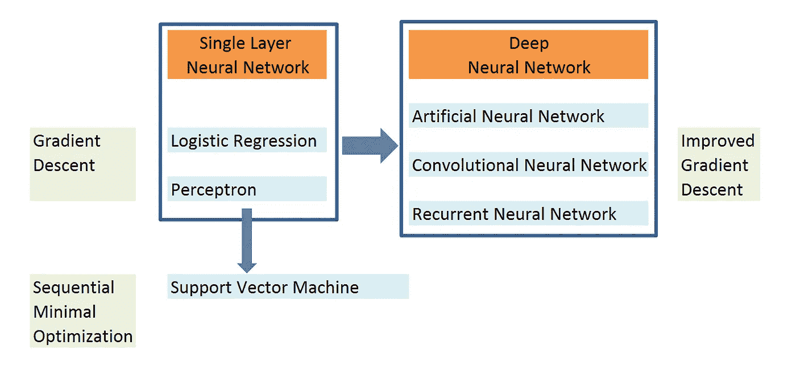
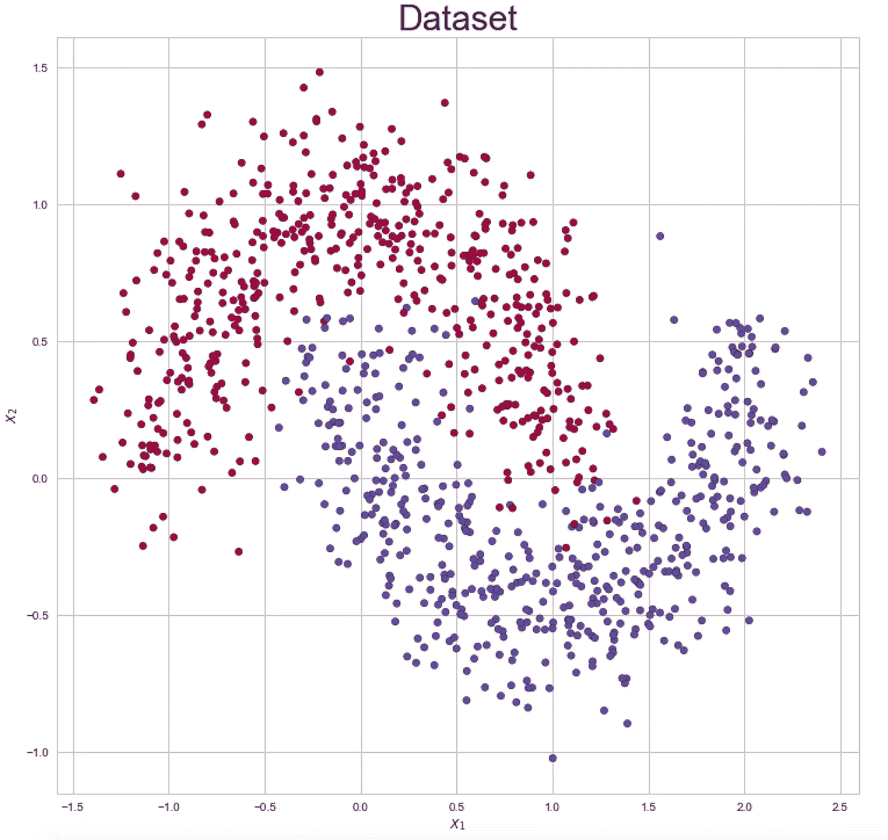
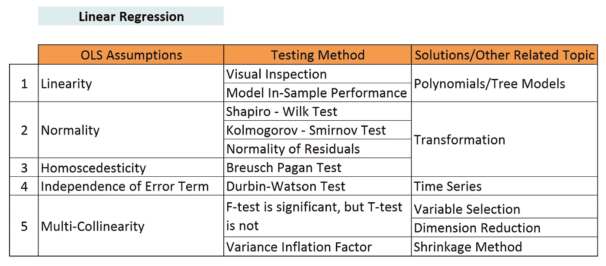
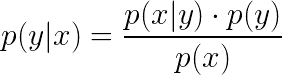
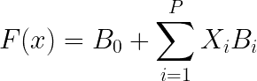
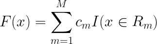
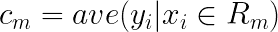
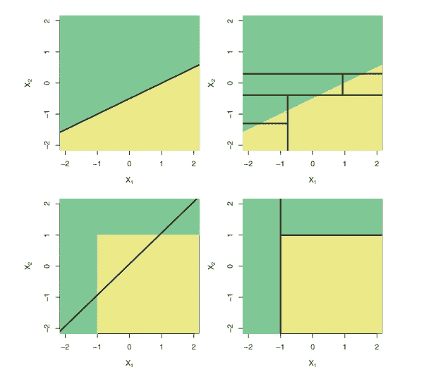

# 机器学习和深度学习综述

> 原文：<https://towardsdatascience.com/table-of-contents-689c8af0c731?source=collection_archive---------19----------------------->

## 机器学习和深度学习之旅

## 机器学习和深度学习模型和算法的映射和总结

这一系列博客将涵盖机器学习和深度学习从理论到实践的主题。目前市场上有许多优秀的教科书，包括模式识别和机器学习，统计学习的元素，深度学习等。然而，似乎那些作者喜欢直接跳到一个算法的结论，而跳过一步一步的解释和说明。因此，对于大一新生来说，那些书不容易消化。还有，那些书没有涉及如何在 R 或 Python 等统计软件中实现算法。我认为要很好的掌握统计模型和算法，理论和数学很重要，实现也很重要。因此，我想在理论和实践之间架起一座桥梁。

经过多年的学习，我认为所有这些方法都是相互联系的，而不是孤立的。当一个传统的方法显示出一些局限性时，那么一个新的方法就被引入来弥补这个局限性，从而进行改进。比如传统的线性回归很难处理多重共线性，于是发明了 LASSO 和岭回归来解决这个问题。另一个例子是引入装袋和增压来提高单棵树模型稳定性和准确性。如今，你也可以看到越来越多的方法涉及到不同领域的知识。将时间序列中的移动平均的思想应用于深度学习中的梯度下降中，以获得更快的收敛并减少振荡，这被称为带动量的梯度下降。因此，首先我想在这个博客中展示方法论之间的关系，然后我想写另外的博客来分别解释每个主题。你可以点击链接阅读你感兴趣的话题。

这个博客会不时更新，将来会增加更多的内容。

**1。深度学习:**

上图显示了传统统计模型和深度学习模型之间的关系。绿色的术语是用于生成相应模型的算法。

在深入研究神经网络(如 ANN、CNN 或 RNN)之前，让我们从单层神经网络开始我们的旅程。单层神经网络的思想是首先对输入变量进行加权线性组合，然后应用激活函数进行非线性变换。经典的单层神经网络包括逻辑回归和感知器。逻辑回归和感知器的区别在于，逻辑回归使用 sigmoid 函数作为激活函数，而感知器使用符号函数。

关于逻辑回归，请阅读我的博客:

 [## 逻辑回归导论

### 逻辑回归从理论到实践的深度探讨

towardsdatascience.com](/an-introduction-to-logistic-regression-8136ad65da2e) 

对于感知器算法，请阅读我的博客:

 [## 感知器算法简介

### 本博客将涵盖以下问题和主题

medium.com](https://medium.com/@songyangdetang_41589/an-introduction-to-perceptron-algorithm-40f2ab4e2099) 

逻辑回归和感知器都使用梯度下降来获得最终模型。对于梯度下降，请阅读我的博客:

 [## 梯度下降导论

### 本博客将涵盖以下问题和主题:

towardsdatascience.com](/an-introduction-to-gradient-descent-c9cca5739307) 

逻辑回归和感知器的限制是这两个模型的决策边界只能是线性的。当我们有一个更复杂的分类问题时，如下图所示，我们可能会期望一个更先进的方法，所以神经网络被引入。

如果你想用简单的数字建立一个神经网络，并更深入地理解这种奇特的算法，请阅读我的博客:

 [## 用 python 构建神经网络

### 使用 Numpy 实现正向传播和反向传播

medium.com](https://medium.com/@songyangdetang_41589/build-up-a-neural-network-with-python-7faea4561b31) 

**2。线性回归**

经典线性回归提供了另一个引入机器学习的完美角度。普通最小二乘法(OLS)用于估计线性模型的系数。然而，线性模型需要遵循几个假设，这些假设对模型的成功和预测的准确性至关重要。上表显示了假设、测试方法和每个假设的解决方案。

**3。贝叶斯统计**

贝叶斯统计在机器学习中也起着重要的作用。贝叶斯统计的一个范例是朴素贝叶斯分类器，它可以简单快速地训练。贝叶斯统计也用于无监督学习，如高斯混合模型(GMM)。贝叶斯公式如下所示:

公式中， *p(y|x)* 为后验概率； *p(x|y)* 是似然性； *p(y)* 是先验概率 *p(x)* 是证据。

对于朴素贝叶斯分类器，请阅读我的博客:

 [## 朴素贝叶斯分类器简介

### 从理论到实践，学习感知机的基本原理

medium.com](https://medium.com/@songyangdetang_41589/introduction-to-na%C3%AFve-bayes-classifier-fa59e3e24aaf) 

在频数统计中，分布的参数是一个确定的数，最大似然估计(MLE)用于进行估计；在贝叶斯统计中，分布的参数也是一个随机变量，而是使用最大后验概率(MAP)。MLE 和 MAP 的对比见博客:

 [## 最大似然估计与最大后验概率

### 最大似然估计(MLE)和最大后验概率(MAP)都被用来估计模型中的一些变量

medium.com](https://medium.com/@songyangdetang_41589/mle-vs-map-a989f423ae5c) 

**4。基于树的模型**

让我们从线性模型转移到非线性模型。非线性模型的一个范例是决策树。决策树是一种基于树的算法，用于解决回归和分类问题。回归树用于具有连续值的因变量，分类树用于具有分类值的因变量。树与更经典的方法(如线性回归或逻辑回归模型)有着非常不同的味道。

特别是，线性回归假设模型的形式为:

而回归树假设模型的形式为:

其中 *R1，…，Rm* 表示特征空间的一个划分和 *Cm:* 的表达式

哪款比较好？根据没有免费的午餐定理，没有一个模型能对所有可能的情况都适用。因此，我们选择的方法取决于手头的问题。如果真正的决策边界是线性的，如顶部的两个图(下图)所示。线性模型将优于树模型。同时，如果真正的决策边界是矩形的，如下面的两个图所示。树模型比线性模型更能拟合数据。除了拟合度之外，为了可解释性和可视化，树模型是优选的。

Figures Source: Gareth James, Daniela Witten, Trevor Hastie, Robert Tibshirani, 2017, An Introduction to Statistical Learning

可以在博客中看到决策树的详细信息:

 [## 机器学习中的决策树

### 决策树背后的数学原理及其 Python 实现

medium.com](https://medium.com/@songyangdetang_41589/how-decision-tree-model-works-ce681cae10a6) 

我的 Github 链接:

 [## sytangtang1991 -概述

### 在 GitHub 上注册您自己的个人资料，这是托管代码、管理项目和构建软件的最佳地方

github.com](https://github.com/sytangtang1991) 

**参考**

[1]伊恩·古德费勒，约舒阿·本吉奥，亚伦·库维尔，(2017) *深度学习*

[2] Gareth James，Daniela Witten，Trevor Hastie，Robert Tibshirani，(2017) *统计学习介绍*

[3] Christopher M. Bishop，(2009)，*模式识别和机器学习*

[4]特雷弗·哈斯蒂，罗伯特·蒂布拉尼，杰罗姆·弗里德曼，(2008)，*统计学习的要素*