# 六分钟内完成基本画面

> 原文：<https://towardsdatascience.com/tableau-basics-in-six-minutes-35b50ec9ae9b?source=collection_archive---------6----------------------->

## 了解商业智能、数据可视化和仪表板创建的 Tableau

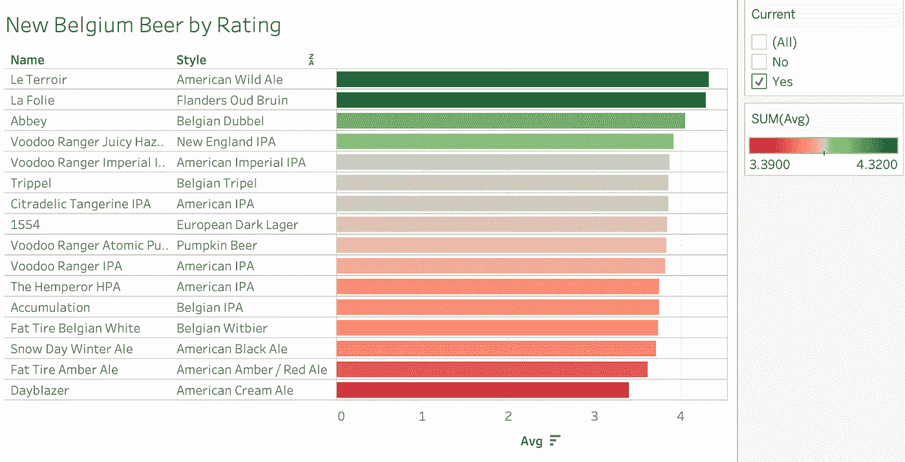

New Belgium Beer Ratings in Tableau

商业智能软件帮助组织做出更好的决策。通过提供良好的可视化仪表板，它们可以更轻松地:

*   查看数据中的关系
*   讲一个清晰的故事
*   将重点放在重要的指标上

[Tableau](https://www.tableau.com/) 和[微软 Power BI](https://powerbi.microsoft.com/en-us/) 是数据可视化和商业智能软件领域的领先产品。Tableau 最近以 157 亿美元的价格卖给了 SalesForce】。显然，让公司更容易可视化他们的数据有很大的价值。😁

Tableau 很受欢迎。我之前对数据科学家最需要的技能的分析显示，Tableau 是数据科学家工作清单中第八大最常见的技术技能。

From [my article](/the-most-in-demand-skills-for-data-scientists-4a4a8db896db)

Tableau 是这个列表中最容易快速精通的技术——假设你已经了解 Excel。我建议你花一点时间在 Tableau 上，这样你就可以把它添加到你的工具箱和简历中。

有了 Tableau，你可以快速做出令人印象深刻的可视化效果。好玩又好用。😀

事不宜迟，让我们看看开始使用 Tableau 时需要知道的最重要的事情，以便为您的成功做好准备。我将用一个新比利时酿造啤酒评级的数据集来演示，这个数据集是我从[啤酒倡导者](https://www.beeradvocate.com/)那里搜集来的。🍺

# 关于 Tableau 要知道的 10 件事

1.  几乎都是拖拖拉拉。您可能偶尔需要输入高级计算，但一般来说，只需拖放即可。🖱

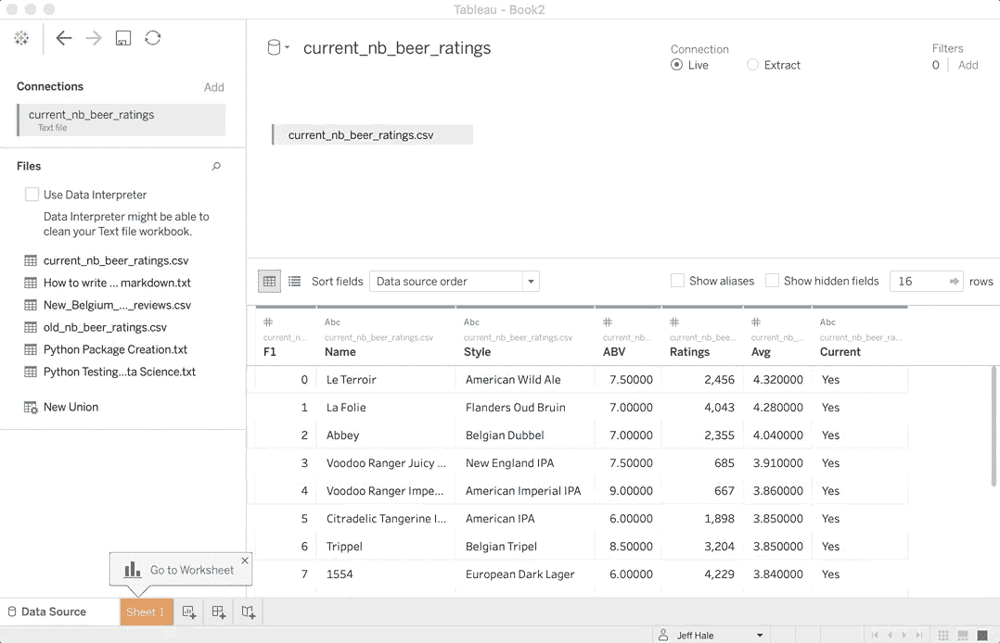

Drag and drop

2.您在*数据源*选项卡中导入数据。拖放数据源以连接或联合它们。Tableau 拥有几乎所有你能想到的数据源的连接器。

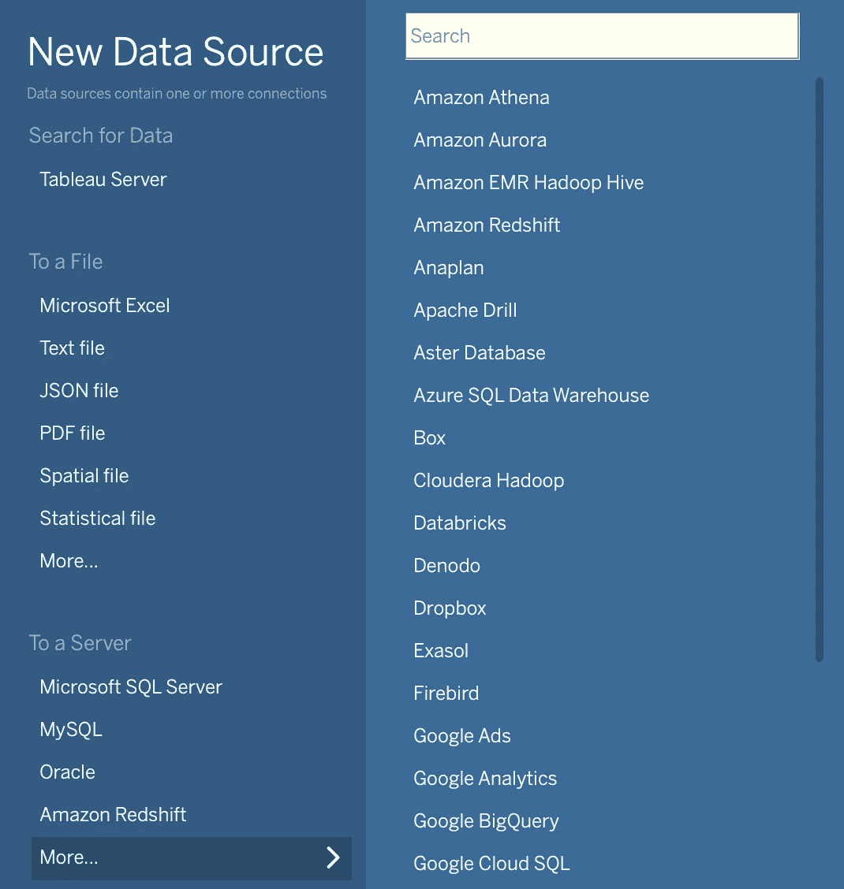

Some Tableau Connector Options

3.你的大部分工作都在工作表中完成。每个工作表都在窗口底部的选项卡中，就像在电子表格程序中一样。

将变量从左侧*数据*栏拖动到工作表顶部的*行*和*列*字段*和*。

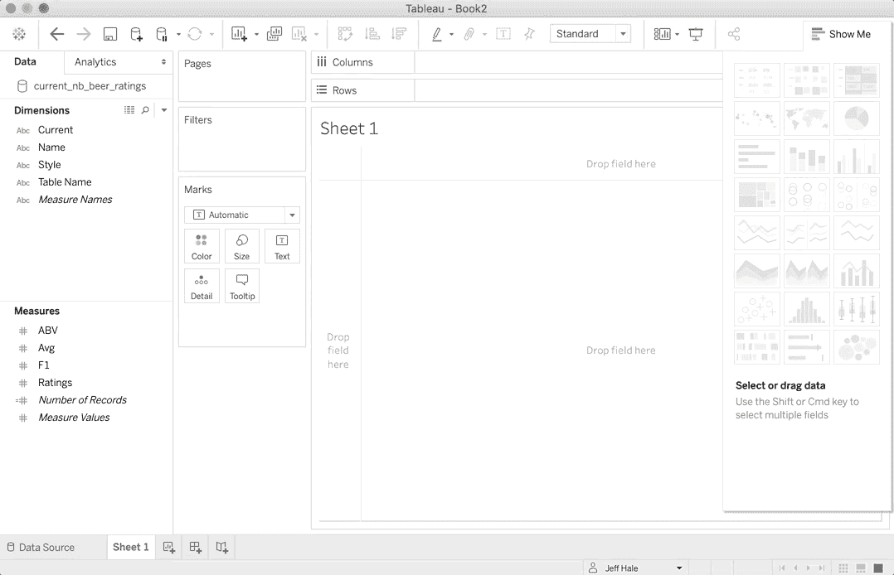

Dragging variables to Rows

*视图*是工作表的主要可视化区域。您也可以将变量拖到视图或*标记*卡上，以便它们显示在视图中。

4.Tableau 试图提供帮助。它根据列的内容推断数据的类型。它在每个变量名旁边提供了有用的小符号来表示数字、字符串、地理、布尔和日期数据类型。Tableau 将您的数据列拆分为*维度*和*度量*。

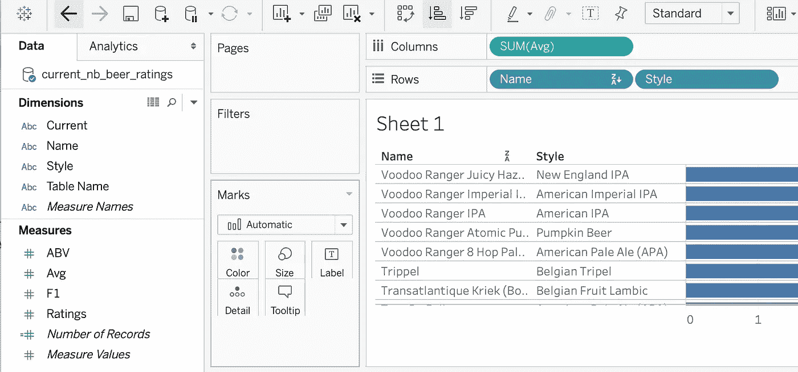

Dimensions and measures

维度是定性(分类)变量，包括字符串和日期。默认情况下，它们是离散的。离散变量是蓝色的。

度量是可以求和并求平均值的定量(数字)变量。默认情况下，它们是连续的。连续变量标为绿色。

默认情况下，Tableau 会假设您在任何时候使用度量值时都希望对它们求和。您可以通过右键单击该变量来更改聚合函数。

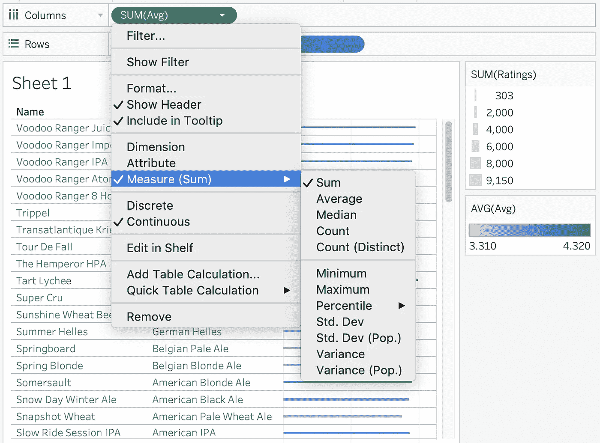

Changing the aggregation function

关于数据科学中离散变量和连续变量之间差异的更多讨论，请参见我的文章[这里](/7-data-types-a-better-way-to-think-about-data-types-for-machine-learning-939fae99a689)。有关 Tableau 中变量的更多讨论，请参见[文档](https://help.tableau.com/current/pro/desktop/en-us/datafields_typesandroles.htm)。

5.标记卡控制许多可视化方面。将变量从左侧栏拖到标记卡，以控制颜色、文本、工具提示等。在设置好行和列后使用它。

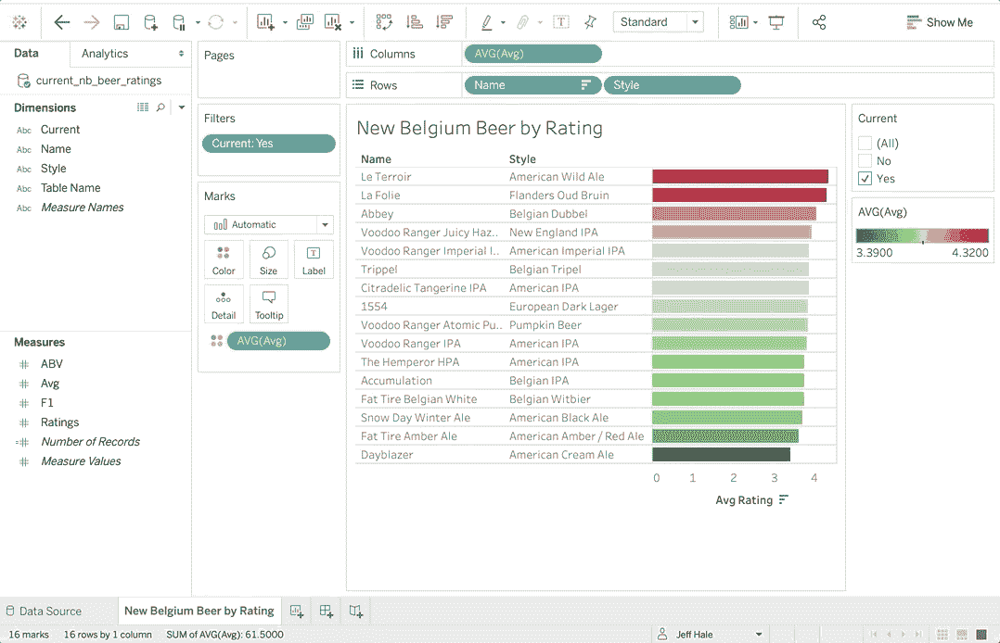

Make the size of the bars based on the number of ratings

6.有许多图表选项——Tableau 在右侧可展开的*演示*菜单中提供建议。建议基于工作表中使用的当前变量。

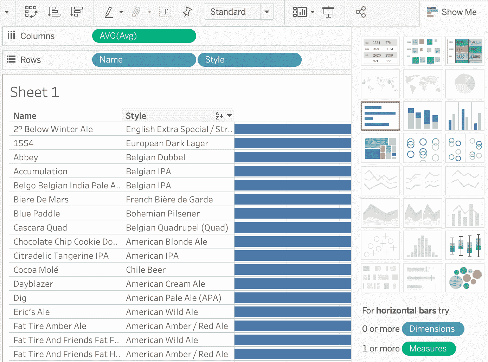

Show Me menu of visualizations

要知道，如果你点击一个图表选项，Tableau 可能会重新排列工作表中的变量。

7.格式可以更改。右键点击你想改变的，你会看到选项。在右键菜单中，你可以设置格式。

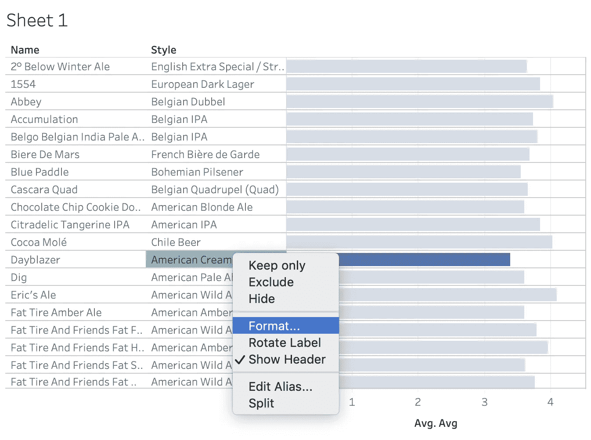

Format most anything with a right click

8.筛选数据就像将变量拖到筛选区域一样简单。右击药丸并选择*显示过滤器*创建一个交互式过滤器。

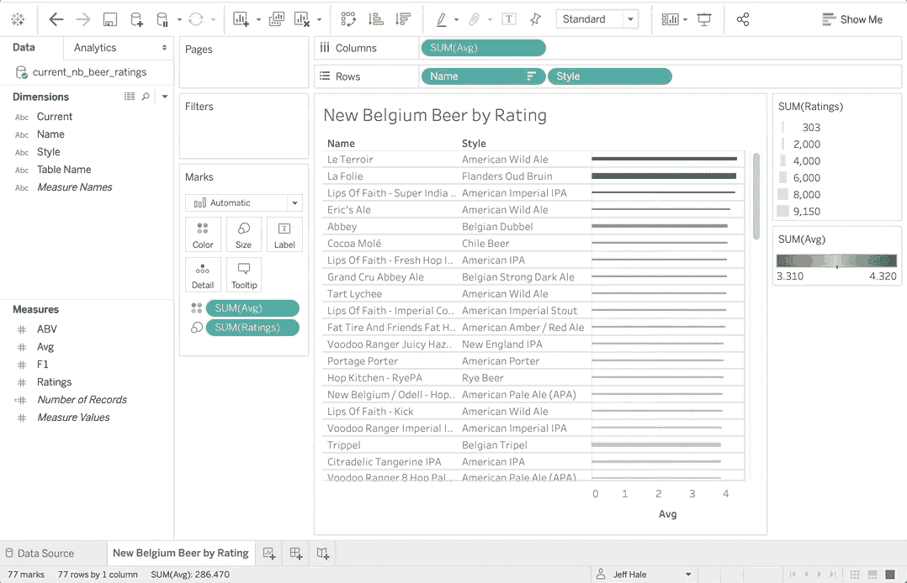

Filters are cool!

很圆滑，是吧？

9.右键点击一个变量，可以创建一个*组*、*集合*或*计算字段*。这些选项允许您对数据进行分组并找到更多见解。

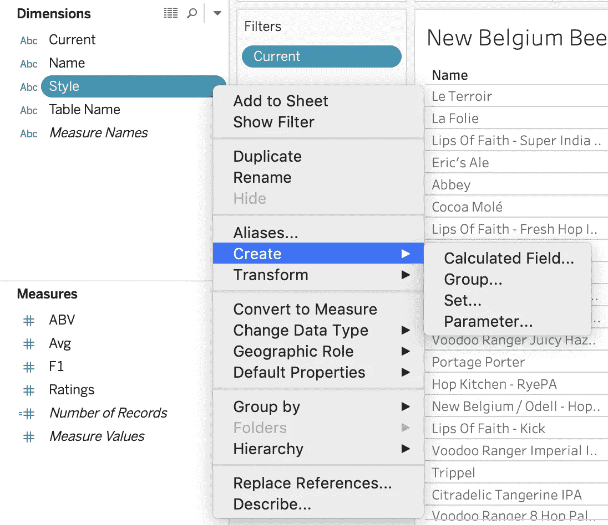

Create more things!

10.您可以快速制作仪表板。只需将完成的工作表拖放到新的仪表板上。然后，查看者可以对您的图表进行排序和过滤，但他们不能破坏您的仪表板。😁

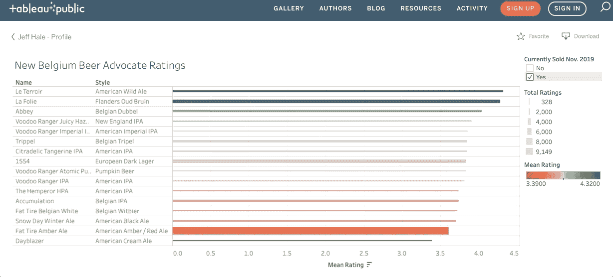

Dashboard at [Tableau Public](https://public.tableau.com/profile/jeff.hale6436#!/vizhome/NewBelgiumBeerRatings/NewBelgiumBeerAdvocateRatings)

你可以在 Tableau Public [这里](https://public.tableau.com/profile/jeff.hale6436#!/vizhome/NewBelgiumBeerRatings/NewBelgiumBeerAdvocateRatings)玩我创建的仪表板，探索来自啤酒倡导者的新比利时啤酒评级。

你可以用我用来在 [GitHub](https://github.com/discdiver/new-belgium-ratings) 刮收视率的 Python 代码克隆 Jupyter 笔记本。请注意，我排除了评级低于 300 的啤酒。

# 结论

Tableau 非常适合快速创建漂亮的可视化仪表盘。Tableau 不太适合机器学习。你可以得到一条趋势线，显示 R2。但其他任何事情都需要一些技巧。🤸🏾‍♂️

您可以免费使用 Tableau Public，但是使用私有数据创建数据可视化将需要 Tableau Desktop。截至 2019 年底，这将花费你每月 70 美元。这两款 Tableau 产品都是适用于 MacOS 和 Windows 的可下载程序。

建议大家下载 Tableau Public 玩玩。你可以通过拖放操作——以及随意使用撤销按钮。😉然而，知道自己在做什么并能够快速做出改变是很好的。希望这篇指南能激起你学习更多东西欲望。我第一次学习 Tableau 是和[基里尔·叶列缅科](https://medium.com/u/6b467d74ac43?source=post_page-----35b50ec9ae9b--------------------------------)的优秀 Udemy 课程: [Tableau 10 A-Z](https://www.udemy.com/course/tableau10/) 。写这篇文章的时候是 9.99 美元。

如果你想用 Python 制作类似的交互式可视化，我是 [Plotly](https://plot.ly/) 的粉丝。我在这里写了一篇关于使用 Plotly [的介绍。不过，Tableau 要快得多。](/its-2019-make-your-data-visualizations-interactive-with-plotly-b361e7d45dc6)

我希望这个指南对你有用。如果你有，请在你最喜欢的社交媒体上分享，这样其他人也可以找到它。👍

我撰写关于 Python、Docker、数据科学和其他技术主题的文章。如果你对此感兴趣，请关注我，在这里阅读更多。

用餐愉快！