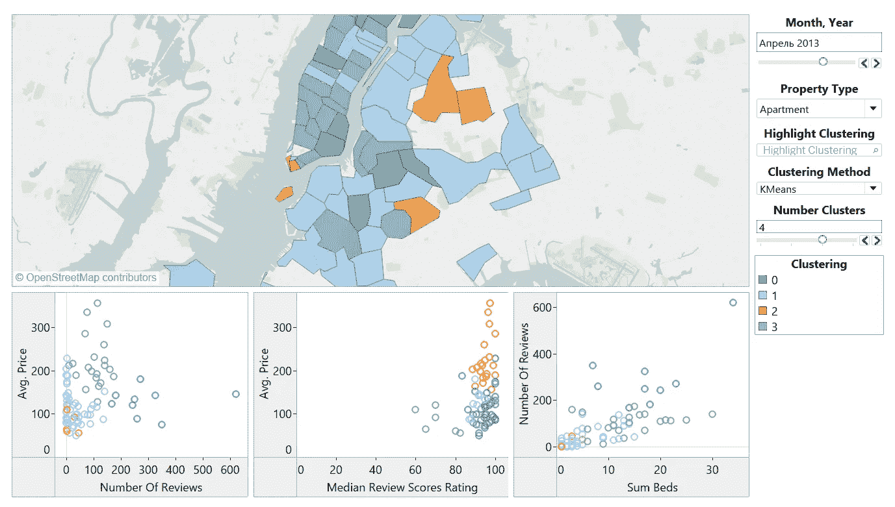
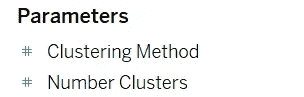
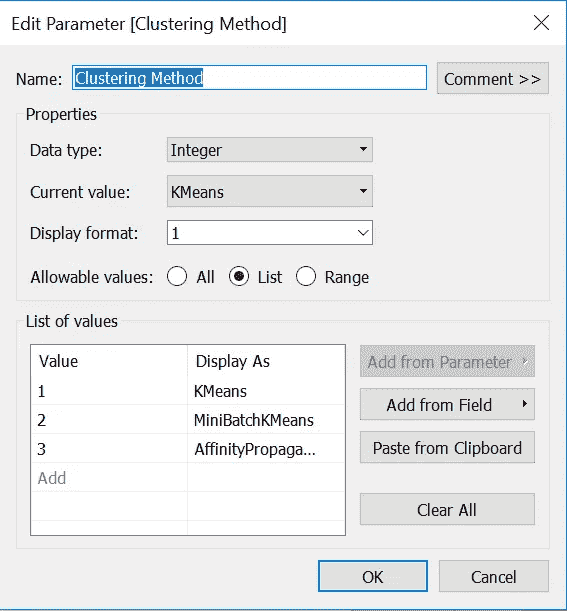
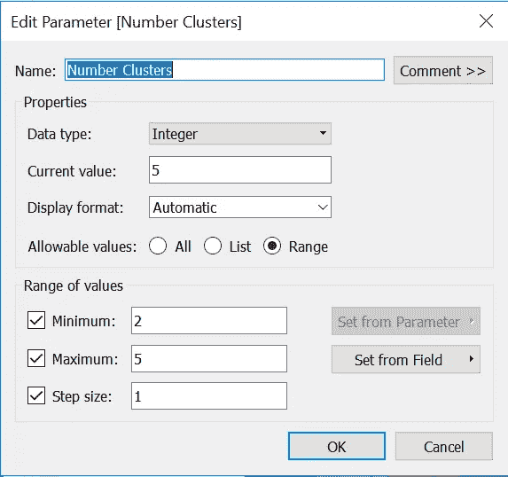
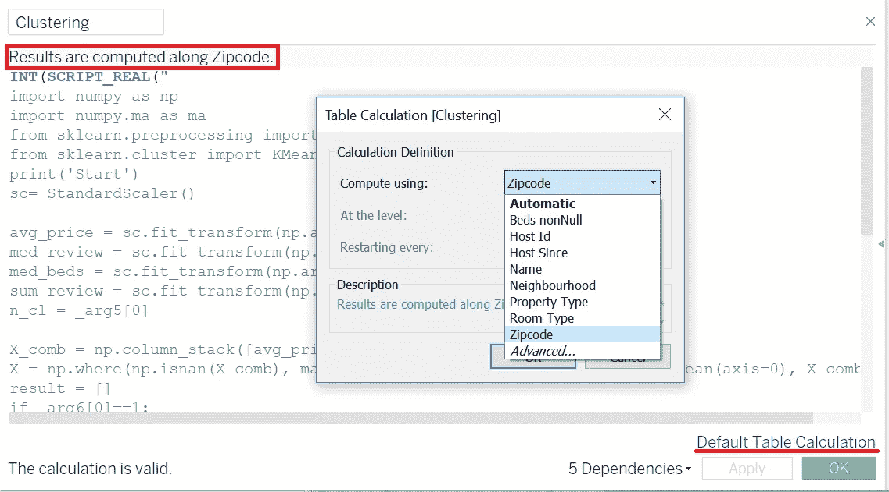
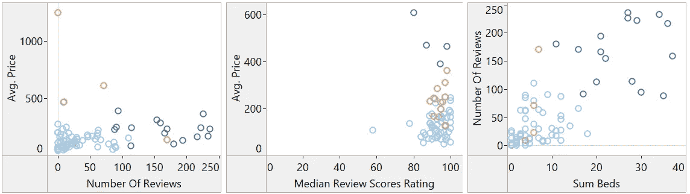
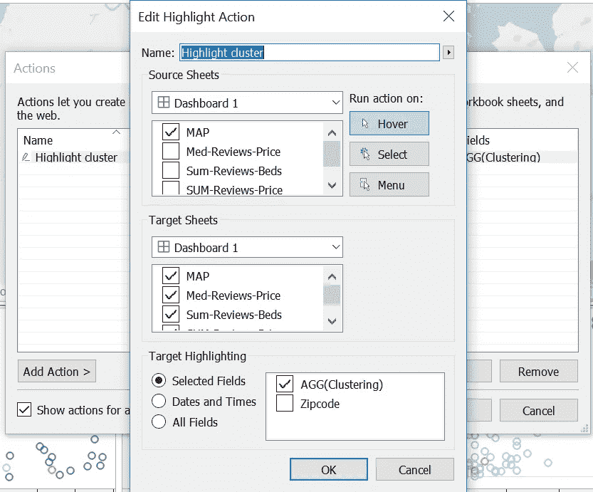

# tableau+Python:tabby 和地理聚类

> 原文：<https://towardsdatascience.com/tableau-python-tabpy-and-geographical-clustering-219b0583ded3?source=collection_archive---------14----------------------->

## 使用 K-means 聚类分析探索数据的简单方法。

Dashboard for clustering AirBNB

这是一个关于如何使用 Tableau 扩展在地图上进行 K-Means 聚类的简短教程。

TabPy 可以在这里下载[或者，如果你使用 conda:](https://github.com/tableau/TabPy)

**conda install-c anaconda tabby-server**

关于如何安装和运行 tabpy server 的文章有很多，但是我个人遇到了两个问题:

1.  *权限错误:[WinError 5]访问被拒绝*。在这里[解决](https://github.com/tableau/TabPy/issues/101)
2.  *无法使用 windows 批处理文件 startup.bat 运行 tabby server*[解决方法是安装 tornado-5.1。](https://github.com/tornadoweb/tornado/issues/2616#issuecomment-470365272)

正如我提到的，我的目标是测试 tabpy 功能，我选择了集群问题作为最常见的问题之一。K-Means 算法是一个很好的工具，可以在不做任何假设的情况下探索你的约会。关于 K-Means 有很多教程:有些是[这里](/clustering-using-k-means-algorithm-81da00f156f6)和[这里](/k-means-clustering-8e1e64c1561c)。数据来源— [**纽约市 Airbnb 房源**](https://public.tableau.com/en-us/s/resources) 公布于 Tableau 公共资源。

该表由几个维度组成:

*   邮政编码
*   属性类型
*   邻近
*   房型等。

我用邮政编码来绘制地图。主要维度，大家可能会感兴趣:物业类型，主机自(时间维度)。

首先，我创建了两个控制参数来管理集群:

Tableau Control Parameters

聚类方法，顾名思义，就是负责一个聚类算法。

使用 **SCRIPT_REAL** 函数将脚本嵌入到计算字段中:

使用 tapby 的一个特点是，它将数据作为列表发送到服务器，因此需要将数据转换为 np.array 并在一列中整形。另一个技巧是删除所有具有 NAN 值的行，这在**第 16 行完成。**

**_arg5** 和 **_arg6** 对应管理参数。尽管它们是单个值，但它们也被打包到列表中，因此为了对 python 解包它们，应该使用 **_arg5[0]** 和 **_arg6[0]** 。

此外，有时算法不起作用，因为表格计算使用了错误的维度。在我的例子中，我使用了沿着**邮政编码**的计算。默认的表计算很少工作，所以每次在代码中查找错误之前检查这个选项。

Default Table Calculations

为了看看我们的聚类是否有意义，我添加了几个散点图来可视化潜在变量的联合分布:

1.  平均值。价格与评论数量
2.  平均值。价格与中值评审分数评级
3.  审查数量与总数(床位)

Scatterplots of joint distribution

可以看出，聚类没有很好地定义，所以我们的简单模型和随机选取一样好，但至少它没有错误👌。

为了增加图形和地图之间的交互性，可以创建仪表板动作。我在*仪表盘>动作*中添加了悬停动作。

这是我第一次使用 TabPy，到目前为止，它的用处有限，但我希望 Tasbleau 将进一步发展它。

**附言**

此外，有时我会给[电报](https://t.me/seeking_for_alpha)(大部分是俄语)写一些关于资产管理的内容。