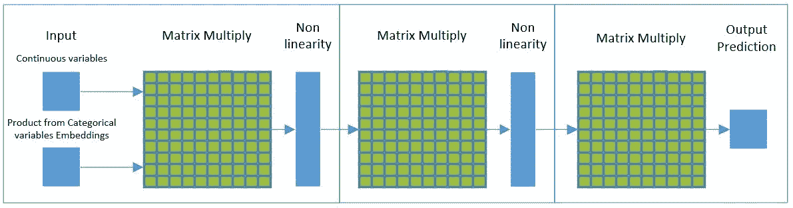
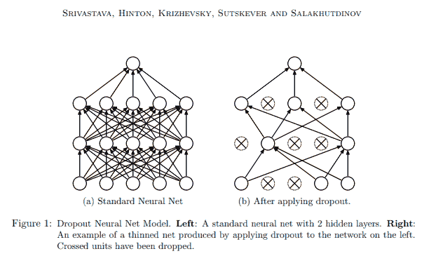

# 基于深度神经网络的表格数据分析

> 原文：<https://towardsdatascience.com/tabular-data-analysis-with-deep-neural-nets-d39e10efb6e0?source=collection_archive---------8----------------------->

深度神经网络现在是用于表格数据分析的有效技术，与其他技术相比，需要较少的特征工程和较少的维护。

目前，在用于表格数据回归和分类任务的机器学习领域中，表现最好的技术被广泛认为是随机森林、梯度推进机器、K 近邻以及诸如支持向量机的较老技术，这些技术遭受维数灾难，最终开始较少使用。

对于大多数从业者来说，深度神经网络被视为对诸如计算机视觉、图像处理、语言处理/理解和信号处理等任务有用。

在过去几年中，使用深度神经网络进行表格数据回归和分类取得了巨大成功。对于著名的深度学习实践者，如杰瑞米·霍华德，90%的时间使用深度神经网络，通常随机森林或其他方法用于剩余的 10%。

深度神经网络对于对表格数据进行预测既可靠又有效。以前，一些从业者认为随机森林在 99%的情况下是表格数据分析的最佳技术。更多信息请看我关于随机森林的文章:[https://medium . com/@ CDT _ 9051/Random-Forests-a-free-lunch-that-that-not-founded-662034 D4 BF 46](https://medium.com/@cdt_9051/random-forests-a-free-lunch-thats-not-cursed-662034d4bf46)

## 深度神经网络可用于表格数据分析的示例

深度神经网络模型可以被训练来执行许多表格数据分析任务:

*   欺诈检测
*   销售预测
*   产品故障预测
*   定价
*   信用风险
*   客户保持/流失
*   推荐系统
*   广告优化
*   反洗钱
*   简历筛选
*   销售优先级
*   呼叫中心路由
*   商店布局
*   商店位置优化
*   员工排班

(来源 Fast.ai 课程 v3)

对于上述一些用法，可能存在伦理问题，请参见本文后面的伦理注释。

例如，Pinterest 用神经网络取代了梯度推进机器，因为它们需要更少的特征工程，更准确，需要更少的维护。

# 特征工程

机器学习中的大多数当前想法是使用特征工程来预处理您的数据以移除特征，有时对从业者认为数据中的特征进行假设。人们习惯于经典统计学，习惯于去除参数。

当对表格数据使用深度神经网络时，仍然需要特征工程，尽管要少得多。所需的特征工程需要更少的维护。理想情况下，使用神经网络的表格数据分析功能不会被删除，所有的数据都可以保留和增加。

有些特征可能需要仔细检查，至于它们是否会造成歧视，请参见本文下面的伦理部分。

## 分类变量和连续变量

数据将包含分类变量和连续变量。连续变量是像年龄或体重这样的数字，它们在任意两个值之间有无限多个值。分类变量是那些从离散组中选择的变量，例如婚姻状况或狗的品种。

连续数据可以作为数字输入到神经网络中，就像将像素值输入到深度神经网络中一样。

## 特征预处理

训练深度神经网络不会自己完成所有需要的特征工程，这将发现特征之间的非线性和相互作用。

在基于图像的数据中使用变换的情况下，相反，在训练之前，使用预处理器预先处理表格数据一次。

这种预处理应该包括填充缺失的数据..对于连续数据，缺失值可以用数据集的中值代替。对于神经网络来说，知道该数据行缺少该特征也很重要。可以添加一个新要素来指示该行中该要素缺少的值，因为这本身就是有价值的信息。这可以防止缺失的特征值影响预测，同时仍然知道该行缺失某个要素的数据。

连续变量可以通过减去特征的平均值并除以特征的标准偏差进行归一化，从而得到介于 0 和 1 之间的值。这使得神经网络更容易训练。

应用于定型集的预处理必须以相同的方式应用于验证集和测试集。

## 分类变量的嵌入

对于每个分类变量，可以创建一组可训练的权重矩阵，分类变量中的每个类别/类都有一行。这些矩阵被称为嵌入。该嵌入矩阵乘以代表数据行的类别/类的一个热编码向量的结果然后被用作神经网络的输入。这些被训练成为每个分类变量中每个类别/类的一组偏差。

# 用于表格数据分析的深度神经网络架构

一个简单的完全连接的深度神经网络足以完成几乎所有的表格数据分析任务，例如下面概述的网络。

Neural Network architecture for Tabular data analysis, source Christopher Thomas.

## 输入层

对于输入层，除了来自每个分类变量嵌入矩阵的结果之外，输入是连续变量的数量。每个嵌入矩阵乘以每个分类变量中数据行的类的一个热编码向量，以形成输入的一部分。

对于复杂的表格数据分析任务，该层可能有 1，000 个输出激活。

矩阵乘法是线性函数。

在大多数情况下，非线性应该是整流线性单元(ReLU)或其变体之一。可以在非线性之后应用批量归一化，以避免过度拟合。

## 中间层

中间层将具有与来自最后一层的输出激活相同数量的输入，在输入层的示例中为 1000 个输入。对于复杂的表格数据分析任务，该层可能有 500 个输出激活。

同样，矩阵乘法是线性函数，非线性在大多数情况下应该是 ReLU，并且可以应用批量归一化。

在这个例子中，权重矩阵中有 500，000 个参数。为了防止过度拟合，可以应用下面描述的技术。

## 输出层

输出层将具有与最后一层的输出激活相同数量的输入，在本例中为 500 个输入。在大多数情况下，会有一个线性转换到一个输出，预测值。

# 过度拟合

过度拟合本质上是匹配特定的数据行，而不是该数据的特征。防止过度拟合是成功使用深度神经网络进行表格数据分析的关键。为了帮助防止过度拟合，可以应用以下技术:

*   重量衰减
*   拒绝传统社会的人
*   批量标准化

## 重量衰减

权重衰减通过每次更新权重来实现，权重乘以小于 1 的因子，通常在 0.01 和 0.1 之间。这可以防止训练过程中重量增长过大。

这项技术于 1992 年被 Anders Krogh 和 John A. Hertz 发现，是减少过拟合的最古老的神经网络泛化技术之一，他们的论文是:[https://papers . nips . cc/paper/563-a-simple-weight-decay-can-improve-generalization . pdf](https://papers.nips.cc/paper/563-a-simple-weight-decay-can-improve-generalization.pdf)

## 拒绝传统社会的人

对于培训中的每个小批量，可以随机移除(退出)激活。这可以防止对特定数据项的过度拟合。这是在 2014 年发现的，是减少神经网络中过拟合的最重要技术之一。

Nitish Srivastava, Geoffrey Hinton, Alex Krizhevsky, Ilya Sutskever and Ruslan Salakhutdinov. Source: [http://jmlr.org/papers/volume15/srivastava14a.old/srivastava14a.pd](http://jmlr.org/papers/volume15/srivastava14a.old/srivastava14a.pdf)

这显然是杰弗里·辛顿辍学的灵感来源:

*“我去了我的银行。出纳员一直在变，我问其中一个为什么。他说他不知道，但是他们经常搬家。我想这一定是因为它需要员工之间的合作才能成功地欺骗银行。这让我意识到，随机移除每个例子中不同的神经元子集将防止共谋，从而减少过度拟合。”*

丢弃技术也可以应用于来自嵌入矩阵的输入。

## 批量标准化

批量标准化显著降低了少量外围输入对训练模型产生过多影响的能力，从而减少了过度拟合。此外，批量标准化可以将训练时间增加一个数量级。

这是由 Sergey Ioffe，Christian Szegedy 在 2015 年发现的，是减少神经网络过拟合的最重要的技术之一。

 [## 批量标准化:通过减少内部协变量转移加速深度网络训练

### 训练深度神经网络是复杂的，因为每层输入的分布在训练过程中会发生变化

arxiv.org](https://arxiv.org/abs/1502.03167) 

# 数据扩充

除了上述缺失数据特征扩充之外，其他技术可以帮助发现隐藏在数据中的特征。

## 时间序列数据扩充

令人惊讶的是，使用具有时间序列数据的神经网络的现有技术结果并不使用递归神经网络(RNNs ),而是使用基于时间元素生成的特征。这使得大多数时间序列任务可以被视为常规的表格任务。

例如，对于给定的日期，可以从日期要素创建以下要素:

*   一周中的某一天(例如 6)
*   一个月中的第几天(例如 30 日)
*   一年中的某一天(例如 361)
*   周(例如 51)
*   月份(例如 10)
*   年份(如 2016 年)
*   是月初(真/假)
*   是月末(真/假)
*   是银行假日(真/假)
*   离下一个银行假日还有几天(例如 2 天)
*   自上次银行假日以来的天数(如 4 天)
*   黑色星期五(对/错)
*   离黑色星期五还有几天(例如 2)
*   自黑色星期五以来的天数(例如 4 天)
*   自 unix 纪元(如 18148 年)以来经过的时间

这使得基于某些周期性事件的行为能够被发现，例如在发薪日或临近银行假日时的变化。

这些特征中的许多可以被视为分类变量，并被嵌入的矩阵所替代。

## 其他增强

由于特征的数量不是训练深度神经网络的问题，所以可以结合其他数据集来发现新的见解，例如天气数据。

# 伦理学

深度学习和机器学习中的伦理是一个重要而有争议的问题，有许多不同的观点。在我看来，当使用深度神经网络时，从业者需要非常小心，避免只使用无法解释高成本决策的模型。还有一个额外的风险是，一些经过训练的神经网络模型的非技术消费者实际上更信任它，而不是他们理解的方法，因为他们认为算法已经在数据中发现了一些隐藏的复杂性。

在高成本决策中，如果一个可解释的模型是接近的或同样准确的，它将是一个更好的选择。[刑事累犯案例](https://arxiv.org/pdf/1811.00731.pdf)是不可复制的重要案例。设计模型的从业者几乎总是不会因为模型的使用而遭受痛苦。

仅仅因为一个神经网络模型是可解释的，它就不一定是可解释的。

虽然使用深度神经网络进行表格数据分析的优势之一是可以保留所有特征，但需要注意那些可能产生歧视的特征，如种族和性别。收入和地点也可能无意中歧视群体。应删除可能具有歧视性或仅具有统计相关性的特征(超出相关个人或群体的控制范围)。例如，个人的父母离婚或之前有过不愉快关系的特征。

# 结论

使用这些技术可以快速准确地对表格数据进行预测。

例如，这种方法被用于罗斯曼商店销售数据竞赛的第三名[https://www.kaggle.com/c/rossmann-store-sales/leaderboard](https://www.kaggle.com/c/rossmann-store-sales/leaderboard)，这里有对参赛者的采访:[http://blog . ka ggle . com/2016/01/22/rossmann-Store-Sales-winners-interview-third-place-cheng-GUI/](http://blog.kaggle.com/2016/01/22/rossmann-store-sales-winners-interview-3rd-place-cheng-gui/)

在 NVidia K80 GPU 等典型的 GPU 上，训练一个深度神经网络可以在几个小时内完成，我的实验中，我训练的模型可以让我在一个迟到的提交中进入前 10 名。

在今年早些时候的 PUBG 完成位置 Kaggle 数据比赛中，我自己应用了这些技术，这意味着我在比赛中获得了第 6 名，尽管后来在排名中有所下降。精确度比应用随机森林高三倍以上。

最好对您的数据尝试随机森林和神经网络，看看哪一个表现最好，然后在两者上微调您的超参数，看看哪一个改进和表现更好。

## 深度神经网络表格数据分析为什么没有更普及

阻碍实践者将深度神经网络用于表格数据的主要问题是缺乏易于使用的库。

通过使用 PyTorch 的 Fastai API，现在有了一个易于使用的表格学习器，它将创建一个表格神经网络模型来匹配您的数据。您的数据需要在 Pandas dataframe 中，这是 python 中表格数据的标准格式。Pandas dataframes 可以从许多数据存储中读取数据，包括 csv、关系数据库、Spark 和 Hadoop。

感谢杰瑞米·霍华德和 Fastai 课程，其中详细解释了这些技术，并且是我在本文中的知识和理解的关键来源。对于任何想了解更多的人来说，在 v3 Fastai 课程中，第 4 课和第 6 课应该会有兴趣。