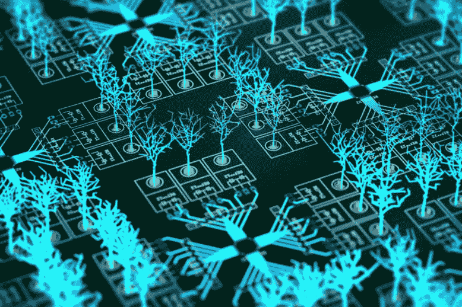
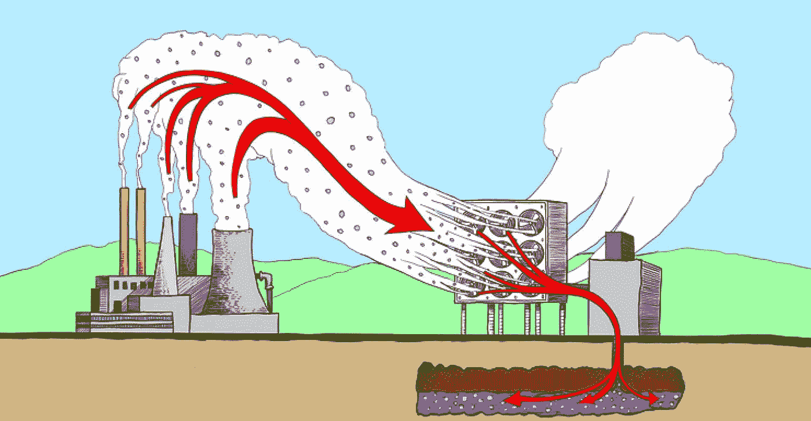
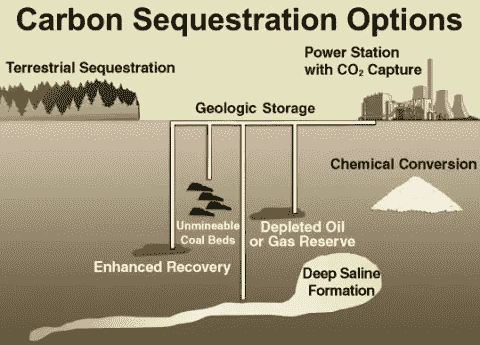
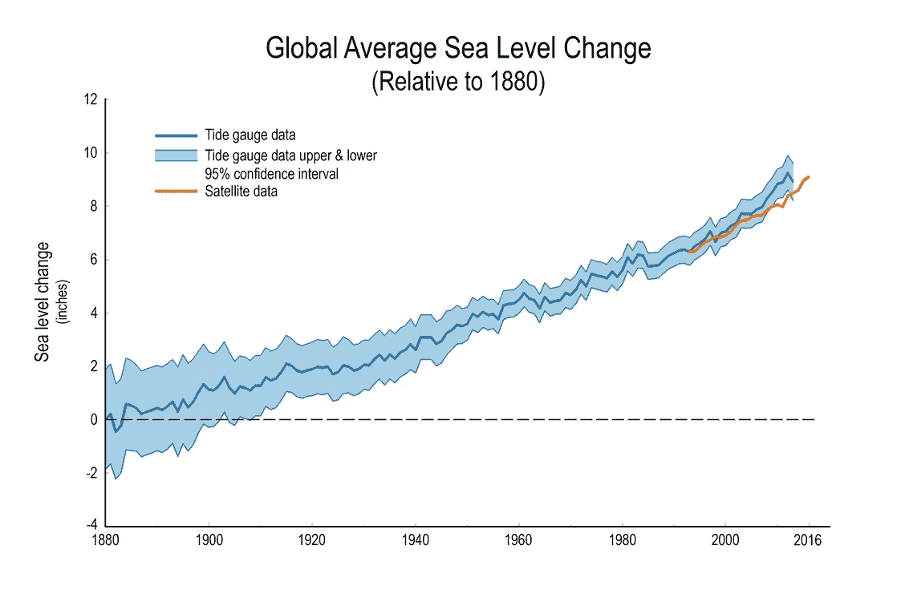

# 用机器学习应对气候变化

> 原文：<https://towardsdatascience.com/tackling-climate-change-with-machine-learning-78d1e185b3ec?source=collection_archive---------18----------------------->

如果这篇博文的标题看起来有些熟悉，很可能是因为你听说过或者读过[这篇在今年 6 月发布的来源全面的论文](https://arxiv.org/pdf/1906.05433.pdf)。这篇论文概述了机器学习可以为减轻气候变化的影响提供有效解决方案的无数领域。虽然整篇论文值得总结(和阅读！)，在这篇博文中，我将重点关注我感兴趣的两个特定领域:碳排放捕获/减少和气候预测。

# 碳排放捕获/减少

2018 年，政府间气候变化专门委员会(IPCC)估计，如果我们不限制并大幅减少全球温室气体排放，30 年内，世界将面临灾难性后果。尽管有国际协议，全球抗议，以及压倒性的科学共识，即如果我们要避免灾难，我们需要减少我们的排放，我们的全球排放量继续增加。如果政府不愿意尽可能快地采取行动减少排放，那么对碳捕获技术的投资就是必要的。虽然这项技术本身存在，但它仍处于起步阶段。但是机器学习可以以多种方式帮助这项新技术。

该文件概述了减少碳排放的三种选择。它还承认，尽管这些技术目前确实存在，但它们概述的应用，特别是与机器学习相关的应用，都是推测性的。

## 1)天然或半天然方法

虽然全球排放量逐年增加，但森林砍伐也火上浇油。世界上大约一半的热带森林已经被砍伐。更糟糕的是，据估计，每年砍伐森林的总面积为 1870 万英亩，相当于每分钟砍伐 27 个足球场大小的森林。总体而言，森林砍伐约占所有温室气体排放的 15%。

鉴于正在发生的所有森林砍伐，提供工具来帮助跟踪森林砍伐可以为决策者和执法人员提供有价值的数据。根据这篇论文，机器学习可以帮助“使用遥感图像区分选择性采伐和皆伐。”它还可以用来“探测半径一公里内的电锯声，并将其报告给附近的手机天线”，以提醒执法官员非法砍伐森林。

此外，重新造林有助于减少森林砍伐的影响。据估计，在现有的森林和废弃的土地上可以种植 1.2 万亿棵树。ML 可用于帮助定位合适的种植地点、监控植物健康状况、评估杂草以及进一步分析趋势。

## 2)直接空气捕获(DAC)

直接空气捕获是一种从发电厂废气、工业过程或环境空气中提取 CO2 的技术。通过将空气吹到吸附剂(基本上是海绵)上来提取二氧化碳，然后使用热力化学过程以纯化的形式释放二氧化碳进行封存。下图概述了这一过程。

机器学习可以在许多方面帮助提高效率。根据该论文，它可以用于“加速材料发现过程，以最大限度地提高吸附剂的可重复使用性和 CO2 吸收量，同时最大限度地减少 CO2 释放所需的热量。”它还可以帮助开发“能够承受高温的耐腐蚀部件，以及优化它们与空气吸附剂接触的几何形状。”

## 3)封存二氧化碳

除非永久储存，否则任何捕获的二氧化碳都将不可避免地释放回大气中。因此，捕获的 CO2 必须被隔离。目前最好的方法是直接注入地质构造，如盐水层(类似于石油和天然气储层)，并隔离在火山玄武岩构造中。那么 ML 在这里起什么作用呢？就像石油和天然气公司利用 ML 进行基于地震仪轨迹的地下成像以寻找提取点一样，ML 可用于帮助识别潜在的储存位置。石油和天然气公司使用的模型可以重新用于帮助捕获和注入，而不是提取。此外，ML 可用于监测和维护封存地点，尤其是用于 CO2 泄漏和总体排放检测。这个过程是通过使用传感器测量来完成的，这些测量“必须转化为关于地下 CO2 流量和剩余注入能力的推断。”“在全球二氧化碳储存模拟中使用卷积图像到图像回归技术进行不确定性量化”也取得了成功

# 气候预测

当前的气候预测模型用于为地方和国家政府决策提供信息，帮助个人计算他们的风险和足迹，并估计我们的排放物的潜在影响。机器学习有助于提高更准确地模拟这些预测的能力。这些进步很大程度上源于数据的可用性。虽然更多的数据并不总是等同于更准确的模型，但从全球更多地区获得更多的同类数据有助于提高准确性。例如，根据这篇论文，“更新更便宜的卫星正在产生数十亿字节的气候观测数据。”基于这些信息的模型还会生成数十亿字节的模拟气候数据，因此这些模型往往会相互依赖。最后，这些预测在计算上是昂贵和耗时的。因此，气候科学家已经开始使用 ML 技术来解决这些问题。

## 1)将数据、ML 和气候科学结合起来

为什么气候科学家越来越依赖机器学习模型？根据这篇论文，这些模型“可能比其他模型更准确或更便宜，因为:1)有丰富的数据，但很难用传统的统计方法对系统进行建模，或者 2)有好的模型，但它们在生产中使用的计算成本太高。”

ML 模型已经在气候科学家中用于各种目的。它们已被用于校准卫星传感器、对作物覆盖进行分类以及识别污染源。也有人提出深度学习可以用于“模式识别、超分辨率和气候模型中的短期预测”，以及汇编环境图像的数据，以进一步加速该领域的 ML 工作。

此外，深度神经网络，结合现有的热力学知识和以前收集的数据，可以用来模拟气候模型中一些最大的不确定性来源:云，冰盖和海平面上升。明亮的云反射光线并帮助冷却地球，而乌云吸收光线并保持地球温暖。这些过程的物理模型和预测它们随着气候变化的最终影响在计算上过于昂贵，无法包括在全球气候模型中，但机器学习模型不是。根据这篇论文，“Gentine 等人训练了一个深度神经网络来模拟高分辨率云模拟的行为，并发现该网络以一小部分成本给出了类似的结果，并且在简化的全球模型中是稳定的。”

由于各种原因，冰盖和海平面上升很难建模。最大的问题是收集数据。因为这些地区是孤立的，黑暗的，寒冷的，它们很难被观察到，因此很难收集数据。然而，在过去的几年里，新的卫星活动使我们能够收集这些地区的万亿字节的数据。然而，最大的问题是准确模拟这些冰盖的质量损失及其对海平面上升的影响。这些模型中最大的改进领域涉及雪和海冰的反射率，因为大部分太阳光被这些冰层反射，热量没有被吸收。随着这些冰原融化，地球将吸收热量并继续融化冰原，从而导致海平面更大的上升。

## 2)预测极端事件

天气模型比气候模型更容易制作，也更精确。由于天气模型跟踪大气中的快速变化，并且有大量信息可用于预测这些变化将产生的影响，因此模型每天都要进行测试和更新，以准确预测短期天气状况。然而，精确的气候模型要难得多。它们只能通过长期观察来检验，任何超过一周的时间都很难预测。此外，用于预测的所有可用数据集都严重倾斜，因为极端事件很少发生，而且历史数据严重缺乏。虽然目前的气候模型可以帮助预测长期趋势的变化，但这些模型的准确性需要大大提高。

机器学习已经被成功地用于对一些极端天气事件进行分类。深度卷积神经网络已被用于计算过去气候数据集中的气旋和天气锋，一些技术已被用于跟踪风暴和龙卷风。此外，最大似然法还被广泛用于本地天气模型预测。“许多作者已经使用支持向量机、自动编码器、贝叶斯深度学习和超分辨率卷积神经网络进行了尝试。”这些模型已经被用于预测不同地区的洪水模式。随着越来越多的数据可用，长期气候预测的准确性有望提高。

# 结论

虽然整篇文章都值得一读，但这篇文章特别关注了两个部分:碳捕获和气候预测。机器学习可以像石油和天然气公司一样用于寻找注入点和监控封存的二氧化碳。至于气候预测，随着更多数据的可用，ML 可以得到更好的利用，并用于更好地模拟冰盖融化和海平面上升将带来的不确定性。