# 用 NLP 解决增长问题

> 原文：<https://towardsdatascience.com/tackling-growth-with-nlp-c364d4e10559?source=collection_archive---------17----------------------->

## 业务增长伴随着一系列挑战。

Photo by [Everaldo Coelho](https://unsplash.com/@_everaldo?utm_source=medium&utm_medium=referral) on [Unsplash](https://unsplash.com?utm_source=medium&utm_medium=referral)

在这个例子中，创建了一组业务规则和一个 **NLP** ( **自然语言处理**)模型来自动回答客户的退货请求。特殊性，我将侧重于 NLP 方面。Tf-idf 用于解析客户注释，以允许或停止对客户退货请求的自动回复。

# TLDR

为了解决退货请求增加的问题，我们使用了**监督机器学习(NLP)** 工具来进一步增加自动回复的数量，从而提高生产率并减少回复时间。

# 现状

每个零售企业都必须处理退货。与应用过程相关的关键方面与问题的维度有关。如果退货数量很少，也许可以通过在 Excel 电子表格上登记退货并手动回复客户来解决。另一方面，如果返回请求的数量超过了一个控制良好的流程的人工阈值，就必须应用一些自动化。

在我们公司，我们有后者。在没有额外措施来降低回报的情况下，业务增长使得问题更加严重。自 2015 年以来，退货请求的数量翻了一番，显然这是我们未来必须应对的趋势。事情需要改变。

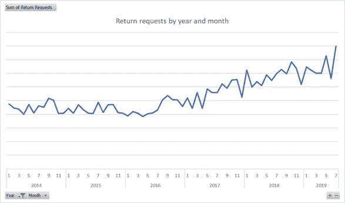

Return requests by year and month

有一段时间，人们更多地关注这项任务，让其他任务退出，从而解决了这个问题。

第二步是创建一组业务规则(自动应答管道)，可以解决所有不需要特殊处理的退货请求(经常销售、无损坏或无保修的商品)。这一步骤使我们能够在 2018 年底之前解决很大一部分退货请求。但是，我们开始触及一个平台，再次，新的步骤需要做。

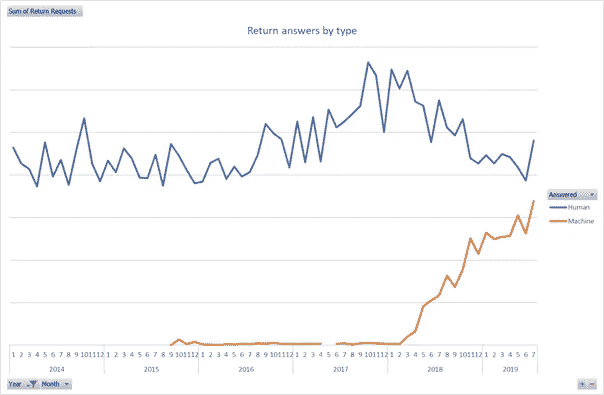

Return answers by type

# 为客户退货单开发 NLP

在 2019 年初，我们注意到我们无法增加通过自动管道运行的请求数量。

分析发生这种情况的原因，每当客户在退货请求中添加备注时，管道就会停止。我们收到了大约 40%的带有备注的退货请求:

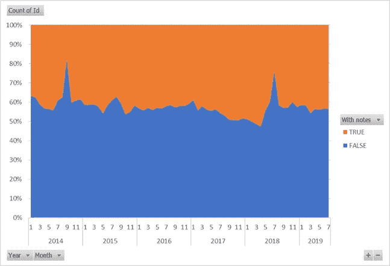

Percentage of return requests with notes on them

当然，其中一些纸币对自动流水线完全无害。像“我请求零件时犯了一个错误”或者“零件不是我想要的”或者甚至“你错误地将零件分类，给我的是左边的而不是右边的”。

这是第三步的开始:向客户退货单引入 NLP，以便可以触发或不触发管道。

这是一个简单的“情绪分析”问题。客户注释阻止了管道(0)或允许了管道(1)。

# 关于 TF-IDF 的 NLP 的一点背景

TF–IDF 代表**词频–逆文档频率。**

> 来自维基百科，是一个数字统计，旨在**反映一个单词对集合或语料库中的文档有多重要**。在信息检索、文本挖掘和用户建模的搜索中，它经常被用作加权因子。TF–IDF 值与单词在文档中出现的次数成比例增加，并由语料库中包含该单词的文档数抵消，这有助于调整某些单词通常更频繁出现的事实。TF–IDF 是当今最流行的术语加权方案之一；数字图书馆中 83%的基于文本的推荐系统使用 TF–IDF。
> 
> TF–IDF 加权方案的变体通常被搜索引擎用作在给定用户查询的情况下对文档的相关性进行评分和排名的核心工具。TF–IDF 可以成功用于各种主题领域的停用词过滤，包括文本摘要和**分类**。

这是一个重量计算公式:

# 处理数据

至于任何有监督的机器学习，我们需要为客户笔记贴上标签。

我们已经开始标记大量的客户笔记，时刻意识到平衡分类的重要性。我们可以很容易地用标签 1(允许自动流水线)对更多的笔记进行分类，但这将使训练和测试数据更加偏向一边。

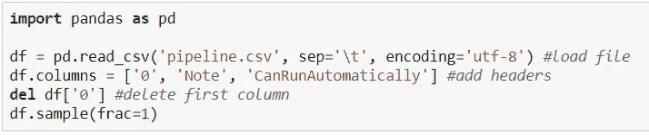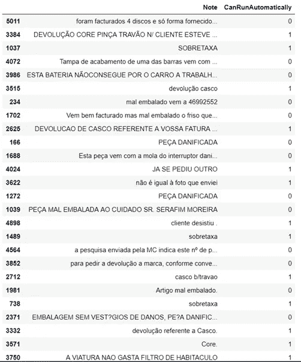

在 5000 张贴有标签的笔记中，我们知道这有点不平衡，但我们可以接受:

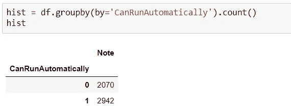

然后，我们在训练和测试中分割数据:

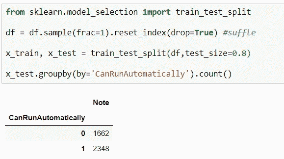

并在我们的业务领域词典中增加了葡萄牙语词典中的停用词:

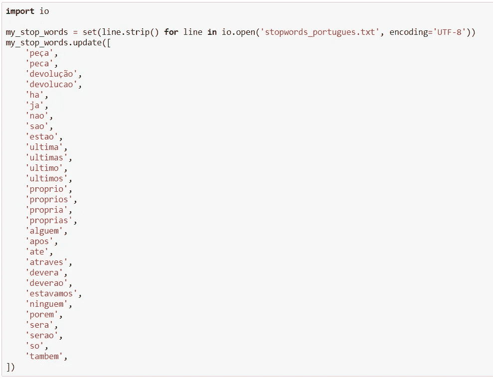

# 培训和测试

下一步是在分类器中加入所有准备工作，并拟合模型:

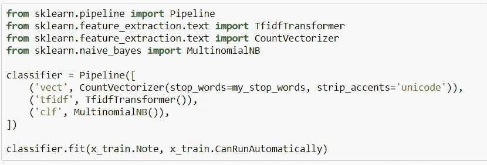

并使用测试数据来评估模型:

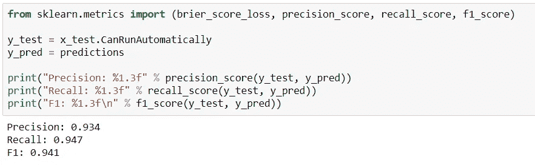

**不错，93.4%的准确率和 94.1%的 F1 分。**

分析混淆矩阵，大多数笔记被正确分类，其中 156 被分类为停止流水线但不需要停止(类型 1 错误)，124 被分类为不停止但应该停止(类型 2 错误)。对于我们的业务领域，类型 2 的错误是最糟糕的，对于未来的工作，应该进一步处理。

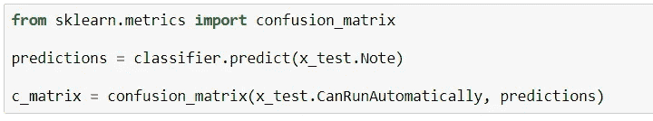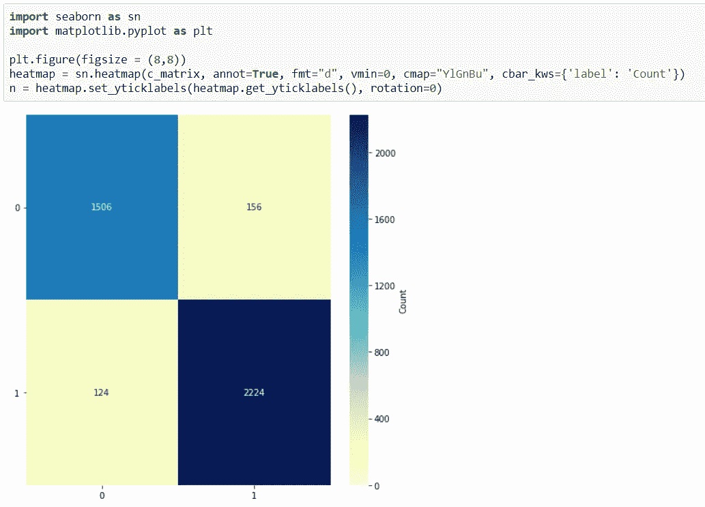

# 总结

NLP 是提高任务自动化和解决日益复杂的业务流程的关键工具。对于未来的工作，可以采用其他方法(其中之一是 LSTM)，甚至可以使用自动化的 ML 工具。

我希望我对我们正在应对的挑战和我们正在应用的解决方案有所了解。在接下来的几个月里，我们将继续进一步增加自动回答的数量，并再次提高效率和客户满意度，让人们专注于更多面向客户的任务。

我将把工作结果留给你:自 2018 年以来，我们使用机器学习将自动答案的数量增加了 20%以上。

Return answers by type