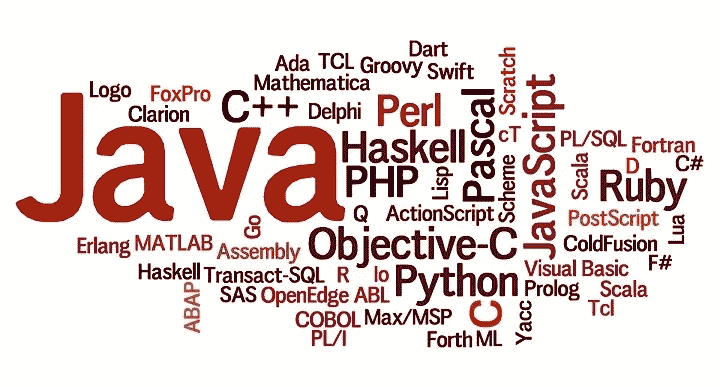
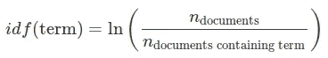
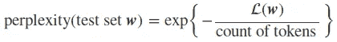
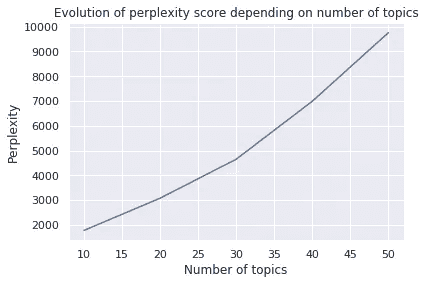
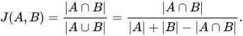
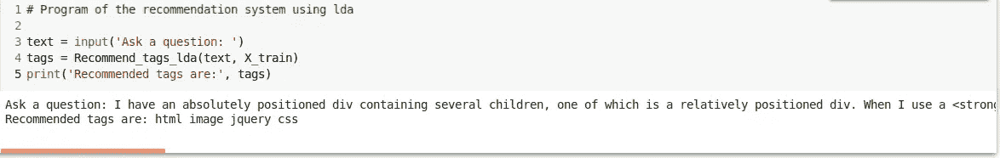
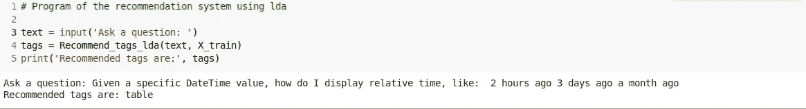

# 基于潜在狄利克雷分配的标签推荐算法

> 原文：<https://towardsdatascience.com/tags-recommendation-algorithm-using-latent-dirichlet-allocation-lda-3f844abf99d7?source=collection_archive---------7----------------------->

## 我们将用 python 开发一个 LDA 模型，根据用户的 StackOverflow 帖子向用户推荐标签

Word Cloud of tags in Stack Overflow

一般来说，LDA 用于对原始数据集进行降维，然后再应用其他机器学习算法，这些算法将受益于更少的维数。这里我们将把它用于另一个目的，即实现一个推荐系统。

# 资料组

我们的数据集来自 [stackexchange explorer，](https://data.stackexchange.com/stackoverflow/query/new)要从网站导出帖子，您必须进行如下 SQL 查询:`SELECT * FROM posts WHERE Id < 50000`默认情况下，每个 SQL 查询的执行时间都有时间限制，这使得很难一次恢复所有数据。要检索更多的结果，请记住使用对 id 的约束进行查询。

现在我们有了数据集，下一步是做一些文本预处理，也就是说:

*   使用[美汤](https://www.crummy.com/software/BeautifulSoup/bs3/documentation.html)库移除 html 格式
*   降低文本
*   转换缩写
*   删除停用词
*   单词的词形变化——将单词的词形变化组合在一起
*   去掉动词和形容词，因为它们不能提供关于文章的有价值的信息

Pre-processing functions

# TF-IDF

TF-IDF 是 Text Frequency-Inverse Document Frequency 的缩写，它旨在衡量一个术语在文档语料库中对一个文档的重要性。*术语权重=术语频率×idf(术语)*

definition of inverse document frequency

Converting training and test post to matrices of TF-IDF features

# 皱胃向左移

**LDA** (潜在狄利克雷分配)是一种基于以下假设的生成式非监督方法:

*   语料库中的每个文档都是一组没有顺序的单词(单词包)
*   每个文档以不同的比例涵盖了多个主题 *p(θm)*
*   每个单词都有一个与每个主题相关的分布 *p(ϕk)* 。因此，每个主题可以由每个单词的概率来表示
*   *zn* 代表单词 *wn* 的主题

因为访问受限于文档，所以有必要确定什么是主题、每个词在主题上的分布、每个主题在语料库上出现的频率。

LDA representation in the form of a graphical probabilistic model

我们使用**sk learn . decomposition . latentdirichletallocation、**训练不同的 lda 模型，每个模型都有不同数量的主题，然后我们使用度量困惑度在测试集上评估不同的模型。

definition of perplexity

L( ***w*** )是看不见的文档 ***w*** 的对数似然；困惑度越低，模型越好。

lda algorithm

最低的困惑分数是针对 10 个主题的，所以我们将学习包含 10 个主题的 lda 模型。

# 推荐算法

现在我们有了模型，我们将研究推荐算法。它将基于两个要点，即:

*   得分=文档被分配给主题的概率×主题生成单词的概率
*   当一个单词的分数高于定义的阈值时，该单词被认为是相关标签

在尝试了阈值的不同值之后，我们选择了阈值 **0.010** ，这是因为使用该值，测试集标签具有看起来像训练集标签的分布，并且还因为使用阈值等于 0.010，超过 90% 的帖子具有推荐标签。

Tags recommender using LDA

# 估价

我们将使用 Jaccard 评分来评估我们的模型，该评分用于将样本的预测标签集与相应的标签集进行比较。

Jaccard score definition

Jaccard score function

我们的 LDA 模型在测试集上的 Jaccard 得分是 **3.98%** ，而使用 OneVsRest 方法(简单基线)的哑分类器使得 **0.90%** 。这表明我们的 LDA 模型肯定比随机模型好，因为它已经成功地正确预测了一些标签，尽管事实上它是一个无监督的模型。但是为了有一个我们推荐系统正常运行的真正指标，我们必须对一些帖子，模型输出的标签与我们手动认为相关的所有标签进行比较。

# 例子

下面的两个例子表明，LDA 推荐器的性能取决于帖子的精确度和用户问题的详细程度。

Recommended tags for example 1

第一个例子是一个详细帖子的完美例子，所以对于基于无监督算法的推荐器来说，返回相关标签很简单，这里就是这种情况。帖子是关于 html/css 的问题，程序显示这 2 个标签。

Recommended tags for example 2

在这个例子(2)中，帖子很短，没有具体的细节来帮助程序推荐感兴趣的标签。这里唯一推荐的标签是*‘table’*，不能真正认为是相关标签。

如果你想有更多相关的标签，你必须给算法更多关于文章的信息，比如在你的程序中考虑文章的标题。

源代码可以在 [Github](https://github.com/koukou10/Tags_recommender) 上找到。请随意分享你的想法和想法。