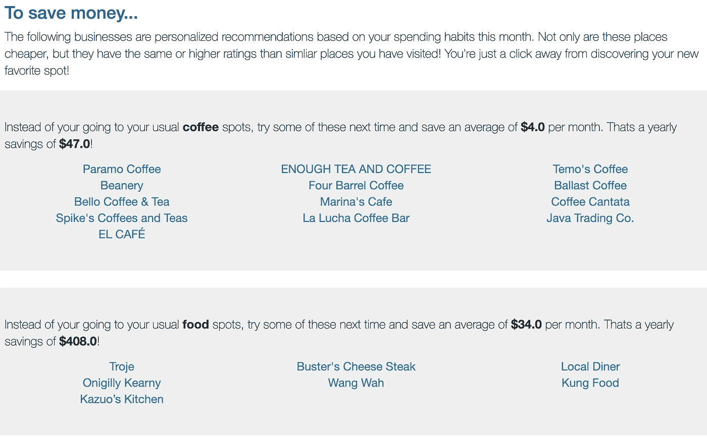

# 定制储蓄推荐器

> 原文：<https://towardsdatascience.com/tailored-savings-recommender-13257983b156?source=collection_archive---------23----------------------->

Photo by [Fahmi Fakhrudin](https://unsplash.com/es/@fahmipaping?utm_source=medium&utm_medium=referral) on [Unsplash](https://unsplash.com?utm_source=medium&utm_medium=referral)

我们很可能每天都与推荐系统进行交互。无论是听 Spotify 推荐的歌曲，还是浏览亚马逊网站上的“顾客也购买了……”栏目，或者尽情享受网飞推荐的新电视节目，我们都在使用推荐系统。所以对于这个项目，我想，我如何利用它来节省一些钱？在这篇文章中，我将带您浏览我构建的原型，它根据用户的消费习惯提供量身定制的储蓄建议。这个项目的代码可以在我的 [Github](https://github.com/kdavis01/projects/tree/master/savings_recommender) 上找到。

让我们以赤道咖啡为例，因为我在那里花了很多钱。赤道公司在旧金山有几个位置，离我的工作地点和家都很近。为了这个例子的目的，我们会说我在工作，准备喝咖啡休息。如果你在 Yelp 上搜索 Equator，它的价格水平是$美元，星级是 4.5，离我工作的地方大约一个半街区。

通常我会去赤道买一杯午后拿铁，但如果有另一家咖啡店，距离和质量都差不多，价格也更便宜，我可能会去那里，这样可以省钱。这个系统的建立是为了帮助我找到像这样的地方，在那里，习惯的轻微改变，可以随着时间的推移积累很多钱。在这个例子中，我的系统推荐了足够的茶和咖啡，它距离我的工作地点大约 2 个街区，星级为 4.5，价格只有$级，如下所示。

# 目标是:

我这个项目的目标是利用我的个人消费习惯来创建量身定制的储蓄建议，以最小的生活方式影响为我省钱。我仍然希望能够去喝咖啡，但希望能以更便宜的价格去做。

我想象这个推荐系统正在被一家银行使用。他们已经可以接触到你所有的信用卡交易，这是对你消费习惯最准确的描述。一家银行为你推荐与你经常消费的类似的更便宜的商家，可以把省下来的钱转到他们的储蓄账户上。

# 构建推荐器:

## 第一步:收集+清洁

构建我的推荐器的第一步是收集旧金山的商业数据。我使用旧金山市和县提供的注册企业位置数据集的子集作为企业列表。从这个业务列表中，我调用了 Google Places 和 Yelp Fusion APIs 来获取业务信息。我主要使用 Yelp Fusion API 数据，并使用 Google Places API 填充空值。

在组合了来自两个 API 的业务信息之后，我仍然有一些空的价格层值。我使用 k=5 最近邻的 KNN 插补来填充这些缺失的价格值。

我还收集了包含 4 个月信用卡交易历史的个人银行对账单。这些将被输入我的原型，作为推荐的基础。

## 第二步:评论+主题

接下来，我对商业 yelp 评论做了一些自然语言处理。在我的数据集中，每个企业都有一些评论，我把它们合并成一个段落。我首先对段落中的单词进行词条化，然后使用词频-逆文档频率(TF-IDF)进行矢量化。

TF-IDF 是确定一个单词对语料库中的文档有多重要的度量。换句话说，对于商业评论段落中的每个词，我想看看这个词在解释该商业相对于数据集中其他商业的重要性。例如，使用 TF-IDF，单词“food”可能不是一个权重很大的单词。虽然“food”可能经常出现在某个餐馆的评论中，但当数据集主要由餐馆组成时，这对于区分该业务没有太大的价值。另一方面，双字母“asian_food”将具有更高的权重，因为它是该业务与整个业务集的更好区分符。比较两个“亚洲食品”企业会比比较两个“食品”企业提供更多的价值，这两个“食品”企业最终可能完全不同，就像一家高级餐厅和一家廉价咖啡馆。

一旦我有了数据集中每个企业的 TF-IDF 向量，我就使用非负矩阵分解(NMF)进行主题建模。NMF 是一种将一个矩阵分解成两个不包含负元素的矩阵的方法，它在评论和推文等较短的文本上非常有效。我使用一个 scree 图来确定使用 NMF 生成的主题数量(15)。最后，我为我的数据集中的每个企业制作了主题向量，显示了每个主题与该企业的相关性。

## 第三步:比较+匹配

我现在有了一个数据框架，其中包含旧金山数千家企业的主题向量和其他属性。我的下一步是比较这些企业，寻找相似之处。我使用余弦相似度进行比较，使用每个企业的所有数字特征。余弦相似度查看 2 个企业的向量，并计算这些向量之间角度的余弦，其中相似企业的余弦相似度更接近 1。这给了我一个矩阵余弦相似性得分为每个企业相比，所有其他企业在数据框架。

为了找到对某个企业的推荐，我会首先选择余弦相似度最高的 25 个企业，然后根据匹配类别的数量和它们的哈弗线距离对它们进行加权。我的数据框架包含了来自 yelp 的每家企业的类别，比如“咖啡”、“咖啡馆”、“餐馆”等等。拥有更多与所访问的企业相匹配的类别的企业将更有可能被推荐。类似地，离被访问的企业更近的企业也更有可能被推荐。

## 第四步:提炼+推荐

我为这个原型使用了一个基于内容的推荐系统。这意味着推荐严格基于个人消费习惯和信用卡交易历史中出现的企业属性。

一旦我有了上一步的匹配列表，我就通过比较价格水平和等级来提炼这些匹配。我的建议将只针对具有同等或更高 yelp 评级以及更低 yelp 价格等级的地方。

# 最终想法:

为了将所有的东西整合在一起，我开发了一个 Flask 应用程序，它可以读取我过去 4 个月的信用卡交易历史，并提供消费汇总以及储蓄建议。

它首先提供了上传的银行对账单中每个月的 5 个类别的支出明细:食品、咖啡、零售、服务和酒吧/娱乐。右边的图表让我们可以很容易地看到每个类别的支出如何逐月波动。

应用程序的下一部分显示了每个类别中的业务细分，以及在上传的银行对账单的整个跨度内每个业务的支出。

最后，该应用程序根据我已经花钱的业务提供建议，并显示如果我转向这些推荐的业务，我每月和每年可以节省多少钱。我可以点击任何一个推荐，然后直接进入商业 Yelp 页面获取更多信息。

你可以通过下面的链接观看我的应用程序的演示。

 [## 储蓄应用程序演示

drive.google.com](https://drive.google.com/file/d/1dKqGrO_3uEuxEP5yhweVmOlmCtNYqET7/view?usp=sharing) 

我真的很喜欢这个项目，并熟悉自己的推荐系统。感谢阅读！