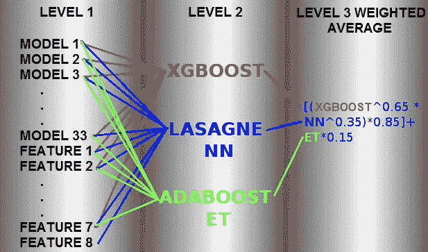
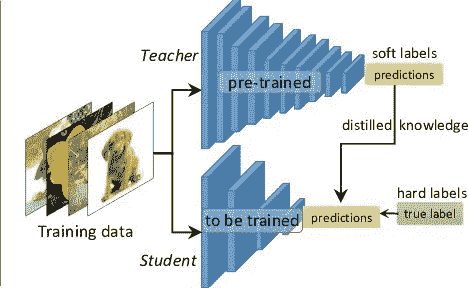
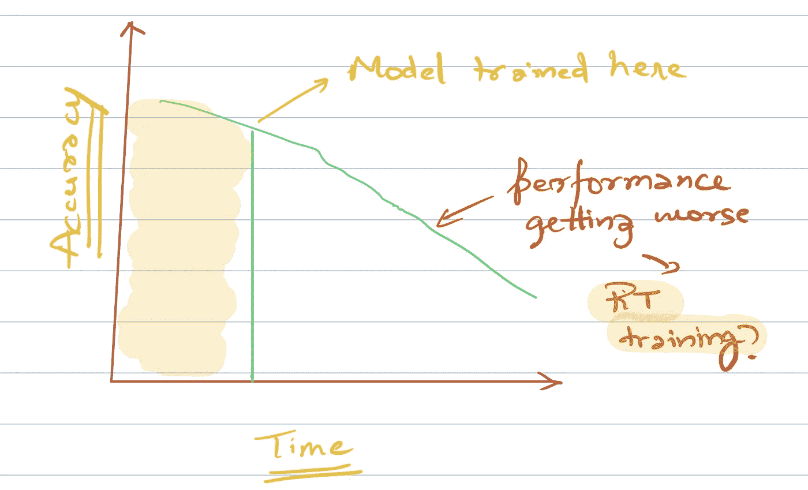
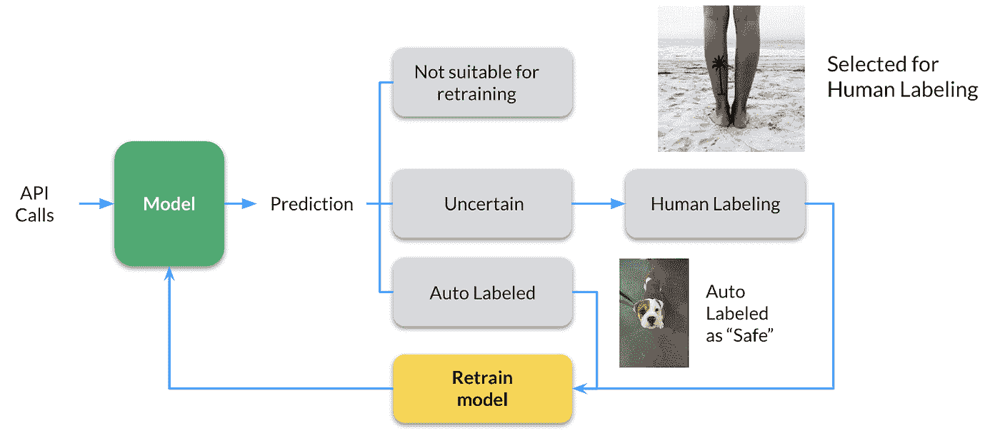

# 通过这 5 个简单的步骤将您的机器学习模型投入生产

> 原文：<https://towardsdatascience.com/take-your-machine-learning-models-to-production-with-these-5-simple-steps-35aa55e3a43c?source=collection_archive---------16----------------------->

Image by [lumix2004](https://pixabay.com/users/lumix2004-3890388/?utm_source=link-attribution&utm_medium=referral&utm_campaign=image&utm_content=1873078) from [Pixabay](https://pixabay.com/?utm_source=link-attribution&utm_medium=referral&utm_campaign=image&utm_content=1873078)

## 或者为什么机器学习项目会失败？

> 创建一个伟大的机器学习系统是一门艺术。

在构建一个伟大的机器学习系统时，有很多事情需要考虑。但是经常发生的是，我们作为数据科学家只担心项目的某些部分。

但是我们有没有想过一旦有了模型，我们将如何部署它们？

我见过很多 ML 项目，其中很多注定要失败，因为他们从一开始就没有一套生产计划。

这篇文章是关于一个成功的 ML 项目的过程需求——一个走向生产的项目。

# 1.开始时建立基线

你真的不需要有一个模型来获得基线结果。

假设我们将使用 RMSE 作为时间序列模型的评估指标。我们在测试集上评估了该模型，RMSE 为 3.64。

3.64 是好的 RMSE 吗？我们怎么知道？我们需要一个基线 RMSE。

这可能来自同一任务的当前采用的模型。或者通过使用一些非常简单的启发式方法。对于时间序列模型，要克服的基线是最后一天的预测。即预测前一天的数字。

或者图像分类任务怎么样。取 1000 个带标签的样本，由人类对它们进行分类。人类的准确性可以作为你的基准。如果一个人不能在任务中获得 70%的预测准确率，如果你的模型达到类似的水平，你总是可以考虑自动化一个过程。

***学习*** :在你创建模型之前，试着意识到你将要得到的结果。设定一些超出世界范围的期望只会让你和你的客户失望。

# 2.持续集成是前进的方向

现在您已经创建了您的模型。在您的本地测试数据集上，它比基线/您的当前模型表现得更好。我们应该前进吗？

我们有两个选择-

1.  不断改进我们的模型。
2.  在生产环境中测试我们的模型，获得更多关于可能出错的信息，然后通过 ***持续集成继续改进我们的模型。***

我支持第二种方法。在 Coursera [深度学习专业](https://click.linksynergy.com/deeplink?id=lVarvwc5BD0&mid=40328&murl=https%3A%2F%2Fwww.coursera.org%2Fspecializations%2Fdeep-learning)的第三门名为《构建机器学习项目》的课程中，吴恩达说

> “不要一开始就试图设计和构建完美的系统。相反，快速建立和训练一个基本系统——也许只需要几天。即使基本系统远非你所能构建的“最佳”系统，考察基本系统的运行方式也是有价值的:你会很快找到线索，向你展示最有希望投入时间的方向。

> 完成比完美更好。

***学习*** :如果你的新模型比生产中的当前模型更好或者你的新模型比基线更好，那么等着去生产是没有意义的。

# 3.您的模型可能会投入生产

你的模型比基线好吗？它在本地测试数据集上表现得更好，但是它在整体上真的工作得很好吗？

为了测试你的模型优于现有模型的假设的有效性，你可以设置一个 ***A/B 测试*** 。一些用户(测试组)看到来自您的模型的预测，而一些用户(控制组)看到来自以前的模型的预测。

事实上，这是部署您的模型的正确方法。你可能会发现你的模型并不像看起来那么好。

> 犯错其实并没有错，错的是没有预料到自己可能会错。

很难指出您的模型在生产环境中表现不佳的真正原因，但一些原因可能是:

*   您可能会看到实时数据与训练数据有很大不同。
*   或者您没有正确完成预处理管道。
*   或者您没有正确衡量绩效。
*   或者您的实现中可能有一个 bug。

***学习:*** ***不要全面投产。*** A/B 考试永远是前进的绝佳方式。准备好可以依靠的东西(也许是旧型号)。总有一些东西可能会坏掉，这是你无法预料的。

# 4.你的模型甚至可能不会投入生产

我已经创建了这个令人印象深刻的 ML 模型，它给出了 90%的准确率，但它需要大约 10 秒来获取预测。

***这样可以接受吗？*** 对于某些用例也许可以，但真的不行

在过去，有许多 Kaggle 比赛的获胜者最终创造了怪物组合，在排行榜上名列前茅。下面是一个特别令人兴奋的示例模型，它用于在 Kaggle 上赢得 Otto 分类挑战赛:

[Source](https://www.kaggle.com/c/otto-group-product-classification-challenge/discussion/14335): 33 models and 8 engineered features used in Level 1

另一个例子是网飞百万美元推荐引擎挑战赛。由于涉及到工程成本，网飞团队最终[从未](https://www.wired.com/2012/04/netflix-prize-costs/)使用获胜的解决方案。

那么，如何让你的模型既精确又容易在机器上运行呢？

Teacher — Student Model: [Source](/knowledge-distillation-simplified-dd4973dbc764)

师生模型或 ***知识升华*** 的概念由此而来。在知识提炼中，我们在一个更大的已经训练好的教师模型上训练一个更小的学生模型。

这里，我们使用教师模型中的软标签/概率，并将其用作学生模型的训练数据。

> 关键是老师输出的是类概率——“软标签”而不是“硬标签”。例如，水果分类器可能会说“苹果 0.9，梨 0.1”，而不是“苹果 1.0，梨 0.0”。何必呢？因为这些“软标签”比原来的更能说明问题——告诉学生，是的，一个特定的苹果确实非常像一个梨。学生模型通常可以非常接近教师水平的性能，即使使用的参数少了 1-2 个数量级！— [来源](https://www.quora.com/What-is-a-teacher-student-model-in-a-Convolutional-neural-network)

***学习:*** 有时候，我们在预测时没有很多计算可用，所以我们希望有一个更轻的模型。我们可以尝试构建更简单的模型，或者尝试为这样的用例使用知识提炼。

# 5.维护和反馈回路

> 世界不是恒定的，你的模型重量也不是恒定的

我们周围的世界正在迅速变化，两个月前可能适用的东西现在可能不再适用。在某种程度上，我们建立的模型是世界的反映，如果世界在变化，我们的模型应该能够反映这种变化。

模型性能通常会随着时间而下降。

***由于这个原因，我们必须在一开始就想办法升级我们的模型，作为维护周期的一部分。***

这种循环的频率完全取决于您试图解决的业务问题。在广告预测系统中，用户往往变化无常，购买模式不断出现，频率需要相当高。而在评论情感分析系统中，频率不需要那么高，因为语言不会太多地改变其结构。

Feedback Loop: [Source](https://www.clarifai.com/blog/closing-the-loop-how-feedback-loops-help-to-maintain-quality-long-term-ai-results)

我还要感谢 ***反馈回路在机器学习系统*** 中的重要性。假设你在狗与猫的分类器中预测了一个特定的图像是一只低概率的狗。我们能从这些低自信的例子中学到什么吗？您可以将它发送到手动审查，以检查它是否可用于重新训练模型。通过这种方式，我们在不确定的情况下训练我们的分类器。

***学习:*** 在思考生产的时候，想出一个利用反馈来维护和改进模型的计划。

# 结论

这些是我在考虑将模型投入生产之前发现的一些重要的事情。

虽然这不是你需要考虑的事情和可能出错的事情的详尽列表，但它无疑可以作为下次你创建机器学习系统的思想食粮。

如果你想了解更多关于如何构建机器学习项目和最佳实践的信息，我想调出他在 Coursera [深度学习专业化](https://coursera.pxf.io/7mKnnY)中出色的[第三门课程](https://coursera.pxf.io/7mKnnY)名为构建机器学习项目。一定要去看看。

谢谢你的阅读。将来我也会写更多初学者友好的帖子。在[媒体](https://medium.com/@rahul_agarwal?source=post_page---------------------------)关注我，或者订阅我的[博客](http://eepurl.com/dbQnuX?source=post_page---------------------------)了解他们。一如既往，我欢迎反馈和建设性的批评，可以通过 Twitter [@mlwhiz](https://twitter.com/MLWhiz?source=post_page---------------------------) 联系