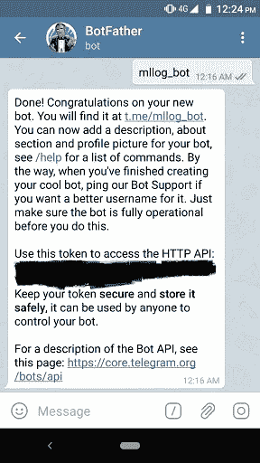
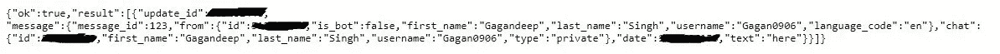

# 让你的机器学习模型训练更上一层楼

> 原文：<https://towardsdatascience.com/take-your-model-training-to-next-level-6e19c6309e05?source=collection_archive---------18----------------------->

## 你有没有想过可以在手机上接收训练日志？


Photo by [William Iven](https://unsplash.com/@firmbee?utm_source=unsplash&utm_medium=referral&utm_content=creditCopyText) on [Unsplash](https://unsplash.com/search/photos/training?utm_source=unsplash&utm_medium=referral&utm_content=creditCopyText)

最近我拿到了亚马逊 SageMaker 和谷歌 AI 笔记本。我真正喜欢的一件事是这些大巨头如何在云上拓展训练模型的界限。你有一个 JupyterLab，你可以很容易地选择你想在哪个 python 版本上工作。真是太神奇了。

我已经尝试了 VM 实例和 JupyterLab，我觉得缺少的一点是查看指标的方法(培训 acc。、培训损失等。).

如果您在 VM 实例上训练您的模型，并且这是一项夜间工作，那么您没有办法监控指标。同样，如果您使用 JupyterLab 在笔记本电脑上训练您的模型，那么在连接断开的情况下，会话会断开连接，大多数情况下会重新连接，但有一会儿您会看到模型训练已经停止(视觉上)，并且您无法知道是否实际上已经停止或仍在运行。

您可能面临的另一个问题是，如果您必须使用 JupyterLab 通宵训练我的模型，因为一旦您关闭 web 浏览器，您的会话就会断开(视觉上)，并且您将无法知道训练是否仍在运行或已经完成。

我也有类似的问题，但我用一种巧妙的方式解决了。

如果我们用电报机器人接收模型日志会怎么样？听起来很有趣，对吧？

步骤-

1.  创建一个电报机器人(免费且超级简单)
2.  获取您的令牌和聊天标识
3.  写一个函数来发送消息
4.  创建自定义回调以发送日志

## 创建一个电报机器人

1.  在手机上安装 Telegram 应用程序并注册。
2.  打开应用程序，搜索“僵尸父亲”。
3.  开始对话并输入

```
/newbot
```

按照步骤做，你会得到你的令牌



Token Generation

4.接下来，您需要一个 chat_id。创建 bot 后，向 bot 键入任何消息(必需)。

5.接下来，打开这个 URL 并用您的令牌替换<token>。</token>

```
[https://api.telegram.org/bot<token>/getUpdates](https://api.telegram.org/bot891342371:AAE8zCxe7b_znVPRQmqH6Vvt05CpI3BI_zQ/getUpdates)
```

6.您将看到一个 JSON 文件



JSON file

7.从中复制“id”。

> *如果您没有看到 id，请再次尝试向 bot 发送消息并刷新网页。*

## 让我们写一个函数来发送消息

只需放置您的令牌和 chat_id 并测试脚本。

> *尝试打印第一条消息的状态，以确保一切正常。*

之后，是时候定义一个回调来发送模型日志给你的机器人了。

除了使用 on_epoch_end，您还可以使用 on_batch_end 来接收更频繁的更新。

有许多选择可以使用。你可以查看 [Keras 官方文档](https://keras.io/callbacks/)来了解其他可能的选项。

现在，坐好，在你的电报机器人上得到所有的模型更新。