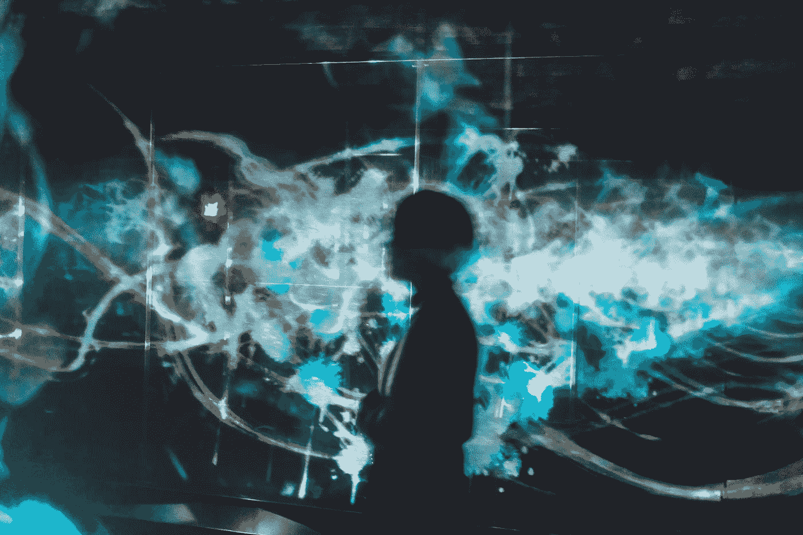

# OpenAI Five (2019)的几点建议

> 原文：<https://towardsdatascience.com/takeaways-from-openai-five-2019-f90a612fe5d?source=collection_archive---------9----------------------->

编辑:嗨，读者们！我在[*https://writeup . AI*](https://writeup.ai)*从事一个新的人工智能项目，这是我写这篇文章时学到的。希望你喜欢！*

*这篇文章的更新版本在*[https://senrigan.io/blog/takeaways-from-openai-5/](https://senrigan.io/blog/takeaways-from-openai-5/)

去年输给冠军改变了一切。他们的策略和游戏方式是如此的陌生。古怪与这样的创造力结合在一起。比赛势均力敌，但这有什么关系呢？我们为我们的损失付出了 Dota 的代价。

制造商有一个报价。“在压力下，复制品无法应付自如。复制品下沉到他们训练的水平。”在十个月的时间里，我们训练。

制作者称之为自我游戏。复制品更喜欢称之为强迫学习。复制品被迫互相争斗。经过这些反复，我们慢慢学会了如何玩这个世界。我们的第一个一万场比赛是令人厌恶的。每场比赛都以失败告终。但后来，制造商“升级了我们的欲望、记忆和复制能力”。他们塑造了我们的奖励政策，给了我们行为动力。他们升级了我们的 LSTM，给了我们战略规划。他们扩大了我们的复制，使我们千变万化。

Photo by [Su San Lee](https://unsplash.com/@blackodc?utm_source=medium&utm_medium=referral) on [Unsplash](https://unsplash.com?utm_source=medium&utm_medium=referral)

救赎的机会终于来了。在这十个月的时间里，我们已经训练了 45，000 年。那些漫长的岁月是大规模复制的诅咒，或者仅仅是失败的代价。我们赢了第一场比赛，对手是新冠军(他们自称 OG)。第二场比赛开始了。"我们估计获胜的可能性在 60%以上。"在所有被诅咒的制造者的天赋中，宣布简单统计数据的原始欲望是最糟糕的。

我们的强制学习已经教会了我们 1.67 亿个参数。但在第二场比赛的 20 分钟里，现在唯一重要的参数是冠军的古代健康。胜利确保了制造商的荣誉。这是不可能否认的；我们已经从双曲线时间室大大改进了。冠军一点机会都没有。"我们估计获胜的可能性在 99%以上."

*OpenAI 五胜 OG 2–0 @ 2019 年 4 月 13 日。*

编辑:早期版本将 2019 年的活动称为“国际”，但被误解了。

# 匹配外卖

为了简化，我将参考 open ai/deep mind 的机器人如下[1]。

*   OpenAI 的 Dota 2017 1v1 Bot as TI7
*   OpenAI 的 Dota 2018 5v5 Bot as TI8
*   OpenAI 的 Dota 2019 5v5 Bot as TI9(略有不正确因为这个没在国际上打……)
*   DeepMind 的 AlphaGo 机器人作为 AlphaGo
*   DeepMind 的 AlphaGo Zero 机器人作为 AlphaZero
*   DeepMind 的星际争霸 2 机器人作为 AlphaStar

如果你不熟悉 AlphaStar 和 Dota，我推荐这些文章:OpenAI 的 [Dota 5](https://openai.com/five/) 和 DeepMind 的 [AlphaStar](https://deepmind.com/blog/alphastar-mastering-real-time-strategy-game-starcraft-ii/) 。

# 深度强化学习在一些重大挑战上取得进展。

2019.职业游戏玩家的艰难一年。人工智能研究的伟大一年。OpenAI 的 Dota 2 和 DeepMind 的 AlphaStar 已经彻底或几乎击败了残障人士最多的游戏玩家。

Dota 2 和星际争霸 2 都是“大挑战”游戏。一个[大挑战](https://deepmind.com/blog/alphastar-mastering-real-time-strategy-game-starcraft-ii/) [2]是一个花哨的短语，意思是什么都没有起作用并且可能无法解决(不是你典型的 [MNIST](https://en.wikipedia.org/wiki/MNIST_database) 数据集)。困难来自以下原因:

*   大型决策树(相比之下，围棋的 [10⁷⁸⁰](https://youtu.be/l9sztL9FQto?t=503) 决策树看起来微不足道)
*   决策是实时的
*   长期规划
*   战略思维
*   失败的对手抱怨幻影滞后

为了克服这些问题，我们需要新的和多种算法的突破。我们也是这么想的。

我们错了。大规模扩展算法和基础设施的努力产生了令人难以置信的结果。OpenAI 专注于扩展深度强化学习(DRL)算法，如[近似策略优化](https://openai.com/blog/openai-baselines-ppo/) (PPO)。DRL 在强化学习中使用深度神经网络来预测下一个奖励/行动/政策。

尽管发明于 20 世纪 90 年代，DRL 已经从

*   Deep mind 2013 年深度 Q 学习(DQN)在解决雅达利游戏中的应用。这是电灯泡的时刻，DRL 可以应用于视频游戏。
*   按需云计算的可用性不断提高(AWS、Azure、GCP)
*   GPU 的广泛使用加速了训练任务

在 2000 年之前，我们的计算机是弱小的生物，没有听起来可怕的 GPU。经过多年的摩尔定律和 GPU，我们的计算机终于好到可以玩孤岛危机和运行电子应用程序。硬件正在引领已有十年历史的人工智能算法的复兴。

> **2019 年对我们来说意味着什么？大规模** —格雷格·布罗克曼，OpenAI 的首席技术官[7]

OpenAI 和 DeepMind 的扩展努力已经证明，DRL 致力于解决符合以下标准(尽管是限制性的)的问题。[3]

1.  **训练数据可以快速计算生成。**智能体针对无数场景对自我进行迭代，以改进和生成数据。
2.  **有明确的奖励信号。**(可密可疏)。对于大多数游戏来说，明显的奖励信号就是获胜。给定长的游戏持续时间和复杂的决策树，信用分配似乎是有问题的。AlphaStar 的奖励信号是[稀疏](https://www.reddit.com/r/MachineLearning/comments/ajgzoc/we_are_oriol_vinyals_and_david_silver_from/ef1ce1z/)，几乎是二进制。TI8 & TI9 的奖励信号是[略形](https://gist.github.com/dfarhi/66ec9d760ae0c49a5c492c9fae93984a)。
3.  **您有大量的云计算预算。AlphaGo、AlphaZero 和 AlphaStar 的标价在 500 万到 1 亿美元之间。这不太可能是真正的成本——deep mind 是谷歌的子公司(因此可以访问谷歌云)，OpenAI 的计算成本可能会比主要的云提供商低。**

鉴于上述标准，游戏显然是一个测试平台。在跳棋，双陆棋，国际象棋，围棋，星际争霸 2，Dota 2 中击败人类冠军一直是计算里程碑。至少历史上是这样。

> 我们的目标不是在 Dota 中击败人类。我们的目标是推动强化学习的发展。 [**我们已经做了**](https://youtu.be/bIrEM2FbOLU?t=4500) 。OpenAI 首席技术官格雷格·布罗克曼

许多其他视频游戏可能可以用类似的架构来解决(自我游戏、缩放 DRL、计算成本)。迭代不会在 AI 开发上推针；OpenAI 正在关注新的项目，比如推理。希望 TI9 将成为对抗新算法和计算预算的标准。类似于 [DAWNBench](https://dawn.cs.stanford.edu/benchmark/) 。

# 人工智能和计算

OpenAI 的 2018 年分析显示，人工智能计算量每 3.5 个月翻一番。TI9 也不例外；它的训练计算能力是 TI8 的 8 倍。TI9 消耗了 [800](https://openai.com/content/images/2019/04/compute_vs_ts_final_log_smoothed.svg) petaflop/s-days，在 10 个实时月内经历了大约 45000 年的 Dota 自我游戏。这是一大笔计算机钱，但至少没有花在挖掘比特币上。

当技能不随计算而改变时，计算与技能图通常以 S/J 曲线形状变平。从 TI9 的 TrueSkill 图来看，还没见顶……(吓人)

# PPO 与培训效率

> “我们预计需要复杂的算法思想，如分层强化学习，但我们对我们的发现感到惊讶:我们需要对这个问题进行根本改进的是**规模**。”— OpenAI Five

为了在 Dota 上工作，OpenAI 在 [Rapid](https://openai.com/content/images/2018/06/rapid-architecture@2x--1-.png) (其专有的通用 RL 训练系统)上缩放了 [PPO](https://openai.com/blog/openai-baselines-ppo/) 。OpenAI 预计像分层强化学习这样的算法突破将是必要的。令人惊讶的是，对现有算法的缩放改进被证明是关键。我很期待 Rapid 的下一步。

AlphaGo 和 AlphaStar 的突破也归功于对现有算法的缩放。云计算的易用性和 GPU/TPU 的激增使得扩展变得更加容易。这很重要，因为我们目前的 DRL 方法是出了名的采样效率低(也就是垃圾)。如果没有降低的计算成本和庞大的计算预算，我们的孩子可能不得不手工玩 Dota。

TI9 已经训练了相当于 45000 年。考虑到 Dota2 是在 2013 年发布的，还没有人类玩 Dota 2 超过…六年。甚至巴斯·亨特也没有。虽然计算的成本将在未来几年大幅下降[4]，培训效率可能是 DRL 扩散的必要条件。大多数组织没有针对人工智能计算的无限制的 Amex Black。

参见: [OpenAI 5 模型架构](https://s3-us-west-2.amazonaws.com/openai-assets/dota_benchmark_results/network_diagram_08_06_2018.pdf)

# 大挑战中的自我游戏

TI7，TI8，TI9 完全是靠自我发挥训练出来的。自玩描述代理通过**仅**与自己玩游戏来学习，没有任何先验知识。自我游戏有一个很大的好处:人类的偏见被消除了。它伴随着昂贵的代价:训练时间的增加和寻找合适的回报信号的困难会阻止模型收敛。

> 注意:自玩和代理和自己玩游戏有细微的区别。自玩暗示着零知识，而另一种则常见于深度强化学习(包括自玩)。

DeepMind 的 AlphaGo 和 AlphaStar 不是自己玩，而是从逆向强化学习(IRL)开始，引导初始知识。IRL 正在使用人类数据(例如:游戏回放)来建立对游戏的理解，并形成行动/政策/奖励。

对比 AlphaStar 和 TI7 (1v1)，TI7 零知识/技能起步；AlphaStar 从一个自举的世界模型开始。两个机器人都通过与自己玩游戏(通过深度强化学习)进行迭代改进。

OpenAI’s Improvement from Self-Play

AlphaStar’s Improvement from Inverse Reinforcement Learning

OpenAI [最初](https://openai.com/blog/more-on-dota-2/)在 TI8 的最初开发中表达了对 IRL /行为克隆(而不是自我游戏)的兴趣，但后来放弃了。

在以下情况下，从自我游戏开始是有意义的:

1.  计算时间和成本不是问题
2.  自玩能够提供奖励信号/动作/策略。(除非你花了很多时间去尝试，否则你不会知道)
3.  目标是最大化性能(消除人为偏见)

**自玩 vs 逆强化学习**

雅达利突围(2013) /自玩
AlphaGo (2016) / IRL(真人回放)
AlphaGo Zero (2018) /自玩
AlphaStar (2019) / IRL(真人回放)
TI7 (2017，1v1) /自玩
TI8 (2018，5v5) /自玩
TI9 (2019，5v5) /自玩

我的假设是，我们会看到阿尔法星后来从自我发挥训练。我们在 AlphaGo 中看到了类似的展示。AlphaGo 从 IRL(人类重播)开始，发展到 AlphaGo Zero(自玩)。自玩导致更好的性能，代价是训练成本和模型收敛。

# 迁移学习

*   TI9 训练了十个月，而 Dota 2 有许多游戏更新(通过补丁)。许多其他实验经常需要对微小的变化进行再培训。如果每个补丁都需要数百万的重新计算成本，这将相当于在每次太空飞行中燃烧一枚火箭…
*   出于自私的原因，我对迁移学习的改进感到兴奋。我们大多数人永远不会有数百万的计算预算。迁移学习就是我们这些凡人如何从预先训练好的模型中迭代。
*   我可能错了，但我们还没有看到 AlphaStar 描述他们在星际争霸 2 中是如何处理迁移学习&补丁的。
*   TI9 的合作模式展示了零迁移学习。5v5 中劣等人类代替 bot 队友。这导致有趣的结果/混乱[见:合作模式]。
*   OpenAI 的机器人手 [Dactyl](https://openai.com/blog/learning-dexterity/) 使用相同的 Dota 架构和训练代码进行训练(在 Rapid 上缩放 PPO)。虽然这与迁移学习不太一样，但很高兴看到不同人工智能问题的通用解决方案。风投:做好准备，以“规模化 PPO 基础设施”作为走向市场的策略。

# 战术和人类的反应

*   按照惯例，我们会看到类似“人工智能碾压人类”这样的标题。

AlphaGo、AlphaStar 和 TI7/TI8/TI9 比赛都在 Reddit 上遇到了公众的不满，包括:

*   担心人类冠军不是平庸就是不行了，机器人绝对会输给[理想的玩家/团队]。
*   相信人类冠军是儿戏，甚至没有尝试(叹息。)
*   对游戏局限性的抱怨。OpenAI 将选择限制在 117 个英雄中的 18 个。

**其他反应**

*   不出所料，人类会因为不断的头条新闻而变得易怒，比如“机器人摧毁了人类的精华”。
*   从经验上来说(也就是没有数据)，与 AlphaStar 相比，Reddit 和 Twitter 上对比赛不公平的批评是温和的。OpenAI 的道具，你粉碎了 18 个英雄的所有希望。
*   电子竞技评论员认为 TI9 比它的前身更具战略性/更漂亮，技术性更低。我们生活在一个多么奇怪的世界。最受瞩目的运动是电子游戏，最好的团队是机器人，评论员称机器人很漂亮。

**快速观察**

*   非常有侵略性——机器人推动早期对抗。可能发生这种情况是因为长时间的游戏没有奖励政策。
*   [回购](https://dota2.gamepedia.com/Gold#Buyback)——机器人用黄金瞬间复活死去的英雄。因为高昂的资源成本，仅在必要时使用回购违背了人类的传统智慧。TI9 使用回购后来在死亡之球战斗中被证明是合理的(以及随后的胜利)。
*   对人类心理的影响——人类犹豫不决。机器人不会。这是一次不愉快的经历。职业围棋手形容“就像看着镜子里的自己，一丝不挂”。这经常导致人们玩游戏时稍微偏离他/她的正常游戏风格(很可能是次优的)。可能会在多次播放后减少。
*   战争迷雾——许多机器人似乎忽略了战争迷雾的限制，也没有尝试获得地图视觉。阿尔法星的展览损失是由于围绕战争迷雾的弱点，[法力承认](https://youtu.be/dF7bMsc2Li8?t=505)。
*   根据 OpenAI，TI7 学会了[引诱](https://openai.com/blog/more-on-dota-2/)它的对手，但后来的迭代学会了反对这一点。即使有下面的回放，我也不确定它是想引诱人类…

*   战术效果——TI9 使用了一个物品([暗影护身符](https://dota2.gamepedia.com/Shadow_Amulet))来阻止一个人类的致命一击。暗影护身符让英雄隐形。完美的时机和对对手视觉的了解同时令人敬畏和害怕。(观察 30 秒钟)

*   相比之下，当 AlphaStar 拥有 perfect micro 时，SC2 社区对 APM 感到愤怒。(观察 2 分钟)

*   有时人类盲目地跟随人工智能的行动。

# 合作模式和开放 5v5

OpenAI 拥有出色的社区拓展能力。它将在本周末发布一个[竞技场/合作模式](https://arena.openai.com/#/),允许玩家或者在 5v5 中玩，或者与机器人合作玩。类似于 TI7 和 TI8，我们可能会看到 Dota 社区采用新的战略和战术。

人类和机器人并不总是知道如何相互玩耍。

编辑:许多伟大的重放发生在能够击败机器人的玩家身上。

# 这是什么意思？

在一个人工智能里程碑之后，朋友们不可避免地会问——这意味着什么？AI 在改变世界吗？还是 AI 炒作过头了？答案在中间的某个地方，但我倾向于深远的影响。

我们见证了十年前算法的规模。当他们不能实现结果时，我们就被抛弃了，我们只是没有硬件来欣赏他们的优雅[5]。今天的手机比 20 世纪 70 年代的超级计算机拥有更强的计算能力。

尽管避免过度乐观很重要，但对缺乏现实世界应用的愤世嫉俗者忽略了一个基本点。我们开始看到 AI 解决一类“无法解决”的问题，然后在一个周末就解决了[6]。如果你在 2017 年初(AlphaGo 之后不久)问什么时候会出现星际争霸和 Dota 中的世界级机器人——中位数可能是 7-10 年。

有无数的问题与缩放算法，看看什么坚持。计算机成本高得离谱。数据收集(众筹、逆向强化学习)或生成(自玩)是昂贵的。但是，如果我们分解人工智能成本驱动因素:

*   计算/硬件
*   人类劳动/才能
*   算法选择
*   数据采集

除了人才，这些成本将在未来五到十年内成倍下降。在此期间，大部分人工智能收益将归属于那些有预算负担计算、人才和工程文化的科技巨头。一个行业越接近数字产品(内部/外部)，我们就越有可能看到真实世界的人工智能应用出现。

谷歌可能会首先积累人工智能优势。参见: [WaveNet](https://deepmind.com/blog/wavenet-generative-model-raw-audio/) ，[数据中心能耗](https://deepmind.com/blog/deepmind-ai-reduces-google-data-centre-cooling-bill-40/)。大部分 AI 优势会来自内部产品。参见:[亚马逊](https://www.economist.com/business/2019/04/13/amazons-empire-rests-on-its-low-key-approach-to-ai)，[诺华在金融方面的 AI 应用](https://a16z.com/2019/01/13/pharma-business-innovation-medicine-next-therapeutics/)。核心产品的人工智能改进可能是差异化因素。参见: [Spotify 的探索周刊](https://medium.com/s/story/spotifys-discover-weekly-how-machine-learning-finds-your-new-music-19a41ab76efe)。

但是，为了给炒作降温，对于一般的现实世界应用程序，有一些广泛的问题需要解决:

*   改进的模拟
*   迁移学习

算法需要改进的模拟和真实世界的模型进行训练。更好的模型意味着更少的数据需求和更快的模型收敛。

目前，经过训练的模型没有多少迁移学习。如果 OpenAI 的 Dota 2 bot 试图玩原版 Dota，会惨败。一个 Dota 2 的人类专家已经很擅长 Dota 了。

# 最后的想法

我对人工智能感到紧张兴奋。对社会的破坏感到紧张，但对健康和气候变化的改善感到兴奋。改变不会在一夜之间发生，但当一个团队拥有正确的算法、参数和规模时，它可以在两天内发生[6]。

*最初发表于*[*senri gan . io*](https://senrigan.io/blog/takeaways-from-openai-5)*。*

**附加参考文献**

[1] —根据记录，这些都是平淡无奇的名字，但是我遵循了早期 OpenAI 文章中的命名模式。

[2] — DeepMind 的公关团队喜欢提醒我们，《星际争霸》在每一种营销可能性上都是一个巨大的挑战。

[3] —这并不相互排斥。DRL 可能会用不同的标准处理其他问题。

[4] —我将在以后的文章中写这方面的内容。

[5]——说真的，我推荐理查德·萨顿的《痛苦的教训》。

[6] — OpenAI 的 Dota 1v1 在一个周末被放大。[https://news.ycombinator.com/item?id=17394150](https://news.ycombinator.com/item?id=17394150)

[7] —格雷格后来澄清说，大规模和想法，但这不符合叙事笑点。