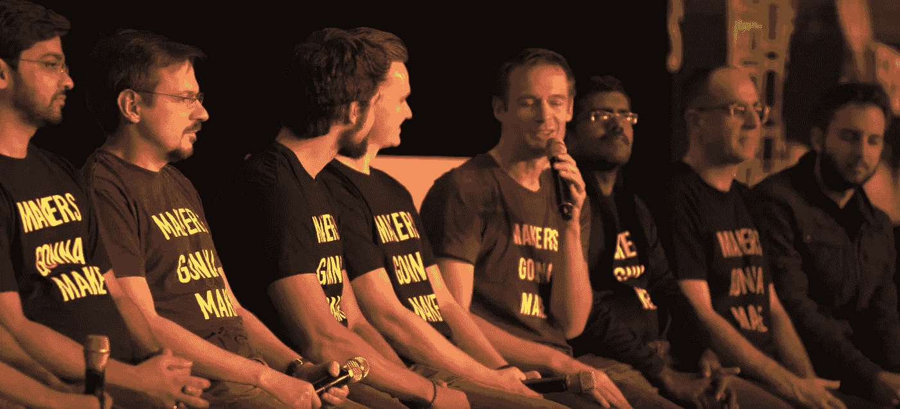

# 从世界上最大的 Kaggle 特级大师小组学到的东西

> 原文：<https://towardsdatascience.com/takeaways-from-the-worlds-largest-kaggle-grandmaster-panel-3f9bf0dd000?source=collection_archive---------20----------------------->



## H2OWorld 大师小组的笔记和心得

> 你可以在推特@bhutanisanyam1 上找到我

```
[Note: This post first appeared on the H2O.ai blog](https://www.h2o.ai/blog/)
```

就我个人而言，我是 Kaggle 的坚定信仰者和粉丝，并且绝对把它视为数据科学之家。卡格大师是卡格或者[的英雄，肯定是我的](https://www.youtube.com/channel/UCRjtBP-o5FbgRzX2BHQEFtQ)。我一直在进行一个[的探索](https://www.youtube.com/channel/UCRjtBP-o5FbgRzX2BHQEFtQ)，去描绘和理解他们进入这个领域的旅程，如果他们仍然是人类或者已经进入了另一个现实的话(不太确定)。

H2O 世界事件最近有最大的 Kaggle 特级大师小组。这篇文章将分享我在小组讨论中的收获，以及我之前采访中的一些笔记。有趣的事实:我采访了小组中所有戴眼镜的大师😎

请读者注意，大多数笔记都包括大师们的评论，并增加了可读性。

这些问题是由阿诺·坎德尔提出的，在这里用标题表示。

# 认识大师们

这个小组由 10/13 的 H2O 特级大师组成。

你认为酷酷的 ML 工程师和模特一起工作？
[我每天上班都会和 Kaggle GMs 聊天](/a-full-time-ml-role-1-million-blog-views-10k-podcast-downloads-a-community-taught-ml-engineer-96f99b91c5ee)😛。

抱歉，我不得不说(我仍然每天掐自己)，回到 GMs:

视频中的“复仇者联盟”时刻，每位 GM 都介绍了自己和自己的优势:

*   金·蒙哥马利(特征工程)
*   Rohan Rao(与 Kaggle 上的惯例相反的单一最佳模式)
*   Shivam Bansal(创建数据故事和端到端解决方案)
*   Dmitry Larko (Dmitry 是无人驾驶 AI 的先驱之一)
*   帕维尔·普莱斯科夫(计算机视觉和时间序列)
*   Yauhen Babakhin(计算机视觉)
*   马克·兰迪(H2O 大学的 OG 数据科学家。郑重声明，这些不是我说的😁)
*   苏达莱·拉吉·库马尔(又名 SRK)
*   Olivier Grellier(时间序列，特征工程)
*   布兰登·默里(特征工程)

# 你会在 Kaggle 上花多少时间(活跃时)？

它真正表达了最好的 Kaggle 人的热情，小组的大多数人同意在 ka ggle 上花费大量的几个小时，甚至一半的时间。

# Kaggle 教过你的最好的技能是什么？

如果你愿意投入时间，Kaggle 确实是一个很好的学习平台。通用汽车马克·兰迪公司称之为“家庭作业”——你把一项任务带回家，做几个月，然后意识到你做得不如其他竞争对手。这会让你提高技能，缩小差距。

“学到的东西不同于任何教室或书本，你在任何地方都找不到你可以在 Kaggle 上竞争的知识”——GM Babakhin

通用汽车公司的帕维尔说，更多的时候，你会组成团队，最终与一群你不会遇到的人一起工作，并远程做出贡献，远程团队合作并推动团队达到最佳状态是他最喜欢的收获之一。

有趣的事实:帕维尔不仅仅是一个书呆子，他还远程工作并环游世界，在他的 Instagram 上冲浪并发布旅行图片。你可以在这里阅读他的完整采访。

在参加了大量的比赛并在问题上花费了大量的时间后，你会发现问题中的共同模式，并在处理这些问题时开始以更有条理的方式思考。批判性思维和把这些问题分成几个步骤，每一步都要有创造性，这是 SRK GM Shivam 的一个小窍门。

[如果你想了解更多关于希瓦姆和 SRK 的旅程，请点击这里查看他们的完整采访。](https://hackernoon.com/interview-with-machine-learning-heroes-0ifi3yyg)

引用通用汽车公司的奥利维耶的话来说，“你还学到了现实世界中最重要的技能之一:制作能够很好概括的模型”。

# Kaggle 的秘制酱料是什么？

[卡格勒比赛就像一场 PUBG 游戏，每个人都从零开始，但是经验丰富的卡格勒知道在哪里可以找到战利品。对我来说，这感觉就像一场比赛，noobs(我和我的同类)赤脚跑着，Kaggle GMs 和 Masters 开着他们的知识超级跑车从我们身边飞驰而过。](/first-kaggle-competition-experience-804011c56a31)

巴巴欣说:比赛更像是一场马拉松，而不是短跑，所以你应该准备好运行许多想法，其中许多会失败，你应该为此做好准备。

GM Dmitry 说:“数据科学就是关于数据和建模的，你真的需要了解如何验证你的数据，然后剩下的就是这些了。”

如果你在追逐胜利，你会想要渗出每一个数字来达到排行榜的顶端，这将需要建立许多模型，并且需要你有正确的组合策略——GM Shivam 补充道

# 你以为深度学习就万事大吉了吗？

Dmitry 和 Mark 同意深度学习可以帮助建模，但在自动创建功能，验证想法方面，特别是 Kaggle 验证想法和批判性思考，如果该功能会反映在 Kaggle 的私人排行榜上，深度学习可能无法做到这一点。

# 在给定的时间点上，你会有多少想法？

这里的答案是不同的，这取决于卡格勒的风格，或者正如通用汽车公司的奥利维尔指出的那样，这也可能取决于比赛的终点有多远，这将影响他是否会采取放松或更严肃的方法。每个复仇者都有自己的战斗风格，对吗？

Kim 最初会花很多时间在特征工程上，并在比赛结束时专注于建模。

Rohan 一次只专注于一项竞赛，同时进行多项实验。

# 你是怎么做特征选择的？

Rohan Rao 现在在无人驾驶 AI 的帮助下使用了很多 FE😁

> 在某个时候，一个聪明的人会拥有一个巨大的知识宝库。2019 年，一个聪明的程序员拥有丰富的代码库。

对于 Dmitry 来说，这取决于比赛是否与他之前参加的比赛相似。据他说，大多数大师都有现成的剧本可以利用。

# 更多战斗故事:比赛中的任何错误或遗憾？

正如 GM Olivier 提到的，每个人都会有后悔的时候在 kaggle 上提交。

就我个人而言，我仍在学习如何选择合适的投稿。或者更诚实地说，选择所有不正确的提交😎

读者注意:当你在 Kaggle 上比赛时，你的最终排名是在一个私人排行榜上评估的(这是真实的排名)。为了获得您的排名，您需要在最后选择您的最终提交。

Olivier 分享了他从这样一次经历中获得的收获，这使他思考如何更好地概括，而不仅仅是关注公共排行榜。

Mark 分享了一个比赛中的战斗故事，一个看起来很有前途的公共内核可能会让他的团队失去很多位置。

Rohan 建议关注离群值，基于一场比赛，只要移除一个离群值就能让他获得第一名。

GM Babakhin 也有一个非常有趣的战斗故事，他差 10 秒就错过了提交截止日期。我只能想象肾上腺素激增。😃

# 如果你的时间有限，你会专注于什么？

这也说明了广义的奉献或 10，000 规则。正如德米特里所说，一般来说，任何技能都需要大量的时间、奉献和专注。📓

Pavel 建议将时间集中在编写高质量的代码上。📝

# **大师们最被低估的技能是什么？**

就我个人而言，我最近最喜欢的一句话是 Rohan 说的:

**“Kaggle 是我最喜欢的第二份全职工作，但这是有代价的”**

他补充说，从小组来看，时间管理至关重要。卡格尔断断续续发生了很多事情。

# 你如何及时了解最新的学习资源？

[至此，各位特级大师同步拿起话筒，提到了柴时间数据科学播客！](https://www.youtube.com/channel/UCRjtBP-o5FbgRzX2BHQEFtQ)

如果这还不明显，我是在开玩笑，但一定要看看这个频道或播客，你很快就可以期待所有小组总经理的采访😉

对于帕维尔来说，他最喜欢的课程是 fast.ai，这是为数不多的始终停留在 Tech 前沿的课程。

希瓦姆和 SRK 使用 Twitter，通过一些博客，他们跟踪该领域的顶级研究人员和从业者。

如果你想在 twitter 上找到我最喜欢的实践者，你可以订阅我的列表。

# 团队战略

对马克来说，他喜欢从头到尾和一个人一起解决一个问题。许多总经理更注重团队合作，带来更多车型等。

# 为什么加入 H2O？

对于布兰登来说，原因是致力于真正的数据科学产品，并进行行业转换。

对于 Shivam 来说，公司的愿景和产品是行业内数一数二的。

一致认为该公司拥有最强的数据科学团队。😎甚至 Kaggle 也不允许你在任何比赛中与 13 名大师组队(根据规则)

# 个人外卖

那么面试后我有什么新的印象和收获呢？

以下是这个小组的几个特质，它们启发了我，甚至是 Kaggle:

*   奉献:
    大师们是真正聪明的人类(或者可能是超人，我的研究仍在进行中)。然而，他们对 Kaggle 有着疯狂的执着。在高峰期，许多人一天有一半以上的时间花在 Kaggle 上。通用汽车公司的帕维尔·普莱斯科夫(Pavel Pleskov)甚至辞去了他的全职角色，将 Kaggle 作为一个全职角色。
*   作为学习平台的 Kaggle:
    引用 GM (KazAnova) Marios Michailidis 的话，“ka ggle 上有成千上万的人在竞争。即使你输了，你也赢了”(就获得知识而言)。Kaggle 是学习数据科学的最佳平台之一，即使它不能教你一些只有真实世界才能教你的关于真实世界的东西。
*   问题的多样性:
    Kaggle 有各种各样的比赛和问题。这些将再次允许你从任何领域选择一个问题，并从中获得经验。不同的大师在讨论中分享了他们的专业领域。他们的大量知识财富来自 Kaggle。

最后，卡格灵的精神。通过竞争、参与论坛和与世界各地的人合作，可以学到很多东西。归根结底，Kaggle 是数据科学之家，它必须是其中最伟大的学习平台之一。

> 如果你想查看对顶级从业者、研究人员和谷歌人的采访，了解他们的旅程。查看 Chai Time 数据科学播客。有[音频](http://chaitimedatascience.com)和[视频](https://www.youtube.com/channel/UCRjtBP-o5FbgRzX2BHQEFtQ)两种。
> 
> 你可以在推特上找到我
> 
> [订阅我的时事通讯，获取深度学习和计算机视觉阅读的每周精选列表](http://tinyletter.com/sanyambhutani/)