# 试用 Azure AutoML

> 原文：<https://towardsdatascience.com/taking-azure-automl-for-a-test-drive-92f162dff3ac?source=collection_archive---------29----------------------->

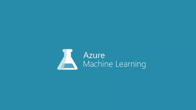

[微软](https://medium.com/u/940e606ec51a?source=post_page-----92f162dff3ac--------------------------------)最近在预览版中引入了 Azure AutoML。我喜欢自动化机器学习的概念，因为这可能是发生在非数据科学家身上的最好的事情。它把数据科学带到大众中，一次一个自动化实验。

# 何时使用自动化 ML

Automated ML 使机器学习模型开发过程民主化，并使其用户(无论他们的数据科学专业知识如何)能够识别任何问题的端到端机器学习管道。

各行业的数据科学家、分析师和开发人员可以使用自动化 ML 来:

*   无需丰富的编程知识即可实现机器学习解决方案
*   节省时间和资源
*   利用数据科学最佳实践
*   提供敏捷的问题解决方案

在下面的例子中，我使用的是 Kaggle telcos 流失数据集，这里是。

第一步是创建机器学习工作空间。

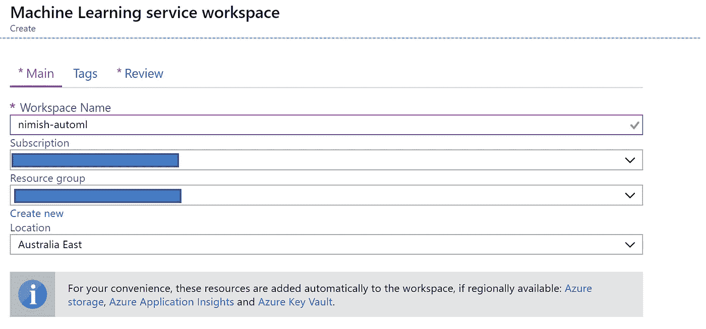

Creating a machine learning workspace (note I have hidden some details)

单击“create ”(创建)后，您将看到下面的屏幕:

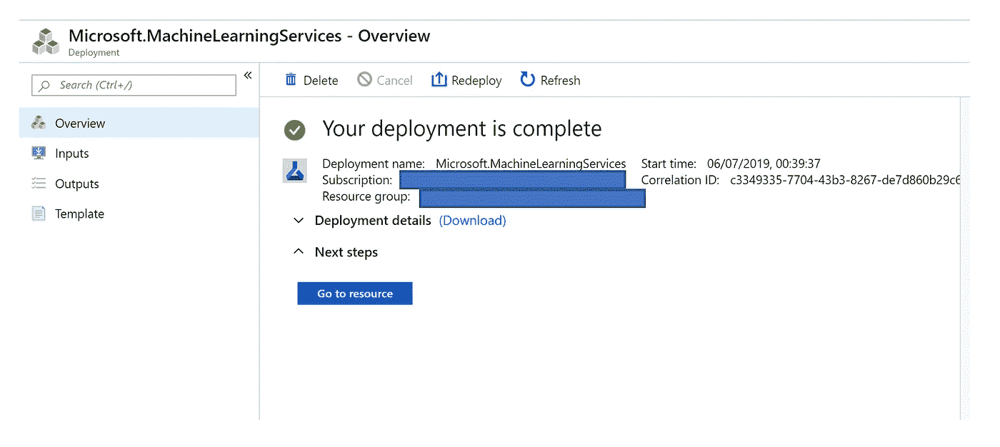

Once the machine learning workspace is created you will see the above screen

您也可以查看详细信息，单击部署详细信息，您将看到以下详细信息:

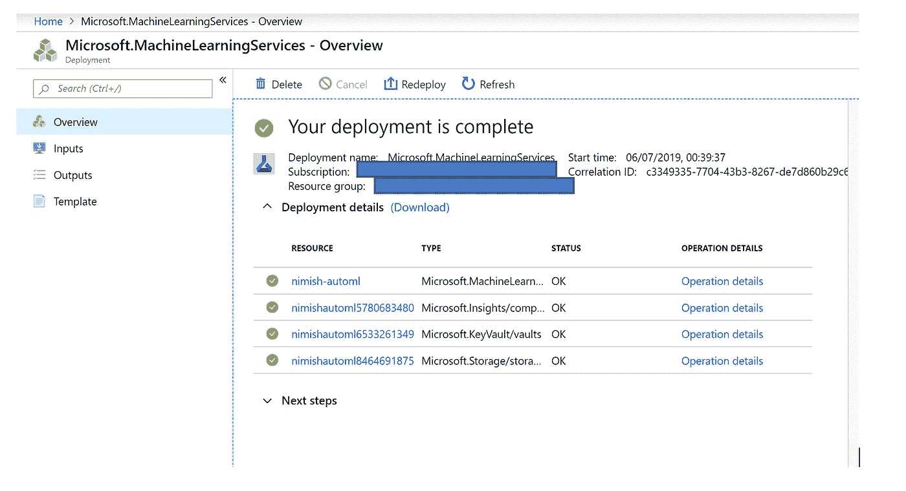

The various resources that get spun up as part of your machine learning workspace

完成后，点击“转到资源”

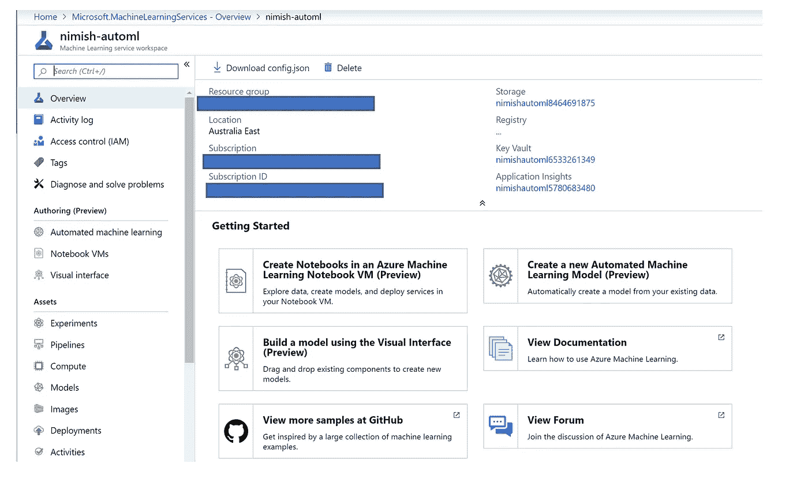

Once you click on Go to Resource you will see the above.

点击“创建新的自动化机器学习模型(预览)”

您将看到以下屏幕:

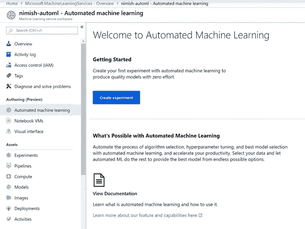

在下一步中，单击“创建实验”

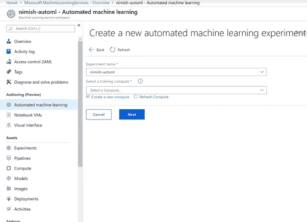

Give your experiment a name

创建新计算机

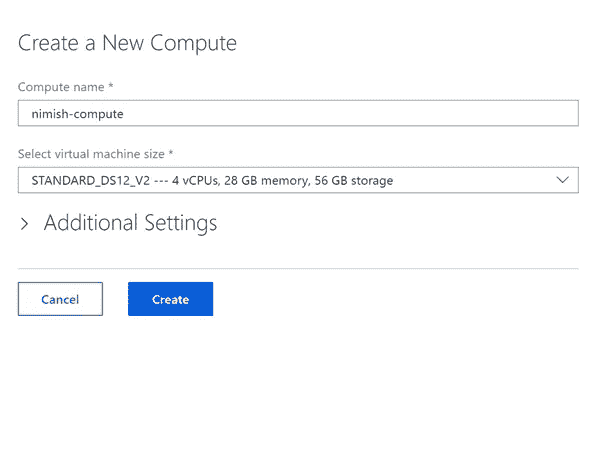

A standard DS12 V2 machine

单击附加设置，并将最小节点设置为 1。

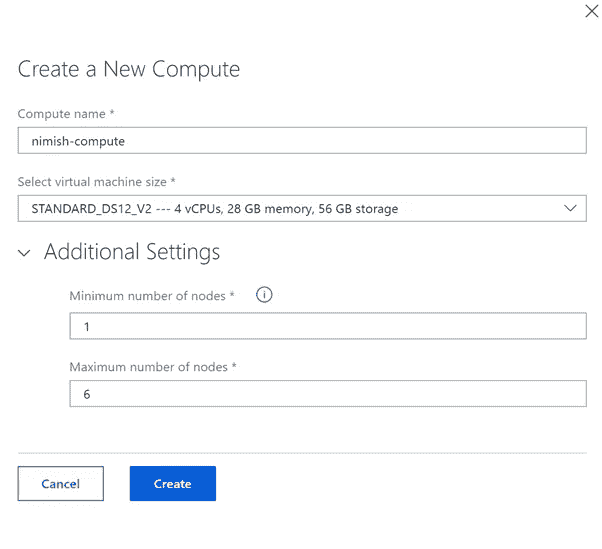

change the minimum number of nodes to 1

This can take a couple of minutes

现在选择计算机并上传电信流失文件。

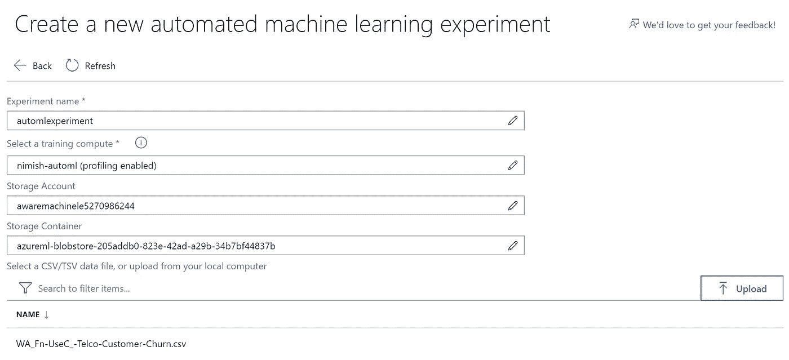

选择文件并点击上传按钮。

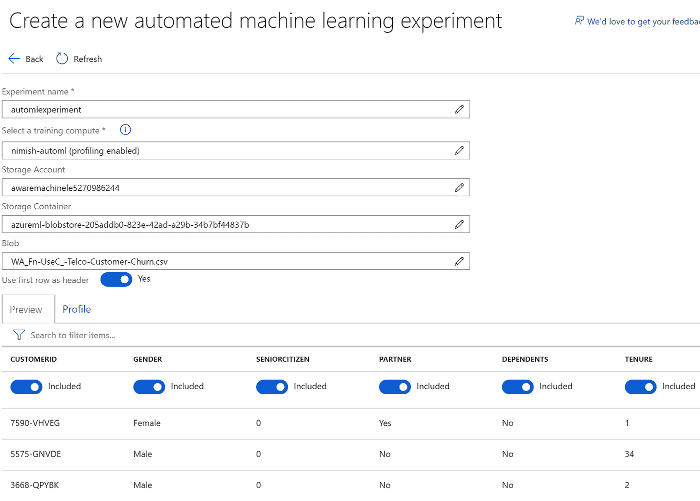

您将看到显示的列。

我们还有数据分析选项，可以帮助您了解更多关于数据的信息。

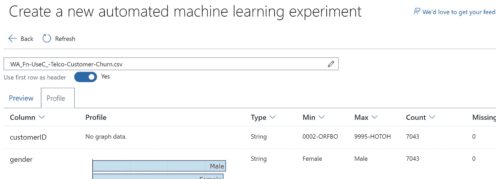

查看配置文件，我不希望模型在 CustomerID 上训练

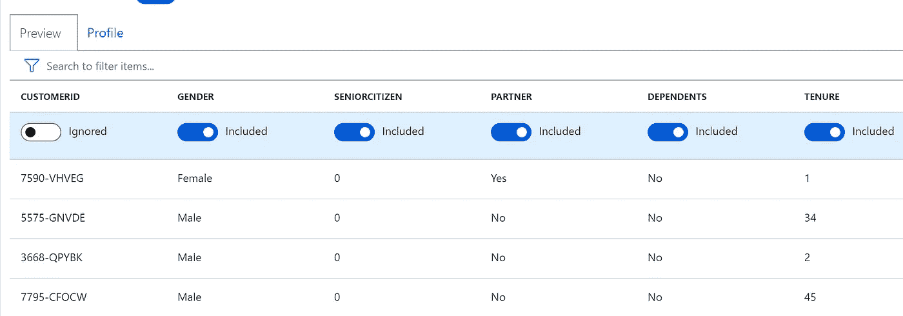

Notice I have ignored the column CustomerID

我们试图解决的三种机器学习问题，我们有三种选择。

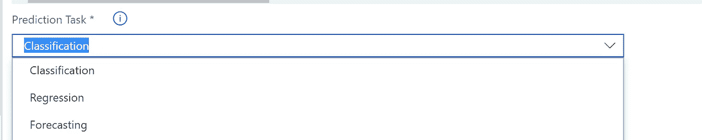

我将使用分类，因为我试图预测客户流失，因此目标列是客户流失。

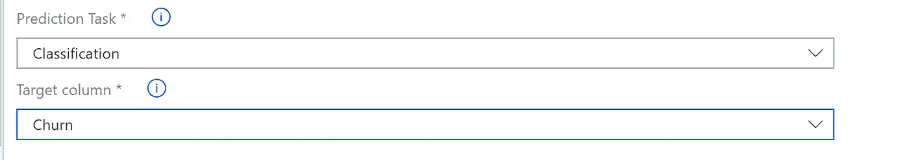

(可选)高级设置:可用于更好地控制培训作业的附加设置。

# 自动(标准)预处理

在每一个自动化机器学习实验中，你的数据都会被自动缩放或归一化，以帮助算法表现良好。在模型训练期间，将对每个模型应用以下缩放或标准化技术之一。

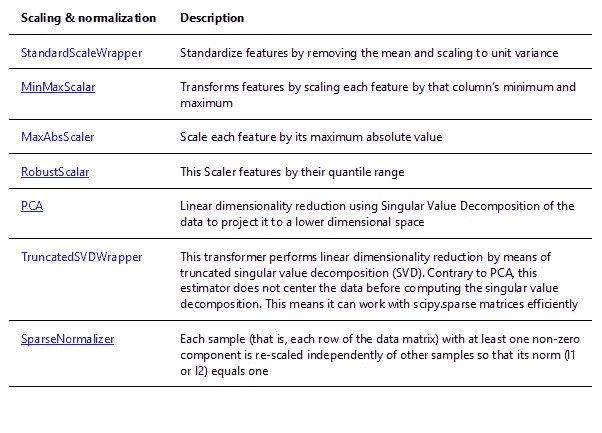

下一步是我们点击加速器并点击开始！

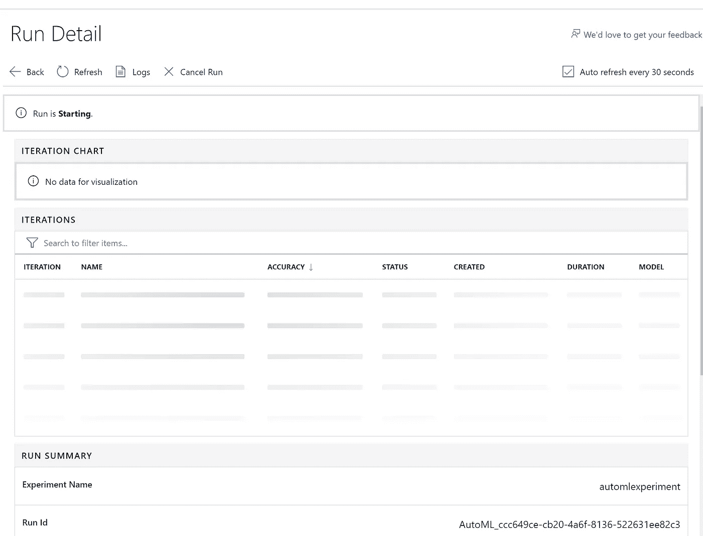

一段时间后，这些值会得到更新:

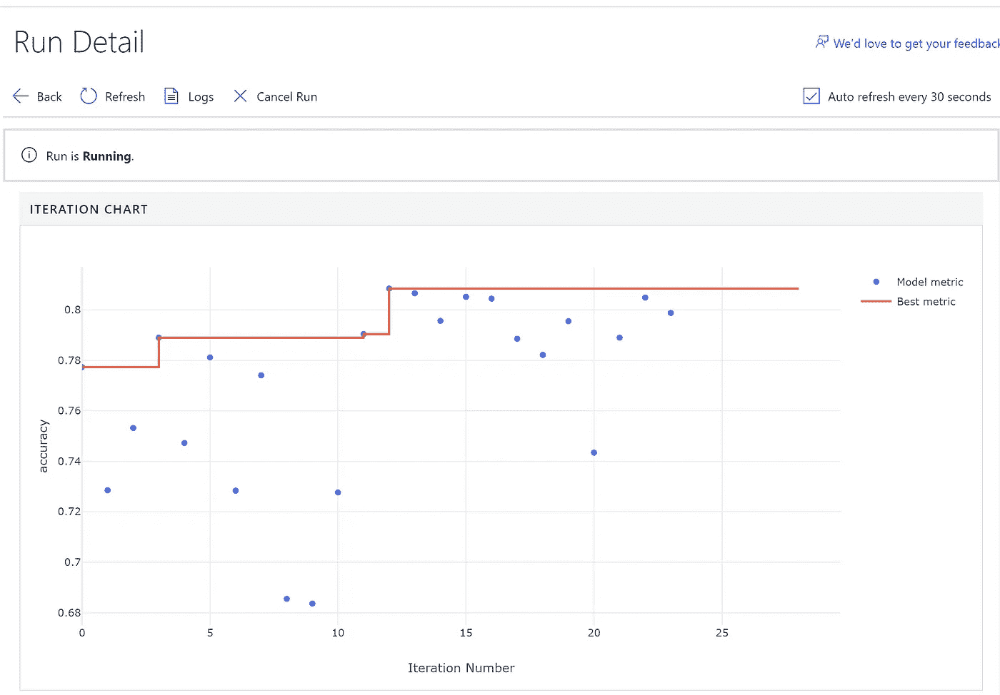

当它仍在运行时，您可以查看它在自动化和调优过程中运行的各种算法。：

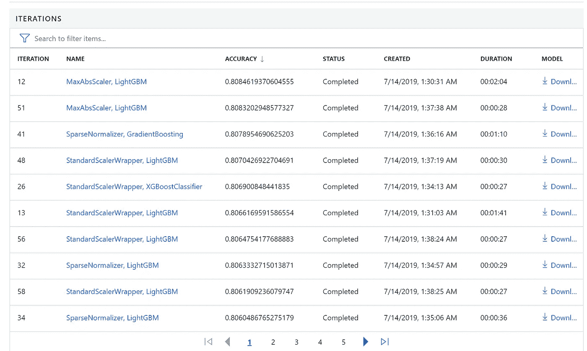

您还可以下载模型，并对其进行调整以适应您的用例。

一旦运行完成。

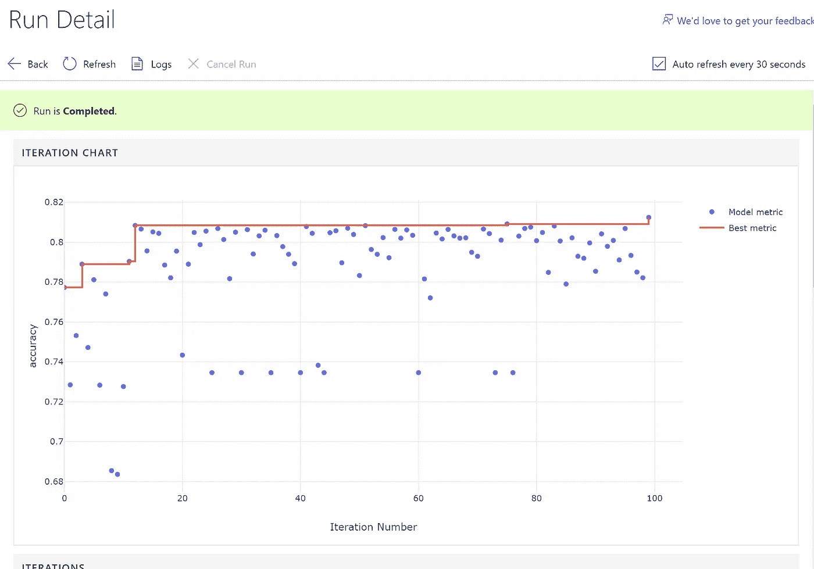

它会自动选择最佳模型供您下载和部署。

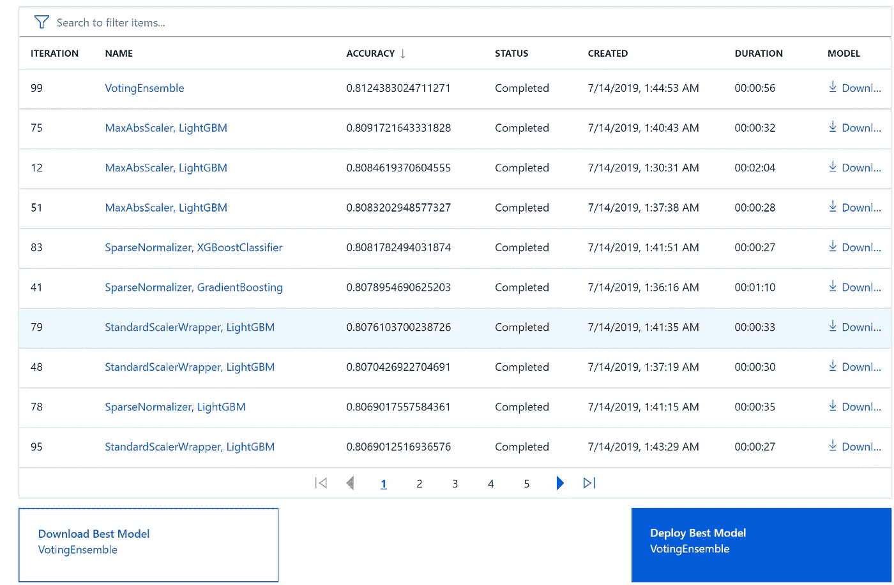

然后，您可以下载并部署该模型！

我将在另一篇文章中介绍下载和部署。

AutoML 对于人工智能社区来说是一个令人兴奋的创新，并且确实是科学上另一个突破的机会。

注意:这里表达的观点是我个人的，不代表我的雇主的观点。