# 在 Python 中取导数

> 原文：<https://towardsdatascience.com/taking-derivatives-in-python-d6229ba72c64?source=collection_archive---------0----------------------->

这篇文章背后的想法是重新审视数据科学和机器学习中需要的一些微积分主题，并把它们向前推进一步——用 Python 计算它们。一旦掌握了要领，真的很简单，不需要为记忆微分规则而烦恼。


Photo by [Unsplash](https://unsplash.com/@unsplash?utm_source=medium&utm_medium=referral) on [Unsplash](https://unsplash.com?utm_source=medium&utm_medium=referral)

这篇文章将基于一个叫做 [SymPy](https://www.sympy.org/) 的 Python 库，这里有一个关于它的简短介绍(*如果你在*之前没有用过的话):

> SymPy 是一个符号数学的 Python 库。它的目标是成为一个全功能的计算机代数系统(CAS ),同时保持代码尽可能简单，以便易于理解和扩展。SymPy 完全是用 Python 写的。[1]

要安装它(*应该附带*[*Anaconda*](https://www.anaconda.com/)*发行版*)打开终端窗口并执行以下命令:

```
pip install sympy
```

正如我所说的，我们将用它来重温微积分中的一些主题，更准确地说是**微积分**。如果您对这方面不熟悉，让我们稍后再来看看:

> 微分学，数学分析的一个分支，由艾萨克·牛顿和 G.W 莱布尼茨创立，研究的问题是求一个函数相对于它所依赖的变量的变化率。因此，它涉及到计算导数，并用它们来解决涉及非恒定变化率的问题。典型的应用包括寻找函数的最大值和最小值，以解决最优化中的实际问题。[2]

现在更具体地说(*这部分很快就会结束，我保证*)，我们将计算**导数**。我也不记得那些是什么了。实际上没什么特别的:

> 函数在某点的导数表征了函数在该点的变化率。我们可以通过计算函数δy 的变化与自变量δx 的变化之比来估计变化率，在导数的定义中，这个比值在极限中被认为是δx→0。[3]

***好了好了，别再用理论折磨我了！***

这是在深入举例之前的最后一段，对天发誓！首先，我们将深入单变量函数，但稍后，我们将通过几个多元函数的例子，因此，我们将涵盖如何计算**偏导数**。这是你会经常做的事情，我在应用部分还没怎么用过单变量函数的导数。

事不宜迟，我们开始吧！

# 一元函数的导数

这将是你的 Calc 1 课程或在线课程中涉及的内容，只涉及处理单个变量的函数，例如，***【f(x)***。目标是遍历一些基本的微分规则，手工遍历，然后用 Python。让我们开始吧。

## 权力规则

幂法则是这样表述的:

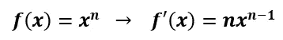

如果你以前听过一些计算课程，这是不言自明的。如果你没有，让我们来看一个简单的例子。你的函数 ***f(x)*** 等于 x 的五次方。现在用幂法则来计算导数。这很简单:

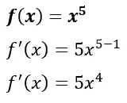

现在我们来看看如何用 Python 来计算。第一件事是导入库，然后声明一个变量，您将在函数中使用它作为字母。下面是对单变量函数的操作方法:

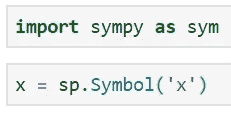

一旦这些单元格被执行，求导就变得很简单了(*与上面的*功能相同):

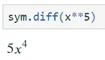

注意这个漂亮的打印格式——看起来就像用 [LaTeX](https://www.latex-project.org/) 写的一个等式！

## 乘积规则

乘积法则规定，如果 ***f(x)*** 和 ***g(x)*** 是两个可微函数，那么导数的计算方法是第一个函数乘以第二个的导数加上第二个乘以第一个的导数。当用文字表达时，这可能听起来有点混乱，所以这里是符号:

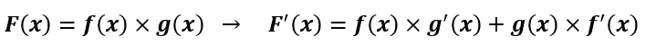

我们手算一个例子。我们有以下内容:

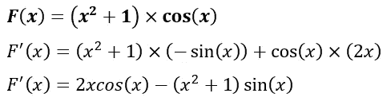

可以看到，x 的平方加 1 会是 ***f(x)*** ，x 的余弦会是 ***g(x)*** 。下面是用 Python 实现的方法:

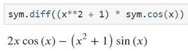

也直白。不过，一定要注意放括号的地方。另外，请注意，您不能使用来自 *math* 或 *numpy* 库的余弦，您需要使用来自 *sympy* 的余弦。

## 链式法则

如果你决定更深入地研究机器学习算法，你会看到链式法则到处涌现——梯度下降、反向传播，应有尽有。它处理嵌套函数，例如， ***f(g(x))*** 并声明导数的计算方法为外部函数的导数乘以内部函数，然后全部乘以内部函数的导数。这是注释:

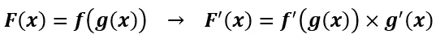

这里有一个简单的手工计算的例子:

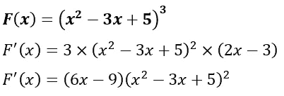

Python 实现再一次变得非常简单:

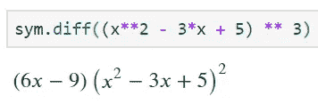

# 多元函数的导数

在这里，同样的规则适用于处理非常简单的单变量——你仍然使用链式法则、幂法则等，但是你对一个变量求导，同时保持其他变量不变。哦，那些叫做**偏导数**。太棒了。

首先，让我们以最基本的二元函数为例，计算偏导数。这个函数很简单，就是 x 的平方乘以 y，你可以把它区分如下:

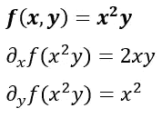

***酷，但是我怎么用 Python 做这个呢？*** 好问题。首先，你需要重新定义你的符号。在传统的 Python 风格中，您可以用一行代码来完成:

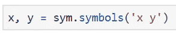

现在叫到了 ***。diff()*** 函数还需要一个参数——计算导数的项。让我们来看看:

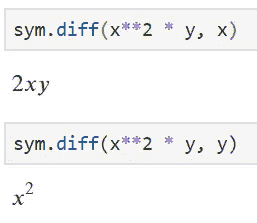

你可以在这里看到如何计算关于 ***x*** 然后 ***y*** 的偏导数。重写函数会很快变得单调乏味，有一种方法可以避免这种情况。让我们在下一个例子中探索它。

## 3 可变函数

这是另一个对所有 3 个变量求偏导数的例子:

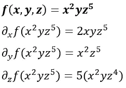

这将再次要求你改变符号:

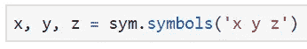

这次你可以更聪明一点，把函数设置成一个变量，而不是每次都重写:


酷毙了。剩下的部分和以前完全一样:

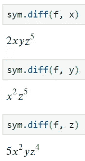

这样可读性强多了。你甚至可以逐字阅读——相对于 ***x*** 区分函数 ***f*** 。

# 最后的话

这不是一个高级微积分教程，见鬼，这甚至不是一个微积分教程，它也不打算成为一个。我们的目标是给你指出正确的方向，这样你就不必手动计算导数，或者使用一些在线计算器。

尝试将此应用于梯度下降的线性回归——这将是一个很好的练习，我将在几天后发布一篇关于它的文章。

***想学习 Python 中如何求积分？让我知道。***

喜欢这篇文章吗？成为 [*中等会员*](https://medium.com/@radecicdario/membership) *继续无限制学习。如果你使用下面的链接，我会收到你的一部分会员费，不需要你额外付费。*

[](https://medium.com/@radecicdario/membership) [## 通过我的推荐链接加入 Medium-Dario rade ci

### 作为一个媒体会员，你的会员费的一部分会给你阅读的作家，你可以完全接触到每一个故事…

medium.com](https://medium.com/@radecicdario/membership) 

# 参考

[1][https://www.sympy.org/en/index.html](https://www.sympy.org/en/index.html)

[2][https://www.britannica.com/science/differential-calculus](https://www.britannica.com/science/differential-calculus)

[3]https://www.math24.net/definition-derivative/