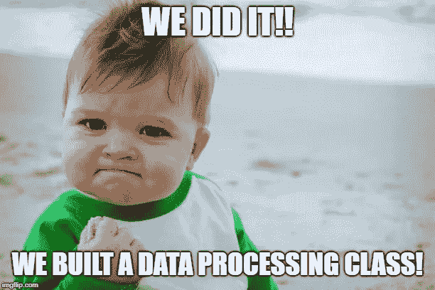

# 带着谷歌床单去上课。

> 原文：<https://towardsdatascience.com/taking-google-sheets-to-a-class-47f7f5f4ed98?source=collection_archive---------17----------------------->

我目前正在为教师构建一个 Flask 应用程序。由于谷歌驱动已经被老师们采用，谷歌表单也被他们使用。我的应用程序的一个功能是允许教师轻松地将工作表链接复制并粘贴到应用程序中，并通过表单提交。然后，它会将其转换为 pandas 数据框，并删除空行和空列。


Google Sheets Icon

这是一项正在进行中的工作，但是我想分享到目前为止制作的类，因为我没有找到很多用于数据收集或预处理的 Python 类示例。我所看到的许多例子对于教授类的概念是有用的。但是大多数时候它们对于数据科学或者 ML 来说不够实用或者不够具体。毕竟，我们总是可以使用更实际的 Python 类的例子。


See, Yoda knows. (Self-made on imgflip.com)

# 但是你为什么需要一门课呢？你就不能写代码就 ok 了吗？

如果这是为了分析的目的，那么…是的。但是生产代码，据我所知，遵循的是面向对象的编程方法。这意味着您的代码在脚本之间是分开的。这些脚本主要由类和函数组成。以这种方式编写的代码也更容易重用于其他目的。以我在本帖中使用的 ecdf 函数为例。

[](/data-science-code-refactoring-example-14c3ec858e0c) [## 数据科学代码重构示例

### 当学习为数据科学编码时，我们通常不会考虑修改我们的代码来获得特定的…

towardsdatascience.com](/data-science-code-refactoring-example-14c3ec858e0c) 

有了这个函数，您可以立即快速重现这个图，而不是一遍又一遍地重新键入相同的 matplotlib 模板代码。

# 太好了！给我看看你的例子！

当然啦！我将分块分享这个例子，并解释每一部分。

```
# Import necessary libraries
import gspread
import pandas as pd
from gspread_dataframe import get_as_dataframe
from oauth2client.service_account import ServiceAccountCredentials
```

是用来处理我们的 Google 表单的输入和操作的库。我们将使用[熊猫](http://pandas.pydata.org/pandas-docs/stable/)来删除工作表中所有的空行和空列。gspread-dataframe 是我们将表格转换成数据框的关键库。最后，oauth2client 是 gspread 建议用来认证我们的凭证的库。如果您不熟悉这种类型的认证，您可以在这里[看到它是如何执行的](https://gspread.readthedocs.io/en/latest/oauth2.html)。

```
# Create class name and init function
class GoogleSheetProcessor:

    def __init__(self):
        self.scope = ['https://spreadsheets.google.com/feeds', 'https://www.googleapis.com/auth/drive']
        self.credentials = ServiceAccountCredentials.from_json_keyfile_name(
                                                      'Credentials.json', self.scope)
        self.gc = gspread.authorize(self.credentials)
```

首先，我们给我们的班级命名。根据[约定](https://www.python.org/dev/peps/pep-0008/#class-names)，使用 CapWords 约定命名类。在这里，我们创建 init 函数来告诉这个类设置分配给这个类的变量。在我们的例子中，我们将让类初始化认证 credentials.json 文件所需的三个变量。

```
# Get google sheet method
def obtain_google_sheet(self, link):
    sheet = self.gc.open_by_url(link)
    sheet = sheet.get_worksheet(0)
    return sheet
```

这里我们创建了一个方法(也就是类的函数),它将 Google sheet 链接作为一个参数。然后，它使用我们的实例`self.gc`获取链接，然后获取 Google sheet 文件中的第一个工作表。最后，它返回我们想要的工作表作为`sheet`。

```
# Convert sheet to data frame and drop unnecessary rows and columns
@staticmethod
def worksheet_to_df(worksheet):
    # adjust input so nan rows and columns are not imported
    df = get_as_dataframe(worksheet, parse_dates=True, header=0)
    df.dropna(axis='columns', how='all', inplace=True)
    df.dropna(axis='rows', how='all', inplace=True)
    return df
```

我们的第二种方法将一个工作表作为输入，并将其转换成 pandas 数据框。它有`[@staticmethod](https://www.geeksforgeeks.org/class-method-vs-static-method-python/)`类装饰器，因为我们不需要将类实例`self` 作为参数来使用它。然后，我们使用熊猫`dropna`数据框方法删除不包含任何值的行和列。

现在让我们退后一步，把整个班级作为一个整体来欣赏。

```
# Create class name and init function
class GoogleSheetProcessor:

    def __init__(self):
        self.scope = ['https://spreadsheets.google.com/feeds', 'https://www.googleapis.com/auth/drive']
        self.credentials = ServiceAccountCredentials.from_json_keyfile_name(
                                                      'Credentials.json', self.scope)
        self.gc = gspread.authorize(self.credentials)# Get google sheet method
def obtain_google_sheet(self, link):
    sheet = self.gc.open_by_url(link)
    sheet = sheet.get_worksheet(0)
    return sheet# Convert sheet to data frame and drop unnecessary rows and columns
@staticmethod
def worksheet_to_df(worksheet):
    # adjust input so nan rows and columns are not imported
    df = get_as_dataframe(worksheet, parse_dates=True, header=0)
    df.dropna(axis='columns', how='all', inplace=True)
    df.dropna(axis='rows', how='all', inplace=True)
    return df
```



It’s possible! (Self-made from imgflip.com)

# 那么如何使用这个类呢？

我用它作为一个烧瓶表单的处理的一部分。下面是利用我们的类的路由功能。

```
@app.route('/upload/<email>', methods=['GET', 'POST'])
@login_required
def upload(email):
    user = User.query.filter_by(email=email).first_or_404()
    form = DataInputForm()
    if form.validate_on_submit():
        if form.google_sheet.data is None and form.excel_sheet.data is None:
            flash('Form Empty. Please enter a Google Sheet link or load an Excel file')
            return redirect(url_for('upload'))

        elif form.google_sheet.data and form.excel_sheet.data:
            flash('Cannot Submit Both Form Types. Only Google Sheet OR Excel File')
            return redirect(url_for('upload'))

        elif form.google_sheet.data:
            gp = GoogleSheetProcessor()
            data = gp.obtain_google_sheet(form.google_sheet.data)
            data = gp.worksheet_to_df(data)

        flash('Upload Successful')
        return render_template('dashboard.html', data=data)
    return render_template('upload.html', title='Data_Upload', user=user, form=form)
```

如果你不熟悉[砂箱](http://flask.pocoo.org/)或[砂箱形式](https://flask-wtf.readthedocs.io/en/stable/)，这可能会让人感到困惑。让我们把重点放在实现类的部分。

```
elif form.google_sheet.data:
    gp = GoogleSheetProcessor()
    data = gp.obtain_google_sheet(form.google_sheet.data)
    data = gp.worksheet_to_df(data)
```

在我们初始化这个类之后，我们将工作表分配给变量`data`。`form.google_sheet.data`是应用程序从之前在路线功能中启动的`DataInputForm`获取输入链接的地方。然后链接被传递到我们的`worksheet_to_df`方法中进行转换和精简。

# 我注意到有`form.excel_sheet.data in your route function`。你用 Excel 文件做什么？

这实际上是部分完成的路由功能。我现在不能透露太多，但将有教师上传 Excel 文件的功能。一旦 MVP 版本的应用程序推出，我会写更多与此类相关的文章。


Picture by [DaMongMan](https://www.flickr.com/photos/damongman/with/6274878152/) on Flickr

# 走之前最后一个想法…

写作课会让人望而生畏。如果你正在学习成为一名数据科学家或分析师，这不是一个常见的概念。甚至编写函数的想法看起来都很可怕。但是你可以做到，这是一个有用的技能。

如果您至少可以构建函数，那么您就可以为您的可视化和 ML 模型减少一些重复的代码编写。更好的是，如果你的模型将被集成到一个产品中，当你的工程师将你的代码添加到他们的产品代码中时，他们会感谢你让他们的生活变得更容易。

感谢阅读！我希望这个 Python 类示例能帮助您构建自己的数据相关类。尝试使用您选择的数据类型自己做一个。你先从哪个开始？数据可以来自 CSV 或 SQL server。如果你还不习惯创建一个类，试着先把这些过程转化成函数，然后围绕这些函数构建一个完整的类。

直到下一次，

约翰·德杰苏斯