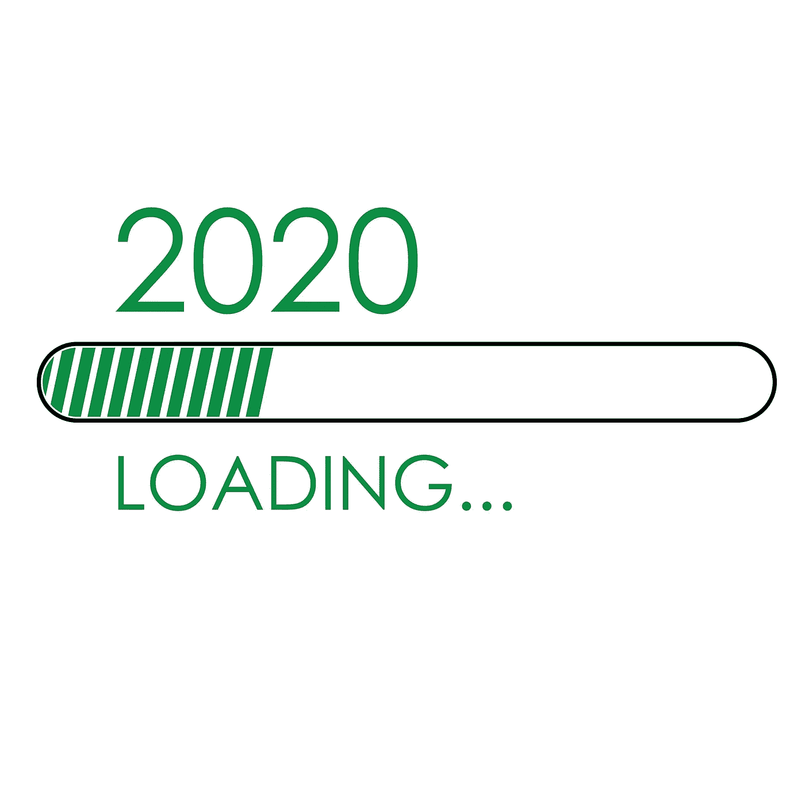
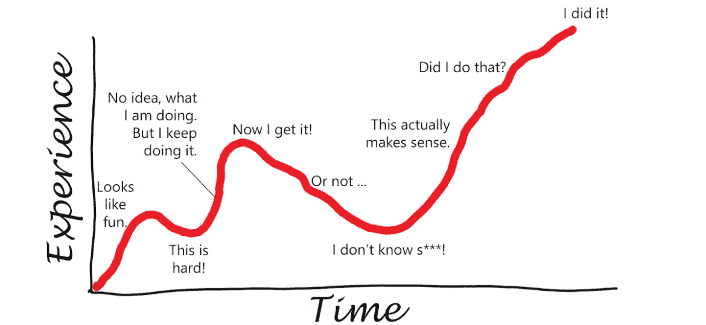
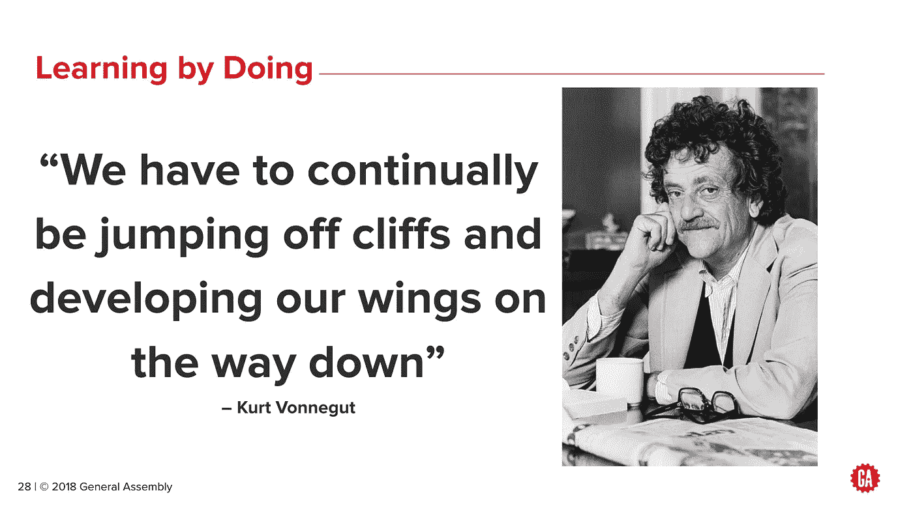
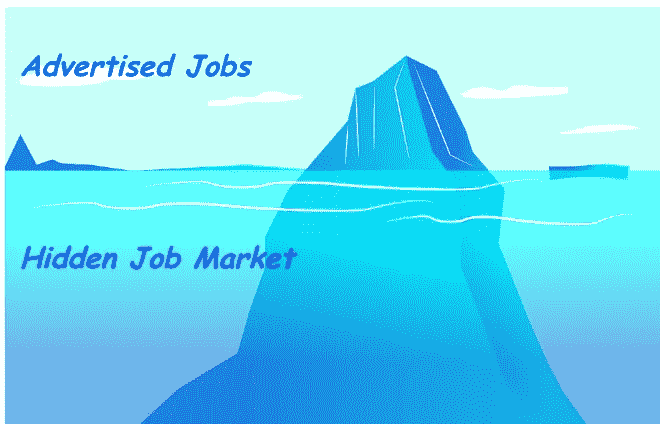

# 投身数据科学

> 原文：<https://towardsdatascience.com/taking-the-plunge-into-data-science-my-experience-on-the-immersive-course-6e06b5b0e498?source=collection_archive---------24----------------------->

Image by [Денис Марчук](https://pixabay.com/users/Manuchi-1728328/?utm_source=link-attribution&utm_medium=referral&utm_campaign=image&utm_content=2462434) from [Pixabay](https://pixabay.com/?utm_source=link-attribution&utm_medium=referral&utm_campaign=image&utm_content=2462434)

*我对沉浸式课程的体验*

Image by [StockSnap](https://pixabay.com/users/StockSnap-894430/?utm_source=link-attribution&utm_medium=referral&utm_campaign=image&utm_content=2602886) from [Pixabay](https://pixabay.com/?utm_source=link-attribution&utm_medium=referral&utm_campaign=image&utm_content=2602886)

在过去的几年里，我发现自己正在浏览大会(GA)数据科学沉浸式网页。它引起了我的兴趣，因为我对统计学在现代世界中的应用非常着迷，但我对学习编码语言 python 的前景感到害怕。我把 python 看作是一个只有 it 程序员理解的黑匣子。

快进到 2019 年 6 月，我迎来了一个里程碑式的生日，我开始看到一些迷因“再过 6 个月就是 2020 年了”。不要让任何人浪费你的时间。这促使我加大了对这个项目的研究，并开始在业余时间学习 python 编码。出于好奇，我开始在 LinkedIn 上联系该课程的往届学生，发送个性化信息，以了解该课程是否值得，以及它对他们的职业生涯有何影响。所有的反馈都是积极的，令人鼓舞。

Image by Elisa Riva from Pixabay

一旦我开始对掌握 python 有了一些信心，我就有了“YOLO”的时刻，并决定报名参加这个课程。

这不是一个容易的决定。这个课程是一个巨大的经济负担，而且这意味着我要辞掉我完美的全职工作。但我的理念是，冒险总比后悔没有抓住机会要好。

我决定冒险报名参加沉浸式全日制课程，因为尽管有更大的承诺，但我知道这将确保我从中获得最大收益。沉浸式课程还有一个职业服务，可以帮助我进入就业市场。赢家！

那么什么是数据科学呢？工作领域仍在定义中，术语“数据科学家”目前是多个角色的统称。许多人认为数据科学家这个头衔将不复存在，因为这个领域将被分为其他类别，如数据分析师、数据架构师、数据工程师等。但用最简单的话来说，数据科学就是使用大数据来建立关于未来的预测模型。

随着科技时代的崛起，大数据正在蓬勃发展！短缺不在于数据本身，而在于挖掘数据的人。

第一次走进教室，见到我将在接下来的 3 个月里一起度过的人，并被分配到我的座位上(现在这已经永久地印在我的脑海里了!),这是令人畏惧的。幸运的是，介绍课介绍了我们的助教，包括一顿亲密的午餐和校园参观。

作为澳大利亚 GA 的一名学生，我们有一个“连接班”，将我们(悉尼)和墨尔本班连接在一起。每个班级都有一名助教，主要老师通过视频连接。令人惊讶的是，你可以通过视频链接了解你的同学和老师！

每天我们上午和下午都有一节课，每节课之后都有时间进行实践或“实验”工作。我们还有一个每两周运行一次的项目，展示我们正在学习的实践技能，并在课程结束时以一个更大的顶点项目结束。

这是使我选择在大会学习而不是在大学读研究生的决定性因素。实践经验意味着我有项目工作“准备好了”，可以显示在我的 GitHub 个人资料上，供潜在雇主查看。这表明我有做好工作的实践经验，而不仅仅是理论。

The Bumpy Learning Curve. Image by Sascha Kasper at [sascha-kasper.com/](http://sascha-kasper.com/)

前四周过得飞快，不知不觉中，我已经提交了两个主要项目，一个基于 python 编程，另一个基于 Kaggle 数据集的探索性数据分析。

到目前为止，我发现这个速度是可以控制的，我有精力在早上早起做额外的学习，晚上也一样。GA 建议您在周一至周五的 9-5 工作日之外再投入 20 个小时！

接下来的几周，随着理论变得越来越复杂，工作量开始增加，我的动力开始减弱，恐慌开始出现。“我究竟要怎样才能完成这一切，”我心想。在这个时候，我有一个项目，实验室会议和我的顶点项目工作。速度赶上了我，任务似乎不可能完成。我的理智开始下滑，我叛逆的一面开始出现，拒绝在晚上做任何自习！我几乎偏离了轨道，但不知何故我继续前进，这要感谢我用一些热瑜伽保持头脑冷静，偶尔喝一杯有益的红酒，并确保我有一个固定的休息日。

我现在已经是第十周了，感觉好多了。我的第四个项目已经提交，我只有我的顶点项目工作。我们已经涵盖了几乎 100%的课程，课程的最后两周没有课，这样你就可以进行你的顶点项目。

我也喜欢我职业生涯中新的社交方面。我正在悉尼参加每周一次的数据科学会议(外加免费披萨！).

现在回想起来，我可以欣赏我学到的大量知识，从 python 编程到 SQL，从数据分析到机器学习。我才刚刚开始我的新道路，但我对我在数据方面的未来感到兴奋！

这门课的经历和我一路上遇到的人，真的让我看到了一个不同的世界，一个我无法想象的世界。但现在我有信心将我所学的一切付诸实践，并开始研究数据分析中的角色和进入数据科学的长期途径。看好这个空间！

Image by General Assembly

**如果你正在考虑学习数据科学课程，十条建议:**

1.  准备好快速学习很多东西吧——你肯定会从一套自然的数学技能中受益
2.  在本课程中，你的社交生活将会退居其次，我不建议你预定任何节日或周末外出
3.  去见 ups。当你在找工作时，不仅仅是你知道什么，而是你认识谁！…打入“隐性就业市场”
4.  警告你所爱的人，这将会占用你很多时间，你可能会有压力
5.  先学 python，因为整个课程都是用 python 教的，所以差别很大。强烈推荐 Codacademy 和 Data Camp
6.  复习一下你的统计数据。有些人没有意识到这门课程大量基于统计学
7.  在课程中使用 Stat Quest 作为资料来源——统计学和机器学习理论的优秀学习资料来源
8.  花点时间在课程之外学习 SQL 和 Tableau，最好是在课程开始之前。这是目前就业市场对数据分析师的需求
9.  想一想你想从事什么行业，将你的顶点项目向这个方向排列
10.  周日休息一天，我对自己的规定是，如果我周六去 GA 学习了一整天，我就可以周日休息

Image by MoteOo from Pixabay