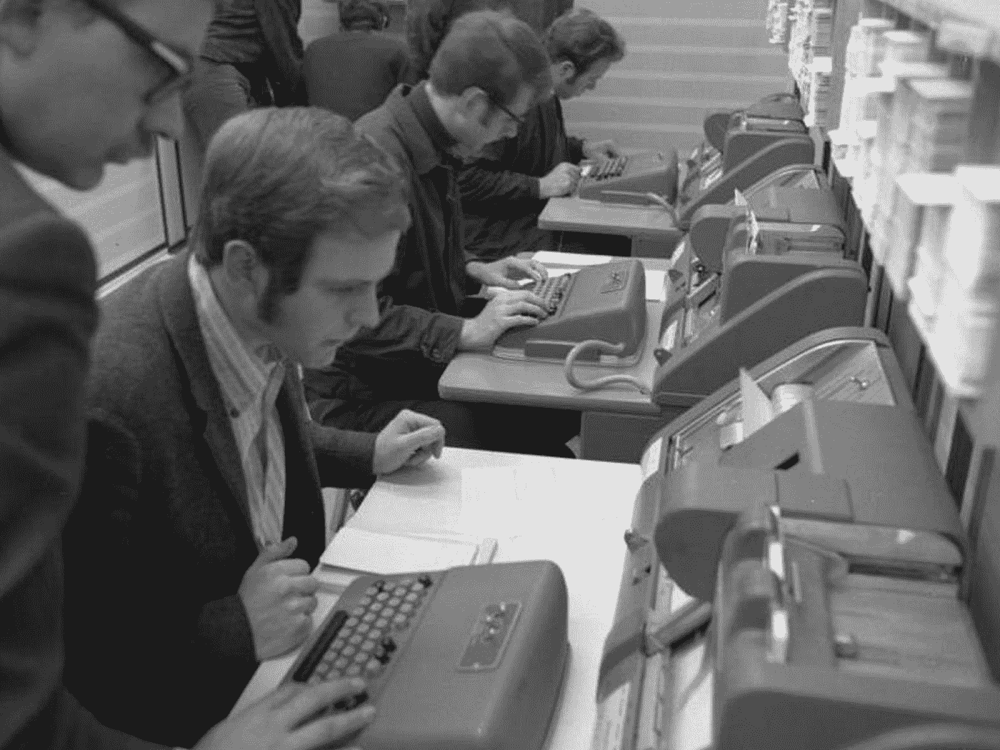

# 与机器对话

> 原文：<https://towardsdatascience.com/talking-to-machines-3da09845c251?source=collection_archive---------27----------------------->

## **语言、人工智能和下一个用户界面**

德克·克内梅尔和乔纳森·福利特

在我们和我们的计算设备之间是用户界面，或 UI。我们与机器交流的方式，以及机器与我们交流的方式，对于我们整体用户体验的质量至关重要。对于人工智能来说，这一点再正确不过了。人工智能软件的增强能力不仅依赖于我们向机器提供的正确数据，还依赖于机器解释这些数据的复杂程度。

除非我们与机器交流，否则机器不会工作——无论是与一个人操纵机器的显式控制，还是隐含在机器的形式中，以特定的方式实际上只是“做”。用我们最早的机器，这一切都很简单。想象一下算盘，它要求操作者仅具备简单的数学知识，并能够使用手指或类似装置来回移动珠子。与我们的机器和技术最早的接口是具体的、物理的和直接的。

Figure 01: The earliest interfaces with our machines and technology were concrete, physical, and direct.
[Photo: [Multicolored Abacus](https://unsplash.com/photos/cHhbULJbPwM) by Crissy Jarvis on Unsplash]

随着机器变得越来越复杂，这种情况发生了变化。印刷机需要用到打字机，打字机需要用到电脑键盘。穿孔卡在今天已经过时了，但是仅仅在几十年前，这项技术——可能起源于 1725 年巴西勒·布琼的[和对织布机的控制](https://en.wikipedia.org/wiki/Basile_Bouchon)——才发展到加速早期的机械计算，与键盘一起成为计算机用户界面的两个最重要的设备，更不用说穿孔卡在数据存储和检索中的更大作用了。直到 20 世纪 80 年代，随着苹果电脑和图形用户界面的兴起，鼠标才成为核心用户界面设备，而就在 10 多年前，移动计算的手势约定帮助将计算从工作场所或有时的活动变成了我们今天在美国体验的无处不在的东西。

重要的是要记住这一切都是最近发生的。在历史计算生态系统中，穿孔卡片比鼠标有更丰富的历史，即使是鼠标提供的可用性帮助计算成为主流。我们所处的时刻转瞬即逝，我们可能会在几年而不是几十年后远离鼠标，因为我们知道它正在转变为一个外围角色。昨天看似永恒的东西明天就会过时，而我们甚至没有意识到这一点。

Figure 02: Punched cards evolved to accelerate early mechanical computing
[Photo: [Technische Hochschule Aachen](https://commons.wikimedia.org/w/index.php?curid=5454732) (Technical University of Aachen) by Jens Gathmann, German Federal Archives (1970) on Wikimedia Commons]

今天，当我们与机器交流时，我们仍然在很大程度上使用我们的手指和手——拉、推、翻转、打字、点击和滑动。虽然这种模式可行，但它不是最优雅或最强大的交流方式。它要求我们与之交流的机器——在这种情况下，机器是你正在使用的软件和你正在使用它的硬件设备的综合体——特别好地定向，以得到你确切想要的东西。像一首你很久没有听过的最喜欢的歌，可能需要腕管综合征诱导的大量点击才能从听这首歌的冲动中得到实际播放。这并没有说明它所花费的时间，根据您的计算和网络环境，可能不只是几秒钟，而是几分钟。

如果处理得当，为支持语音的人工智能抛弃图形用户界面会好得多。这也是 Alexa 和 Siri 这样的技术如此令人兴奋的原因之一。在最好的情况下，用户界面被简化为一个语音命令。只需要一秒或几秒钟，在这段时间里，你的大脑和身体不再需要考虑这个请求。对于用户来说，过去的图形用户界面和繁琐的架构和层次管理，现在只是一种愿望的口头表达。尽管无缝的人机连接是最理想的，但目前，这样的交互还远非易事。或者说，说起来容易，但得到正确的结果似乎很难。与机器交谈会给我们带来很大的挫败感:Alexa，这样做。Siri 会这么做。不，不要做这个，请做那个。

## **自然语言处理**

因此，自然语言处理(NLP)已经成为当今最重要、发展最快、人工智能必不可少的技术之一。简而言之，这就是计算机处理和分析自然语言数据的方式——尤其是我们的语音。NLP 是人工智能如何与我们交流并为我们工作的一项支柱技术。在不久的将来，自动化将在许多方面受到 NLP 的推动。鉴于每个语音用户界面和人工智能的能力和潜力，机器解释并使用自然语言——特别是口语——的能力必须是有效的。

为了更好地理解 NLP，我们采访了曾在 SYSTRAN 和 Adobe 等公司工作过的研究员兼计算机科学家 Shivali Goel。“NLP 是人工智能的核心技术之一。你可以把它看作语言学和计算机科学的完美结合，”戈尔说。“这基本上是让机器有能力理解一个人说话或打字时的意思。NLP 是关于克服语言中的歧义，理解意图和上下文。比如我说‘小孩做营养零食’，你懂什么？孩子们在煮有营养的东西吗？或者它们本身就是一种有营养的小吃。”

> NLP 算法检查并利用这些数据中的模式。他们理解单词关系和文字游戏，并模拟类似人类的对话。所以，当你要求谷歌播放舞曲时，那就是 NLP。当你打开一个外国网页，它被翻译成你的语言，这就是自然语言处理。当你的 Wi-Fi 无法工作，你试图向虚拟助理解释你的问题，或者只是大喊“代理！代理人！在电话里也是 NLP。相信我，我们正在努力改进。"

语音是我们最自然的输入设备。这是我们与他人交流的主要方式，几千年来一直如此。NLP 是一种将我们的声音翻译成最适合机器使用的技术。在其理论的顶点，NLP 会解释我们的单词、节奏、语调和其他因素，将其转化为对我们意图的细微理解。正如 Goel 指出的那样，如今，it 部门甚至常常无法找到一个简单的电话决策树。尽管如此，在其更好的体现中，这项技术似乎像魔术一样理解和响应。一个例子是谷歌的双工服务，它使用人类的声音为主人预约。这不仅仅是一种便利，它还是另一种技术，令人毛骨悚然地模糊了真假之间的区别。

NLP 的另一个很好的例子是机器翻译。“机器翻译系统可以帮助学生学习外语，”Goel 说。“翻译人员还不足以与人类相匹配或取代教师，但这些系统肯定可以补充教学。此外，许多在线资源和电子书可以被翻译成不同的语言，以便更多的人可以从学习中受益……”

语音作为界面输入确实有其局限性。特别是，有许多重要的用例可能会变得困难，因为它在非私人空间中使用的侵入性质。“我必须说，我不认为语音用户界面在公共领域会有什么前途。《合格的自己》一书的作者、康奈尔大学传播学系副教授李·汉弗莱斯说:“我认为我们看到的是在公共场所的视觉和文本交流的增加。21 世纪初，Humphreys 在美国开展了第一项关于公共场所使用手机的研究。“我做了一项观察研究，我出去观察人们……使用他们的手机。这项研究真正吸引人的一点是，人们在打电话时试图保持私人交流的方式。所以，他们会低下头。他们可能会用手捂住嘴。他们用各种方式来保持谈话的私密性。但(同时)他们的声音可能会侵犯公共场所其他人的隐私，”汉弗莱斯说。《英国医学杂志》甚至将 21 世纪初的打手机等同于二手烟，是空气中的一种社会污染物。…我真的认为在某些情况下，声音的作用是非常困难的。作为一种公共空间，你可能会在汽车里看到它。然而，你在这个小泡泡里，你想跟着收音机或 Spotify 或其他什么东西唱歌，那就去做吧。或者，你可以口述一些东西。所以，我认为这是一个地方，除了家庭空间之外，更多的是在公共空间，在那里你可能会看到声音形式的交流。”

Figure 03: There are many important use cases for voice UI that can become difficult because of the intruding nature of its use in non-private spaces.
[Photo: [Railway Station From Above](https://unsplash.com/photos/ABGaVhJxwDQ) — Bern, Switzerland by Timon Studler on Unsplash]

更普遍的语音用户界面是有前途的，但它需要其他技术的加入。围绕语音 UI 已经有了一些有意义的工作，它可以记录用户的低语或嘴部动作，而不是与他人交谈时所需的大声说话。要充分利用语音作为主要的界面范例，需要这些或其他一些进步。

WomenOfAI.org[执行董事兼创始人艾丽卡·李(Erica Lee)说:“我现在对语音的看法是，许多人把它当作一个系统来执行直接命令——设置闹钟，或者通过‘开始’、‘停止’、‘下一个’来播放音乐——对电脑来说，这些都是非常简单的命令。”。“你不用按按钮，只是用你的声音。所以，现在我的整个房子都是自动化的，用亚马逊 Alexa 和谷歌 Home Assistant 来帮助改变音乐、设置定时器、阅读日历……做很多低级功能。节省我的时间真的很有帮助。”](http://womenofai.org/)

“语音界面现在实际上开始与视觉界面融合。现在有一种新的趋势，我们把带有屏幕的电子产品送回家，这些屏幕连接到许多这样的音响系统上。亚马逊最近发布了 [Echo Show](https://www.amazon.com/All-new-Echo-Show-2nd-Gen/dp/B077SXWSRP) ，它有一个带前置摄像头的屏幕。它[不仅]说，“播放下一首歌”，我们实际上可以看到专辑封面和它的名字，有时甚至可以看到它后面的图形或动画。它变得越来越具有互动性和沉浸感，”Lee 说。

最有趣的人工智能应用将是那些与我们日常生活交织在一起的应用。为了最好地做到这一点，机器需要理解我们想要什么，或者不想要什么。这又回到了用户界面，以及我们如何向机器输入命令。在这方面，声音和视觉的结合是重要的一步。大约 17 年前，我们从未接近过电影《少数派报告》中的沉浸式计算环境。当时，这被吹捧为未来，一个基于未来学家和技术专家的输入的虚构描绘，他们知道事情将如何演变，很快。我们还没有到那一步。事实上，我们的现实甚至感觉不到接近。然而，将改进的语音界面与我们的显示环境相结合是这条道路上的一步。

Lee 认为 UI 将演变成更加被动和自动化的输入:“我个人的观点——我希望行业能这样发展——是这个系统不那么单向，我告诉机器做一些事情，而更多的是一个反馈循环，我偶尔会请求我的 Siri 改变日历，或者检查我的邮件。但实际上，该系统有许多不同的传感器和许多不同的输入来读取我的行为。”这无疑是一种最佳的机器模型:被动地利用网络上所有可用的数据，然后以对每个独特的人来说最佳的方式自动化环境和体验。

[*Creative Next*](http://www.creativenext.org/?source=post_page---------------------------) *是一个播客，探索人工智能驱动的自动化对创意工作者，如作家、研究人员、艺术家、设计师、工程师和企业家的生活的影响。本文附* [*第二季第一集— UI 与人工智能*](https://creativenext.org/episodes/ui-artificial-intelligence/) *、* [*第二季第二集—社交媒体的起源*](https://creativenext.org/episodes/origins-of-social-media/) *、* [*第二季第三集—自然语言处理*](https://creativenext.org/episodes/nlp-natural-language-processing/) *。*