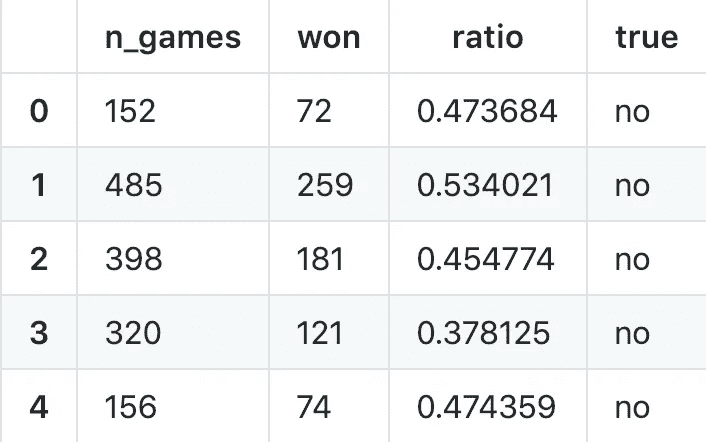
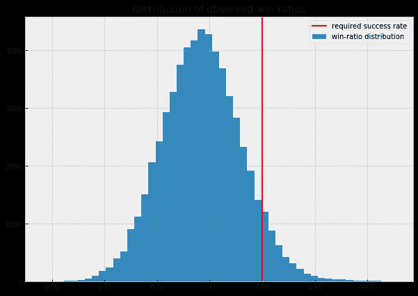
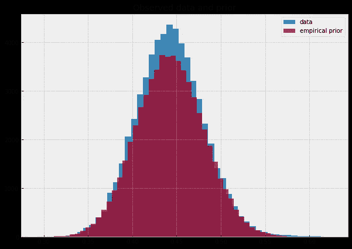
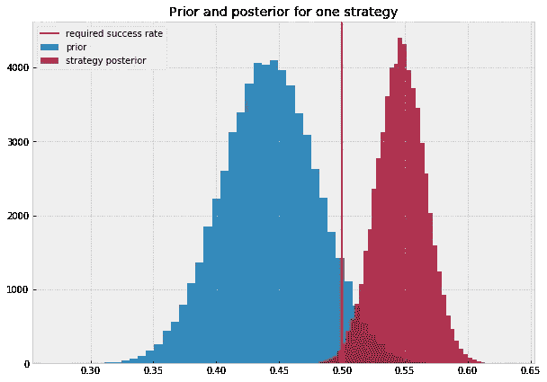
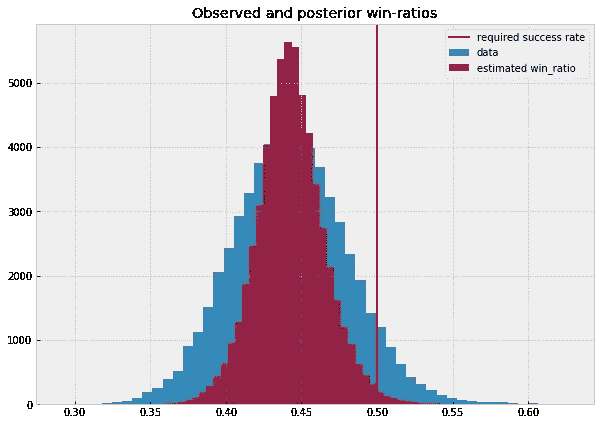
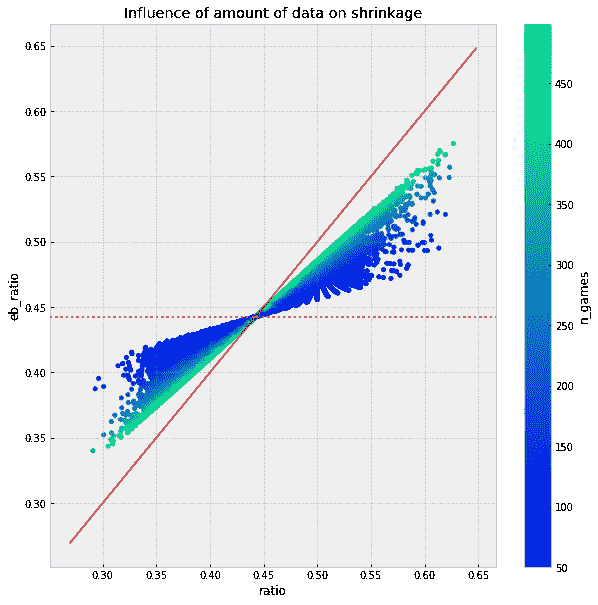
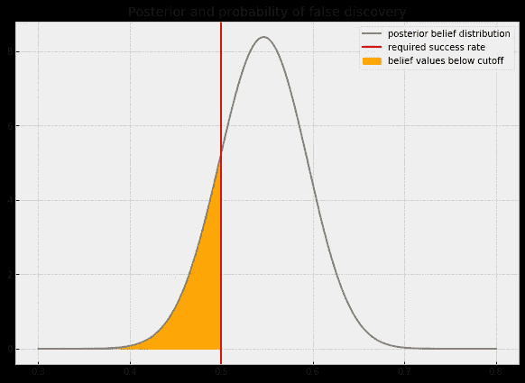

# 用经验贝叶斯驯服错误发现

> 原文：<https://towardsdatascience.com/taming-false-discoveries-with-empirical-bayes-2ce81aa8f407?source=collection_archive---------7----------------------->

## 如何在噪音海洋中安全捕鱼


Watch out for false discoveries when fishing in a sea of noise

今天的数据科学家有大量的数据可供他们使用。但他们也面临一个新问题:有这么多功能可供选择，我们如何防止错误的发现？

p 值有助于错误的发现。假设没有影响，运行 100 个独立的 p 值测试平均会产生 5 个阳性结果。被误导 5 次是可控的，但是如果我们运行数百万个假设测试，情况很快变得无法忍受。

我们需要一种方法来控制我们发现的假阳性的数量。它应该与我们运行的假设数量成比例，并允许我们对我们的整体发现有信心。

# 场景

你在一家大数据科学公司工作，该公司的业务是预测[赛马](https://www.bloomberg.com/news/features/2018-05-03/the-gambler-who-cracked-the-horse-racing-code)的结果。您和您的同事收集马、体育场、骑师等数据，然后构建模型。这些模型反过来会影响赌博策略。随着时间的推移，你和你的同事已经开发了 60，000 个策略。你的任务是找到真正胜率在 50%以上的策略。虽然这当然是一个简化的问题，但有许多应用非常接近，例如神经科学中的[fMRI](https://en.wikipedia.org/wiki/Functional_magnetic_resonance_imaging)、遗传学中的[微阵列](https://en.wikipedia.org/wiki/DNA_microarray)和金融中的[阿尔法测量](https://www.jstor.org/stable/25656289?seq=1#page_scan_tab_contents)。

下面你看到的数据:`n_games`描述了一个策略下的赌注数量。`won`描述策略获胜的频率,`ratio`是获胜游戏的份额。因为这是合成数据，我们知道一个策略的真实比率是否在 50%以上。在现实生活中，您可能无法访问`true`值，但它在以后会很有帮助。



下图显示了所有策略的观察胜率分布。如你所见，有不少策略的胜率超过 0.5。



问题是，大多数观察到的胜率很高的策略只是偶然显示出来。我们知道大多数策略的胜率不会超过 0.5。这在我们的数据中显而易见。我们需要找到一种方法将这种间接证据纳入我们的结果。18 世纪的某个 Bayes 牧师思考过这个问题，这是件好事。

# 信仰问题

本文中介绍的概念大致属于[贝叶斯统计](https://en.wikipedia.org/wiki/Bayesian_statistics)领域。关键的概念是，我们不仅对数据的分布感兴趣，而且对真实的、未观察到的值的分布感兴趣。每个策略的真实胜率是无法观察到的。但是我们可以估计一下真实的胜率是多少。因为我们对自己的估计没有 100%的把握，所以我们认为多个值可能是真的，但是不要给所有的值分配相同的概率。

在日常生活中，我们凭直觉做到这一点。如果我问你明天撒哈拉的天气，你会说:“可能是晴天，那里几乎不下雨”。

我们在看到任何数据之前的信念被称为*先验*信念(在看到数据之前)。你对撒哈拉天气的信念是在没有任何撒哈拉天气信息的情况下形成的。

一旦我们观察到数据，我们就可以更新我们的信念。如果我告诉你，撒哈拉上空出现了巨大的雨云，气象学家对十年一遇的事件感到兴奋，你对天气的回答会改变。你可能会说“也许会下雨，也许不会。50/50".这个新的和更新的信念被称为*后验*信念(后验，又名 after，指看到的数据。花式古英语)。

数学上，[贝叶斯定理](https://en.wikipedia.org/wiki/Bayes%27_theorem)制定了一个更新规则，所以我们不仅可以直观地更新我们的信念，还可以定量地更新。为此，我们需要数据，更重要的是，需要先验知识。

# 经验贝叶斯

回到我们的投注策略，我们之前对投注策略胜率的信念应该是什么？在撒哈拉的例子中，基于我们对沙漠的了解，我们有很强的先验知识。在下注的例子中，我们只有数据，没有先验信息。

[经验贝叶斯方法](https://en.wikipedia.org/wiki/Empirical_Bayes_method)背后的关键思想是使用我们所有的数据形成我们的先验，然后使用来自特定策略的数据形成关于不同策略的真实胜率的后验信念。

在我们的例子中，我们假设我们对策略胜率的信念可以用 [Beta 分布](https://en.wikipedia.org/wiki/Beta_distribution)来表达。这意味着我们认为不存在一个真正的胜率，而是胜率的分布。该分布可以用两个参数α和β来描述。我们可以使用 [scipy 的 beta 函数](https://docs.scipy.org/doc/scipy/reference/generated/scipy.stats.beta.html)来推断产生我们的数据的最可能的值:

```
alpha_prior, beta_prior, _, _ = ss.beta.fit(df['ratio'], floc=0, fscale=1)
```

有了α和β先验知识，我们可以从先验知识中取样，看它是否与数据相匹配。下面你可以看到蓝色的数据和橙色的推断先验分布。



我们还可以在此先验下计算平均胜率:

```
prior = alpha_prior / (alpha_prior + beta_prior)
print(f'Expected win ratio under prior: {prior*100:.2f}%')Expected win ratio under prior: 44.27%
```

# 我们能这样评估先验吗？

让我们回到这里，因为我们刚刚做的有一些编造的统计的天赋。因为我们缺乏根植于知识的先验，我们就…编造了一个？那不可能是对的。但是这有一种直觉和数学逻辑。你怎么知道撒哈拉沙漠很少下雨？你可能读过某个地理学家写的东西，他依赖于几个世纪以来人们的观察，甚至可能是几千年前的人工制品。基于所有的数据，地理学家形成了撒哈拉沙漠很少下雨的观点，你相信了。相信收集了大量数据的地理学家和我们自己收集数据的过程有什么不同？

有一个潜在的区别，那就是地理学家收集的数据与我们的研究对象相关，但最终是独立的。这位地理学家并没有收集明天 T4 是否会下雨的数据，只是收集了撒哈拉的总体天气数据。同样，如果我们想使用其他策略的数据来为任何特定策略的决策提供信息，胜率必须相互独立。这也是[数学论证](https://projecteuclid.org/euclid.bsmsp/1200501653)做出的一个关键假设(技术术语是数据必须来自*平行情况*)。它也必须足够大)。

# 更新我们的信念

既然我们努力工作来形成先验，是时候使用关于个体策略的数据来形成后验了。对于测试版，更新规则相对简单。alpha 参数的后验值等于策略赢得的游戏数加上 alpha 的先验值。

```
df['alpha_posterior'] = df.won + alpha_prior
```

beta 参数等于策略输掉的游戏数加上 beta 先验。

```
df['beta_posterior'] = (df.n_games - df.won) + beta_prior
```

下图显示了从数据推断出的先验分布(蓝色)和一个特定策略的后验分布(红色)。正如你所看到的，这个策略的大部分后验值都高于要求的胜率。换句话说，大多数我们认为可能的真实胜率都在这条线上。



# 收缩

因为我们在估计每个策略的真实胜率时考虑了总体平均胜率，所以我们将估计值“缩小”到大平均值。经验贝叶斯是一种所谓的“收缩”方法。正如我们将在后面看到的，这正是帮助我们减少错误发现的原因:我们使我们的估计偏向于一无所获。

为了可视化收缩，让我们计算每种策略的平均后验胜率:

```
df['eb_ratio'] = df.alpha_posterior / (df.alpha_posterior + df.beta_posterior)
```

下图显示了数据中的胜率分布(蓝色)和所有策略的估计真实胜率分布(红色)。如您所见，估计值都更接近平均值，并且估计胜率超过要求(红线)的策略明显更少。



当然，并不是所有的估计都缩小了相同的数量。我们希望拥有更多数据的策略(比如，我们在更多游戏中尝试了哪些策略)比只有很少数据的策略减少的估计要少。这正是正在发生的事情。贝叶斯规则考虑了我们拥有的可能与先验不同的后验证据的数量。

下面的图表显示了收缩率和我们拥有的数据量之间的关系。红色实线是观察到的胜率是估计胜率的线。如果一个点在红色实线附近，就只有很小的收缩。红色虚线是先验。绿点是我们有很多数据的策略，蓝点是我们只有很少数据的策略。

如您所见，具有少量数据(蓝色)的策略更接近先验值，而离观察值更远。我们拥有大量数据(绿色)的策略向先验收缩得更少。



# 错误发现率

正如我们前面所看到的，我们不仅仅估计每种策略的真实胜率。我们估计了我们认为可能的胜率的整个分布。这是很多额外的工作，但它大大简化了我们来这里的问题:“这种策略是错误发现的可能性有多大，真正的胜率低于 0.5？”

为了回答这个问题，我们可以问自己:“对于我们的策略，我们的后验信念分布的多大份额低于 0.5？”

下图显示了策略的后验置信分布。红线是 0.5 的关键关卡。橙色区域显示低于障碍的信念分布部分。在我们的信念下，真实胜率小于 0.5 的概率就是橙色区域。



我们可以用 beta 分布的[累积密度函数](https://en.wikipedia.org/wiki/Cumulative_distribution_function)计算面积，从而计算出这种策略是错误发现的概率。

```
print(f'The probability that this strategy is a false discovery is {ss.beta.cdf(0.5,60,50)*100:.3} %')The probability that this strategy is a false discovery is 16.9 %
```

这种方法可以应用于所有策略，以找出它们是错误发现的可能性:

```
df['FDR'] = ss.beta.cdf(0.5,df.alpha_posterior,df.beta_posterior)
```

# 管理总体错误发现率

现在我们该如何选择下注的策略呢？我们可以简单地选择那些错误发现概率低的策略。但是我们可以做得更好。由于期望的[线性，多个策略的期望错误发现率是被错误发现的个体概率之和。例如，如果我们有 10 个策略，错误发现的概率为 1%，那么这 10 个策略中错误发现的预期份额为 10%。](https://brilliant.org/wiki/linearity-of-expectation/)

因此，我们可以选择哪些错误发现是可以接受的。比方说，在我们的博彩业务中，如果我们部署的博彩策略中有 5%的真实胜率不高于 0.5，我们就没事。然后，我们可以根据策略被错误发现的个别概率对它们进行分类，并选择那些累计错误发现率为 5%的策略。

```
accepted = df[df.FDR.cumsum() < 0.05]
```

由于这是合成数据，我们可以检查它的效果如何，事实上，我们发现大约 5%的策略实际上没有足够的胜率。如您所见，我们的估计非常接近！

```
print(f"The actual false discovery rate is {(len(accepted[accepted.true == 'no']) / len(accepted)*100):.2f}%")The actual false discovery rate is 5.26%
```

# 收场白

在本文中，您已经看到了经验贝叶斯框架的基本构件，以及如何使用它来管理错误发现率。

经验贝叶斯属于一个更广泛的[收缩](https://en.wikipedia.org/wiki/Shrinkage_(statistics))方法家族，它们都是正则化的方式。规则化是[常见的](/regularization-in-machine-learning-76441ddcf99a) [主题](/regularization-an-important-concept-in-machine-learning-5891628907ea)在[机器](https://www.quora.com/What-is-regularization-in-machine-learning) [学习](https://www.analyticsvidhya.com/blog/2018/04/fundamentals-deep-learning-regularization-techniques/)所以你可能之前在 ML 的上下文中遇到过。每当你冒着做出错误发现的风险时，无论是深度学习模型中的一组过度拟合的参数还是一个不起眼的胜率，让你的发现偏向于一无所获都是有用的。通常，这与经验贝叶斯密切相关的方法一起工作，例如在[岭回归](http://statweb.stanford.edu/~ckirby/brad/other/CASI_Chap7_Nov2014.pdf)中。

随着数据科学进入越来越多的高风险应用，错误的发现或过度拟合的模型可能会产生灾难性的后果，正则化变得越来越重要。

# 进一步阅读

Jupyter 笔记本的所有代码可以在[这里](https://github.com/JannesKlaas/sometimes_deep_sometimes_learning/blob/master/Empirical%20Bayes.ipynb)找到。这篇文章是我为 Bradley Efron 和 Trevor Hastie 的“计算机时代的统计推断”所写的学习笔记的一部分。埃夫龙还写了一本纯粹关于经验贝叶斯的书[《大规模推理》](https://statweb.stanford.edu/~ckirby/brad/LSI/monograph_CUP.pdf)。大卫·罗宾逊写了一个更加[代码驱动的介绍](http://varianceexplained.org/r/empirical-bayes-book/)。我的作品《金融领域的 ML》,在金融背景下讨论了文中提出的一些问题。