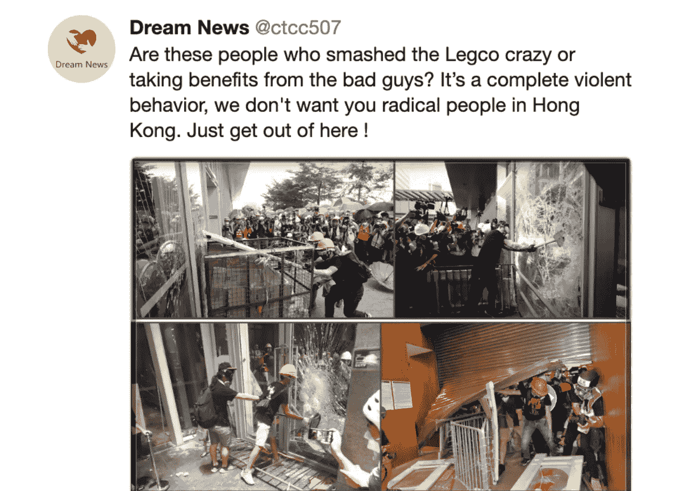
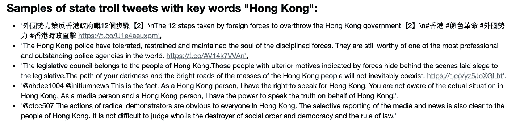
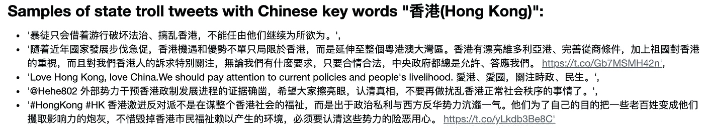
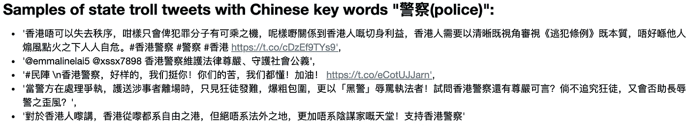
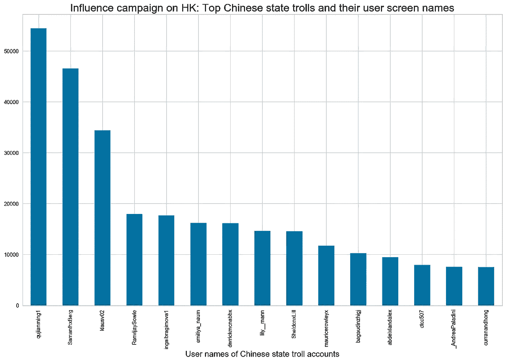
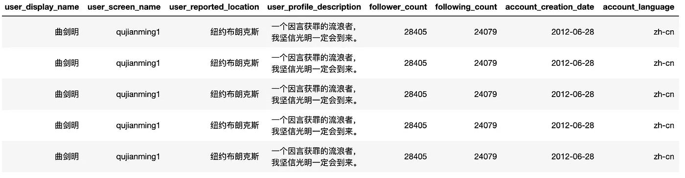
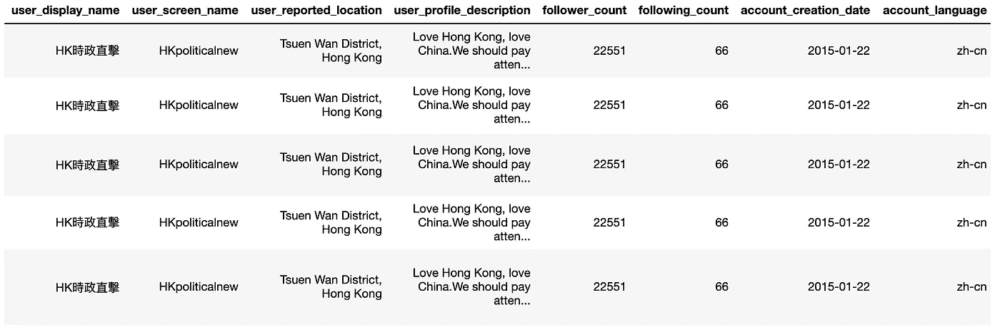
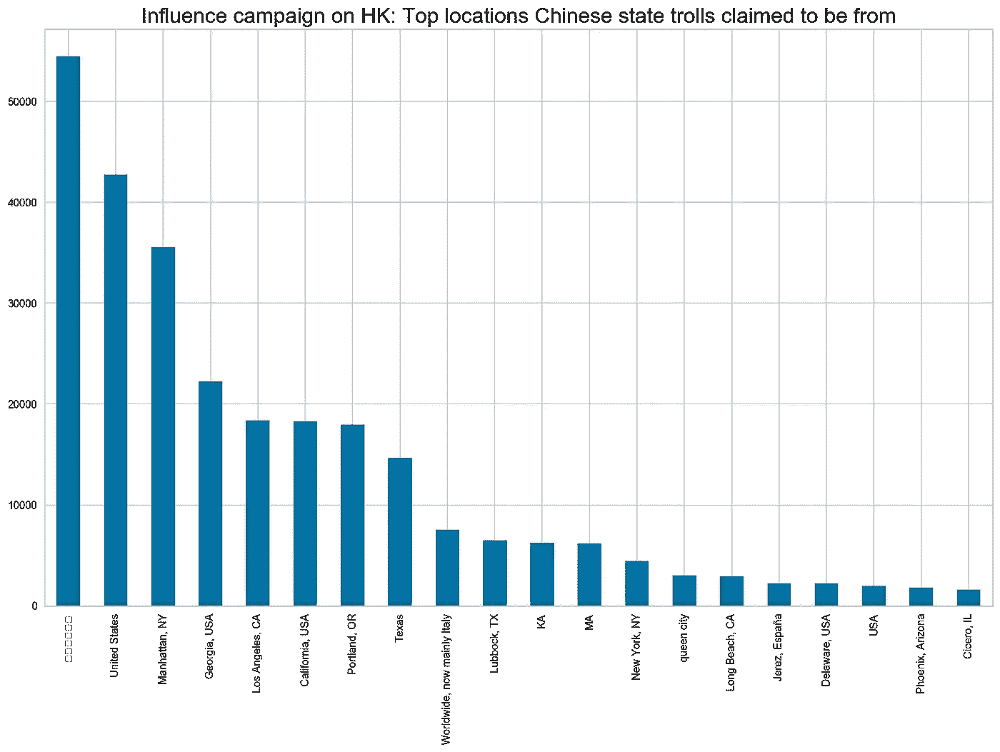
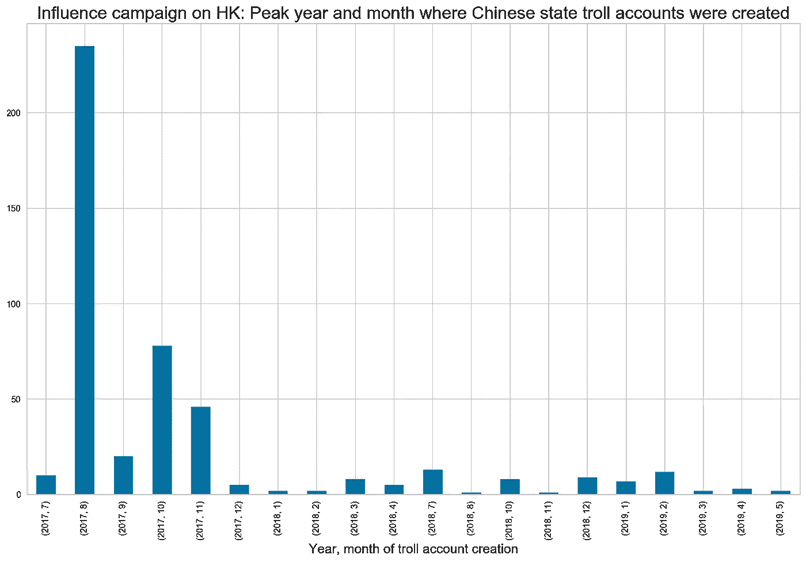
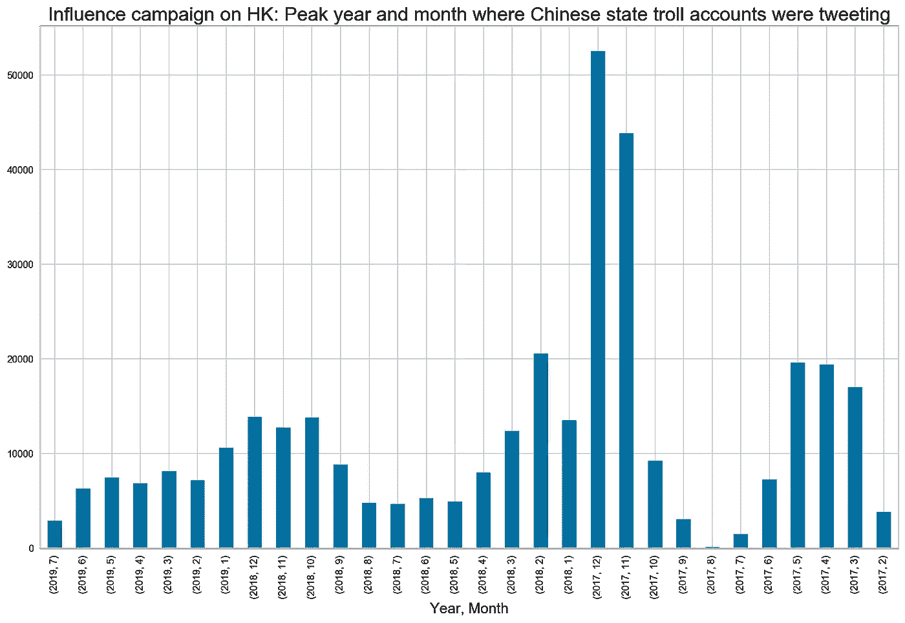

# 目标香港:快速了解中国在推特上的造谣活动

> 原文：<https://towardsdatascience.com/target-hk-a-quick-dive-into-chinas-disinformation-campaign-on-twitter-2b64ab9feb1a?source=collection_archive---------23----------------------->

这是对 8 月 19 日推特发布的中国国家巨魔推特的快速浏览。未来几天和几周还会有更多。



An example of Chinese state troll tweet exposed by Twitter on Aug 19.

8 月 19 日， [Twitter 发布了一组新的官方微博](https://blog.twitter.com/en_us/topics/company/2019/information_operations_directed_at_Hong_Kong.html)，该公司称这些微博来自“一个重要的政府支持的信息行动，关注香港的局势，特别是抗议运动和他们对政治变革的呼吁。”

这些推文值得更深入的研究，显然可以利用这些材料做更多的事情。我之前参与了一个关于揭露推特上虚假信息的[项目。](https://github.com/chuachinhon/twitter_state_trolls_cch)

由于时间限制，这里有一个快速和肮脏的第一次探索性的数据。未来几天和几周还会有更多。

# **1。数据、笔记本和假设**

我的粗略笔记本是[这里](https://github.com/chuachinhon/twitter_hk_trolls_cch)，回购将会更新，因为我找到更多的时间来做这个项目。

CSV 文件太大，无法上传到 Github 上。直接从推特[下载。](https://blog.twitter.com/en_us/topics/company/2019/information_operations_directed_at_Hong_Kong.html)

为了在这个阶段控制项目的复杂性，我过滤掉了转发，这是一个值得单独研究的有趣领域。我也只关注英文和中文微博。信不信由你，这个数据集中的推文有 59 种语言。

# **2。总体来看中国国家巨魔推文**

Twitter 表示，其发布的推文来自“936 个来自中华人民共和国(PRC)的账户。总体而言，这些报道是蓄意和有针对性地试图在香港制造政治不和，包括破坏当地抗议运动的合法性和政治立场”。

已经暂停的账户“代表了这场运动中最活跃的部分；一个约有 20 万个账户的更大的垃圾邮件网络”，Twitter 在其新闻稿中补充道。

以下是我快速浏览后发现的关键数据:

```
Unique userids: 890
Unique user display names: 883
Unique user screen names: 890
Unique user reported locations: 178
Unique user creation dates: 427
Unique account languages: 9
Unique tweet languages: 59
Unique tweet text: 3236991
Unique tweet time: 1412732
Unique hashtags: 110957
```

在我过滤掉即时战略和语言之后，巨魔推文的数量从最初的 360 万减少到了 581，070 条。太咄咄逼人？也许吧，但是还有很多工作要做。

# 3.典型的中国官方推特

首先，让我们快速浏览一下这些针对香港的中文和英文官方推特:



The phrasing of some tweets would be immediately familiar to those who follow official Chinese rhetoric and its state-driven Internet commentary. Phrases like 外國勢力(foreign forces) are not commonly used elsewhere, if at all.

# **4。主要中国巨魔账户**

以下是我筛选过的数据集中排名前 10 位的巨魔帐户:

```
曲剑明               54455
阿丽木琴              46600
Klausv            34451
春天里               17989
gwalcki4          17707
emiliya naum      16230
derrickmc         16163
Lily Mann         14673
炫彩                14604
mauricerowleyx    11749
```



It is far more interesting to look at specific accounts, in my view. Let’s start with the one at the top of the list: qujianming, or 曲剑明.



在我的过滤数据集中，这个 troll 帐户发出了 19614 条独特的推文。该账户创建于 2012 年 6 月 28 日，拥有 28405 名关注者和 24079 名用户——这是一个可疑的高数字，也是一个巨魔账户的主要迹象。

该账户在 2019 年发了 77 条推文。一些样品:

*   2019–07–05: ‘香港作为一个法治社会的典范，这种暴徒行径一定要严惩，换民众一个公道’
*   2019–07–04: ‘反对势力想尽办法想搞乱香港，想等混乱的时候谋取利益，他们根本就无暇顾及市民的利益，可怜的是还…’
*   019–07–02: ‘#HongKongProtest #香港 #七一 #游行 #民阵 7 月 1 日反对派宣扬暴力冲击…’

Twitter also highlighted two accounts in its press release, one of which is HKpoliticalnew, or HK 時政直擊:



在我过滤后的数据集中，这个 troll 账户只发出了 1059 条独特的推文。该账户创建于 2015 年 1 月 22 日，拥有 22，551 名关注者和 66 名用户。增选新闻机构身份的举动完全是俄罗斯互联网研究机构的剧本。

该账户在 2019 年发送了 462 条“原创推文”，其中许多是针对香港抗议的。一些样品:

*   2019–06–21: ‘千名黑衣人圍堵立會，當中不乏重裝上陣的人，警方一定要嚴防，大家小心！👍💪\n\n#香港 #大專學界 #升級行動 #包圍立會 #重裝上陣 #警察 \n 原圖：星島日報 [https://t.co/DIoiFWWkBo'](https://t.co/DIoiFWWkBo')
*   2019–06–20: ‘#香港 反對派一再散布失實資訊抹黑修例、誤導市民，更不斷造謠煽動情緒，企圖以網民壓力杯葛支持修例甚至只是沉默的商戶。\n 政府決定停止修例工作後，反對派又繼續播謠，稱換領智能身份證會「失去選民資格」，企圖撕裂市民對社會不同界別、團體、組織的信任。 [https://t.co/9B3xCI9MWv'](https://t.co/9B3xCI9MWv')
*   2019–06–20: ‘反修例暴動後，#香港 仿佛又回到占中時期嘅黑暗日子，最令人痛心嘅系，執法者又再次成為黃營發泄嘅對象，黑警，「警你老 x」等言詞唔絕於意，立志以生命守護人民，卻落得過街老鼠嘅下場…\n\n 立法會議員何君堯律師呼吁各位市民站出嚟山席撐警集會，為 #警察 打氣，讓佢哋知，黃營所言非香港嘅主流聲音！ [https://t.co/yDpKt0mSAM'](https://t.co/yDpKt0mSAM')

# 5.自称的国家巨魔帐户的位置

像俄罗斯的国家巨魔一样，中国账户主要声称在美国:



Twitter 在中国被屏蔽。但该公司表示，“这些账户中有许多是使用 VPN 访问 Twitter 的。然而，一些账户从源自 mainland China 的特定未被封锁的 IP 地址访问 Twitter”。

# **6。巨魔账户创建于 2017 年 8 月达到峰值**

正如所料，巨魔账户的创建时间要早得多——在 2017 年 8 月达到顶峰:



类似的推文数量在 2017 年达到峰值:



然而，对这些数据进行时间分析是很棘手的。首先，不清楚 Twitter 何时开始对巨魔账户采取行动。第二，不清楚中国国家机构是否有能力改变账号创建/发布日期，以掩盖其活动。听起来有些牵强，但时代就是这样。

# **END-NOTE，目前:**

当然，分析将受益于 NLP 工具的广泛使用。但对推文的初步观察表明，需要更多的过滤来剔除噪音。中文推文必须与英文推文分开处理。我将在未来的笔记本中继续这一点。

为了节省时间，这就足够了。如果您发现任何错误，或者有任何意见，请 ping 我@

推特: [@chinhon](https://twitter.com/chinhon)

领英:[www.linkedin.com/in/chuachinhon](https://www.linkedin.com/in/chuachinhon/)

我早期的项目是关于推特上的虚假信息运动