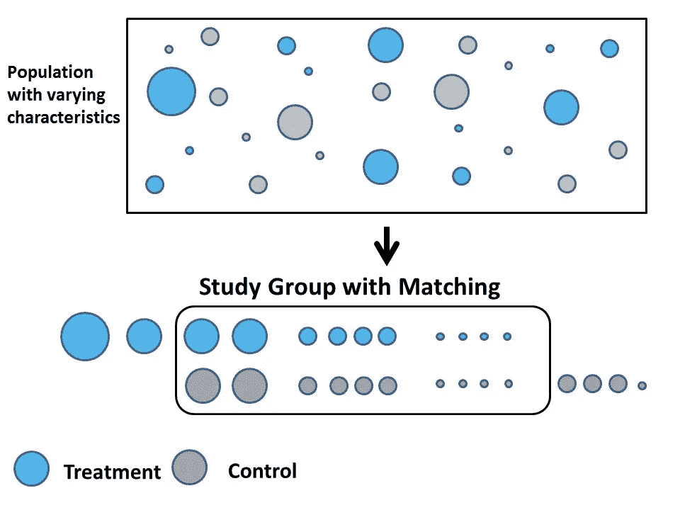

# 因果推理的目标最大似然(TMLE)

> 原文：<https://towardsdatascience.com/targeted-maximum-likelihood-tmle-for-causal-inference-1be88542a749?source=collection_archive---------9----------------------->

## 一种双稳健的自动因果推理方法

**什么是因果推断？**

假设你有两种治疗癌症的药物，A 和 B。你在不同的人身上测试药物，现在你想衡量哪个更有效，你打算怎么测试？

你可能会先对患者进行随机化，给一半的患者服用药物 A，另一半服用药物 B，在一段时间内测试关键指标，以比较哪种药物降低了更多的关键指标。够了吗？

不。人们的一个常见误解是，只要随机化完成，我们就可以推断不同的治疗**会导致**不同的结果。这是不对的。随机化不能保证**等价**。这就是**倾向分数匹配**出现的地方。

**那么什么是倾向评分匹配呢？**

倾向评分匹配背后的想法是，通过给研究中的每个个体一个倾向评分，我们可以比较不同治疗组中的个体，并试图使个体尽可能等同，以便我们可以控制混杂因素，不同的结果将仅来自治疗。

现在，您可以看到，在研究中将药物用于个体之前，倾向评分匹配需要适当的实验设置。我们最终可能会放弃很多人，因为他们没有匹配的对手。如果我实验失败或者配对的数量太少怎么办？我们还能用我们收集的数据吗？

让我们仍然考虑之前的案例，我们有两组接受两种不同药物 A 和 b。我们的目的是测量**平均治疗效果**(ATE = E[Y(A = 1)]-E[Y(A = 0)]，以便比较治疗效果。我们称患者的数据点为 X——它可能包含患者的年龄、性别、职业、收入、锻炼、吸烟与否等特征；测试指标 Y——我们关心的用于测试治疗结果的指标；处理 A 是用于两种不同处理的二元变量 0 和 1。

我们如何估计无偏的 Y(A=1)和 Y(A=0)来精确地测量具有最小混杂变量影响的治疗效果？

这里我将介绍一种最先进的方法**目标最大似然估计(TMLE)** 。目标学习是由 [van der Laan & Rubin 在 2006 年](https://biostats.bepress.com/ucbbiostat/paper213/) [1]提出的，作为一种自动化(而不是自己动手)的因果推理方法。TMLE 用于分析来自非对照实验的删失观察数据，即使在存在混杂因素的情况下也能进行效果估计。

以下是 TMLE 工作方式的分步指南:

***第一步:生成 E(Y|A，X)的初始估计。*** 这就是我们所说的[g-计算](https://www.ncbi.nlm.nih.gov/pmc/articles/PMC4674449/)在因果推断中，它是一种基于极大似然的替代估计量，它依赖于给定暴露和协方差的结果的条件期望的估计。该估计器用于生成对应于 A=1 和 A=0 的潜在结果 Y₁和 Y₀。至于如何得到估计量，Mark 在论文中使用了“超级学习器”，本质上是一种集成学习方法。我会在以后的文章中更多地讨论 G-计算和系综方法。

现在我们有了估计量，记住这个方法是以治疗为条件的，只是假设其他变量对估计量有偏差，可以忽略。但这还不够稳健——我们需要“瞄准”治疗变量，并以更稳健的方式最小化变量偏差。

***第二步。使用倾向得分 P(A=1|X)估计暴露机制。*** 给定观察到的联合创始人 x，我们计算暴露的条件概率。这与我们之前提到的人们用来匹配个体的倾向得分相同。在 TMLE 中，除了倾向得分，我们还计算了研究中每个人的π₁= P(A=1|X)和π₀ = 1-π₁。

***第三步。更新 E(Y|A，X)的初始估计值。*** 在第一步中，我们通过 g 计算计算了 Y₀和 Y₁，现在我们需要对其进行更新，以减少混杂变量的偏倚。我们引入 H₀(A=a，x)= \frac{i(a=1}{π₁}—\frac{i(a=0}{π₀}.让我们更好地理解这一点——对于个人，我们计算 H₁=\frac{1}{π₁}和 H₀=\frac{1}{π₀}.有了每个人的 y，H₁和 H₀，我们可以拟合一个线性模型，假设截距是常数。
logit(e∫(y | a，X))=logit(Y_a)+𝛿×Ha，这里的𝛿是一个由两个值组成的波动参数(𝛿1,𝛿0)的模型。有了𝛿ˆ，我们可以产生 logit(Y₁)=logit(Y₁)+ 𝛿1×H₁和 logit(Y₀)=logit(Y₀)+ 𝛿0×H₀

***第四步。生成目标参数的目标估计值。*** 用我们从上一步得到的每个个体的新 Y₁和 Y₀，我们可以计算出目标估计值 ATE=1\n ∑|Y₁-Y₀|.

我将在下一篇文章中更多地讨论 TMLE 与其他因果推理方法的比较，以及如何实现 TMLE。

直到下一次！

# **参考文献:**

[1]范德兰&鲁宾，[目标最大似然学习](https://biostats.bepress.com/cgi/viewcontent.cgi?article=1214&context=ucbbiostat)，2006