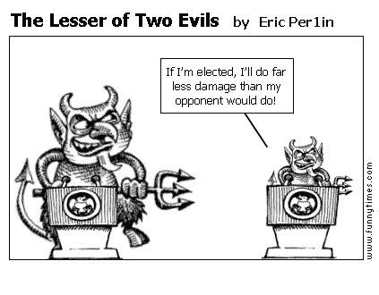
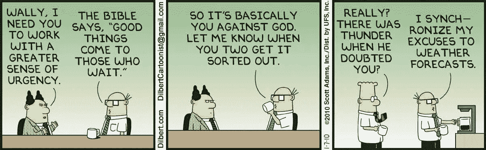
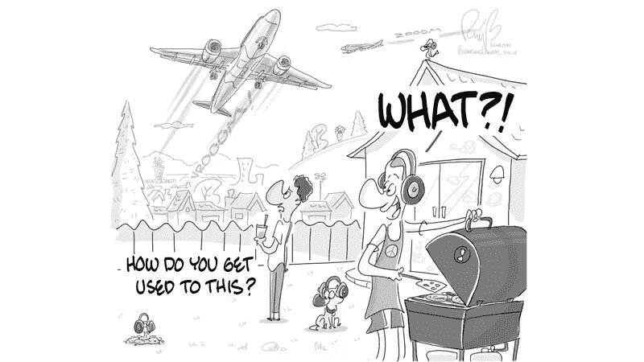
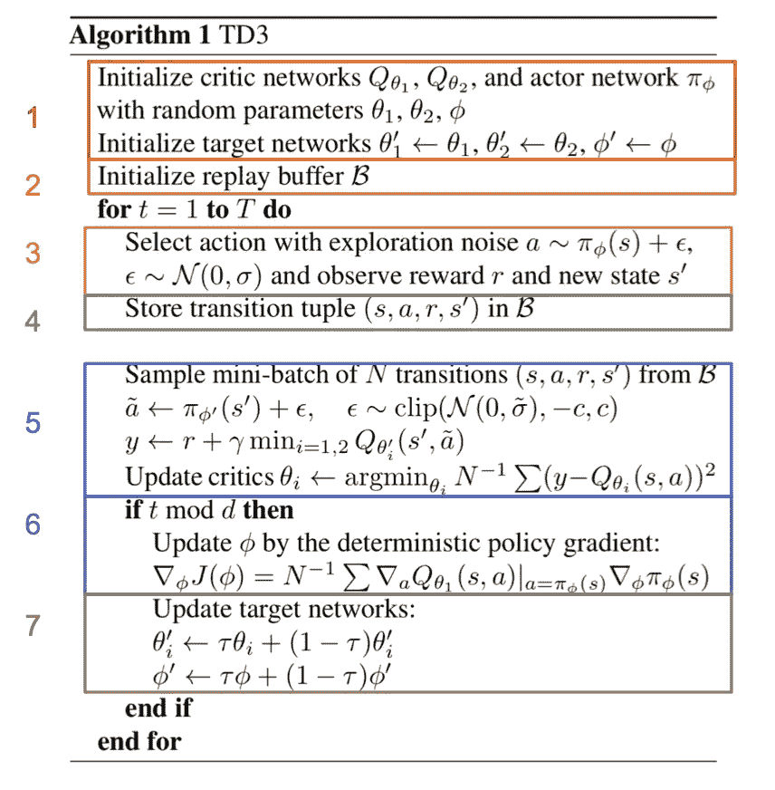
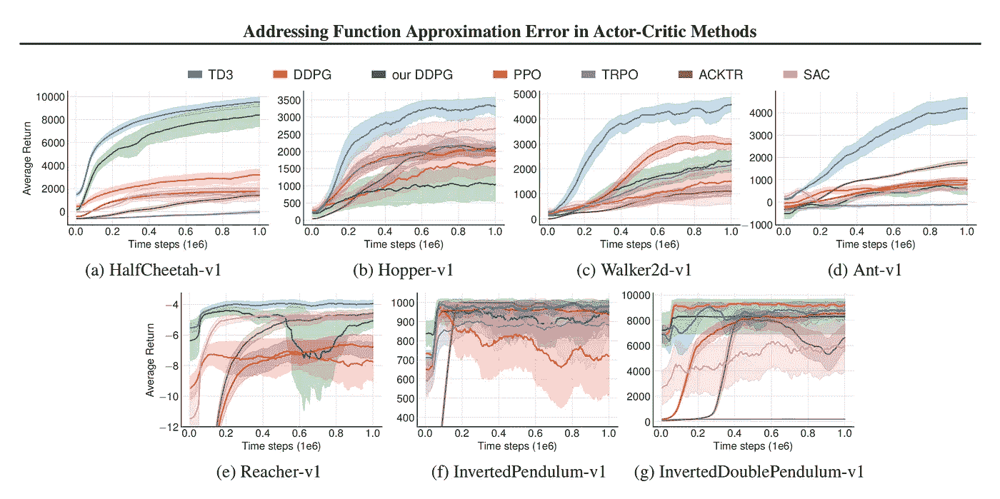
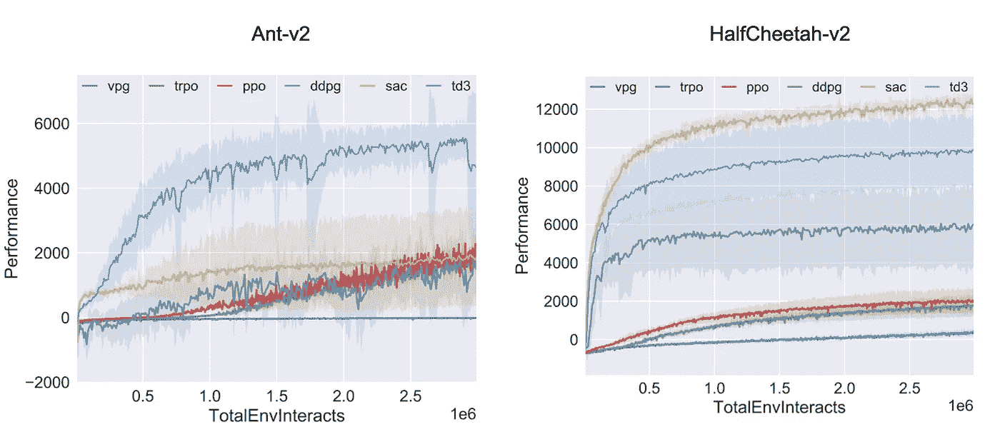
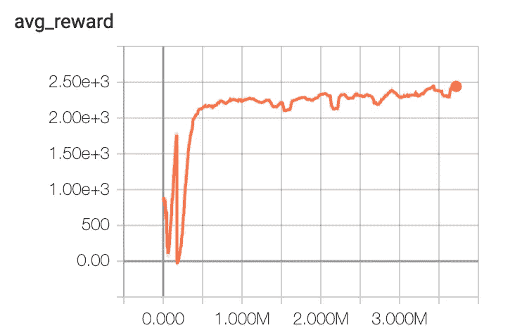
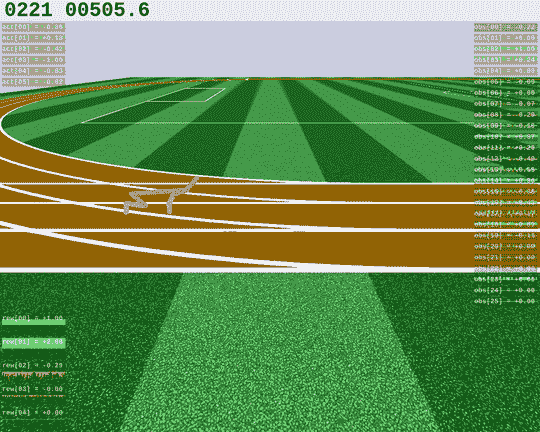

# TD3:学习用人工智能跑步

> 原文：<https://towardsdatascience.com/td3-learning-to-run-with-ai-40dfc512f93?source=collection_archive---------1----------------------->


Photo by [Sammy Wong](https://unsplash.com/@vr2ysl?utm_source=medium&utm_medium=referral) on [Unsplash](https://unsplash.com?utm_source=medium&utm_medium=referral)

本文着眼于强化学习(RL)中最强大和最先进的算法之一，双延迟深度确定性策略梯度(TD3)( Fujimoto 等人，2018)。到本文结束时，您应该对是什么使 TD3 性能如此之好有了坚实的理解，能够自己实现该算法，并使用 TD3 训练一个代理在 HalfCheetah 环境中成功运行。

然而，在学习 TD3 之前，你应该已经对 RL 和常用算法有了很好的理解，比如深度 Q 网络和 DDPG，TD3 就是建立在这些算法之上的。如果你需要复习你的知识，请查看这些优秀的资源， [DeepMind 讲座系列](https://www.youtube.com/watch?v=iOh7QUZGyiU&list=PLqYmG7hTraZDNJre23vqCGIVpfZ_K2RZs)，[让我们做一个 DQN](https://jaromiru.com/2016/09/27/lets-make-a-dqn-theory/) ，[旋转起来:DDP](https://spinningup.openai.com/en/latest/algorithms/ddpg.html) G .本文将涵盖以下内容:

1.  什么是 TD3
2.  每个核心机制的解释
3.  实现和代码演练
4.  结果和基准

完整的代码可以在我的 g [ithub](https://github.com/djbyrne/TD3) 上找到。如果您想快速了解这里使用的代码，请单击下面的图标，进入一个准备就绪的 Google Colab 工作簿。

[](https://colab.research.google.com/drive/1foJRBKv0ymV7I5cpmQ6bI4v6CyJ-qATs)

# TD3 是什么？

TD3 是深度确定性政策梯度(DDPG)的继承者(Lillicrap 等人，2016 年)。直到最近，DDPG 是机器人和自动驾驶等连续控制问题中使用最多的算法之一。虽然 DDPG 能够提供出色的结果，但它也有自己的缺点。像许多 RL 算法一样，训练 DDPG 可能不稳定，并且严重依赖于为当前任务找到正确的超参数(OpenAI [Spinning Up](https://spinningup.openai.com/en/latest/algorithms/td3.html#background) ，2018)。这是由于算法持续过度估计 critic (value)网络的 Q 值造成的。这些估计误差随着时间的推移而累积，并可能导致代理陷入局部最优或经历灾难性的遗忘。TD3 通过专注于减少以前算法中出现的高估偏差来解决这个问题。这是通过增加 3 个关键功能实现的:

1.  使用一对评论家网络(标题的孪生部分)
2.  参与者的延迟更新(延迟部分)
3.  动作噪音规则化(这一部分没有成为标题:/)

# 双胞胎评论家网络

TD3 增加的第一个功能是使用两个 critic 网络。这是受使用双 Q 学习的深度强化学习(Van Hasselt 等人，2016 年)中看到的技术的启发，该技术涉及使用单独的目标值函数估计当前 Q 值，从而减少偏差。然而，这种技术并不完全适用于演员评论方法。这是因为策略和目标网络更新得如此之慢，以至于它们看起来非常相似，这使得偏见又回到了画面中。相反，在双 Q 学习(Van Hasselt，2010)中看到的一个更老的实现被使用。TD3 使用限幅双 Q 学习，取两个 critic 网络中的最小值(两害相权取其轻)。



Fig 1\. The lesser of the two value estimates will cause less damage to our policy updates. image found [here](https://funnytimes.com/wp-content/uploads/2011/10/131986994517768.png)

这种方法有利于低估 Q 值。这种低估偏差不是问题，因为低值不会像高估值那样通过算法传播。这提供了更稳定的近似，从而提高了整个算法的稳定性。

**底线:** TD3 使用两个独立的批评家网络，在形成目标时使用两者中的最小值。

# 延迟更新



Fig 2\. Making our policy wait for a little while the critic network becomes more stable. Image found [here](https://i2.wp.com/static1.businessinsider.com/image/525461206bb3f7812b2c9bd4-1200-375/you%20against%20god.jpg?quality=60&strip=all)

目标网络是一个很好的工具，可以将稳定性引入到代理培训中，但是在演员评论方法的情况下，这种技术存在一些问题。这是由政策(行动者)和批评(价值)网络之间的相互作用造成的。当一个糟糕的政策被高估时，对代理人的训练就会偏离。我们的代理策略将继续变得更糟，因为它正在更新有很多错误的状态。

为了解决这个问题，我们只需要比价值网络更少地更新策略网络。这使得价值网络变得更加稳定，并在用于更新策略网络之前减少错误。在实践中，策略网络在固定的时间步长之后更新，而价值网络在每个时间步长之后继续更新。这些不太频繁的策略更新将具有较低方差的值估计，因此应该产生更好的策略。

**底线:** TD3 使用 actor 网络的延迟更新，仅每 2 个时间步更新一次，而不是在每个时间步之后更新，从而产生更稳定和高效的训练。

# 噪声调整

TD3 的最后一部分着眼于平滑目标策略。确定性策略方法在更新 critical 时倾向于产生具有高方差的目标值。这是由于过度拟合值估计中的尖峰造成的。为了减少这种差异，TD3 使用了一种称为目标策略平滑的正则化技术。理想情况下，目标值之间应该没有差异，相似的行动得到相似的值。TD3 通过向目标添加少量随机噪声并对小批量求平均值来减少这种差异。噪波的范围被剪切，以保持目标值接近原始动作。



Fig 3\. by training with the added noise to regularise the agents actions it favours a more robust policy. Image found [here](https://www.latimes.com/resizer/22Um68pXlFQTowJjlGRhO3YIfvI=/800x0/www.trbimg.com/img-5a7e4b10/turbine/la-1518226187-c3x7zfn6yp-snap-image)

通过将这种额外的噪声添加到值估计中，策略趋向于更加稳定，因为目标值为对噪声和干扰更加鲁棒的动作返回更高的值。

**底线:**计算目标时，剪切噪声被添加到所选动作中。这对于更健壮的动作来说偏好更高的值。

# 履行

这个实现基于本文中的原始回购协议。代码的主要部分包含在下面的完整的自包含笔记本中。这个实现是用 pytorch 写的，如果你不熟悉，我建议查看一些示例文档[这里](https://pytorch.org/tutorials/)。所有网络架构和超级参数都与原始论文中使用的相同。下面是论文中的伪代码。虽然这可能看起来很复杂，但当你分解它，并通过数学方程格式时，它实际上是非常直观的。



Fig 4\. TD3 algorithm with key areas highlighted according to their steps detailed below

# 算法步骤:

为了实现 TD3 算法，我将前面的伪代码分解成逻辑步骤，如下所示:

1.  初始化网络
2.  初始化重放缓冲区
3.  选择并执行带有探测噪音的动作
4.  存储转换
5.  更新评论家
6.  更新参与者
7.  更新目标网络
8.  重复直到有知觉

# 1.初始化网络

对于演员和评论家网络来说，这是一个相当标准的设置。注意，critic 类实际上包含了要使用的两个网络。critics forward()方法返回两个批评家的 Q 值，供以后使用。get_Q 方法只是返回第一个 critic 网络。

```
class Actor(nn.Module):

    def __init__(self, state_dim, action_dim, max_action):
        super(Actor, self).__init__() self.l1 = nn.Linear(state_dim, 400)
        self.l2 = nn.Linear(400, 300)
        self.l3 = nn.Linear(300, action_dim) self.max_action = max_action def forward(self, x):
        x = F.relu(self.l1(x))
        x = F.relu(self.l2(x))
        x = self.max_action * torch.tanh(self.l3(x)) 
        return xclass Critic(nn.Module):

    def __init__(self, state_dim, action_dim):
        super(Critic, self).__init__() # Q1 architecture
        self.l1 = nn.Linear(state_dim + action_dim, 400)
        self.l2 = nn.Linear(400, 300)
        self.l3 = nn.Linear(300, 1) # Q2 architecture
        self.l4 = nn.Linear(state_dim + action_dim, 400)
        self.l5 = nn.Linear(400, 300)
        self.l6 = nn.Linear(300, 1) def forward(self, x, u):
        xu = torch.cat([x, u], 1) x1 = F.relu(self.l1(xu))
        x1 = F.relu(self.l2(x1))
        x1 = self.l3(x1) x2 = F.relu(self.l4(xu))
        x2 = F.relu(self.l5(x2))
        x2 = self.l6(x2)
        return x1, x2 def get_Q(self, x, u):
        xu = torch.cat([x, u], 1) x1 = F.relu(self.l1(xu))
        x1 = F.relu(self.l2(x1))
        x1 = self.l3(x1) return x1
```

# 2.初始化缓冲区

这是一个从 OpenAI 基线回购[借用的标准重放缓冲区](https://github.com/openai/baselines/blob/master/baselines/deepq/replay_buffer.py)

# 3.选择带有探测噪音的动作

这是环境马尔可夫决策过程中的一个标准步骤。在这里，代理将选择一个添加了探索噪声的动作。

```
state = torch.FloatTensor(state.reshape(1, -1)).to(device)

action = self.actor(state).cpu().data.numpy().flatten()
if noise != 0: 
            action = (action + np.random.normal(0, noise,                            size=self.env.action_space.shape[0]))

return action.clip(self.env.action_space.low,
self.env.action_space.high)
```

# 4.存储转换

在采取行动后，我们在重放缓冲区中存储关于该时间步长的信息。这些转换将在以后更新我们的网络时使用。

```
replay_buffer.add((self.obs, new_obs, action, reward, done_bool))
```

# 5.更新评论家

一旦我们在环境中执行了一个完整的时间步骤，我们就为我们的模型训练几次迭代。更新的第一步涉及到批评家。这是算法中最重要的部分之一，也是大多数 TD3 附加特性得以实现的地方。首先要做的是从重放缓冲区中抽取一小批存储的转换。

```
# Sample mini batch
s, s_, a, r, d = replay_buffer.sample(batch_size)
state = torch.FloatTensor(s).to(device)
action = torch.FloatTensor(s_).to(device)
next_state = torch.FloatTensor(y).to(device)
done = torch.FloatTensor(1 - d).to(device)
reward = torch.FloatTensor(r).to(device)
```

接下来，我们将为我们从小型批处理中提取的每个状态选择一个操作，并应用目标策略平滑。如前所述，这只是用我们的目标演员网络挑选一个动作，我们将噪声添加到已被剪辑的动作中，以确保有噪声的动作不会离原始动作值太远。

```
# Select action with the actor target and apply clipped noise
noise = torch.FloatTensor(u).data.normal_(0, policy_noise).to(device)
noise = noise.clamp(-noise_clip, noise_clip)
next_action = (self.actor_target(next_state) + noise).clamp(-self.max_action, self.max_action)
```

接下来，我们需要计算评论家的目标 Q 值。这就是双重批评网络发挥作用的地方。我们将获得每个目标评论家的 Q 值，然后取两者中最小的一个作为我们的目标 Q 值。

```
# Compute the target Q value
target_Q1, target_Q2 = self.critic_target(next_state, next_action)
target_Q = torch.min(target_Q1, target_Q2)
target_Q = reward + (done * discount * target_Q).detach()
```

最后，我们计算了两个电流评论家网络的损失。这是通过获得每个当前评论家的 MSE 和我们刚刚计算的目标 Q 值来完成的。然后，我们像往常一样对批评家进行优化。

```
# Get current Q estimates
current_Q1, current_Q2 = self.critic(state, action)# Compute critic loss
critic_loss = F.mse_loss(current_Q1, target_Q) + F.mse_loss(current_Q2, target_Q)# Optimize the critic
self.critic_optimizer.zero_grad()
critic_loss.backward()
self.critic_optimizer.step()
```

# 6.更新参与者

与评论家相比，演员的更新要简单得多。首先，我们确保每隔 d 个时间步长就更新一次演员。在我们的例子和论文中，演员每两个时间步更新一次。

```
# Delayed policy updates
if it % policy_freq == 0: # Compute actor loss
        actor_loss = -self.critic.Q1(state,       self.actor(state)).mean() # Optimize the actor 
        self.actor_optimizer.zero_grad()
        actor_loss.backward()
        self.actor_optimizer.step() # Update the frozen target models
        for param, target_param in zip(self.critic.parameters(), self.critic_target.parameters()):
            target_param.data.copy_(tau * param.data + (1 - tau) * target_param.data) for param, target_param in zip(self.actor.parameters(), self.actor_target.parameters()):
                    target_param.data.copy_(tau * param.data + (1 - tau) * target_param.data)
```

演员的损失函数简单地从我们的评论家网络中获得-Q 值的平均值，我们的演员在给定小批状态的情况下选择采取什么行动。就像以前一样，我们通过反向传播优化我们的演员网络。

# 7.更新目标网络

最后，我们使用软更新来更新冻结的目标网络。这是与 actor 更新一起完成的，也是延迟的。

```
# Update the frozen target models
        for param, target_param in zip(self.critic.parameters(), self.critic_target.parameters()):
            target_param.data.copy_(tau * param.data + (1 - tau) * target_param.data)for param, target_param in zip(self.actor.parameters(), self.actor_target.parameters()):
                    target_param.data.copy_(tau * param.data + (1 - tau) * target_param.data)
```

# 完整代码

# 结果

作者在原始论文中的结果在各种基准测试环境(如 MuJoco control suite)中都取得了优异的成绩。下面的结果显示了 TD3 如何优于几乎所有算法，包括最近的 SAC (Haarnoja 等人，2018 年)算法和 PPO(舒尔曼等人，2017 年)，PPO 是 OpenAI 的 go to 算法，用于开创性的研究，如他们的 DOTA 2 代理。



Fig 5\. Benchmarking results from the TD3 paper

用作基准的算法包括、PPO、ACKTR (Wu 等人，2017)和 TRPO(舒尔曼等人，2015)的 OpenAI 基线实现。SAC 是从作者的 github 实现的。

然而，自 TD3 发布以来，SAC 已得到改进，如软演员-评论家算法和应用中所见(Haarnoja 等人，2019 年)。在这里，Haarnoja 展示了全面超越 TD3 的新结果。为了对算法进行公正的评估，我们可以从 OpenAI:Spinning Up 的主要 RL 算法实现中看到基准测试结果。正如您在图 6 中看到的，TD3 在 Ant 环境中设法超越了 SAC。然而，SAC 在 HalfCheetah 环境中实现了更高的性能。



Fig 6\. OpenAI Spinning Ups benchmark results for the Ant and HalfCheetah MuJoCo environments

下面是我在 [Roboschool](https://openai.com/blog/roboschool/) HalfCheetah 环境中测试的 TD3 实现的训练结果。上图显示了代理在过去 100 集的平均得分。如你所见，代理很快学会站立，然后成功行走。



Fig 7\. Training results of TD3 HalfCheetah. Shows the average score over the previous 100 episodes

虽然它确实短暂地陷入局部最优，但代理能够快速恢复，在 500k 时间步长后收敛到最优策略。下面的视频显示了经过全面培训的代理的结果。



Fig 8\. results of the trained TD3 HalfCheetah

# 结论

恭喜您，我们已经涵盖了您开始实施市场上最先进的强化学习算法所需的一切！我们现在已经了解了 TD3 是什么，并解释了使该算法表现如此出色的核心机制。不仅如此，我们还一步一步地学习了算法，并学习了如何用 pytorch 构建算法。最后，我们看了原始论文和本文实现中看到的算法的结果。我希望这篇文章对你有所帮助，并对强化学习有所了解！

# 参考

[1] Fujimoto，s .，van Hoof，h .，和 Meger，d .在演员-评论家方法中解决函数近似错误。 *arXiv 预印本 arXiv:1802.09477* ，2018。

[2] Lillicrap，T. P .，Hunt，J. J .，Pritzel，a .，Heess，n .，Erez，t .，Tassa，y .，Silver，d .，Wierstra，d .深度强化学习的连续控制。 *arXiv 预印本 arXiv:1509.02971* ，2015。

[3]open ai—spinning Up，2018:[https://spinning Up . open ai . com/en/latest/algorithms/td3 . html #背景](https://spinningup.openai.com/en/latest/algorithms/td3.html#background)

[4]哈多·范·哈塞尔特(2010 年)。双 Q 学习。*神经信息处理系统进展 23* (NIPS 2010)，加拿大不列颠哥伦比亚省温哥华，第 2613–2622 页。

[5] Van Hasselt，h .，Guez，a .，和 Silver，d .使用双 q 学习的深度强化学习。在 AAAI，第 2094-2100 页，2016 年。

[6]t . Haarnoja，a .周，a . abbe El，p .和 Levine，s .软行动者-批评家:随机行动者的政策外最大熵深度强化学习。 *arXiv 预印本 arXiv:1801.01290* ，2018。

[7]舒尔曼，j .，沃尔斯基，f .，德里瓦尔，p .，拉德福德，a .，和克里莫夫，o .近似政策优化算法。 *arXiv 预印本 arXiv:1707.06347* ，2017。

[8]舒尔曼，j .，莱文，s .，阿贝耳，p .，乔丹，m .，和莫里茨，p .信托区域政策优化。在*机器学习国际会议*中，第 1889–1897 页，2015 年。

[9] Wu，y .、Mansimov，e .、Grosse，R. B .、Liao，s .和 Ba，j .使用 kronecker 分解近似的深度强化学习的可扩展信赖域方法。在*神经信息处理系统进展*中，第 5285–5294 页，2017 年。

[10] Haarnoja，t .，周，a .，Abbeel，p .，和 Levine，s .软演员-评论家算法和应用。 *arXiv 预印本 arXiv:*12.05905 v2，2019