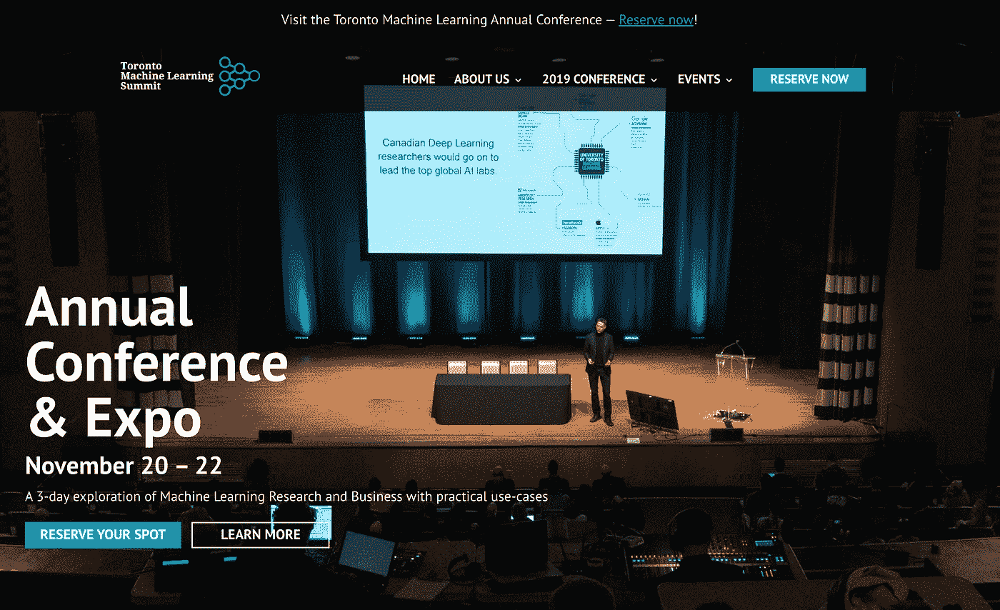
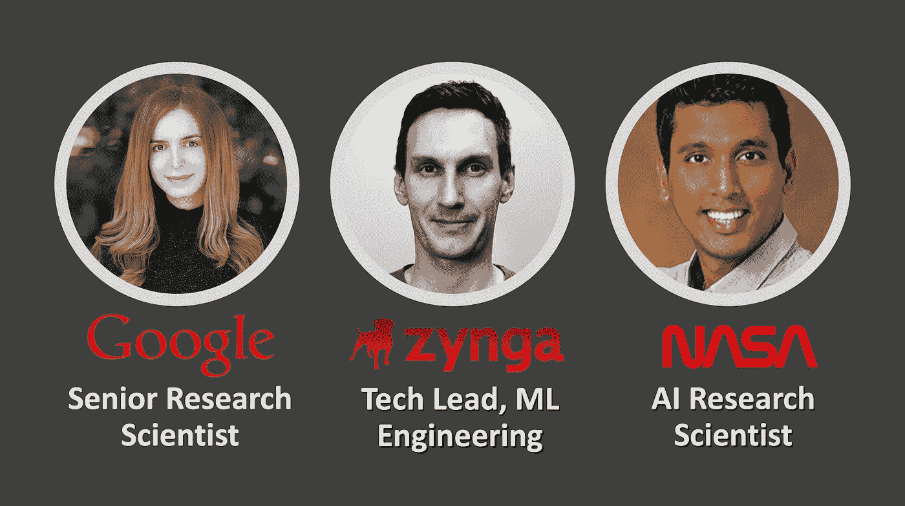
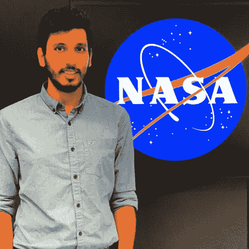
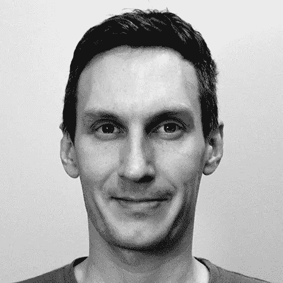

# TDS 将来到多伦多采访人工智能领域的领导者——请将您的问题发送给我们！

> 原文：<https://towardsdatascience.com/tds-is-coming-to-toronto-to-interview-leaders-in-ai-send-us-your-questions-for-them-d939a6d52a3f?source=collection_archive---------33----------------------->

## [独家 TDS 采访](https://medium.com/@haebichan)

## 帮助我们为 TDS 合作的人工智能大会上的知名演讲人设计面试问题。

再过不到两周，TDS 将作为官方媒体合作伙伴和视频主持人出席**多伦多 ML 年会**。在会议期间，我们将针对紧迫的数据科学问题，面对面地采访内部演讲者，他们都有精美的简历！此外，知名科技 YouTuber[cs Dojo](https://www.youtube.com/channel/UCxX9wt5FWQUAAz4UrysqK9A)将加入 TDS 担任面试官！

[Tickets for conference are still available here!](https://www.eventbrite.ca/e/toronto-machine-learning-society-tmls-2019-annual-conference-expo-tickets-62269039373?aff=Rsvtopbanner)

在过去的几个月里，我们与数据科学领域的知名嘉宾推出了[视频访谈](https://towardsdatascience.com/tagged/tds-interview)和[播客](https://towardsdatascience.com/tagged/tds-podcast)系列。我们正在扩大这个系列，同时为 TDS 观众提供空间，让他们向即将到来的面试官提问。

这些问题可以是关于招聘、日常工作流程、公司内部项目或其他对你很重要的数据主题。我们将为面试日收集和策划。

请在评论区列出问题或直接发送给*haebichan@towardsdatascience.com*。

以下是四位确定要接受采访的演讲者:

## **1。阿扎利亚·米罗西尼**

阿扎利亚是谷歌大脑的高级研究科学家。具体来说，她是系统的机器学习 moon shot in the Brain 的联合创始人/负责人，她专注于基于深度强化学习的方法来解决计算机系统和元学习中的问题。

Azalia 是深度学习方面的专家，对与神经网络和深度强化模型相关的最新研究有着透彻的了解。她对人工智能领域做出了巨大贡献，特别是通过她在可训练门控网络(稀疏门控专家混合层)方面的工作，解决了神经网络通过参数数量吸收信息的局限性。

在会议期间，Azalia 将谈论模型容量的这些问题，以及与学习做资源分配的深度强化模型相关的挑战。

## **2。Shreyansh Daftry**

Shreyansh 是美国宇航局(计算机视觉小组-自主系统部门)的人工智能研究科学家和技术专家。他帮助开发火星及更远地方的下一代智能自主机器人。他通过构建复杂但可扩展的算法来实现这一点，这些算法充当机器人的“大脑”。

他处理辐射、机器学习中的少量数据等具有挑战性的问题，并为必须适应这些问题的机器处理意外环境和情况。

在多伦多 ML 会议上的演讲中，Shreyansh 将讲述机器学习如何用于太空探索以及他在这一过程中所学到的经验。

## 3.帕特里克·哈林娜

Patrick 是 Zynga ML 工程团队的技术主管，Zynga 是世界上最大的移动视频游戏公司之一。他是强化学习领域的专家，他在 Zynga 使用这种算法来个性化游戏体验。他的专长还在于支持这些复杂算法的分布式计算系统，如 Apache Spark。

例如，Zynga 已经利用 Spark 来改善内部数据管道，以生成数千个格式正确的功能，而无需手动输入。这是一个重要的成就，因为游戏数据(点击流数据)可能会非常混乱，来自同一游戏的不同操作系统会生成它们自己的数据模式。

Patrick 将在会议期间就强化学习如何解决许多业务问题以及在生产中使用强化学习的挑战发表演讲。

## 4.尚查尔·查特吉

Chanchal 领导谷歌云的人工智能团队。他专注于金融服务，解决与前 100 家银行相关的数百个机器学习问题，其中许多银行都是谷歌的客户。

这些问题包括欺诈、风险(缓解、量化风险)、编辑云中的敏感数据、对话代理(Google Home)、广告和推荐，以及模型的可解释性，他认为从消费者、管理层和监管者的角度来看，这是极其重要的。

在他的演讲中，Chanchal 将探讨深度学习人工智能能力如何推动谷歌的许多关键决策，作为改善数字营销、客户服务、制造运营等诸多方面的秘方。

同样，请随意在评论区写下问题，或者直接发邮件给*haebichan@towardsdatascience.com*！我们期待你们所有人的参与，无论是虚拟的还是面对面的。