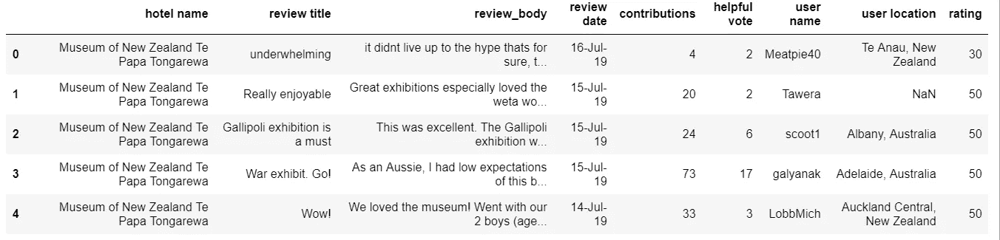
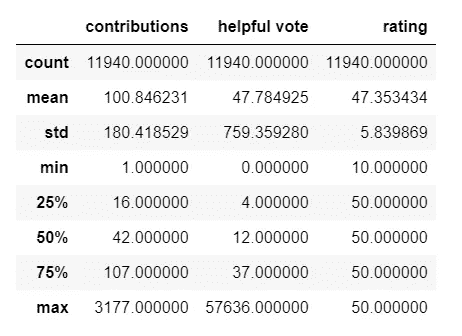
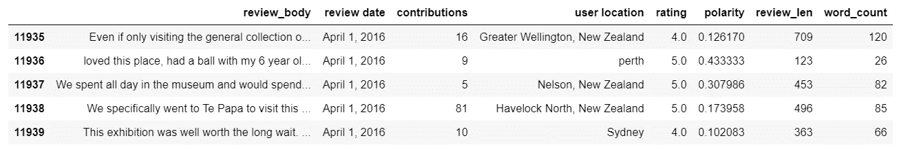
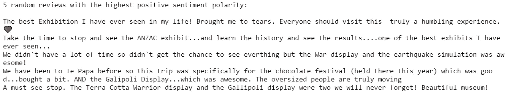
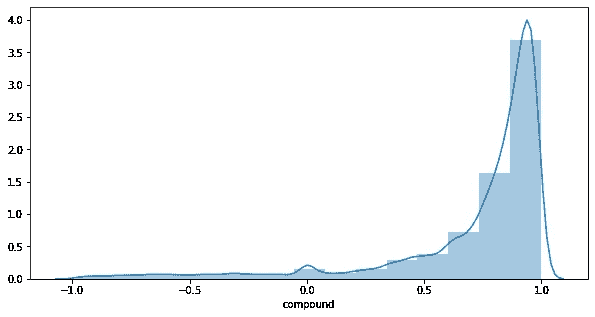
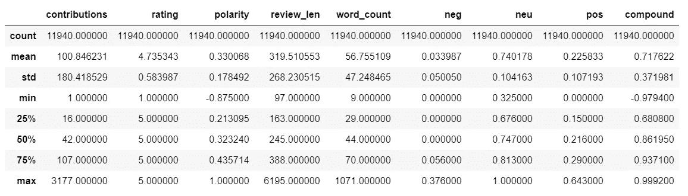
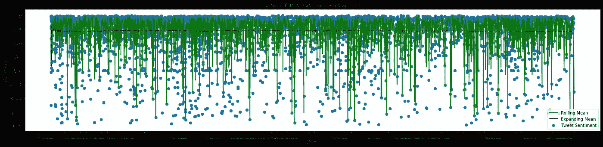
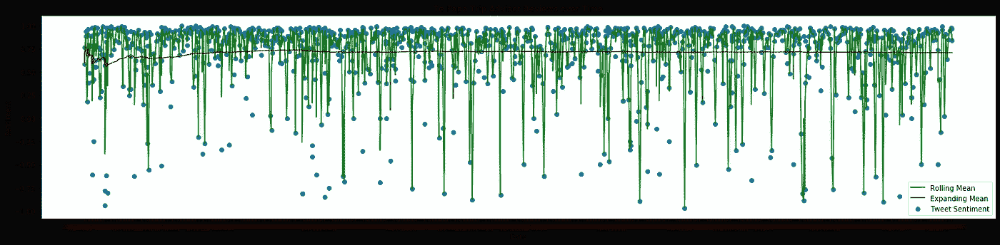

# Te Papa Tongarewa(新西兰博物馆)

> 原文：<https://towardsdatascience.com/te-papa-tongarewa-museum-of-new-zealand-sentimental-footing-d062e41e430f?source=collection_archive---------42----------------------->

大约四个月前，我在游览世界上最大风之都[惠灵顿](https://www.worldatlas.com/articles/which-is-the-windiest-city-in-the-world.html)的时候参观了这个博物馆。毛利人的名字， [Te Papa Tongarewa](https://www.tepapa.govt.nz/about/what-we-do/our-history#Te%20Papa%E2%80%99s%20history) ，字面意思是“宝藏的容器”，它始于 1865 年**作为一个小型殖民博物馆。**

这座建筑和里面的展览一样宏伟。我喜欢的两个地方是**和记录新西兰移民旅程的部分。作为一名有抱负的数据科学家，在离开这个地方后，我有一个目标。我想弄清楚我的积极情绪是别人感受到的还是被遗漏的。我的第一站是快速浏览网上评论。我选择猫途鹰评论是基于它们的简洁和高度的表现力。我从 2016 年 4 月 1 日到 2019 年 7 月 15 日收到了 Te Papa 的旅行顾问评论。下面是一些统计数据和数据集样本。**

****

**A snippet of the 11940 reviews. Hotel name is just a place holder in my review collection process so yes Te Papa is not a hotel.**

****

**The dataset comprises of 11940 reviews. The rest of what we’ll cover is in the text bit of the review thus not statistically significant here.**

**关于数据集的一些分析:**

## **发行审查文本长度和字数**

**120–139 characters reviews lengths were written by 1068 visitors. That’s the most representative cluster.**

**4630 reviews were made up of 20–39 words which makes them quite expressive. Visitors really wanted to pass the message across.**

****文本分析****

**我们按照以下流程清理了数据**

1.  **掉*酒店名称*，*点评标题*，*义举投票*，*用户名*。**
2.  **给出 5 分而不是 50 分的评价。简单地除以 10。**
3.  **删除缺少“review_body”的行。**
4.  **为评论的长度创建新的特征。**
5.  **为评论的*字数*创建新功能。**
6.  **使用 TextBlob 计算情感极性。值的范围从-1 到 1，其中 1 是最积极的情绪，而-1 是最消极的情绪。**

**上述过程的输出如下**

****

**Results after: Dropping hotel name, review title, helpful vote, user name, preprocessing (removal of unwanted characters. Can be user defined),polarity computation as well as addition of review length and word count columns.**

****文本斑点操作****

**[*text blob*](https://textblob.readthedocs.io/en/dev/)Python(2 和 3)库提供了一个简单的 API，用于处理常见的自然语言处理(NLP)任务，如词性标注、名词短语提取、情感分析、分类、翻译等。下面的代码片段生成 5 条随机 tweets，在数据帧中极性最大。在我们的例子中，对于最消极的一个，即极性= =-0.875 和极性== 0，可以做同样的事情。**

****

**Five random tweets with the most positive sentiment i.e. polarity equal to 1.**

**我对 TextBlob 库的性能不太满意，特别是在一个严重偏向正极性的数据集中指出负面情绪，如下所示。**

****

**Skewed to the left. Close to 38% of the reviews depict satisfaction in what Te Papa offers.**

****与 VADER 的感悟****

****(**效价感知词典和情感推理机**)是一个词库和基于规则的情感分析工具。它使用一个[情感词典](http://livernspleen.com/wp-content/uploads/2013/09/social-media-tool-as-a-learning-resource.pdf?source=post_page---------------------------)的组合，情感词典是一个词汇特征(例如，单词)的列表，这些词汇特征通常根据它们的语义取向被标记为正面或负面。****

****我选择 VADER 来分析情绪，因为与传统评论相比，它更习惯于社会数据。****

********

****Most negative review is with a compound score of -0.9794.****

****VADER 最负面的评论如下。****

****我们去 Te Papa 看 Gallipolli，战争规模展览。这个展览很棒，但同时也非常悲伤，因为它讲述了战争的徒劳和人类生命的可怕损失。Weta 工作室制作的超大模型非常精确。****

****像“非常”和“悲伤”这样的词肯定在否定过程中起到了关键作用。就像其他观点更多的是积极的观点过于美好一样，它需要一双更敏锐的眼睛来捕捉这种不一致。总而言之，期望提取的语句 100%准确是不可能的。唯一的出路是尽可能地训练我们自己的模型，而不要过于精确。我们以后再做那件事。****

******一段时间的情绪******

****事件影响人的感情。某些展览的开展必然会引起参观者不同的反应。将情绪绘制成时间序列会让我们更好地了解游客的感受模式。在绘制之前，会对数据框进行一些更改。我们根据评论时间对所有值进行排序，将评论时间复制到索引中，评论之间的间隔为 24 小时，以使绘图更容易，并计算复合情感得分的扩展和滚动平均值。****

********

****从上面的情节中得到一些有趣的观点****

1.  ****很多情绪点都集中在 0.75 情绪分左右。这是一个强有力的指标，表明大多数评论都过于积极。****
2.  ****有很多数据点。很难解释模式。****

****整个数据集的样本表示可能会给出一个更容易解释的图表。下面的输出证实了之前对 Te Papa 游客体验的强烈肯定。****

********

****Sentiment scores are evenly higher i.e. close to 1.0\. Shows an even and strong footing in terms of what Te Papa offers its clientele.****

******结论******

****从上面的分析来看，当谈到游客的体验时，Te Papa 有一个强大的立足点。我们使用了两个情绪分析器，它们都被证明是通用的，因为情绪中的负面检测对两者来说都很困难。这是关于 Te Papa 的统计和数据科学展望系列帖子的第一步。我期待着利用 Te Papa 的公开数据集来解决以下问题****

1.  ****使用来自他们的谷歌评论的更多数据，基于增强的低向量表示来训练情感分类器。希望我也能挖掘他们的社交数据。****
2.  ****基于方面的情感分析。游客对哪些方面感到欣喜若狂，对哪些方面不满意？****
3.  ****根据游客的排名，与世界上排名前 25 位的其他[博物馆进行面对面的比较分析。哪些方面让他们比 Te Papa 做得更好？](https://www.tripadvisor.co.nz/TravelersChoice)****
4.  ****分析惠灵顿或 Te Papa 的某些活动是否会影响游客体验。****

****敬请期待！****