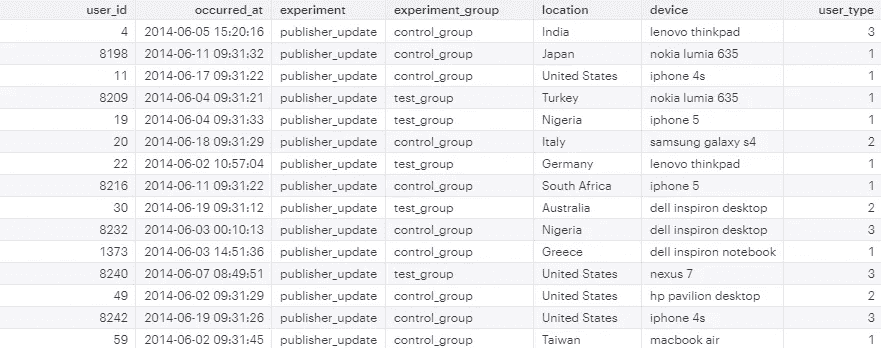
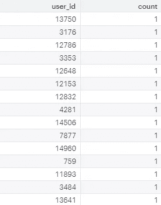

# 自学 SQL —第一部分

> 原文：<https://towardsdatascience.com/teach-yourself-sql-part-i-b85cb95aade3?source=collection_archive---------13----------------------->


Courtesy of comic.browserling.com

作为一名数据分析师，我在 SQL 方面做了很多工作，我想我应该分享一下如何使用它来解决业务问题。我自学成才，并在一家专门从事数据科学和 UX 设计教育的[教育科技初创公司](http://springboard.com?utm_source=medium&utm_medium=blog&utm_campaign=teach_yourself_sql&utm_term=riley_article)从市场营销工作成为一名数据分析师。

我想用我的学习来回报它，并分享一些我发现对培养分析技能有帮助的事情。事不宜迟，我将直接切入正题:一个可以用 SQL 解决的一些业务/产品分析师风格问题的端到端示例。

这篇文章是为那些希望发展自己的 SQL/分析思维技能的人，以及那些试图进入并开始他们作为业务分析师、数据分析师、产品分析师或数据科学家的职业生涯的人准备的。无论您选择哪种方式，我向您保证 SQL 是您工具箱中的一项关键技能！

因此，我这篇文章的目标是让您:

1.  建立自己的免费 Mode 实例，这是一个常用的商业智能平台。许多数据分析师和数据科学家的职位描述都在寻找知道这个工具的候选人，所以如果你想进入这个领域，熟悉这个工具是很好的。
2.  根据 Mode 提供的测试数据源编写基本的 SQL 语句。

在本系列文章的后续部分中，我将更深入地研究更高级的 SQL，并使用它来解决业务问题。

## 目标 1:设置

首先，你需要前往[mode.com](http://mode.com)注册一个免费账户。这是一个超级快速和基本的注册过程。验证您的帐户后，您可以登录。

一旦进入平台，转到`SQL Training2019`并点击`Write a Query`。作为一个有产品和业务分析经验的人，我将带你浏览一下`yammer_experiments`表中的 SQL 查询，它对应于产品实验及其结果。

这样，我们就实现了目标 1！看我们走！

## 目标 2:基本 SQL

让我们运行第一个查询来计算我们要处理多少行:

```
SELECT
     COUNT(1)
FROM
     tutorials.yammer_experiments
;
```

上面的查询告诉您表中的行数— 2595。

现在我们知道了这个表的大小，让我们了解一下这个表的值。为此，请使用 LIMIT 子句编写以下内容:

```
SELECT
     *
FROM
     tutorials.yammer_experiments
LIMIT 100
;
```

星号获取所有列，LIMIT 子句减少返回的行数，否则您将等待一段时间，尤其是在大型表上。



The first few rows returned from the previous query gives us a sense of what the data are

看起来`yammer_experiments`表是某种网络分析数据。看到`occurred_at`字段让我觉得这就是所谓的事件表。事件表的不同之处在于，每一行对应于用户采取的一个**动作**。典型地，在数据库中设置有触发器，其中执行以下逻辑:**如果**用户采取动作 A，**记录**在事件表 A 中捕获该用户-动作对的记录。动作的发生激活触发器并将记录推送到该表。

我不知道这张表，所以这是我的假设。在分析师的工作中，开发和测试假设是很重要的。为了测试我的假设，即每一行都是一个用户-动作对，因此任何用户都可以执行**多个**动作，让我们计算每个 user_id 出现的次数，看看是否有多个条目对应于任何用户 id。下一个查询引入了两个新子句:GROUP BY 和 ORDER BY。

```
SELECT
      user_id,
      COUNT(1)
FROM
      tutorial.yammer_experiments
GROUP BY
      user_id
ORDER BY
      COUNT(1) DESC
;
```

在上面的查询中，我从表中选择了用户 id，并使用了上面介绍的相同的 COUNT(1)逻辑。分组依据按用户 id 对计数进行分组。最后，我使用 ORDER BY 和关键字 DESC(代表降序)首先获得用户 id 的最大数量的实例。这产生了以下结果:



First few rows of user ids and the number of occurrences of each

这否定了我的假设，即这是一个事件表，但让我们继续前进！

让我们更好地理解下一个专栏:`occurred_at`。所以我们知道一个用户只出现一次，可能是某种动作不能执行两次。

无论如何，假设你的利益相关者没有告诉你这个信息，或者当这个实验进行时，你没有在会议*中问他们，这将会很有趣。很容易做到这一点，使用*聚合函数* : MIN 和 MAX。查看并运行下面的查询:*

```
SELECT
    MIN(occurred_at),
    MAX(occurred_at)
FROM
      tutorial.yammer_experiments
;
```

这将向我们显示最早的操作是在 2014 年 6 月 1 日刚过午夜时执行的，最晚的操作是在 2014 年 6 月 30 日晚上 10:45。让我们假设这是 2014 年 6 月的一次实验！

现在需要一个关于可读性和易于理解的注释。在这些列的 SELECT 子句中使用 AS 关键字对我们自己的理解和将来可能运行该查询的任何人来说都更好一些。

```
SELECT
    MIN(occurred_at) AS `Earliest Occurrence`,
    MAX(occurred_at) AS `Latest Occurrence`
FROM
      tutorial.yammer_experiments
;
```

这称为别名，它有助于 SQL 的可读性和理解。然而，当与其他分析师单独工作时，我实际上建议保持表名和字段名不变——因为别名是您自己的命名约定。其他分析师只会理解数据库模式的实际名称，而不是您决定对其进行重命名的名称！因此，如果你在寻求反馈或合作，尽量不要使用别名，即使你会打更多的字。做一个好的分析师同事——不要化名。

*注意:*反斜杠(`)并不是在 SQL 的每个版本中都适用于别名，一些 SQL 变体很难处理空格。尝试使用下划线而不是空格、单引号或双引号，直到没有出现错误为止。

在研究这些数据的其他方法之前，重要的是要看看控制组和测试组的大小是否相等。如果我们正在做一个 A/B 测试，看看设计流程的两个变量，按钮点击行为，登陆页面，等等。，我们希望数据平均分布在多个变量上。让我们再用 COUNT(1)的把戏检查一下。

```
SELECT
    experiment_group,
    COUNT(1) AS number_of_participants
FROM
      tutorial.yammer_experiments
GROUP BY
    experiment_group
;
```

这表明`test_group`有 849 个参与者，而`control_group`有 1746 个参与者！虽然这种划分并不理想，但双方都有统计意义上的显著数量的观察结果，所以让我们注意到 A/B 划分的警告并继续前进——这是需要向利益相关者注意的事情，并作为未来的建议添加——请平均划分您的小组！

您可能已经注意到 Mode 中有多个 Yammer 表。你想知道它们之间有什么联系吗？一个名副其实的数据组织应该有一个 ER(实体关系)图，它显示了表的主键和外键。主键通常是表中的第一列，外键是从该表指向外的键，映射到您试图连接的任何其他表的主键。这让我想到了连接的概念。

让我们试试下面的方法:将用户表连接到实验表。在我们开始之前，由于我们不知道模式，让我们通过对表运行查询来从经验上了解模式**！为了提高可读性和处理表名太长的奇怪换行符，我将打破自己的规则，为下一节的表和字段起别名。**

**让我们看看实验表中是否使用了所有用户:**

```
SELECT
      COUNT(1)
FROM
      tutorial.yammer_users AS users
INNER JOIN
      tutorial.yammer_experiments AS experiments 
      ON experiments.user_id = users.user_id
;
```

**上面的查询再次计算了行数，但是在 users 表中的所有用户 id 被内部连接到 experiments 表之后返回的行数。结果呢？2595.为什么？内部连接是文氏图的内部部分，这意味着只有当表 A 中的记录与表 B(实验表)中 on 子句中使用的字段匹配时，才会返回这些记录。简单地说:返回 2595 行，因为在所有用户(users 表)中，只有这 2595 个用户 id 用在了 experiments 表中。**

**因为 experiments 表是 users 表的子集(当然，因为您不想对所有用户进行实验！)，这是使用另一种联接的好机会:左联接。**

**让我们尝试与上面相同的查询，但是使用左连接而不是内连接:**

```
SELECT
      COUNT(1)
FROM
      tutorial.yammer_users AS users
LEFT JOIN
      tutorial.yammer_experiments AS experiments 
      ON experiments.user_id = users.user_id
;
```

**嗯？成功了吗？它应该返回用户表中的行数！这是因为它获取用户表中的所有用户 id，并且只获取用户 id 对应的实验表中的行。对上述查询生成的表进行解聚，自己去看看吧！**

```
SELECT
      *
FROM
      tutorial.yammer_users AS users
LEFT JOIN
  tutorial.yammer_experiments AS experiments 
  ON experiments.user_id = users.user_id
;
```

**发生了什么事？我返回了两个表中的所有列，如果一个用户 ID 同时存在于 users 表和 experiments 表中，则 experiments 表中的列将填充该用户对应的实验数据，否则值为 NULL，因为没有匹配！**

**下面是上述查询生成的表格(我突出显示了用户 id 匹配的地方):**

****

**The resultant table from the LEFT JOIN query above**

## **结论**

**在 SQL Academy 系列的第一部分中，您学习了 SQL 的基础知识:SELECT、FROM、LIMIT、COUNT、GROUP BY、MIN、MAX 和 ORDER BY。**

**在下一部分中，我写了子查询和 case 语句。点击这里查看！**

**如果你觉得这篇文章有用或者学到了新的东西，[可以考虑捐赠](https://www.patreon.com/rileypredum)任何数量来支付给下一个学习者！**

**感谢阅读和快乐编码！**

**奢侈的生活**