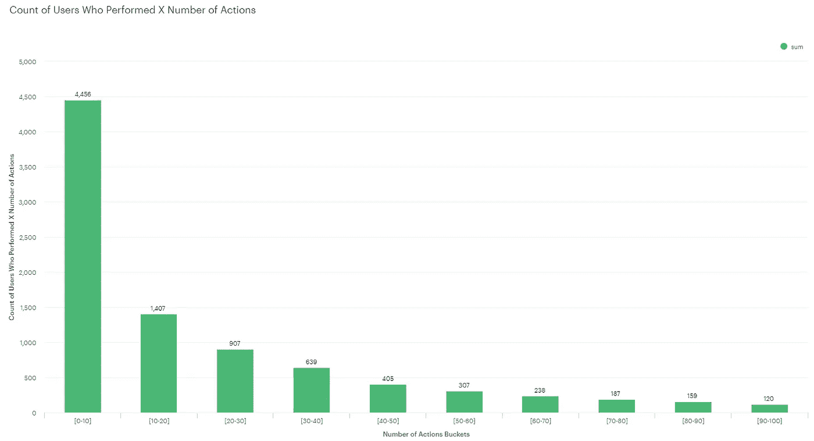
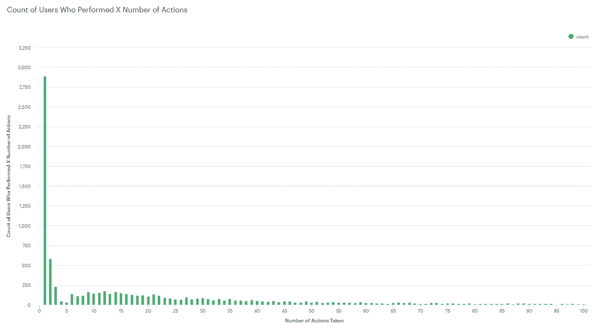

# 自学 SQL —第二部分

> 原文：<https://towardsdatascience.com/teach-yourself-sql-part-ii-c0916dd8d17d?source=collection_archive---------21----------------------->



Bucketed data

几周前，我决定写更多我作为数据分析师所学到的关于 SQL 和分析思维的东西。我在一家名为[的教育科技初创公司](http://springboard.com?utm_source=medium&utm_medium=blog&utm_campaign=teach_yourself_sql&utm_term=riley_article)工作，该公司致力于让学生在数据科学和 UX 设计等热门领域找到工作。

本文是这个系列的第二篇文章(见第一部分[此处](https://medium.com/@rileypredum/teach-yourself-sql-part-i-b85cb95aade3))。第一部分的目标是让您了解模式分析，并熟悉示例数据库中的基本 SQL。

在本文中，我将介绍以下内容:

1.  使用子查询更深入地研究 SQL。
2.  将事情联系到业务示例案例，以及如何从战略上对查询结果采取行动。
3.  展示一些例子，说明如何有效地用可视化表达这些查询的结果。

## 目标 1:总结和更多 SQL

回顾一下第一部分中的内容，我们在查询编辑器中设置了模式，并对 Yammer 实验表运行了一些基本的查询，使用了 SQL 的以下功能:SELECT、FROM、LIMIT、COUNT、GROUP BY、ORDER BY 以及 MIN 和 MAX。

这些对于获取汇总统计数据和理解您的数据非常有用。接下来让我们试着从数据中找出一个更复杂的商业问题！但是在我开始之前，我想分享一个提高效率的小技巧:

在大多数 SQL 编辑器和客户端(MySQL Workbench，我们一直使用的 GUI 模式分析平台，以及其他软件)中，查询的结尾用分号(；).在下一节中，我将写出几个查询，用注释(一个最佳实践)向您展示您可以在一个页面中有多个查询，并运行您想要的任何一个查询(在突出显示它或光标位于 SELECT 和分号之间的任何位置时运行`CTRL + Enter`,将只运行那个查询)。

这里有一个例子来说明我的意思:

```
-- This subquery produces the event type counts
SELECT 
      events.event_type AS event_type,
      COUNT(1) AS number_of_occurrences
FROM 
      tutorial.yammer_events AS events
GROUP BY
      events.event_type
;-- This subquery produces the count of actions by location
SELECT 
      events.location,
      COUNT(1) AS number_of_occurrences
FROM 
      tutorial.yammer_events AS events
GROUP BY
      events.location
ORDER BY
      COUNT(1) DESC
;-- This grabs the count of actions by device
SELECT 
      events.device,
      COUNT(1) AS number_of_occurrences
FROM 
      tutorial.yammer_events AS events
GROUP BY
      events.device
ORDER BY
      COUNT(1) DESC
;
```

两个破折号是单行注释。若要注释掉多行，请以“/*”开始，以“*/”结束。运行上述查询并检查输出，我们看到大多数操作都是约定。在这些数据中，美国、日本和德国是行动的前三名。最常见的设备是 Macbook Pro，其次是联想 Thinkpad，最后是 Macbook Air。

## 目标 2:将它与业务示例案例联系起来

将这个问题与一个商业案例联系起来:如果有一个 bug 同时影响了 OS X 和 Windows 的用户，那么技术团队最好先修复 OS X 的 bug，然后在修复 Windows 的时候再推出，因为这是可能受到影响的最大的两个用户群。

一个更详细的表也可能存储操作系统版本，这可以帮助开发人员确切地知道要修补什么版本。如果那些数据是可用的，当优先考虑首先解决哪个 OS 版本时，可以应用与上述类似的逻辑。

如果我们想弄清楚打开电子邮件的用户是否会表现出其他行为呢？我们需要探索更多，然后才能尝试找出要寻找的模式。

让我们看看用户采取的平均行动次数是多少。这将让我们对预期的参与量有所了解:

```
SELECT
      user_id,
      COUNT(1)
FROM 
      tutorial.yammer_events AS events
GROUP BY
      user_id,
      event_name
;
```

请记住，事件表是一个实际的事件表。因此，我们需要做的就是统计用户 id 并按用户 id 分组。等等，我们不是想要普通的吗？

让我们引入子查询的概念来获得该值！

子查询是查询中的一个查询。我花了一段时间才明白如何使用它们，直到我的同事解释了一个启发法，帮助我建立了正确的思维模式。之后就一拍即合了。

当您说 SELECT something FROM table 时，您正在查询该表并选择 SELECT 子句中指定的列。子查询返回所谓的**派生表**、**、**，这只是一种说法，即查询的输出是一个只在查询期间持续的表。就像查询任何表一样，您可以从该表进行查询，该表本身就是一个查询。我将从一个例子开始，这个例子在实践中没有意义，但是以一种简单的方式说明了这个概念。

```
SELECT
      user_id
FROM
(
      SELECT
            user_id
      FROM 
            tutorial.yammer_events AS events
) AS example_derived_table;
```

这应该是清楚的，并说明了为什么我学会了制表(即缩进)的方式。左括号和右括号在一条线上，所以你可以很容易地知道子查询从哪里开始和结束(相信我，有 10 或 20 个子查询，这是至关重要的！).

这个查询没有任何意义，但是它说明了这一点:我在 events 表中派生出一个用户 ID 表，并从中提取用户 ID。

您能猜到我们如何使用它来获得用户使用我们之前的 COUNT 查询所采取的平均操作数吗？

获取用户的动作计数，然后从中取这些计数的平均值！

```
SELECT
      AVG(action_count)
FROM
(
      SELECT
            user_id,
            COUNT(1) AS action_count
      FROM 
            tutorial.yammer_events AS events
      GROUP BY
            user_id
) AS example_derived_table;
```

这个返回 34.9！第一个用户只有几个，所以我怀疑有一个巨大的行动传播，实际上通常有高度参与和勉强参与的用户。所以让我们来数一数吧！

```
SELECT
      action_count,
      COUNT(1)
FROM
(
      SELECT
            user_id,
            COUNT(1) AS action_count
      FROM 
            tutorial.yammer_events AS events
      GROUP BY
            user_id
) AS example_derived_table
GROUP BY
      action_count
ORDER BY
      action_count
;
```

这将返回给我们动作的数量。最常见的是单个行动，这很有意义，因为少行动比多行动更容易。

在上面的子查询示例中，我在 FROM 子句中进行了子查询。但是可以在任何子句中进行子查询。我通常会在 JOIN 子句中编写一个子查询，因为我想将一些被操作的数据连接回某个基表。

## 目标 3:有效的可视化

通常，制作简单、易读的图表向企业的利益相关者传达信息是最有效的。假设你在一个产品分析团队工作，你的任务是展示用户参与度的分布。总共有多少用户执行 x 个操作？

我们已经有了产生这个结果的查询。然后，您可以在模式下，或者在将数据提取为 CSV 格式并导入 Python、Excel 或您喜欢的任何其他工具之后，用结果数据制作一个条形图！

在模式下，您只需使用您编写的查询，然后单击图表按钮并选择一个条形图。将从查询中导出的列拖动到 X 轴和 Y 轴上，这就是您的图表！



The count of users who performed X number of actions

这向我们展示了执行一个动作的用户数量巨大，而执行更多动作的用户数量却少得多。不过 X 轴并不理想，所以让我们重新查看一下查询，使用 CASE 语句和谓词逻辑为 X 轴创建更好的数据存储。这将允许我们为了可读性和简洁性而截断数据。

下面是在 X 轴上存储数据的 SQL 查询:

```
SELECT
      CASE
        WHEN action_count BETWEEN 0 AND 10 THEN '[0-10]'
        WHEN action_count BETWEEN 10 AND 20 THEN '[10-20]'
        WHEN action_count BETWEEN 20 AND 30 THEN '[20-30]'
        WHEN action_count BETWEEN 30 AND 40 THEN '[30-40]'
        WHEN action_count BETWEEN 40 AND 50 THEN '[40-50]'
        WHEN action_count BETWEEN 50 AND 60 THEN '[50-60]'
        WHEN action_count BETWEEN 60 AND 70 THEN '[60-70]'
        WHEN action_count BETWEEN 70 AND 80 THEN '[70-80]'
        WHEN action_count BETWEEN 80 AND 90 THEN '[80-90]'
        WHEN action_count BETWEEN 90 AND 100 THEN '[90-100]'
      END AS action_count_bucketed,       
      SUM(number_of_users)
FROM
(
    SELECT
          action_count,
          COUNT(1) AS number_of_users
    FROM
    (
          SELECT
                user_id,
                COUNT(1) AS action_count
          FROM 
                tutorial.yammer_events AS events
          GROUP BY
                user_id
    ) AS example_derived_table
    GROUP BY
          action_count
    ORDER BY
          action_count
) AS case_table
GROUP BY
      action_count_bucketed
LIMIT 10
;
```


Bucketed data

好多了！使用 case 语句并捕获值的范围，我能够简化这个图表。没有必要知道大约 20 个用户执行了 98 个动作。说 120 执行了 90 到 100 个动作就“够好”了！永远记住 80/20 法则，多少是足够的信息。

这张图表背后的故事是，你可以看到大多数用户并不十分投入，只有少数核心群体处于 10-20 到 30-40 个行动区间。下一步是使用日期时间列`occured_at`来讲述一个关于这些行为何时发生的更有趣的故事，并查看重要的产品参与度指标，如日活跃用户(DAU)、周活跃用户(WAU)等。

在本系列的下一部分中，我将更深入地研究如何使用日期时间值，敬请关注！

如果你觉得这篇文章有用或者学到了新的东西，[考虑捐赠](https://www.patreon.com/rileypredum)任何数量来支付给下一个学习者！

感谢阅读和快乐编码！

奢侈的生活