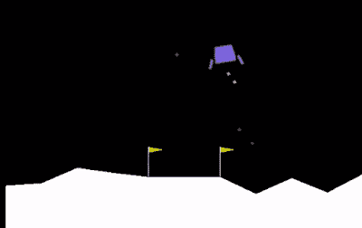

# 教电脑登陆月球

> 原文：<https://towardsdatascience.com/teaching-a-computer-to-land-on-the-moon-c168d551fc68?source=collection_archive---------25----------------------->



去年我花了相当多的时间来了解机器学习领域的进展。现在可用的工具真的令人印象深刻——现在，利用可用的库，只需几行代码就可以实现复杂的神经网络。

我一直对机器学习复杂任务的想法很感兴趣，比如通过一遍又一遍地做它们来学习飞行，并看看什么有效，所以我选择了 OpenAI Gym 月球着陆器环境进行第一次实验。进行学习和控制的程序被称为代理。

代理学习解决问题的正确方法，而没有被提供许多解决的例子，这是无监督学习。这样做的一个方法是建立一个培训环境，奖励做得好的代理人，这样代理人就可以强化这种行为。这叫做强化学习。

OpenAI 健身房提供了一个模拟不同问题的一致的训练环境——游戏、物理模拟等。它处理给出所需的奖励，以便代理可以学习。

有一个很好的库可以做到这一点，叫做 Keras-RL，它和 OpenAI Gym 配合得非常好。

下面显示了训练过程的视频，每隔一段时间采样一次。它从火箭坠毁时的有效随机发射发展到犹豫盘旋，再到平稳着陆。学习代理的代码如下。

The training process

该计划是第一次训练，这可能需要几天时间，如果你没有使用 GPU 加速。然后保存训练模型的参数，并由测试程序加载，该测试程序演示学习的着陆技术。在云系统或 GPU 加速桌面上进行培训将大大加快这一过程。

这些程序由 Keras-RL 演示代码修改而来。

```
import numpy as np import gym from keras.models
import Sequential from keras.layers 
import Dense, Activation, Flatten from keras.optimizers 
import Adam from keras.callbacks 
import EarlyStopping from rl.agents.dqn 
import DQNAgent from rl.policy 
import BoltzmannQPolicy from rl.policy 
import EpsGreedyQPolicy from rl.memory 
import SequentialMemory ENV_NAME = 'LunarLander-v2' env = gym.make(ENV_NAME) 
env = gym.wrappers.Monitor(env, 'recordings12') 
np.random.seed() env.seed() 
nb_actions = env.action_space.n # Next, we build a very simple model. 
model = Sequential() model.add(Flatten(input_shape=(1,) + env.observation_space.shape)) model.add(Dense(128)) model.add(Activation('relu')) model.add(Dense(64)) model.add(Activation('relu')) model.add(Dense(32)) model.add(Activation('relu')) model.add(Dense(nb_actions)) model.add(Activation('linear')) print(model.summary())# configure and compile our agent. memory = SequentialMemory(limit=1000000, window_length=1) 
policy = EpsGreedyQPolicy() 
earlystop = EarlyStopping(monitor = 'episode_reward', min_delta=.1, patience=5, verbose=1, mode='auto') 
callbacks = [earlystop] 
nb_steps_warmup = 1000 
target_model_update = .2 
gamma = .99 
lr = .0001 
training_steps = 4000000 
epochs = training_steps/1000 decay = float(lr/epochs) 
dqn = DQNAgent(model=model, nb_actions=nb_actions, memory=memory, nb_steps_warmup=nb_steps_warmup, target_model_update = target_model_update, policy=policy, gamma = gamma)dqn.compile(Adam(lr=lr), metrics=['mae']) # Train model 
dqn.fit(env, nb_steps=training_steps, visualize=False, verbose=1) # After training is done, we save the final weights. dqn.save_weights('dqn_{}_weights.h5f'.format(ENV_NAME), overwrite=True)
```

**测试程序**

```
import numpy as np 
import gym from keras.models 
import Sequential from keras.layers 
import Dense, Activation, Flatten from keras.optimizers 
import Adam from rl.agents.dqn 
import DQNAgent from rl.policy 
import EpsGreedyQPolicy from rl.memory 
import SequentialMemory ENV_NAME = 'LunarLander-v2' 
env = gym.make(ENV_NAME) 
env = gym.wrappers.Monitor(env, 'recordings2') 
np.random.seed() 
env.seed() 
nb_actions = env.action_space.n 
model = Sequential() model.add(Flatten(input_shape=(1,) + env.observation_space.shape)) model.add(Dense(128)) 
model.add(Activation('relu')) 
model.add(Dense(64)) 
model.add(Activation('relu')) 
model.add(Dense(32)) 
model.add(Activation('relu')) 
model.add(Dense(nb_actions)) 
model.add(Activation('linear')) 
print(model.summary()) 
memory = SequentialMemory(limit=75000, window_length=1) 
policy = EpsGreedyQPolicy() 
dqn = DQNAgent(model=model, nb_actions=nb_actions, memory=memory, nb_steps_warmup=10000, target_model_update=.2, policy=policy) dqn.compile(Adam(lr=.0001), metrics=['mae']) dqn.load_weights('dqn_{}_weights.h5f'.format(ENV_NAME)) dqn.test(env, nb_episodes=10, visualize=True)
```

*最初发表于*[T5【http://shortcircuitsandinfiniteloops.blogspot.com】](https://shortcircuitsandinfiniteloops.blogspot.com/2019/08/teaching-computer-to-land-on-moon.html)*。*