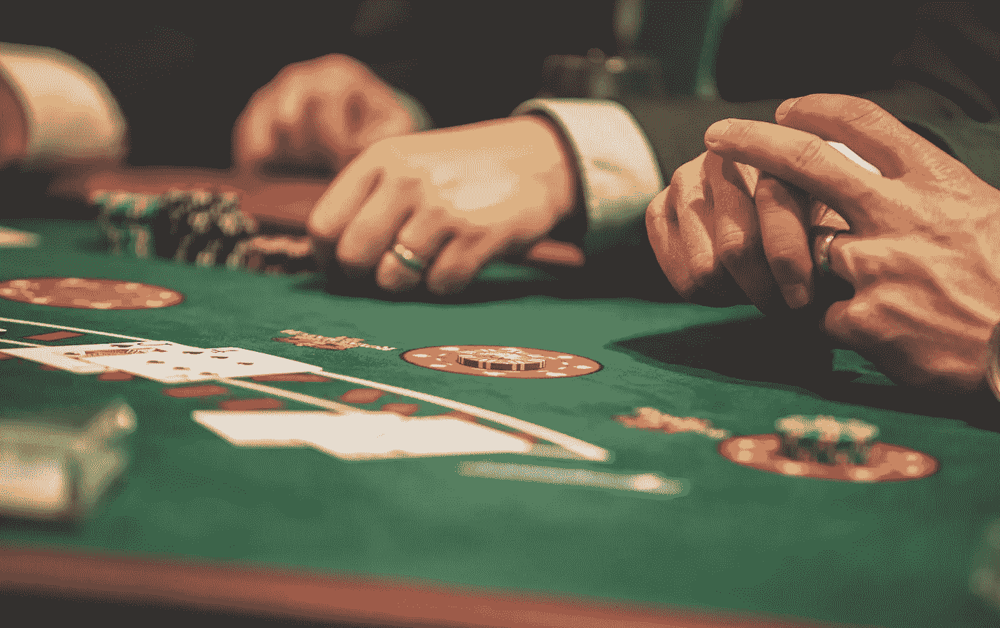
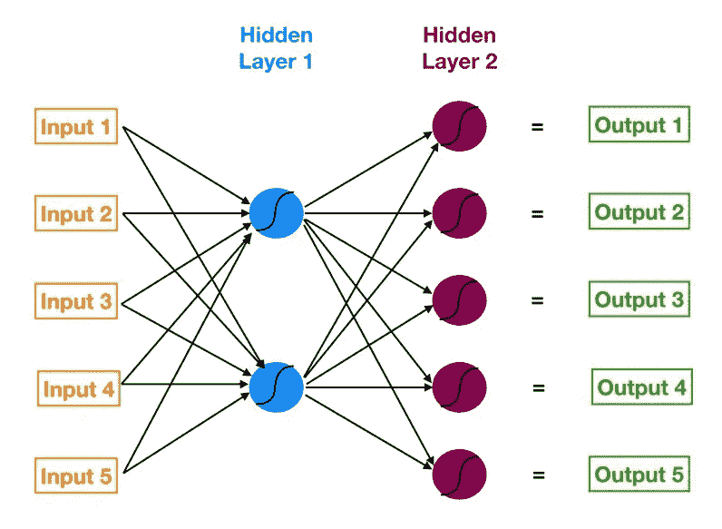
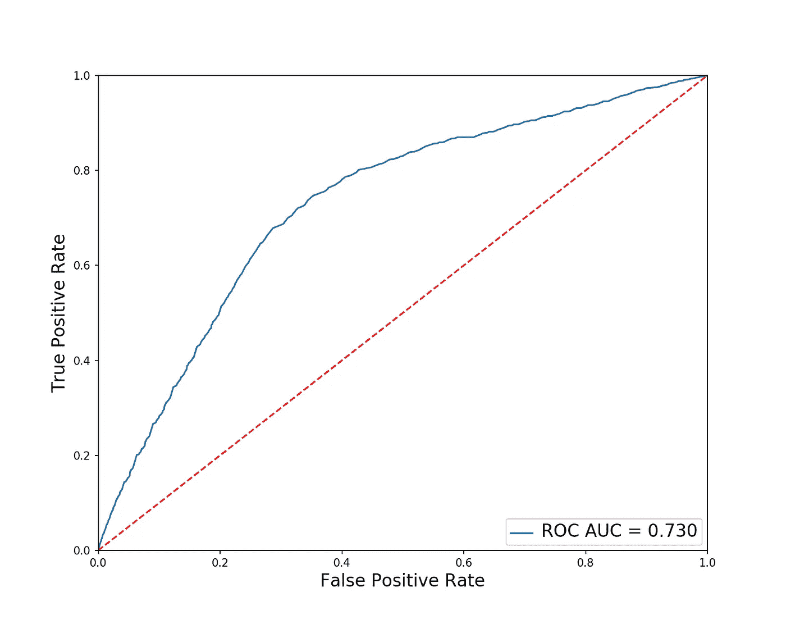
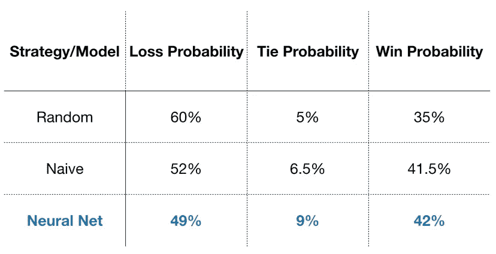
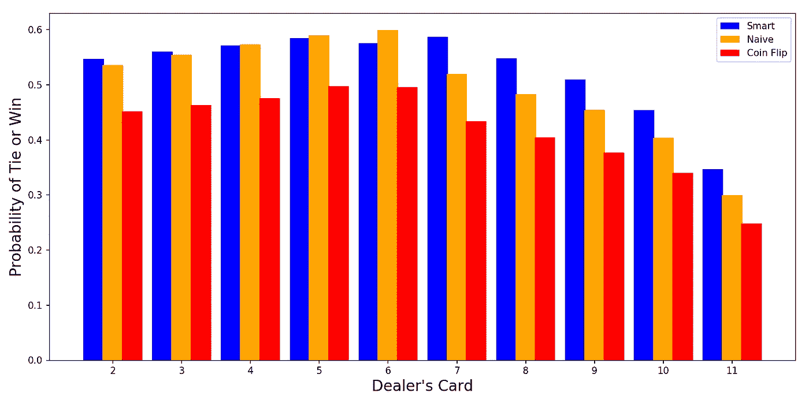
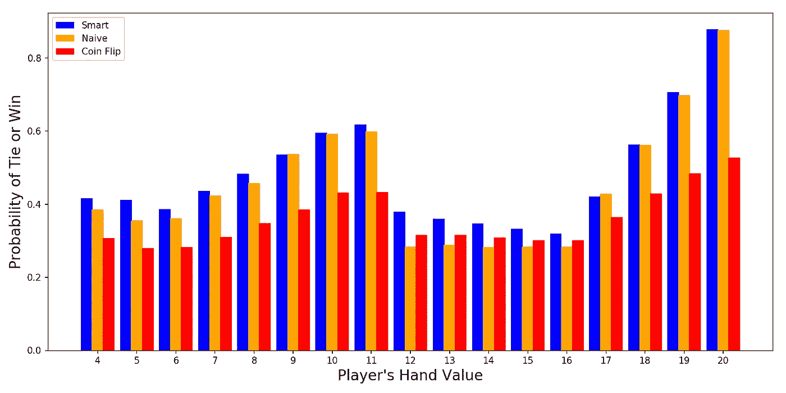

# 教神经网络玩 21 点

> 原文：<https://towardsdatascience.com/teaching-a-neural-net-to-play-blackjack-8ec5f39809e2?source=collection_archive---------9----------------------->



Photo by [Drew Rae](https://www.pexels.com/@drewrae?utm_content=attributionCopyText&utm_medium=referral&utm_source=pexels) from [Pexels](https://www.pexels.com/photo/person-playing-poker-1871508/?utm_content=attributionCopyText&utm_medium=referral&utm_source=pexels)

## 我们训练一个神经网络，看看应用深度学习是否可以改善我们的 21 点策略

上次我们开发了模拟 21 点的代码。通过这些模拟，我们发现了赌场优势的关键驱动因素。以下是我们之前发现的快速回顾:

*   **赌场通过强迫玩家在庄家之前行动(并根据不完全信息行动)来获得对 21 点玩家的优势。这首先让他们面临破产的风险**(所以他们可能在庄家有机会行动之前就破产了)。
*   **当玩家的牌总数在 12 到 16 之间(他们的下一张牌有被击败的风险)并且庄家亮出大牌时，他们尤其危险。**在这些情况下，假设庄家最终会有一手好牌，因此玩家必须命中或灭亡。我们可以直观地看到这一点，玩家获胜或平手的概率在 12 和 16 之间(**绝望之谷**)。


Probability of Win or Tie vs. Player’s Hand Value (21 not shown because the probability is 100%)

*   最后，我们观察到，一个天真的策略，即只有在失败的机会为零时才出手，极大地提高了我们击败赌场的几率，因为它将失败的风险完全转移到了赌场

如果你不熟悉 21 点这个游戏，[我之前的帖子也描述了这个游戏的玩法和规则。](/lets-play-blackjack-with-python-913ec66c732f)

# 但是深度学习能做得更好吗？

今天帖子的目标是，我们是否可以使用深度学习来获得比幼稚策略更好的策略。我们将:

1.  使用我们上次编写的 21 点模拟器生成数据(做了一些修改，使其更适合训练算法)。
2.  编码并训练神经网络玩 21 点(希望是最佳的)。

**如果你不熟悉神经网络，** [**我在这篇文章**中写了大量关于它们的内容(这是我最努力的一篇文章，所以请查看)。](/understanding-neural-networks-19020b758230)



A Visual Depiction of a Simple Neural Net (From [Understanding Neural Networks](/understanding-neural-networks-19020b758230))

在我们进入训练过程之前，让我们后退一步，快速讨论一下在这种情况下使用神经网络的利弊。**神经网络是高度灵活的算法，就像软粘土一样，神经网络可以自我调整以适应数据的轮廓，即使很少或没有转换。神经网络很容易处理会给线性回归等更严格的东西带来麻烦的数据。此外，网络中的层和神经元将学习数据中可能存在的任何深度嵌入的非线性关系。**

然而，这种多功能性是有代价的——神经网络是一个黑盒模型。与我们可以通过查看回归系数来了解模型如何做出决策的回归不同，神经网络没有这种透明性。**此外，神经网络有可能过于拟合我们的数据，而不能很好地概括样本数据。**在我看来，这些缺点值得牢记并设计安全措施，但它们不是回避使用神经网络的理由。

# 生成我们的训练数据

在我们可以训练我们的神经网络之前，**我们首先需要弄清楚如何组织我们的训练数据，以便我们用它建立的模型将是有用的。**

我们想预测什么？在我看来，我们的目标变量有两个候选者:

1.  输掉比赛的概率。在这种情况下，我们可能希望模型告诉我们损失的概率是多少。话说回来，这只有在我们可以增加或减少赌注的情况下才有用，而在 21 点中我们不能这样做。
2.  相反，我们希望我们的神经网络能够识别正确的动作，击中或停留。因此，我们的目标变量应该是“正确的行动是打击还是停留”。

事实上，我花了一段时间才想出设置它的最佳方式。但这是我想到的。

我们需要一种方法让神经网络知道给定的移动是否正确。不需要做到万无一失，只要大体正确即可。因此，我判断一个给定的走法是否正确的方法是模拟一场 21 点游戏:将牌发给玩家和发牌者，检查是否有人有 21 点，**只走一步(要么击中，要么留下)**，模拟游戏结束并记录结果。**由于模拟玩家只做出一个决定，我们可以通过他在游戏中是赢是输来评估该决定的质量**:

*   如果玩家击中并获胜，那么击中(Y=1)是正确的决定。
*   如果玩家击中并输了，那么留下(Y=0)是正确的决定。
*   如果玩家留下并获胜，那么留下(Y=0)是正确的决定。
*   如果玩家留下并输了，那么 hit (Y=1)是正确的决定。

这允许我们训练我们的模型，以便它的输出是一个是否击中或停留的预测。代码[与上次的](/lets-play-blackjack-with-python-913ec66c732f)类似，所以这里就不做详细概述了([你也可以在我的 GitHub 上找到这里](https://github.com/yiuhyuk/blackjack))。但是主要特征是:

1.  庄家面朝上的牌(另一张看不见)。
2.  玩家的总牌价。
3.  不管玩家有没有 a。
4.  玩家的动作(击或停留)。

目标变量是由上述逻辑定义的正确决策。

# 训练神经网络

我们将把 [Keras 库](https://keras.io/)用于我们的神经网络。让我们先把我们的进口商品放在一边:

```
from keras.models import Sequential
from keras.layers import Dense, LSTM, Flatten, Dropout
```

现在，让我们设置用于训练神经网络的输入变量。变量 feature_list 是我在上面列出的特性(X 变量)的列名列表。dataframe model_df 是我存储我运行的 21 点模拟的所有数据的地方。

```
# Set up variables for neural net
feature_list = [i for i in model_df.columns if i not in
                ['dealer_card','Y','lose','correct_action']
               ]
train_X = np.array(model_df[feature_list])
train_Y = np.array(model_df['correct_action']).reshape(-1,1)
```

实际实例化和训练我们的神经网络的代码行非常简单。第一行(第 1 行)创建顺序型神经网络，它是神经网络层的线性序列。第 1 行之后的行一个接一个地给我们的模型添加层(密集是最简单的层类型，只是一堆神经元)——像 16、128 等数字。指定每层中神经元的数量。

**最后对于最后一层，我们需要选择一个激活函数。这将神经网络的原始输出转换成我们可以理解的东西。**关于最后一层要注意两点。**首先，它只包括一个神经元，因为我们在两个可能的结果之间进行预测**(两类问题)。其次，我们使用 [sigmoid 激活](https://en.wikipedia.org/wiki/Sigmoid_function)，因为我们希望我们的神经网络像逻辑回归一样运作，并预测正确的举动是击中(Y=1)还是停留(Y = 0)——换句话说，**我们希望知道击中是正确举动的概率。**

最后两行告诉我们的神经网络模型使用什么损失函数([二元交叉熵](https://ml-cheatsheet.readthedocs.io/en/latest/loss_functions.html)是输出概率的分类模型使用的损失函数)，并使模型适合我们的数据。我没有花太多时间调整层或神经元的数量，但是如果有人要摆弄我的代码，我会建议将它们作为潜在的改进途径。

```
# Set up a neural net with 5 layers
model = Sequential()                         # line 1
model.add(Dense(16))
model.add(Dense(128))
model.add(Dense(32))
model.add(Dense(8)) 
model.add(Dense(1, activation='sigmoid'))    # final layermodel.compile(loss='binary_crossentropy', optimizer='sgd')
model.fit(train_X, train_Y, epochs=20, batch_size=256, verbose=1)
```

# 检验我们模型的性能

判断我们的模型是否增加了任何价值的一个快速方法是[使用 ROC 曲线(如果你想深入研究 ROC 曲线，请查看你的真实博客链接)。](/roc-curves-and-the-efficient-frontier-7bfa1daf1d9c)**ROC 曲线告诉我们，我们的模型在收益(真阳性率)和成本(假阳性率)之间的权衡有多好——曲线下的面积越大，模型越好。**

下图显示了我们玩神经网络的 21 点的 ROC 曲线——神经网络似乎比随机猜测增加了相当多的价值(红色虚线)。其曲线下面积或 AUC 为 0.73，显著高于随机猜测的 AUC(0.50)。



ROC Curve for Our Blackjack Playing Neural Net

我用我的训练数据画了 ROC 曲线。通常我们会希望使用我们的验证或测试数据来绘制它，但在这种情况下，我们知道只要我们的样本足够大，那么它就是总体的代表(假设我们继续用相同的规则玩 21 点)。我们希望我们的模型能够很好地推广(任何新数据都将与我们的训练数据具有相同的基本统计特征)。

# 该玩了！

在我们的神经网络可以正式开始赌博之前，我们需要给它一个决策规则。**记住，sigmoid 激活(来自我们最终的神经网络层)使我们的神经网络输出正确移动命中的概率。**我们需要一个决策规则，根据给定的概率，我们决定是打还是留。

我编写了以下函数来实现这一点 model _ decision 函数获取神经网络所需的特征，使用这些特征进行预测，并将该预测与预定义的阈值进行比较，以决定是成功还是失败。我用 0.52，因为我们从上次已经知道，对一个 21 点玩家来说，破产是最大的风险。因此，使用 0.52 作为命中的截止值使得我们的模型不太可能命中，因此不太可能失败。

```
def model_decision(model, player_sum, has_ace, dealer_card_num):
    input_array = np.array([player_sum, 0, has_ace,
                            dealer_card_num]).reshape(1,-1)
    predict_correct = model.predict(input_array)
    if predict_correct >= 0.52:
        return 1
    else:
        return 0
```

现在我们只需要将上述函数添加到我们的代码中，在这里我们决定是否点击([如果你想知道我是如何编写这部分代码的，请参考我的 GitHub](https://github.com/yiuhyuk/blackjack) )。因此，当决定要做什么时，神经网络将根据庄家正在展示的牌、自己手中牌的总价值以及它是否持有 a 来做出决定。

# 我们的模型相当不错！

最后，让我们比较一下我们的神经网络在简单策略和随机策略下的性能。提醒大家:

*   我对每种策略类型(神经网络、朴素策略和随机策略)进行了大约 300，000 次 21 点模拟。
*   **天真的策略是只有在没有机会击败**的时候才出手(出手总数低于 12 的时候出手，出手总数超过 12 的时候继续出手)。
*   **随机策略是抛硬币**——如果正面朝上，否则留下。如果你击中了，但没有失败，那么再掷一次硬币，重新开始整个过程。

让我们看看我们的神经网络是否能够找到更好的策略。下表显示了每种策略类型的结果分布。有两件事引起了我的注意。**首先，我们的神经网络只输了略少于一半(49%)的游戏。**虽然我不认为这是赢了，但对于一场赔率对你不利的比赛来说，这已经相当不错了。第二，它实际上并没有比天真的策略更常获胜，而是能够迫使更多的平局。



Outcome Breakdown by Strategy

我们还可以看看这些策略在我们的关键特征(庄家牌和玩家手牌总数)中的表现。首先，让我们看看庄家的牌对我们三种策略的胜算或平手概率的影响。在下面的图中，如果庄家正在展示一张低牌，我们的神经网络的表现和天真策略差不多。但当庄家亮出更高的牌(7 或更多)时，我们的神经网络表现明显更好。



Probability of Tie or Win vs. Dealer’s Shown Card (Taller Bars are Better!)

我们可以看看赢或平的概率是如何随着玩家的初始手牌总数而变化的。这看起来很有希望——我们的神经网络在各方面的表现一样好，甚至更好。而且不像在绝望谷(玩家手牌值在 12 到 16 之间)表现甚至比随机猜测更差的天真策略，我们的神经网络表现更好。



Probability of Tie or Win vs. Player’s Initial Hand Value (Taller Bars are Better!)

最近的情节暗示了神经网络如何能够超越天真的策略。天真的策略(因为我们是如何编码的)是不愿意在任何时候冒险，哪怕有一丁点失败的风险。另一方面，神经网络会定期点击 12、13、14 或 15。更细致的决策和承担可计算风险的能力似乎使其有别于天真的策略。


Tendency to Hit of Neural Net and Naive Strategy vs. Player’s Initial Hand Value

我们可以看看当玩家的手牌总数在 12 和 16 之间时，神经网络会做什么，以尝试改进我们的天真策略(并且不会给赌场输掉那么多钱)。

看起来，当庄家亮出大牌(8、9 或 10)时，玩家更倾向于出手。但是，即使当庄家展示像 3 这样的低牌时，神经网络仍然有 60%的时间选择击中——这是因为神经网络在做决定时考虑了它拥有的所有特征。**所以看起来我们不能轻易地将其决策提炼为几条简单的经验法则。**


Neural Net’s Frequency of Hitting vs. Dealer’s Shown Card

# 结论

希望这篇文章给了你一个关于机器学习如何在现实生活中帮助决策的体面介绍。当您训练自己的模型(无论是决策树、回归还是神经网络)时，请记住以下几点:

*   **我的目标变量是否以这样一种方式构建，如果我能预测它，那么我就能解决我的问题？**在你开始收集数据和建立模型之前，确保你预测的是正确的事情是至关重要的。
*   **新数据与我训练过的数据有什么不同？如果差异很大，那么统计模型甚至可能不是你问题的正确答案。至少你必须认识到这一点，并建立安全措施，如规范化和严格的(以及诚实的)验证，以及你的模型的测试集基准。**
*   **如果不能理解模型是如何做出决策的，那么除了使用模型训练过程中获得的测试数据进行严格测试之外，您就无法理解和检查模型的决策**。

关于 21 点最后说一句。我大概有一段时间不会再写赌博了(我想探讨的其他话题太多了)。但是如果有人对使用或不使用我的代码感兴趣，这里有几个这个项目的潜在有趣的扩展:

1.  尝试通过更优化的神经网络结构来改进模型，或者添加用于拆分 ace 的代码(我没有将此构建到我最初的模拟器中)，或者选择比我使用的基本功能更好的功能。
2.  给模型算牌的能力，看看这对一副牌和六副牌的情况(这是维加斯的标准)的性能有何影响。

希望你和我一样对此感兴趣。干杯！

***我最近的一些帖子，希望你看看:***

[*让数据科学面试变得更好*](/making-data-science-interviews-better-f6bba15d02df)

[*您的公司真的是数据驱动的吗？*](/is-your-company-truly-data-driven-2cf5feaa3cfb)

[*数据科学家面临自动化的风险吗*](/is-the-data-science-profession-at-risk-of-automation-ae162b5f052f)

[*数据科学家挣多少钱？*](/how-much-do-data-scientists-make-cbd7ec2b458)

[*数据科学家赚多少钱第二部*](/how-much-do-data-scientists-make-part-2-cb959a0d05f)

[*软件工程师挣多少钱？*](/how-much-do-software-engineers-make-60565f50f579)