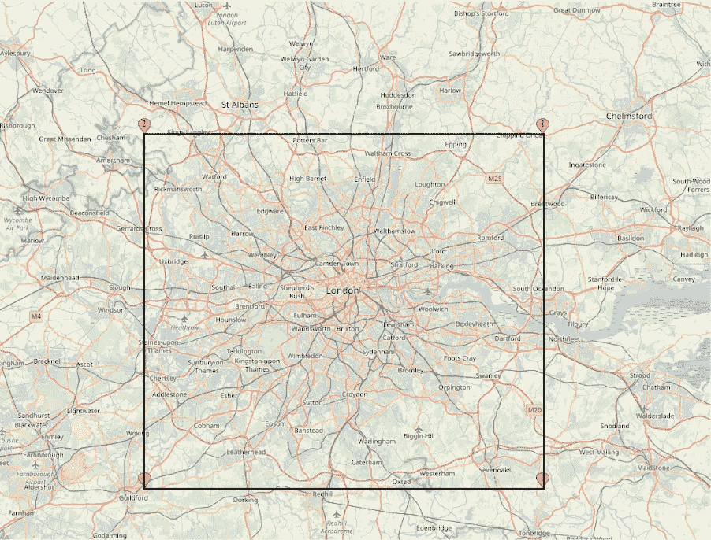
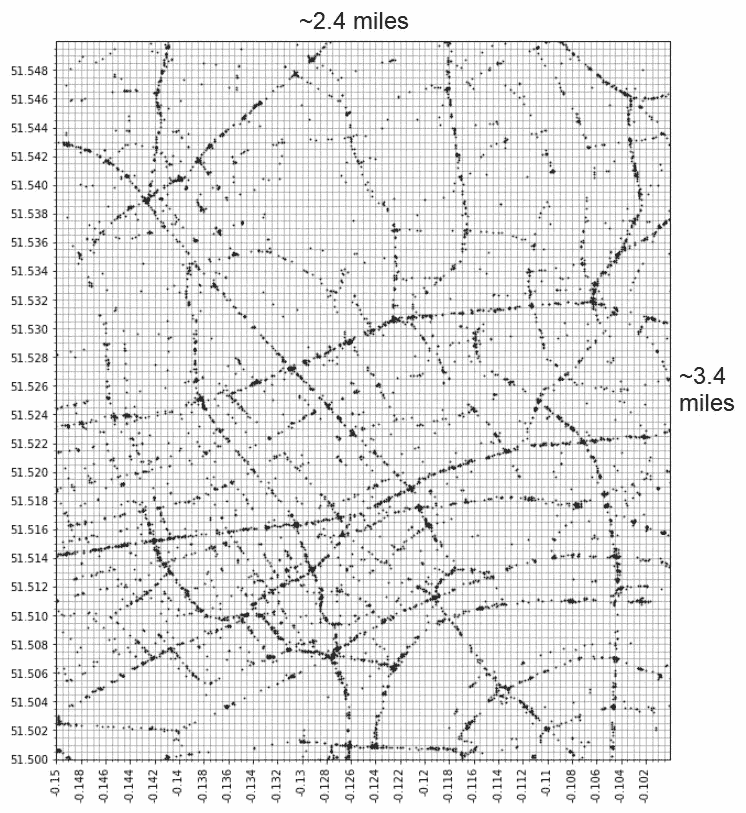
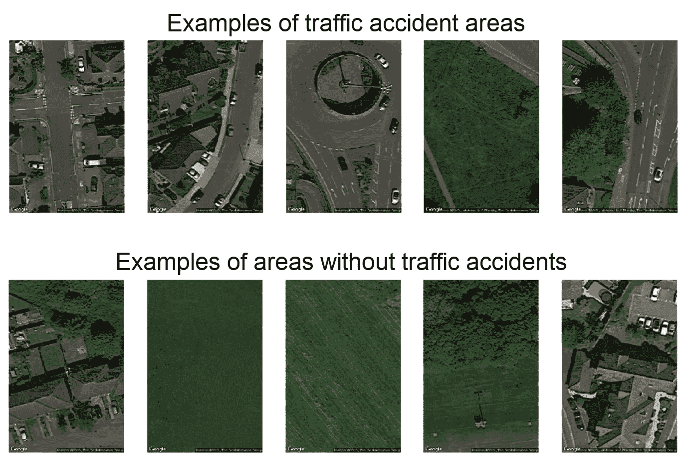
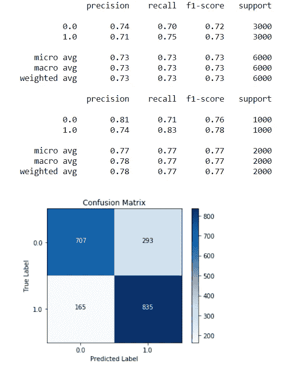

# 教神经网络看道路

> 原文：<https://towardsdatascience.com/teaching-a-neural-network-to-see-roads-74bff240c3e5?source=collection_archive---------8----------------------->

## 用卫星图像和卷积神经网络预测交通事故的位置

Source: [https://www.tbftraffic.com/traffic-management-london/](https://www.tbftraffic.com/traffic-management-london/)

# 问题是

全世界每年约有 125 万人死于道路交通事故，另外还有 2000 万至 5000 万人受伤或致残。如果交通事故的位置可以预测，这可能会产生巨大的有益影响，有助于减少每年的事故数量。例如，路由软件可以避开最危险的区域——特别是在无人驾驶汽车即将到来的背景下。它在保险领域也很有用，可用于预测风险，也可用于政府和地方公路局，以创建更高效的道路维护和改善系统。

# 解决方案

带着这个想法，我最近与[陈山眉](https://medium.com/u/a281957a0cca?source=post_page-----74bff240c3e5--------------------------------)完成了一个项目，试图解决这个问题，使用各种形式的深度学习来预测交通事故可能发生的地方。我们对回答这个问题特别感兴趣:

> 使用卫星图像能提高模型预测交通事故的能力吗？

我们总共建立了三种类型的模型来预测交通事故的各个方面:

1.  使用交通事故、人口密度和交通的结构化数据来尝试和预测事故的严重程度
2.  使用卫星图像来尝试和预测一个地区是“安全”(无交通事故)还是“危险”(交通事故)
3.  一种奇特的混合数据模型，将在结构化数据上训练的多层感知器和在卫星图像上训练的卷积神经网络的输出组合成最终的神经网络层头

这篇文章是关于模型 2，以及我们如何建立一个卷积神经网络(CNN)来预测一个给定区域在交通事故方面有多危险(但不用担心，花哨的模型 3 将是未来博客帖子的主题——它相当糟糕)。

# 数据

我们选择伦敦作为我们的试验场——部分是因为英国国家统计局有一些关于交通事故、人口和交通的非常全面的高质量数据；部分原因是伦敦是一个大城市，由市中心区、郊区和大小道路组成，这为训练提供了各种各样的图像；部分原因是因为我住在这里，不被车撞是我的既得利益。

该项目的完整代码可以在我的 [GitHub repo](https://github.com/L-Lewis/Predicting-traffic-accidents-CNN) 中找到。数据来源包括[英国运输部(DfT)的道路安全数据](https://data.gov.uk/dataset/cb7ae6f0-4be6-4935-9277-47e5ce24a11f/road-safety-data)、 [DfT 的道路交通统计](https://data.gov.uk/dataset/208c0e7b-353f-4e2d-8b7a-1a7118467acc/gb-road-traffic-counts)(是的，我们确实雇佣了一些人站在街角数汽车)、来自[英国 2011 年人口普查的数据](https://www.nomisweb.co.uk/census/2011/ks101ew)，以及由[谷歌地图静态 API](https://developers.google.com/maps/documentation/maps-static/intro) 提供的卫星图像。

# 该方法

我们选择的区域是我在 M25 号高速公路外侧画的一个正方形，M25 号高速公路是环绕伦敦的大型高速公路(对我的美国观众来说是高速公路)，目的是为了包括各种各样的道路类型:

为了得到一组不重叠的“危险”和“安全”区域，通过将伦敦分成 0.0005 纬度 x 0.0005 经度的正方形来创建和使用网格系统。这导致了 56 米高(纬度)和 35 米宽(经度)的网格正方形(技术上是矩形)，类似于通常用于交通事故分析的 30 米×30 米[。](https://pdfs.semanticscholar.org/ef28/efaa43a05be548ed61d52a6bd590b88e7782.pdf)

下图显示了叠加在伦敦市中心交通事故地点地图上的方格系统，以提供比例感(事故地点相当有效地追踪了道路系统):

Bonus points if you can spot the Strand and the Thames

一旦我们有了全部方格的列表，我们就使用事故数据集来计算出哪些方格在过去五年中发生过或没有发生交通事故。这些成为我们的“危险”和“安全”类。然后，我们使用[谷歌地图静态 API](https://developers.google.com/maps/documentation/maps-static/intro) 下载 5000 个“危险”区域和 5000 个“安全”区域的随机样本中每个方块的图像。

下面的图片显示了从每个班级的随机样本中下载的前五张图片。它们表明，危险区域包括郊区的道路、较大的道路和交叉路口(例如，在英国非常常见的环形路)，但并非所有图像都一定只是道路，例如，第四幅图像也包含事故发生道路旁边的绿色区域。

安全区域包括没有道路的绿色区域(不足为奇)，但也包括有道路的郊区区域，这些区域与发生事故的区域有相似之处。这些图像对 CNN 来说可能更难分类，但对它来说也很重要，因为它们意味着 CNN 不仅了解道路和田野之间的差异，还了解不同类型道路之间的差异。

# 模型

我们尝试了三次 CNN 迭代，试图产生最精确的模型。我们尝试的第一个版本是一个相当简单的 CNN 模型架构，使用 Keras，在最终的 sigmoid 激活层之前有三对 Conv2D 和 MaxPooling2D 层以及一个密集层。它做得相当好，测试准确率(平均 F1 分数)为 72%，没有过度拟合。

这是我们基线模型的代码:

对于我们模型的第二次迭代，我们在 VGG19 预训练模型的基础上构建了 ImageNet 权重，并通过在输出的基础上训练新的分类器之前首先运行我们的图像来提取特征。我们达到了 74%的测试准确率，但是有明显的过度拟合(即训练集达到了更高的准确率)。

对于我们的最后一次迭代，我们使用 L1 正则化来尝试和克服过度拟合。为了尝试和提高准确性，我们增加了图像输入的大小，并添加了一个额外的密集层到分类器头只是为了更好的测量。

# 结果呢

最后一次迭代是我们最好的模型，达到了 77%的准确率和最小的过度拟合。构建模型的代码有点复杂(没有双关语的意思)，但是在我的 GitHub repo 的 [notebook 6](https://github.com/L-Lewis/Predicting-traffic-accidents-CNN/blob/master/6_Model2_CNN.ipynb) 中可以找到。结果如下:

Classification reports (top is the training set, bottom is the test set) and confusion matrix for the final model

我想改进的主要方面是提高召回率，降低误报率——预测 1 =安全，而实际上该区域为 0 =危险。在这种情况下，与预测实际上安全的危险区域的模型相比，这些类型的错误可以被视为成本更高。

# 今后

为了尝试和提高模型的准确性并完全消除过度拟合，可以在进一步的模型迭代中尝试以下一些方法:

*   下载更多图片用于培训
*   使用不同的预训练模型，如 ResNet50，该模型已在其他 CNN 中用于卫星图像(如[此处](https://www.researchgate.net/publication/331557018_Convolutional_Neural_Network_for_Satellite_Image_Classification)和[此处](https://medium.com/data-from-the-trenches/object-detection-with-deep-learning-on-aerial-imagery-2465078db8a9))
*   冻结预训练模型的特定层，并微调其他层
*   在预训练模型的顶部改变密集连接的分类器的架构(例如，添加更多层或节点)

然而，仅从卫星图像就能正确预测一个地区是否可能发生交通事故的概率为 77%,这仍然令人印象深刻。

感谢阅读——我希望你发现这是一个有趣的话题！将来，我会写我们如何将这个模型与结构化数据结合起来，创建一个非常酷的混合数据神经网络。如果你有兴趣阅读更多，你可以订阅我在 Medium 上的博客，当下一篇文章发表时，你会得到通知。