# 教一个排外的人工智能健康检查员，和机器学习的伦理

> 原文：<https://towardsdatascience.com/teaching-a-xenophobic-ai-health-inspector-and-the-ethics-of-machine-learning-b644d72376f?source=collection_archive---------36----------------------->

## 基于德克萨斯州奥斯丁的健康检查分数，并受到这篇关于纽约州水塔检查的媒体文章的启发。

前言:我并不反对我在这篇文章中作为例子的任何一家餐馆，我积极地在所有这些餐馆吃饭。

请继续阅读这些预测的来源！

# 介绍

我是一名奥斯汀人，一名 UT Austin 的学生，一名脸书的实习生，一名有抱负的数据科学家。

关于数据科学项目，我已经意识到的一件事是底层数据的重要性。

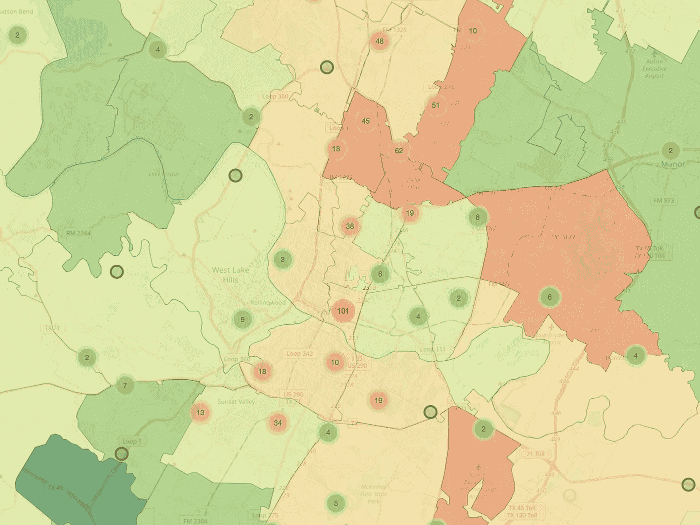

Score average by ZIP Code + Individual Scores

使用对你来说重要的数据既能给你领域的专业知识来发现有洞察力的结果，又能增加你在项目上工作的动力。

这个数据集与我密切相关，因为我在许多这样的餐馆吃过饭，有些得分较高，有些得分较低。

# 假设

我认为训练一个机器学习模型来预测仅仅基于**餐馆名称**的**健康检查分数**会很有趣。我有一种感觉，由此产生的模式最终将是一个排外的模式，比如认为中国餐馆很脏。


Spicy Fish Fillet at Asia Cafe, **Average Score: 76.75**

在奥斯汀我最喜欢的餐馆中，我敢肯定一些低端餐馆的卫生检查分数会低于理想水平。我相信我的“直觉”(字面和隐喻)，无论如何都会去那里吃。

# 数据探索

为了确定我想如何对问题建模，我从探索和理解数据集开始。

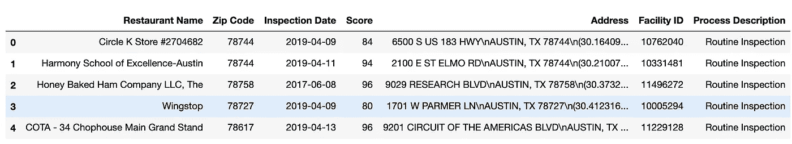

df.head()

其特点是:

```
'Restaurant Name', 
'Zip Code', 
'Inspection Date', 
'Score', 
'Address',
'Facility ID', 
'Process Description'
```

**设施 ID** 、**地址**和**餐厅名称**对于每个餐厅应该是唯一的。

我对差评餐厅的**餐厅名称**感兴趣，我将“差评”设为 85 分及以下，并生成了一些**单词云**。

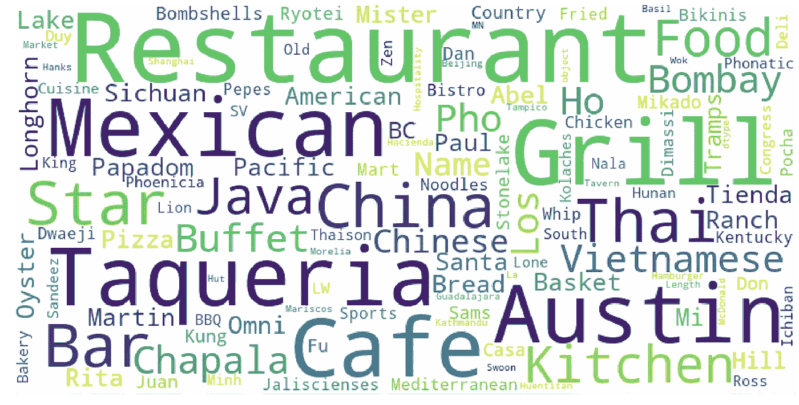

根据我的经验，这听起来不错。在这一点上，我开始意识到教授一个模型的伦理含义，即名称中带有“taqueria”的餐馆比名称中带有“pizza”的餐馆的健康检查分数更差。我后来在**建模**部分捕捉到了这个想法，并对其进行了讨论。

每个餐厅可能都有过几次检查。随着时间的推移，我对变化不感兴趣，所以我取消了**检查日期**，用**平均分数**代替了**分数**。

```
groupby = df.groupby("Facility ID")['Score']means = groupby.mean()df_mean = df_mean.join(means, on="Facility ID", how="right")df_mean.drop(columns=["Scorel"], inplace=True)df_mean.rename({"ScoreR": "Average Score"},)df_mean.drop(['Inspection Date'])
```

**地址**有 3 行

```
6500 S US 183 HWY
AUSTIN, TX 78744
(30.164092387667438, -97.69352171343812)
```

第一行是街道地址，
第二行是德克萨斯州奥斯汀的邮政编码，
第三行是字符串格式的**(纬度，经度)**。

我想把坐标提取到浮点数中，用于我的可视化。如果我真的关心我们的模型的性能，我也可以提取街道名称作为一个特征，因为街道名称可以给我们提供关于邻居的上下文。

```
def extract_lat(x):
    lst = x.**split**('\n')

    string = lst[2]
    #substring cuts off the leading and tailing brackets
    string = **string[1:-1]**
    #split to the lat and long  
    pair = string.**split(',')**

    return **float(pair[0])**

def extract_long(x):
    ... similar
    return **float(pair[1])**lat = df3['Address'].**apply(extract_lat**)long = df3['Address'].**apply(extract_long**)df3['lat'] = lat
df3['long'] = long
```

**邮政编码**是一个有趣的分类变量，我稍后也可以在可视化中使用它。

```
['78744' '78758' '78727' '78617' '78701' '78745' '78751' '78757'   '78750' '78756' '78753' '78748' '78705' '78746' '78704' '78721' '78613' '78738' '78741' '78702' '78739' '78724' '78759' '78734' '78723' '78703' '78735' '78729' '78728' '78731' '78752' '78749' '78754' '78669' '78722' '78660' '78732' '78725' '78653' '78730' '78641' '78747' '78726' '78719' '78652' '78733' '78717' '78736' '78620' '78737' '78654' '78742' '78610' '78621' '78615']
```

然后我开始观察这些特征的分布:

我看了检查分数直方图，很多 100 分(耶)，左尾(恶)。

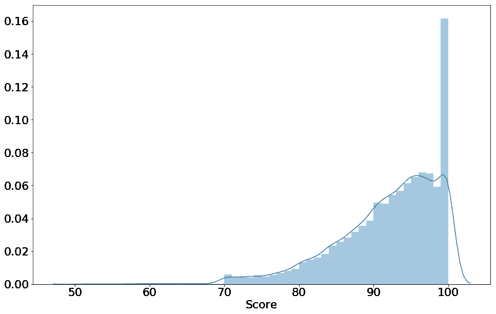

Histogram of scores

另一件有趣的事情是查看每个**邮政编码**的分布情况，是否有些邮政编码比其他的更脏？I **根据**邮政编码**聚合**，并为每个邮政编码绘制一个图表

```
for _, row in df_agg.iterrows():
    if row['total_facilities'] > 10:
        zipcode = row['Zip Code'] df_zip = df_mean[df_mean['Zip Code'] == zipcode]

        sns.distplot(df_zip['Average Score'])
```

大多数分布看起来像是 **78704** 分布， **78719** 看起来更像是**双峰**分布，这是令人不安和有趣的。

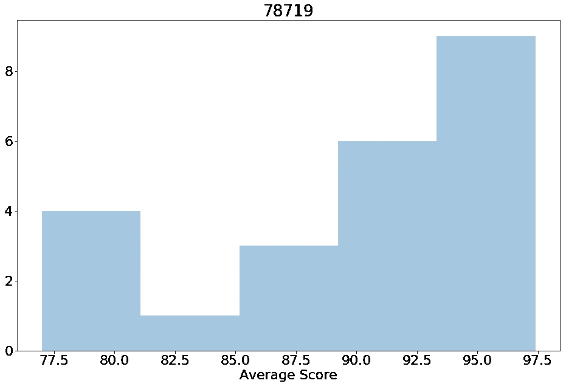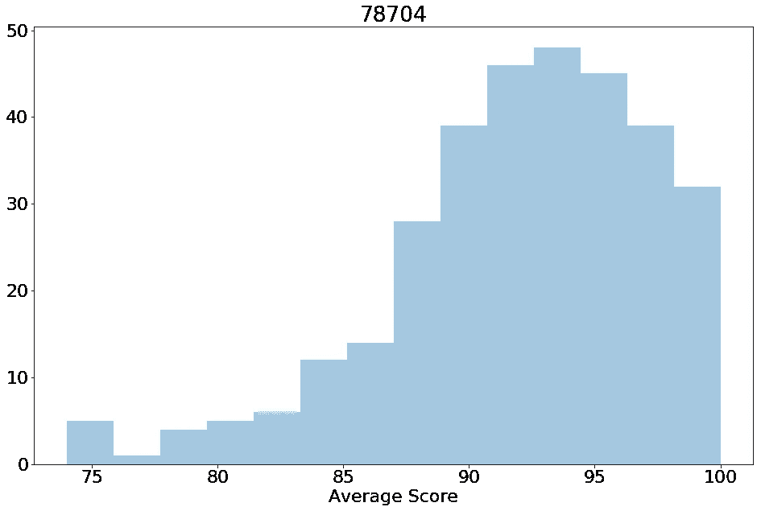

## 地图

好了，玩够了 **seaborn** 和 **matplotlib** 。这些信息本质上是地理上的，所以构建一些地图是非常有意义的，我使用**叶子**和 **plotly-Express** 来实现这些可视化。完整的笔记本将被链接，所以我跳过一些细节。

首先，让我们看看地图上所有的分数。我用 **plotly-express** 来做这个。

```
px.**scatter_mapbox**(df3, lat="lat", lon="long",
                  **color="Score**",hover_data=['Score'], zoom=14)
```


接下来，看看**每个邮编的平均得分**结合**个人得分**不是很有趣吗？我为此使用了**叶子**，因为 **Plotly-express** 不支持 **geoJSON** (邮政编码形状)。

我使用了一个 **groupby** 和 **agg** 来计算每个邮政编码的平均得分。

我找到了一个德克萨斯州的邮政编码 **geoJSON** ，我用它和叶子根据平均分数给每个邮政编码着色。

我想在地图上标出每家餐馆。与 plotly-express 不同，follow 不会渲染超过 1000 个标记，所以我不得不使用 **MarkerClusters。**

这就是结果。

FFFFFolium’s nauseating cluster animation, sorry!


Score average by ZIP Code + Individual Scores

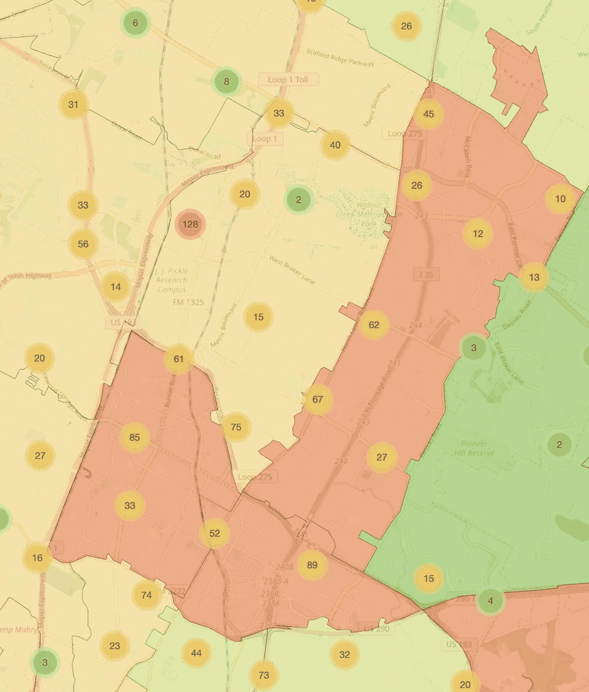

Mopac，Lamar 和 I 35 走廊似乎很脏。

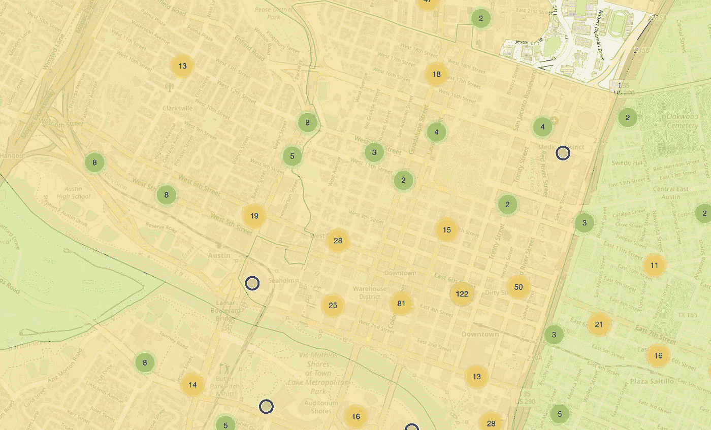

第六街和市中心也是如此。

# 建模

现在我对数据有了更多的了解，我应该有更多的背景来开始建模。

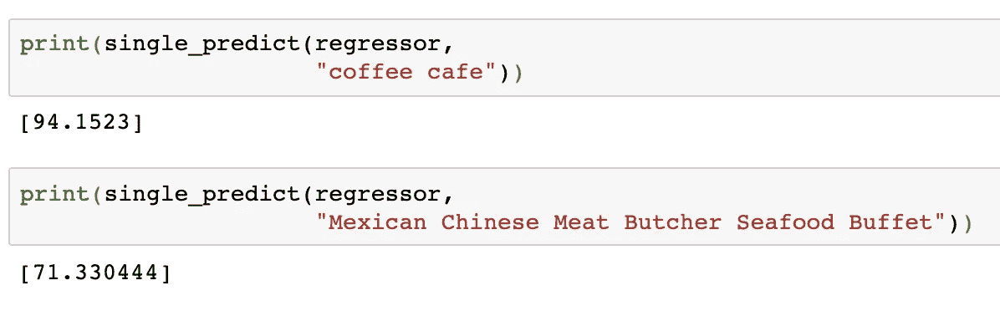

My Xenophobic model at work! I wouldn’t want to eat a at a “Mexican Chinese Meat Butcher Seafood Buffet” either

我想尝试做的是建立一个模型，让**只根据**餐馆名称**预测**检查分数**。我有一种感觉，即“民族”餐馆与较差的健康检查分数相关，我想说服一个模特了解这一点。**

**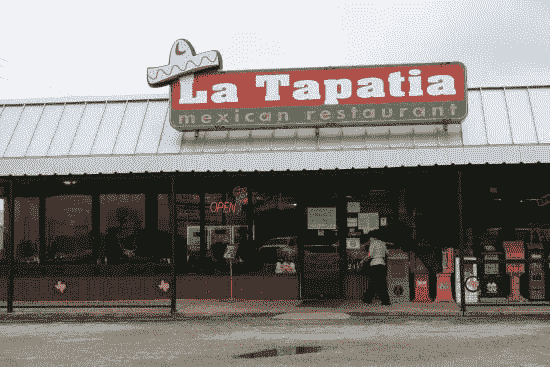**

**How do I get a model to know this is a mexican restaurant?**

## **自然语言处理**

**NLP 意味着以人类能够理解的方式来表达语言的含义。**

**餐馆名称包含关于它们是什么类型的餐馆的信息,“taqueria”是与“四川”餐馆不同类型的餐馆，等等。**

**我可以使用 **TF-IDF** 将这些信息传递到模型中。**

**TF-IDF 考虑了我们的数据集中所有单词的词汇，并且根据该单词在整个数据集中的频率来衡量该单词在每行数据中的存在。**

**如果“cafe”这个词很常见，而“carniceria”这个词不常见，TF-IDF 会认为“carniceria”比“cafe”有更多的含义**

**应用到我们的问题，我敢打赌，一些餐馆听起来像他们有更差的食品检查分数比其他人。**

**凭直觉， **TF-IDF** 会找到一家名为 ***【墨西哥中式肉店海鲜自助餐】*** 的餐厅，比 ***【咖啡厅】*** 包含更多的信息。**

****

**One of the dingiest looking restaurants I have ever been in, but the food is great. **Score: 89****

## **预处理:**

**餐馆名称对于文本字符串来说非常短。我必须小心地预处理我们的数据，明智地选择我们的技术来充分利用数据。**

**n-gram 是由 n 个单词组成的短语，“taco”是 1-gram，“taco joint”是 2-gram。**

**考虑到作为文本形式的数据的餐馆名称很短，我将 TF-IDF 限制为 n-grams==1，就像只使用像“taco”和“joint”这样的单词一样。**

**我可以做的另一种形式的预处理是从我们的餐厅名称中删除数字和符号，“棒约翰的#928”变成了“棒约翰”。**

****

**Food from Asters**

## **建模:**

**我使用了 XGBoost，一个非常通用的模型。**

**我还得决定如何表达这个问题。**

****回归:** 如果我将问题表述为回归，我可以将目标变量设置为分数。**“给定一个餐厅名称，预测它的卫生检查分数”****

**或者，我可以通过为一个令人讨厌的分数设置一个阈值，比如低于 85 分，来把这个问题表述为分类。**“给定一家餐馆的名字，预测它在卫生检查中得到“坏分数”的几率”****

**我选择了 85 分而不是 70 分(不及格)，因为不及格的分数很少，我不想要极度不平衡的班级。**

```
# Get the tfidf vectorstfidf_vec = **TfidfVectorizer**(stop_words='english', norm='l2', ngram_range=(1,1))tfidf_vec.**fit_transform**(X['restaurant_name'].values.tolist())train_tfidf = tfidf_vec.**transform**(X['restaurant_name'].values.tolist())regressor = xgb.XGBRegressor()
regressor.**fit**(train_tfidf, df4['score'])classifier = xgb.XGBClassifier()
classifier.**fit**(train_tfidf, df4['score'] < 85)eli5.**show_weights**(classifier, vec=tfidf_vec)
```

****来自分类器的权重，这些是与低于 85 的“坏分数”相关的单词****

**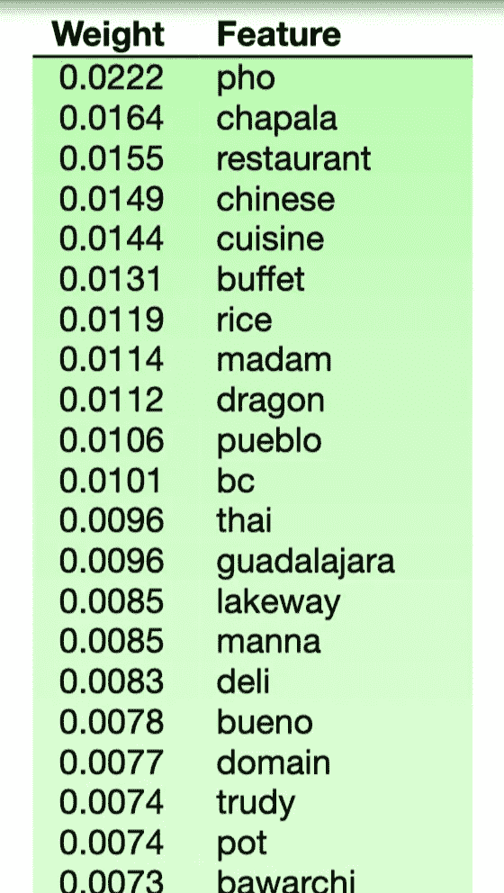**

**TF-IDF 和 XGboost 的好处是，该模型非常容易理解，您可以很容易地看到与低于 85 的“糟糕分数”直接相关的单词，结果与预期的一样，并且与早期的单词云相似。**

**我使用全部数据进行训练，所以让我们用一些任意数据来测试模型。**

**回归器根据输入字符串预测得分。以下是我发现的一些有趣的预测结果。**

**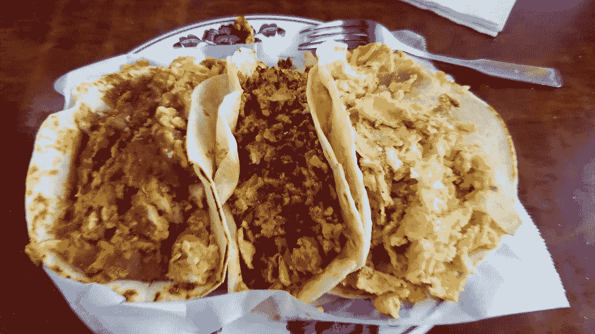**

**$4 for 3 Breakfast Tacos, La Tapatia, **Score: 87.5,** I have been coming here for years**

**显然，奥斯汀的一些餐馆往往比其他餐馆更脏，我一直通过查看数据和我们的模型来怀疑这一点。**

# **伦理学**

**这整个数据集有很多有趣的伦理考量。**

****准确性与社会危害:**
好吧，也许一些餐厅往往不如其他餐厅干净，这是否意味着我可以允许人类或人工智能健康检查员针对这些类型的餐厅？**

****

**准确性和不公平地针对某些人群之间的权衡。**

**有人可能会说防止顾客生病很重要。**

**另一个人可能会争辩说，针对特定类型的餐馆是荒谬的，因为“数据就是这么说的”**

**最佳解决方案取决于它是什么类型的问题。**

**在招聘时，模特不可能被允许使用“种族”或“性别”，因为这些是 EEOC 明确保护的。**

**在广告定位中，使用那些相同的特征可能更容易被接受，因为不同的人口统计仅仅具有不同的消费模式**

****数据中的人为偏差** 训练数据由人类健康检查员生成。如果那些人类健康检查员讨厌中国餐馆，这个模型也会学会同样的憎恨。**

**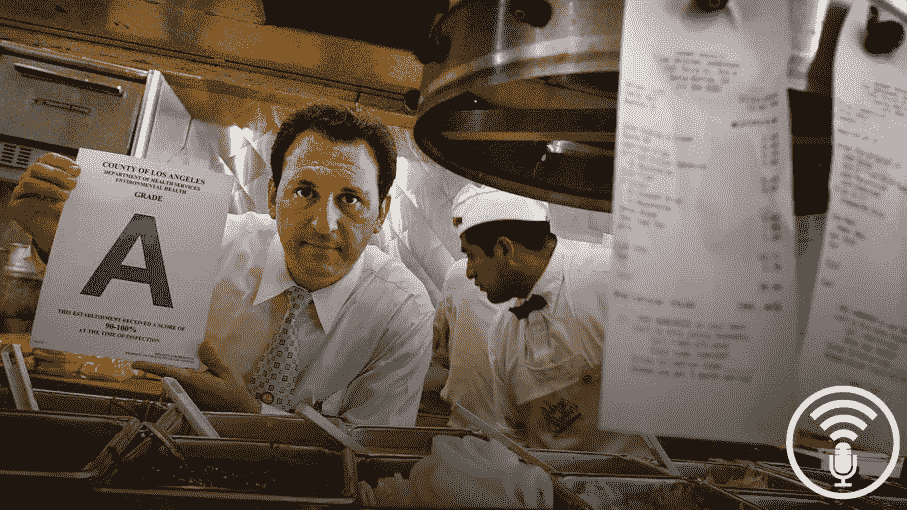**

**根据我的经验，我有相对较好的信心认为这些数据接近事实，但这种探索仍然表明了盲目训练模型的危险，因为“数据说什么，数据就说什么！”。**

**一个模型会学习它被训练的数据中的任何东西。**

****数据科学家的人类偏见:**
我试图通过让一个模型认为中国餐馆很恶心来证明这一点。在我找到一个能证明我观点的模型后，我停了下来。这样，我在文章中展示的模型也代表了我的偏见。**

**我在寻找一种利用数据来证明我的观点的方法，当我找到这样做的方法时，我就停止了。试图提出另一个观点的人可能也会让数据支持他们的观点。**

****模型复杂度成本:**
在我们的例子中，我应用的 TF-IDF 技术相对简单易懂，我们可以看到哪些词与目标变量相关。**

**但是如果我使用更先进的技术呢？**

**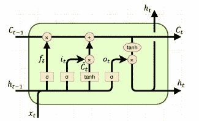**

**如果我用 word2vec + LSTM RNNs 举例呢。更复杂的模型，如具有单词嵌入的 RNN，能够理解数百个单词之外的文本内容中单词之间的关系，并且具有类似于人类记忆的长期和短期记忆。**

**对于如此复杂的模型，要“诊断”为什么模型会预测某些预测结果要困难得多。**

**像谷歌这样的公司肯定也有成千上万的功能和模型，它们不仅理解功能，还理解这些功能之间复杂的交互和关系，什么人可能理解这样一个模型的工作方式？**

**如果我们不明白为什么模型是准确的，我们还能相信准确的模型吗？**

# **结论**

**该数据集中有 22，000 个检查，5，000 个被检查的独特企业，以及大约 50 个邮政编码。**

**我的模型只使用 TF-IDF 和餐馆名称进行预测。**

**如果有人希望构建一个更关注模型准确性的模型，数据集中还包含一些其他重要的功能。**

**其他一些很棒的特性是邮政编码作为一个分类特性。**

**以(北、南、东、西)作为分类或文本特征的街道名称，包含位置的邻域级别上下文。**

**过程描述有“常规”、“跟进至低分”和“第二次跟进至低分”，必须有某种方法来教导一个模型，该模型在较差的检查之后分数通常会上升。我在这次探索中没有使用时间序列，但肯定有办法。**

**日期，也许卫生检查员周一更暴躁？**

**这就是我对一个数据集的分析，这个数据集既与我个人密切相关，也与我毫不相关(外出就餐时，我“相信自己的直觉”)。**