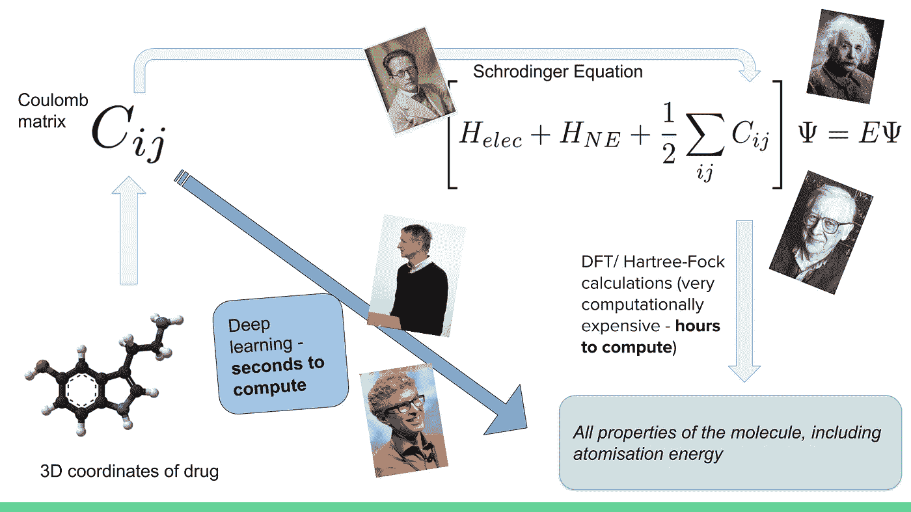
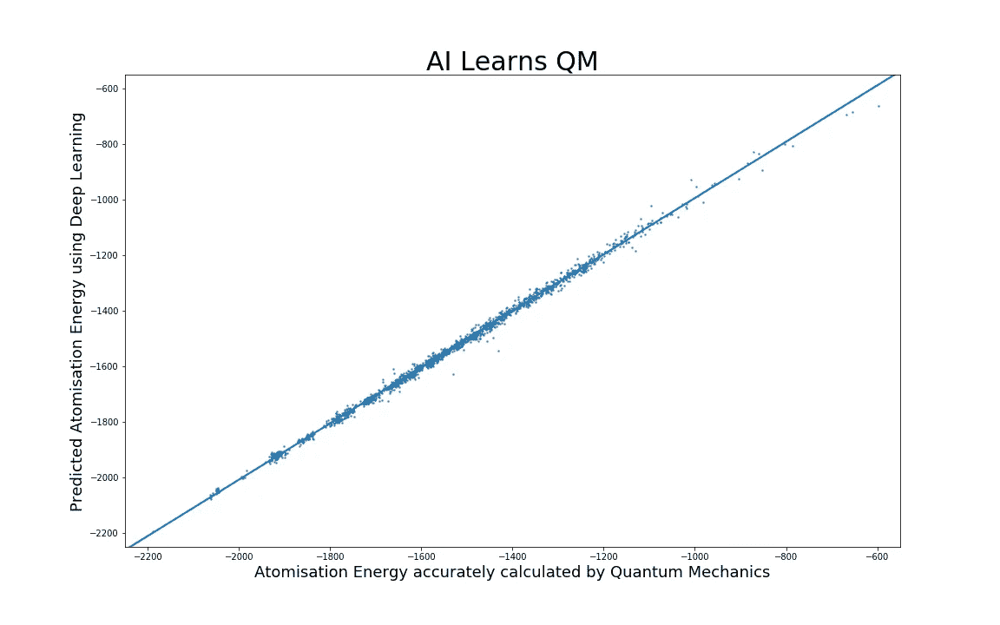
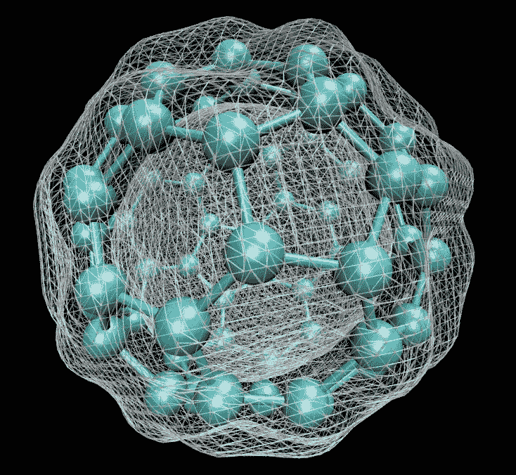
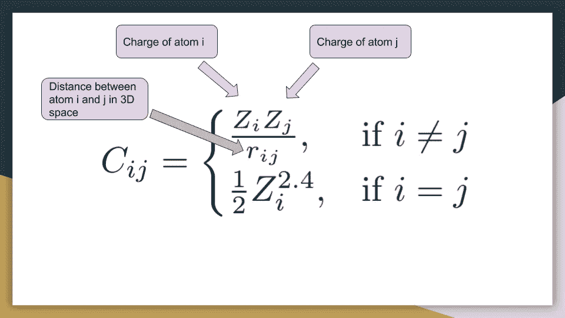
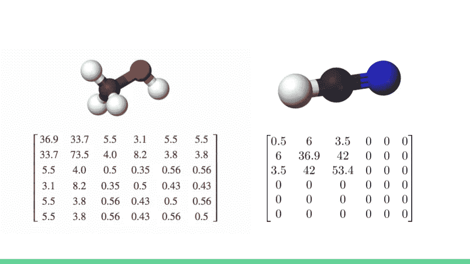
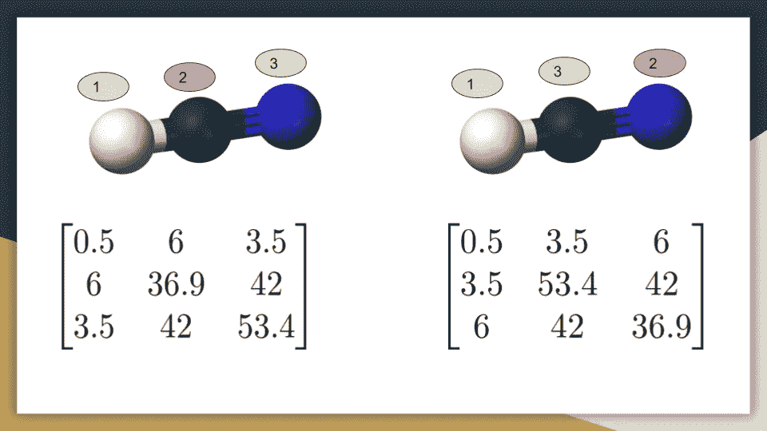
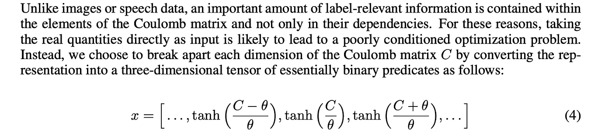
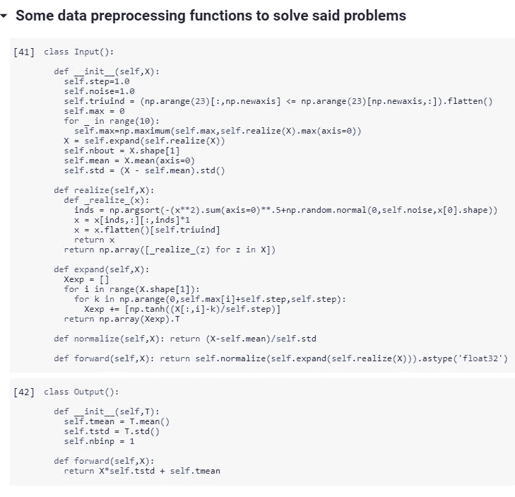
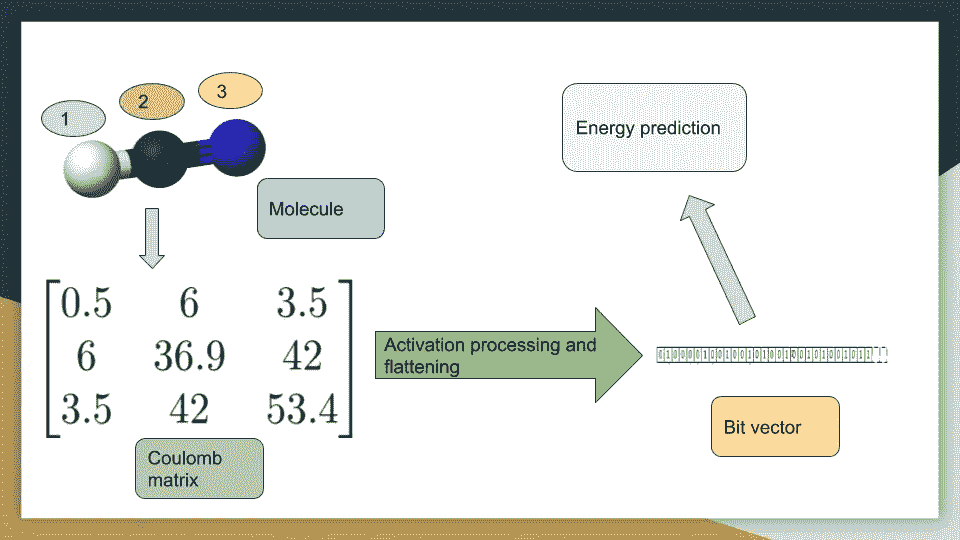
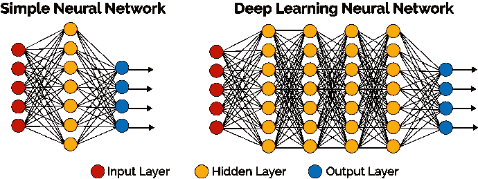

# 教人工智能如何做量子力学

> 原文：<https://towardsdatascience.com/teaching-ai-how-to-do-quantum-mechanics-8ea693b2fa8a?source=collection_archive---------22----------------------->

Pictured top left: Schrodinger, Einstein and Pople. Pictured bottom middle: Hinton and Bengio

## 使用传统的先进方法，精确计算化合物的量子力学性质，如原子化能，可能需要几个小时到几周的时间。这篇文章探索了使用*深度神经网络在几秒钟内计算上述属性，准确率达到 99.8%*。

Training a DNN to predict atomization energy based on a Coulomb matrix input. The average error is 3 kcal/mol, equating to a mind-boggling 99.8% accuracy

答在 20 世纪 20 年代发现*量子力学*之后，科学家们很快意识到从该理论中产生的基本方程只能在最简单的系统中求解(比如氢原子……)。用诺贝尔奖获得者保罗·狄拉克自己的话说:

> “潜在的物理定律必要的数学理论的大部分物理和整个化学[因此完全知道，困难只是这些定律的精确应用导致方程太复杂而无法解决。因此，发展应用](https://en.wikiquote.org/wiki/Chemistry)[量子力学](https://en.wikiquote.org/wiki/Quantum_mechanics)的近似实用方法变得很有必要，这可以导致对复杂原子系统的主要特征的解释，而不需要太多的计算”——保罗·狄拉克，1929

接下来的快速发展是寻找新的近似方法来处理这个复杂的问题。由此产生了两种最先进的方法: [**哈特里-福克理论**](https://medium.com/analytics-vidhya/practical-introduction-to-hartree-fock-448fc64c107b)**(HF)**[**密度泛函理论**](https://en.wikipedia.org/wiki/Density_functional_theory) **(DFT)。**

特别是，在 20 世纪 90 年代，DFT 取得了突破性进展，至今仍保持着领先水平。

今天，DFT 是计算化学和材料科学的基石。例如，它可用于精确模拟大分子的电子密度表面，如[巴克敏斯特富勒烯](https://en.wikipedia.org/wiki/Buckminsterfullerene):

Electron density map of Buckminsterfullerene (C60)

DFT 和 HF 的问题是，要得到准确的结果，还是需要很长的时间:**小时，天甚至几周**。

我们将使用深度神经网络的预测能力将这个时间缩短到几秒钟。

这篇文章附带了一个 Google Colab 笔记本,可以用来阅读和深入研究这里提到的一些过程。

最后，对最初出版这部作品的 [G .蒙塔冯等人](https://pdfs.semanticscholar.org/5761/d22bb67798167a832879a473e0ece867df04.pdf)给予应有的感谢。确实是一个伟大的发现，他们正在继续做一些有趣的事情。

# 1.什么是库仑矩阵，为什么它很重要？

库仑矩阵是一种装置，本质上*存储不同原子相互作用的所有信息*。

准确地说，它储存了分子中所有原子对的成对静电势能。

分子的每个原子都有一个与之相关的 ***电荷*** 。此外，每个原子都有一组表示其在空间中的**位置的 3D 坐标。因此，对于每一对原子，我们记下两个原子的距离。那么**库仑矩阵**就是:**

Definition of the Coulomb Matrix

我们希望使用库仑矩阵作为我们的数据输入，因为它具有**预测能力**。

事实上，给定库仑矩阵，我们可以进行 DFT 或 HF 计算，以精确计算复杂的量子力学性质(库仑矩阵直接进入薛定谔方程——参考前面的图像)。

> *我们本质上是使用库仑矩阵来*隐含地教导机器学习模型关于量子力学的规则。

# 2.库仑矩阵有什么问题？

事实上有三个问题。幸运的是，这些都可以解决，仍然可以产生一个非常有用的模型。

## 2.1 不同大小的分子有不同大小的库仑矩阵。这与机器学习不兼容。

这个问题的解决方案是填充较小分子的库仑矩阵的边缘，就像这样:

幸运的是，我们使用的数据中已经生成了填充库仑矩阵。我们暂时不需要担心这个问题。

## 2.2 存在几个(N！准确地说)标记你的分子的方法——每种标记方案都会产生不同的库仑矩阵。

Different atom labeling leads to different Coulomb matrices of the same molecule

解决这个问题的方法是简单地按照最大原子的顺序对矩阵进行排序。

但是有一个问题——在排序时，我们实际上给矩阵添加了一点噪声，所以每次排序都略有不同。这使神经网络暴露于同一库仑矩阵的几个微小变化，使其更加鲁棒，并防止过拟合。

## 2.3 订单中包含大量与标签相关的信息

这个问题可以通过将库仑矩阵通过激活函数转换成二进制输入(0 和 1)来解决。这方面的细节并不重要，要了解更多细节，以及这篇文章中提到的许多其他细节，请阅读以下内容:[学习原子化能量预测的分子不变表示](https://pdfs.semanticscholar.org/5761/d22bb67798167a832879a473e0ece867df04.pdf)

Converting the Coulomb Matrix into a Binary input

对于以上两个问题，这些输入输出类会整理一下。你可以通过代码工作，或者你不能这样做，只是信任它；)

Stochastic augmentation and input processing functions

# 3.我们的数据是什么？

我们使用了大约 7000 个分子的数据，这些分子具有几个不同的官能团。

对于每个分子，库仑矩阵已经计算出来(这在代码中很容易做到；每个分子的原子坐标都使用 MM94 力场进行了优化——都相当标准。

对于每个分子，我们还使用 DFT 实现计算其*原子化能量*，这是一种量子力学属性。这是我们试图预测的数据，我们将使用计算值来训练我们的神经网络。

The flow of data from molecule to quantum energy prediction

# 4.我们的深度神经网络是什么架构？

我们使用一个非常简单的架构:2 个完全连接的隐藏层，每层分别有 400 和 100 个神经元。

使用 [Xavier 初始化](http://proceedings.mlr.press/v9/glorot10a/glorot10a.pdf)对重量进行初始化。

更复杂的架构有很大的发展空间(请随意尝试，如果发现更好的，请告诉我)，但这个简单的结构适用于这个问题。

We used something somewhere in between these two…

我们使用 [Adam 优化器](https://machinelearningmastery.com/adam-optimization-algorithm-for-deep-learning/)来最小化我们的 MSE(均方误差)损失函数。

神经网络在 Google 的 [Tensorflow](https://www.infoworld.com/article/3278008/what-is-tensorflow-the-machine-learning-library-explained.html) 库中实现，代码在 [Colab 笔记本](https://github.com/aced125/Coulomb_matrix_Medium_blogpost/blob/master/Notebook_accompanying_blogpost.ipynb)中。

# 5.结果

如果你想深入了解更多细节，请点击这里查看 Google Colab 笔记本。

您应该能够毫无问题地运行它，并且神经网络应该训练得非常快(大喊免费 GPU 的 Google Colab)。

回归的结果如下所示。很好，如你所见…

The straight line represents a perfect prediction while the scattered points represent predictions made by the DNN

# 6.后续步骤

要深入探究这篇博客文章中的更多概念，请继续阅读发表这项研究的[原始论文](https://pdfs.semanticscholar.org/5761/d22bb67798167a832879a473e0ece867df04.pdf)。

这个研究小组发布了更多关于这个想法的论文，所以一定要去看看。

如果你喜欢这个，给这个帖子鼓掌，在 [LinkedIn](https://www.linkedin.com/in/laksh-aithani-7b0451148/) 上和我联系，告诉我你喜欢什么。下次见！