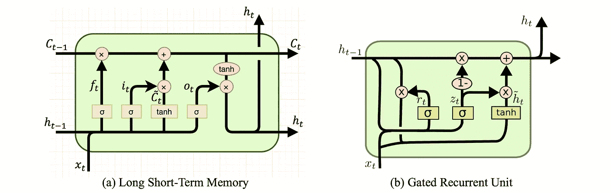

# 教人工智能写流行音乐

> 原文：<https://towardsdatascience.com/teaching-an-ai-to-write-pop-music-df38e608020a?source=collection_archive---------10----------------------->

## 因为谁还有时间自己写呢？

我从来都不擅长写歌词。在我高中的 ska 乐队中，我创作了圆号部分和一些其他乐器，在我大学的一个无伴奏合唱团中，我总是整理已经写好的歌曲的封面。很少有一场斗争让我觉得我可以写一首关于它的歌，但当我写的时候，它们总是俗气和蹩脚的。经过多年的放弃，我终于发现了我需要的工具来解决写歌词的问题，同时将自己从过去的跛脚感或劣质感中分离出来。利用递归神经网络和一个与我心心相印的数据集，我将最终解决几十年来一直存在的问题——写歌词。

The CD that started it all

当我 7 岁的时候，我得到了一张汉堡王的 CD，作为儿童餐的一部分:一张 7 首歌的后街男孩 CD，名为“给粉丝”。这张专辑点燃了我对乐队的爱，这个乐队很快就发行了他们的热门歌曲“我想要那样”。那首歌几乎毫无意义。《我想要那样》是瑞典音乐创作巨星马克斯·马丁在他的英语还不流利的时候写的，这就是为什么这首歌在任何时候表达的意思都不一致。由于其商业上的成功和它的意义，在人工智能生成的歌曲中，“我想要它这样”是一个伟大的一致性基准。

使用生成神经网络模型，我可以从他人的作品中获得灵感，并通过与写歌相关的作家障碍，直接进入编辑阶段。因为我对男孩乐队深深的(和真正的)热爱，我将记录我使用递归神经网络(RNN)编写男孩乐队歌词的人工智能艺术的尝试。这个项目使用的所有代码都在我的 GitHub 上，特别感谢 T2 的丹尼·门多萨的帮助。以下乐队的完整作品用于训练我的模型:

*   后街男孩
*   超级男孩
*   Boyz II Men
*   一个方向
*   我们为什么不呢
*   新来的孩子
*   乔纳斯兄弟
*   通缉犯

LSTM and GRU nodes are great for recognizing sequences in data [Source](https://isaacchanghau.github.io/post/lstm-gru-formula/)

生殖模型绝不是新的，但与人类的艺术相比，通常不会受到重视——明显的例外是售价超过 40 万美元的人工智能生成的艺术作品。有不同的技术用于生成不同类型的艺术——生成对抗网络(GAN)生成图片，而 rnn 由于其识别和创建连贯序列的能力而生成音乐和文字。为了这个项目，我在我的神经网络中使用了门控循环单位(GRU)层，但该领域的同事也成功地使用了长短期记忆(LSTM)网络。

为了收集数据，我结合使用了 web 抓取和 python 包调用。最初，我计划抓取我想要的歌曲的所有歌词，但被狡猾的网络开发者阻止我从他们的网站抓取 700 首歌曲。由于我只能获得艺术家和歌曲名称的列表，所以我使用 PyLyrics 包制作了一个去掉了任何格式和标点符号的歌词列表。我将从我的输出中提取一系列单词来制作一首歌曲，而不使用歌曲本身的任何格式。一旦我有了歌曲的所有歌词，我将所有的单词添加到一个列表中，作为生成 7 个单词长的单词序列的标记。在删除重复序列后，我训练我的 RNN 模型来预测每个序列的最后一个字，给定前 6 个字。下面的函数显示了模型如何获取一个种子词，并生成我们可以选择长度的歌词。

使用我的 RNN 和这个 gen_sequence 函数，我编译了模型的输出来写一首男孩乐队的歌。模型的原始输出在左边，模型被训练的时间在右边。尽情享受吧！

