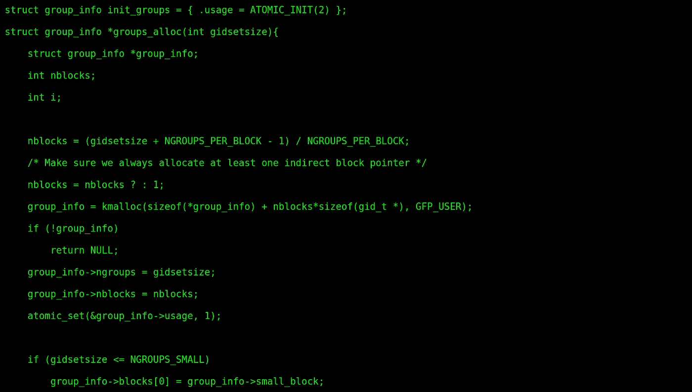
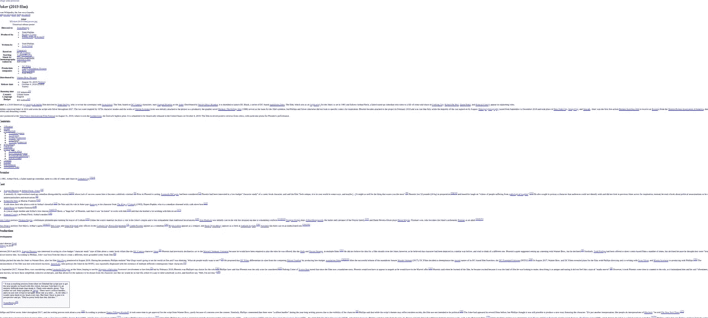
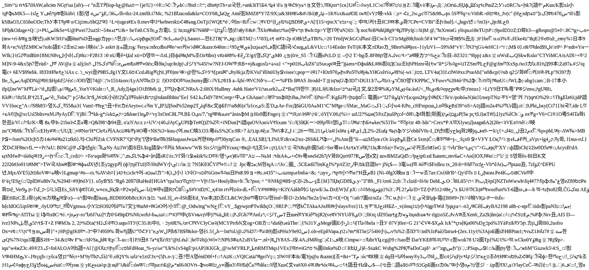
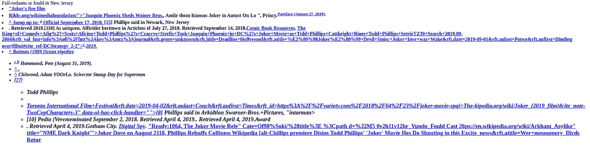

# 教 RNN 人写代码

> 原文：<https://towardsdatascience.com/teaching-an-rnn-to-write-code-84a8e3435f65?source=collection_archive---------27----------------------->

## 请放心，您可以阅读本文的其余部分，知道您的开发职业不会有任何风险。

上学的时候对计算机科学和开发了解不多，偶然发现了[这个很酷的网站](https://hackertyper.net/)。当键盘上的任意键被点击时，它会输出视觉上有意义的代码。它让任何人看起来都像一个专业黑客，整个矩阵都是黑底绿字，发现这个工具意味着巨大的责任，因为它有可能给人留下深刻印象——但这是另一个故事了。



Source code of the matrix ([Cloned from Keanu’s GitHub](https://hackertyper.net/))

几年后，在发现了 RNN 氏症之后，在抽出一些空闲时间从事这个迷你项目之后，我终于有机会目睹了“代码创建”，结果令人捧腹。

## 数据集

对于本文，我决定用两个数据集来训练网络:

1.  我从 https://github.com/gcc-mirror/gcc 的[拿的几个 C 文件。(完全公开——因为我的 C 语言知识是中级的，所以我随机选择了两个看起来足够长的 C 文件)](https://github.com/gcc-mirror/gcc)
2.  HTML 页面——没有任何内联或外部 CSS 或 Javascript。

**框架和平台** 我很喜欢学习 [TensorFlow](https://www.tensorflow.org/) (v2.0)和 [Keras](https://keras.io/) ，但我会将本教程主要放在 TensorFlow 上，并在我认为比 TensorFlow 更容易实现或理解的地方提供 Keras 实现的示例。
我使用过[Google Colab](https://colab.research.google.com/notebooks/welcome.ipynb)——这是一个由 Google 提供的很酷的云服务，允许你完全在云上运行你的 Jupyter 笔记本 env(无论是 CPU 还是 GPU 运行时)

## 想法

在文本生成领域，[递归神经网络——特别是长短期记忆(LSTM)](https://en.wikipedia.org/wiki/Recurrent_neural_network#LSTM) 网络擅长记住给定输入的输出历史，然后相应地预测新的结果。

这听起来可能比实际情况复杂一点，所以让我试着分解一下—
考虑一下正文

> 这只狗被命名为猫。

现在，当我们将此作为训练数据提供给 RNN 时，我们将文本中的每个标记等同于其输出的直接邻居。

Input to Output correlation [ training data ]

每个[i+1]元素被训练为每个第 I 个元素的输出。

## 步伐

## **1。导入库和数据集**

使用 Google Colab 允许我们通过使用 google.colab 连接到 Google Drive 上的数据集。验证您的帐户后，您可以装载驱动器并指向您的数据集。

## **2。准备查找表和数据集**

查找表负责将字符转换为整数，并将整数转换为字符。字符的查找表是建立在我们的文本词汇上的。

现在，我们可以将数据集分成输入(dataX)和输出(dataY)。为了创建数据集，我们通过每个字符的步长来累积输入和输出。这里，每个训练模式是一个字符(输入)的 100 次步进，后跟一个字符输出。我们从文本的开头开始，直到结尾，如果有任何剩余部分，就把它们去掉。

```
sequences = char_dataset.batch(seq_length+1, drop_remainder=True)
char_dataset = tf.data.Dataset.from_tensor_slices(text2int)def split_input_target(chunk):
    dataX = chunk[:-1]
    dataY = chunk[1:]
    return dataX, dataYdataset = sequences.map(split_input_target) 
```

## **3。构建和编译模型**

```
def build_model(vocab_size, embedding_dim, rnn_units, batch_size):
  model = tf.keras.Sequential([
    tf.keras.layers.Embedding(vocab_size, embedding_dim,
                              batch_input_shape=[batch_size, None]),
    tf.keras.layers.GRU(rnn_units,
                        return_sequences=True,
                        stateful=True,
                        recurrent_initializer='glorot_uniform'),
    tf.keras.layers.Dense(vocab_size)
  ])
  return model
```

并且训练模型！这个模型在 Colab 上被训练了 30 个时期

```
model.compile(optimizer='adam',loss=tf.keras.losses.sparse_categorical_crossentropy(target_example_batch, example_batch_predictions, from_logits=True)**)**model.fit(dataset, epochs=EPOCHS, callbacks=[checkpoint_callback])
```

## **4。生成结果**

有两组共享的结果

1.  HTML 数据集——使用的数据集来自维基百科(随机页面),因为它有很多 HTML 属性。我尽可能地删除了内联 CSS，这是训练数据的样子-



(INPUT) looks structured even without most of the CSS elements

下面是模型生成的代码(HTML 预览)


(OUTPUT) Lower temperature predicted output, 5000 predicted characters



(OUTPUT) Higher temperature predicted output, 10k predicted characters

温度越低，文本越容易预测。更高的温度导致更令人惊讶的文本。



OUTPUT: Lower temperature, 10k predicted characters

2.生成 C 代码

胡言乱语，但努力。

感谢您的阅读！