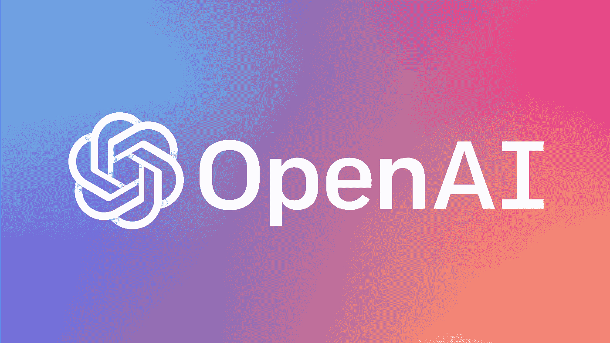

# 教 GPT 2 号变形金刚幽默感

> 原文：<https://towardsdatascience.com/teaching-gpt-2-a-sense-of-humor-fine-tuning-large-transformer-models-on-a-single-gpu-in-pytorch-59e8cec40912?source=collection_archive---------22----------------------->

## 如何在 PyTorch 中单个 GPU 上微调大型变压器模型

Photo by [Ben White](https://unsplash.com/@benwhitephotography?utm_source=unsplash&utm_medium=referral&utm_content=creditCopyText) on [Unsplash](https://unsplash.com/s/photos/laugh?utm_source=unsplash&utm_medium=referral&utm_content=creditCopyText)

在这篇文章中，我演示了如何使用预训练的 GPT-2 来生成文本，然后使用单个 GPU 在特定的语言建模任务中对其进行微调。在这种情况下，我试图通过在笑话数据集上对模型进行微调，让它变得有趣。

# GPT 2 号

最近 OpenAI 团队发表了一篇文章[更好的语言模型](https://openai.com/blog/better-language-models/)，以及一篇技术论文[语言模型是无监督的多任务学习者](https://d4mucfpksywv.cloudfront.net/better-language-models/language_models_are_unsupervised_multitask_learners.pdf)关于训练更大更好的语言模型。他们研究语言模型的能力，以生成连贯的文本，并在零射击设置中解决 NLP 任务，这意味着使用模型解决没有明确训练过的任务。

Image Credit: OpenAI

他们创建了一个基于 [transformer 的](https://arxiv.org/abs/1706.03762)语言模型，他们称之为 GPT-2，并在一个巨大的 40GB 互联网文本数据集上训练它。他们在语言建模任务中训练该模型，该任务是预测单词序列中下一个单词的概率。为语言建模训练 NLP 模型，然后[为特定任务进行微调](http://wiki.fast.ai/index.php/Fine_tuning)是训练 NLP 模型最常见的途径之一。为语言建模预先训练模型是方便的，因为它不需要带标签的数据来学习语言的结构——它只需要纯文本，这是大量公开可用的。大多数公开可用的预训练 NLP 模型是为语言建模而训练的。

他们在训练后生成文本的结果令人印象深刻。这些片段感觉非常人性化和连贯，几乎令人毛骨悚然。此外，该模型在各种语言建模任务(包括摘要、阅读理解和翻译)的零射击设置中获得了最先进的分数。

# 微调实验计划

所以我决定用 GPT 2 号做一点实验。我觉得教模特讲笑话会很有趣。为此，我需要一个笑话数据集和一个预训练的 GPT-2 模型进行微调。

Photo by [Helloquence](https://unsplash.com/@helloquence?utm_source=unsplash&utm_medium=referral&utm_content=creditCopyText) on [Unsplash](https://unsplash.com/s/photos/planning?utm_source=unsplash&utm_medium=referral&utm_content=creditCopyText)

由于人工智能社区和一些特定团队的慷慨，他们发布了预先训练的神经网络模型，解决像这样的挑战性任务的相对廉价的解决方案是可能的。从头开始训练这样的大型神经网络模型将花费数万美元，在某些情况下，甚至数十万美元。在单个 GPU 上，针对新任务对预训练模型进行微调可能需要几个小时。我会做到的。

Huggingface 已经在 PyTorch 中提供了许多[预先训练好的变形金刚](https://github.com/huggingface/transformers)模型以方便使用。我将使用他们预先训练的 GPT-2，并在 Kaggle 上发布的这个[短笑话数据集](https://www.kaggle.com/abhinavmoudgil95/short-jokes)上进行微调。

GPT-2 有 4 种不同的尺寸——小、中、大和 [XL](https://openai.com/blog/gpt-2-1-5b-release/) ，分别有 124 米、355 米、774 米和 1.5 米的参数。我发现，一个中等大小的 GPT-2 模型是我可以在单个 GPU 上用合理的输入序列长度进行微调的最大模型。

Image Credit: Image by [Jay Alammar](https://jalammar.github.io/) from post [The Illustrated GPT-2](https://jalammar.github.io/illustrated-gpt2/)

# 通过生成文本来测试预训练模型

在对笑话的模型进行微调之前，我将在生成文本时对其进行测试。

在下面的要点中，我演示了如何通过使用来自 huggingface 的预先训练好的中等大小的 GPT-2 来生成文本。首先，我将向模型提供以下文本片段，并让它生成其余部分:

> **‘母体’无处不在。它就在我们周围。即使现在，就在这个房间里。当你向窗外看或者打开电视时，你可以看到它。当你去工作的时候，当你去教堂的时候，当你交税的时候，你能感觉到。是这个世界蒙住了你的眼睛，让你看不到真相……'**
> 
> **‘人工通用智能是……’**
> 
> 教父:“我要给他一个他无法拒绝的提议。”… '

**从生成的关于技术的阴谋论，关于 AI 行业的威胁性预测，以及教父与自己的对话来看，我会说文本生成在起作用。**

# 在单个 GPU 上微调模型

大型变压器模型通常在多 GPU(或 TPU)设置中训练，因为在大型模型上训练合理的批量大小和序列长度需要大量张量/图形处理单元内存。我的机器配的是单颗 GeForce 1080 Ti，内存 11 GB。通过对中型 GPT-2 模型的经验测试，我发现我的 GPU 在一个批处理中处理的最大总序列元素数大约是 550，这不是很多，可能不足以成功进行微调。

但是我们可以考虑一些事情来改善这种情况。

首先要注意的是，基于 transformer 的模型的前后传递中的批量大小不起作用，因为使用了[层归一化](https://arxiv.org/abs/1607.06450)而不是批量归一化。在图层归一化中，每个特征在[特征尺寸](https://mlexplained.com/2018/11/30/an-overview-of-normalization-methods-in-deep-learning/)上归一化，不涉及批量尺寸。

第二，我们可以在多次向前-向后过程中累积梯度，然后才进行模型权重更新。这样，我们不必将整个批次的计算图存储在存储器中，但我们可以一个序列接一个序列地处理，并获得相同的结果，就好像整个批次在单次向前-向后传递中被处理一样。

考虑到这一切，我将一次处理一个最大长度为 550 的序列，并对每个 *BATCH_SIZE* 处理的序列进行模型权重更新。

笑话的长度在数据集中变化很大——有许多短序列。为了使一个优化步骤中的总序列元素数更加一致，我将尝试在每个 550 个元素的序列中加入尽可能多的笑话。

# 结果和结论

Photo by [Marcela Rogante](https://unsplash.com/@marchuri?utm_source=unsplash&utm_medium=referral&utm_content=creditCopyText) on [Unsplash](https://unsplash.com/s/photos/laugh?utm_source=unsplash&utm_medium=referral&utm_content=creditCopyText)

教人工智能生成对人类来说很有趣的文本是一个困难的问题，我认为这比生成一个连贯的文本要困难得多。即使对一个人来说，这也不容易做到——这需要一种特殊的创造力，对环境的理解，甚至对人类心理的理解。向语言模型输入许多笑话可能不足以让模型真正了解什么让事情变得有趣。训练人类水平的开玩笑模型可能需要更复杂的技术和更多的数据。

尽管如此，看到这种语言模型的尝试还是很有趣的。偶尔，这个模型会设法产生一个有趣的人类水平的笑话。

**当我开始实验时，我没有注意到数据集中有很大一部分笑话是种族主义和粗鲁的，这意味着你可以在模型生成的笑话列表中预期相同的内容。我为此道歉并做好准备。*

**这里是** [**完整生成的笑话列表**](https://github.com/mf1024/transformers/blob/master/generated_2_jokes.txt) **。**

如果你在生成的笑话列表中看到一些好的和有趣的东西，请在评论中发布。:)我自己也没有全部通读。

这是转贴自我的[原创博客](https://mf1024.github.io/2019/11/12/Fun-With-GPT-2_/)。