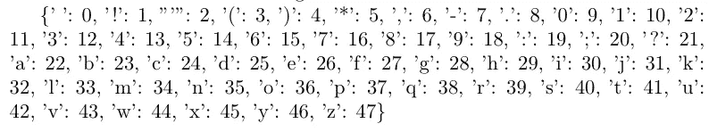
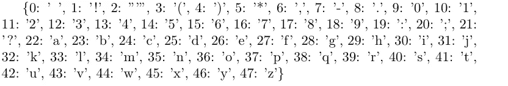
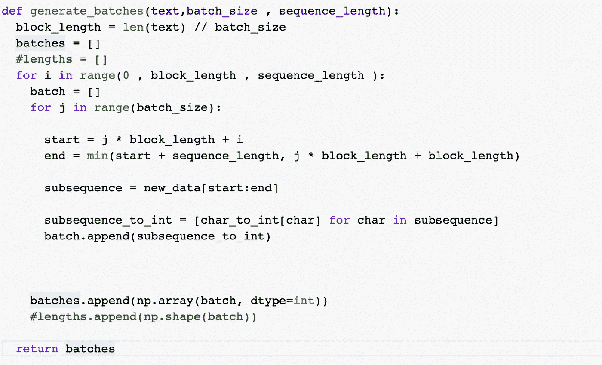
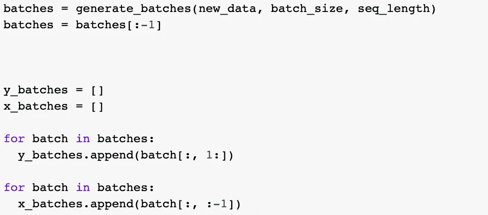
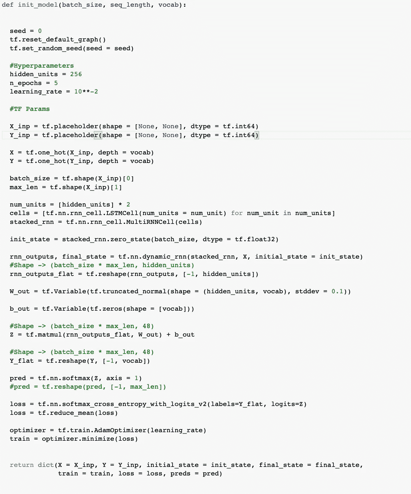
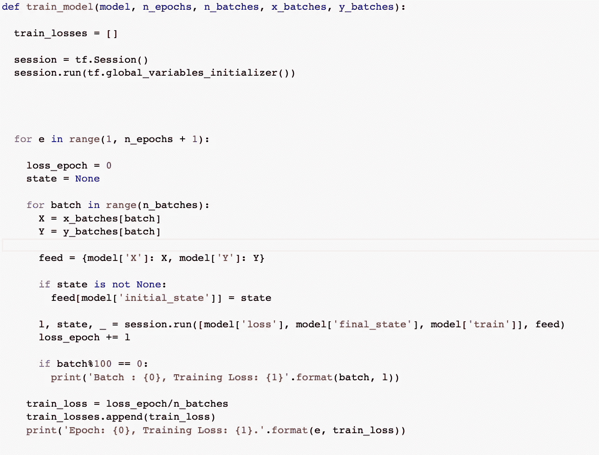
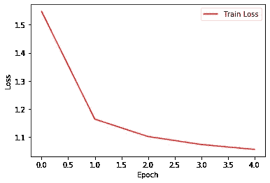
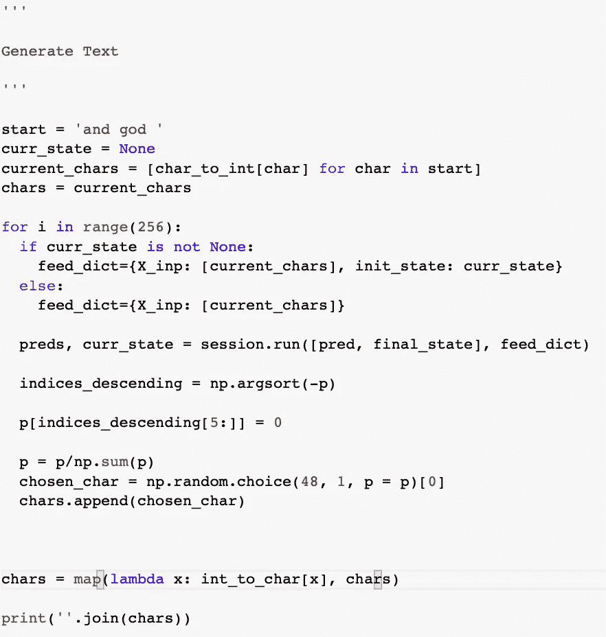

# 教他们扮演上帝

> 原文：<https://towardsdatascience.com/teaching-lstms-to-play-god-1a11c7fe7f37?source=collection_archive---------18----------------------->

## 对初学者友好的角色生成介绍

Photo by [Aaron Burden](https://unsplash.com/@aaronburden?utm_source=unsplash&utm_medium=referral&utm_content=creditCopyText) on [Unsplash](https://unsplash.com/s/photos/the-bible?utm_source=unsplash&utm_medium=referral&utm_content=creditCopyText)

冒着成为另一个“用 RNN 生成文本”教程的风险，想到 Shakespeare 和 Lewis Carrol 在坟墓里为这些普通模型通常生成的文本畏缩不前，我选择了一条不同的路线，但同时决定对此进行挖掘。

《圣经》是人类历史上销量最大、最有影响力的书籍。人类思想、阐述和创造的巨大宝库都围绕着这本书。

这就引出了一个问题——递归神经网络能被很好地训练以产生布道吗？

在这个玩具示例中，我们将通过相对简单的代码行来尝试这一点。我们的期望不高，因为我们将使用一个非常简单的架构。这篇文章的目标是学习如何在 tensorflow 中使用 RNNs 进行文本生成。我以前在 tensorflow 中训练神经网络时确实假设了一些背景，只是我不会解释例如损失函数或 softmax 是如何实现的。

版本:Python 3.6 和 Tensorflow 1.15.0。

我们开始吧！

**数据**

既然深度学习没有数据就无法进行，那我们就来获取一些数据。古腾堡计划有一些精彩的书籍供公众免费使用[多么讽刺啊，因为古腾堡圣经是第一个用活字印刷的文本]。我们将在这里得到国王詹姆士版本。

**预处理**

圣经的结构相对来说比其他书简单。即使这样，我们可能会遇到一些我们不希望被馈入我们的模型的怪异角色。让我们来看看数据:

我们不希望我们的模型学习像' \ '、' { '、' \n '这样的字符。事实上，让我们看看文中独特的人物:

`print(sorted(list(set(data)))`

数字很重要，因为它们表示诗句，其他标点符号也可以，但我们可以没有以下内容:

那更好。这段文字中有 48 个独特的字符。

在我们继续这个模型之前，我们需要做两件小事。这些角色不能以他们本来的样子存在。我们需要对它们进行整数编码，以便能够将它们作为输入数组。类似地，当我们预测字符时，我们需要一种方法将获得的整数再次解码为字符。所以我们可以创建两个字典，一个保存一个字符到一个整数的一对一映射，反之亦然。让我们这样做:

``char_to_int = dict((i, char) for char, i in enumerate(unique_chars))
int_to_char = dict((char, i) for char, i in enumerate(unique_chars))``

在此之前没有什么需要解释的，请检查您是否有以下映射:

Char to int

int to char

**批量生成**

许多深度学习训练碰巧涉及到对数据的大小、形状、结构等做出决定。文本太大，无法一次输入，现实世界中的大多数问题都涉及到比我们目前正在处理的文本更大的尺寸。分批训练不是一件好事。这是必要的。

特别地，RNNs 使用通过时间的*反向传播【BPTT】*进行训练，这基本上是在每个时间步长上展开的传统反向传播。一个很好的引子就是[这个](http://www.wildml.com/2015/10/recurrent-neural-networks-tutorial-part-3-backpropagation-through-time-and-vanishing-gradients/)。

因为我们不能在整个文本上应用 BPTT，所以我们在生成的批处理上应用它。我们如何生成这些批次？这主要是一个设计问题，但是我已经实现了下面的过程:[如果您只对代码感兴趣，可以跳过这一部分]。

(1)将全文分成 16 块。

(2)每个块包含字符序列。我们选择 256 作为我们的序列大小。

(3)我们创建的每个批次 *i* 包含来自每个块的第 *i* 个序列。这个。意味着每批包含 16 个序列，每个序列的大小为 256。这意味着*批次* 1 具有来自*块 1、块 2、…的第一个 256 字符序列。，第 16 块。*同*批次 2、批次 3、…、*等。我们有多少批？总共有`n`个字符，这是标准的中学数学

`n = batch_size * sequence_size * no_of_batches`

当然，这不会总是被整除，这取决于所选择的四个整数值。例如，在我们的例子中，`n = 4233042, batch_size = 16, sequence_size = 256, no_of_batches = 1034`但是如果你仔细观察，最后一批的序列大小不可能是 256，而是一个更小的值【拿出笔和纸，试着算出这个值会是多少】，因为当我们到达最后一批时，我们已经用完了所有的字符。

我们可以放弃这最后一批，以避免以后出现形状不匹配的问题。我们现在有了`no_of_batches = 1033`，所有的阵列都在`(16, 256)`成形。

好了，总之，`1033`批，每批包含 16 个序列，每个序列`256`字符长。

顺便说一下，我描述的整个过程有一个名字——*截断的时间反向传播。*很多细节[这里](https://r2rt.com/styles-of-truncated-backpropagation.html)。

下面是完成我刚才提到的所有事情的代码:

Batch generation

下一个问题是，我们如何创建输入值和目标值？这很简单。考虑下面的例子:

`X -> the dog`。

这方面的目标是:

`Y -> he dog`。

目标向量中的每个字符 *i* 都是输入向量中的第( *i + 1】个字符。注意`Y`是如何比`X`小一个单位尺寸的。这是因为当你到达`X`的最后一个角色时，就没什么可预测的了。因此，我们可以简单地删除`X`中的最后一个字符。这个小小的观察很重要，我们最终得到的`X`和`Y`都是`(16, 255):`*

Creating the Dataset

搞定了。我们现在准备构建我们的模型。

**架构和培训**

我们将选择一个简单的架构——两个隐藏层，一个多单元，每个 LSTM 单元包含 256 个隐藏单元，一个 softmax 输出层包含 *k* 个单元，其中 *k* 是我们数据中唯一字符的数量【有道理，对吗？].

就是这样！

Model Architecture

这应该是不言自明的，除了我为输入和标签添加了一个热编码的部分。注意，在我们的例子中，这将形状`(16, 256)`转换为`(16, 256, k), k = 48`。我选择了少量的时期来检查训练损失是否表现得像它们应该表现的那样——逐渐减少。稍后，您可以随时使用这些超参数。

让我们训练我们的模型:

Train for 5 epochs

请注意，您需要将每个时间步 *t* 的最终状态作为( *t + 1)* 的初始状态。这是至关重要的。

我们得到以下损失曲线:

Train Loss per epoch

漂亮的肘状动作。损失有:`[1.54, 1.16, 1.10, 1.07, 1.05]`

**生成神的话语**

真正有趣的时候到了。让我们用这个简单的模型来生成一些文本:

我们将提供一个开始序列，并要求模型预测开始后的 256 个字符。因为我们的 softmax 返回选择每个字符的概率，所以我们可以灵活地决定选择哪个字符。总是选择最大概率字符会使模型自我重复，表现得像一个无限循环，一遍又一遍地打印相同的值。相反，我们对概率进行排序，取五个最大值，重新归一化，然后从这五个值中随机选择。这引入了产生更好结果的随机性:

Words of God

让我们来看看我们的 LSTMs 发出了什么样的布道:

> 神和耶和华所喜悦的地，我要向耶和华所喜悦的，就是向旷野所喜悦的，和一切耶和华所喜悦的

爆笑！这里还有一些:

> 神也看顾服事他们。那离弃他们如会众之子的，耶和华已经成就了，且喝吧。因为耶和华你的神已经成就了。我却为我应允你。你借着你的光所说的耶和华心之神的分裂
> 
> 神与光。我对他说，这要在我身上发生的事，我们为什么没有信你，又在仇敌中间呢。夫子，我要把这些都预备好了，送给你，放在会众面前

几乎所有这些在语义上都是无意义的，但请注意，这个模型没有任何关于单词、字母或数字是什么，标点符号是什么，结构是什么，语言是什么的信息。经过 5 个时期的训练，我们可以看到一些有趣的结果。例如，它知道很多文本都是以数字开头的。它确实在新的讲道之前增加了正确的数字和冒号的结构。它还学会了在各处添加标点符号，就词汇而言，大部分单词都是正确的。

让我们试试不同的开始顺序，只是为了好玩。这是我们的模型为“耶路撒冷”想出的:

> 耶路撒冷:惟有利未人，他的城要被火烧死，要被咒诅。我设了一个比喻，说，你们就是这地，也是属他们的。没有人奉他的名。他们好像圣灵，他们列祖的话是指着他们说的
> 
> 耶路撒冷，宝座，三匹马，和祭司的仆人陀拉，都归与这俗语。因为众水必流在耶和华殿的坟墓上
> 
> 耶路撒冷，和他们的父。有能力攻击耶和华的，只有这一位，就是耶和华的话是什么，并偶像的挂物。又说，我必服自己的劳苦

有趣的是，它学到了很多，耶路撒冷是一个独特的实体，不与其他字符连接。

自己尝试不同的开始顺序！

**改进和总结意见**

改进可以在许多方面实现。调整超参数，特别是尝试增加历元，稍微降低学习率，增加隐藏单元的数量，以及所有这些的组合。可以引入的一个有趣的超参数是**温度**，它决定了在选择下一个字符时模型选择的保守性/多样性。这里[解释的很好](https://cs.stackexchange.com/questions/79241/what-is-temperature-in-lstm-and-neural-networks-generally)。

我以一个问题作为结束——如果有足够的时间、足够的数据和一个聪明的模型，我们可以生成与人类书写的布道没有区别的布道(就像我们对[画作](https://www.artsy.net/article/artsy-editorial-hard-painting-made-computer-human)所做的那样),我们能给上帝编程吗？但是如果我们可以，我们不是遇到了一个悖论吗？我很想就此展开讨论。

快乐深度学习！

代号:[https://github.com/rwiddhic96/LSTMS_God](https://github.com/rwiddhic96/LSTMS_God)

参考资料:

1.  [https://r2rt . com/recurrent-neural-networks-in-tensor flow-ii . html](https://r2rt.com/recurrent-neural-networks-in-tensorflow-ii.html)
2.  [https://www.tensorflow.org/tutorials/text/text_generation](https://www.tensorflow.org/tutorials/text/text_generation)