# 2020 年你应该读的科技书籍

> 原文：<https://towardsdatascience.com/technological-books-you-should-read-in-2020-82ba23dda054?source=collection_archive---------6----------------------->

## 我们生活在未来。是时候了解一下了。

我们的世界是一个地球村。如果你正在阅读这些文字，你可能有一部可以上网的智能手机。过去的 20 年是科技和我们如何使用科技的疯狂时期。在我们的历史上，我们从未在如此短的时间内看到如此多的突破。这篇文章集中在从不同角度讨论这些变化的书籍上。

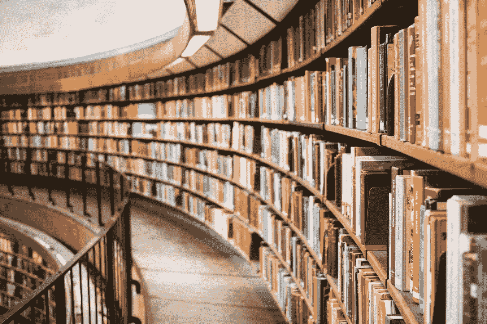

Technology Books you should read in 2020

# 改变世界的创新者

我们都喜欢英雄的故事，他们做出牺牲，失败，一次又一次的失败后回来改变世界。以下书籍关注的是人:

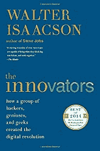

沃尔特·伊萨克森的《创新者》是一本关于有创造力的头脑的书，他们突破界限，与他们的时代背道而驰，并重新发明做事的方式。说到创新，这绝对是经典。

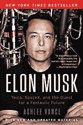

数百万人对埃隆·马斯克又爱又恨。他将电动汽车推向大众和去火星的迷人探索成为头条新闻。[他的传记介绍了他从南非童年到现在的经历。一个惊人的故事仍然揭开。](https://www.amazon.com/gp/product/006230125X/ref=as_li_tl?ie=UTF8&camp=1789&creative=9325&creativeASIN=006230125X&linkCode=as2&tag=petacrunch-20&linkId=3ad87a0f1e234ff54054ad53e709e16a)

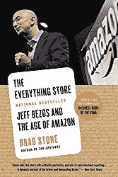

[万物商店](https://www.amazon.com/gp/product/0316219282/ref=as_li_tl?ie=UTF8&camp=1789&creative=9325&creativeASIN=0316219282&linkCode=as2&tag=petacrunch-20&linkId=88e11000b3d828cda217ec475b5bc42b)讲述了亚马逊如何从一个小型在线图书销售商成长为一个全球巨擘的故事，这个巨擘横跨多个行业，并且还在不断成长。读一读就明白为什么总是‘第一天’。

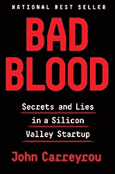

如果你的目标是“不惜一切代价建立一个十亿美元的公司”而不是创新，那么你会犯多大的错误。它展示了硅谷是如何运作的，以及在没有工作原型的情况下你能走多远。

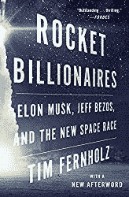

[火箭亿万富翁](https://www.amazon.com/gp/product/1328592812/ref=as_li_tl?ie=UTF8&camp=1789&creative=9325&creativeASIN=1328592812&linkCode=as2&tag=petacrunch-20&linkId=ce218aeb3cd59f97fed0f327ecda1231)展示了火箭工业有多艰难，以及为什么“火箭科学”仍然意味着“艰难，几乎不可能”。它介绍了第一次登月的历史，分析了卫星业务，并解释了为什么私营部门完全改变了火箭工业。任何对太空感兴趣的人都必须阅读。

# 人工智能来了

技术可以有许多面孔，但最近主要的一个是人工智能。不管我们想不想，我们都在使用它。下面的书解释了我们是如何来到这个时代的，以及未来等待我们的可能是什么。

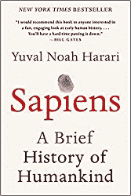

哈拉里的《T2 智人》以令人信服和连贯的方式展现了我们的历史。从我们古老的祖先到现在，从简单的工具到互联网和智能手机，这个故事是一个很好的读物，可以让我们了解为什么我们是人类。

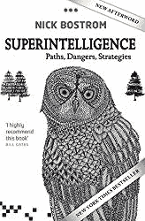

[超智能](https://amzn.to/35rxe1B)是人工智能和人工通用智能的经典参考。尼克·博斯特罗姆列出了其他作者经常使用的所有理论。对于任何想知道人工智能将如何改变世界的人来说，这是一本好书。

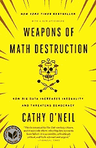

[数学毁灭的武器](https://www.amazon.com/gp/product/0553418831/ref=as_li_tl?ie=UTF8&camp=1789&creative=9325&creativeASIN=0553418831&linkCode=as2&tag=petacrunch-20&linkId=a300cb0ddcce140497befcbd6459eaa6)是一本关于数学的书。凯茜·奥尼尔展示了我们的世界是如何被算法统治的，以及我们如何让算法为我们做出决定。既迷人又可怕。

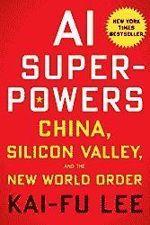

《人工智能的超能力》是解释人工智能如何在商业中使用以及中国如何利用人工智能造福人类的一个很好的参考。作者解释了硅谷和中国初创企业生态系统之间的差异。

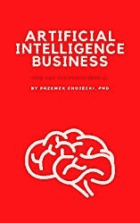

[人工智能商业](https://amzn.to/37kBr99)是针对商业人士和以商业为导向的数据科学家的人工智能简明指南。注重实际，关注最新趋势。

如果你想找更多的书籍推荐，可以看看我的其他书单:

*   [人工智能书籍](/artificial-intelligence-books-you-should-read-in-2020-4d3cecd21efa)
*   [数据科学书籍](http://www.datasciencerush.com)
*   [机器学习书籍](/machine-learning-books-you-should-read-in-2020-344b44d9a11e)
*   [启动书](/startup-books-you-should-read-in-2020-ba8684000128)

 [## 加入我的技术时事通讯

敬请关注更多关于人工智能和技术的文本。](https://creative-producer-9423.ck.page/c3b56f080d) 

Data Science Job

最后，如果你想了解成为一名数据科学家意味着什么，那么看看我的书[数据科学工作:如何成为一名数据科学家](https://amzn.to/3aQVTjs)，它将指导你完成这个过程。