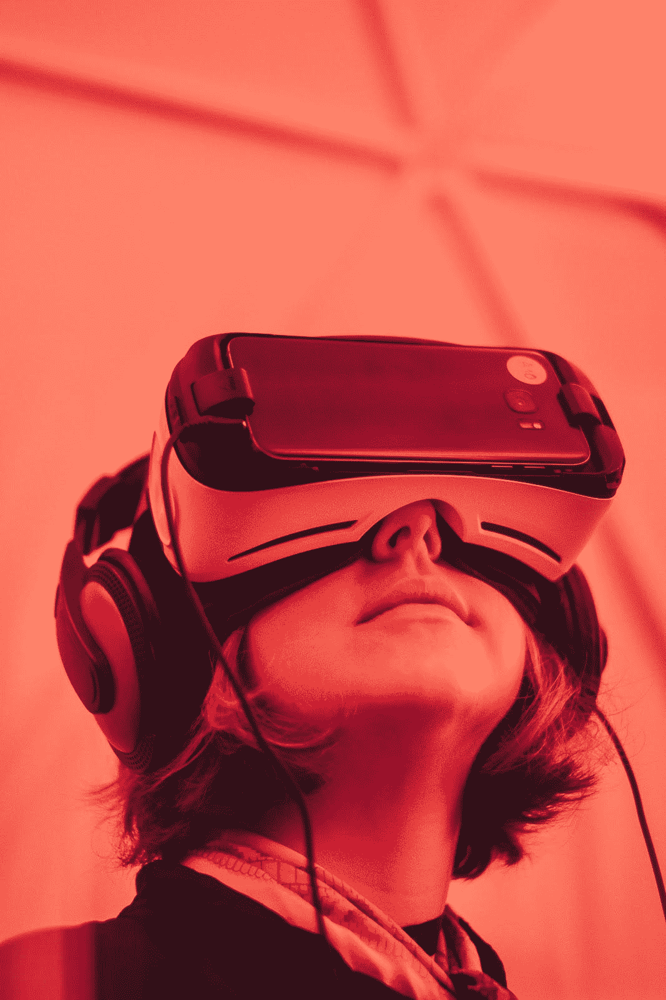
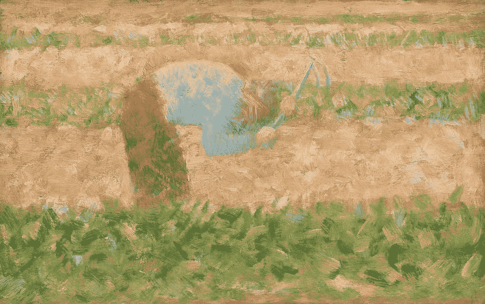
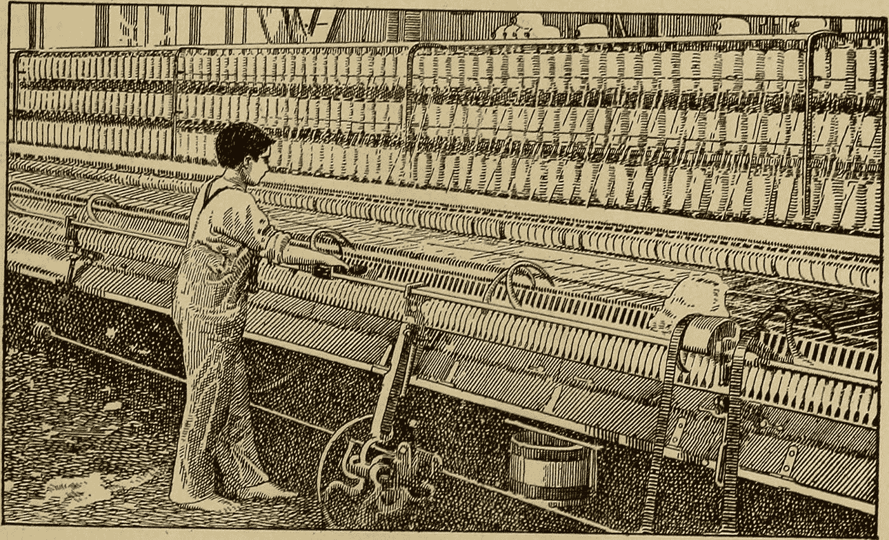
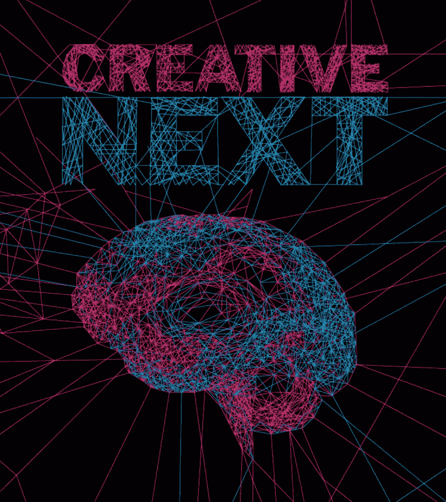

# 技术和创造力的起源

> 原文：<https://towardsdatascience.com/technology-and-the-origins-of-creativity-1820791875e2?source=collection_archive---------21----------------------->

## 人工智能和新兴技术给人类带来了强大的新工具，但我们准备好向它们过渡了吗？

德克·克内梅尔和乔纳森·福利特

The Smartware Evolution [Photo: Girl With VR Goggles, by Samuel Zeller on Unsplash]

## **智能软件的发展**

我们正处于计算技术的下一次重大变革的风口浪尖，这将为我们的工作和生活带来重大变化。虽然人工智能(AI)受到了媒体的极大关注，但它正在与一系列其他新兴和补充技术同步成熟，我们认为这些技术是智能软件——从物联网(IoT)到虚拟和增强现实，再到添加制造/ 3D 打印——决定了自动化系统可以并将如何与我们互动、协助我们并向我们营销。不仅将这些技术本身视为变革性的，而且将其视为从第一台计算机开始的进程的延续，这是很有用的。每一次进步，从个人电脑到互联网再到手机，我们的技术优势都在增加。在过去的 40 年里，随着我们采用和利用这些工具，我们的社会已经从工业经济过渡到信息经济。

这种演变将会破坏稳定，以一种最终看起来类似于我们从农业经济向工业经济演变的规模改变世界。人们的生活将会受到影响，几十年后，世界将会变得面目全非。我们已经可以看到无人驾驶汽车等技术的痕迹。尽管由于优步和特斯拉等商业模式各异的公司发生了引人注目的致命事故，它们的发展和采用速度有所放缓，但它们在一些社区仍然引人注目。此外，一些人做出了激烈的反应，这让人想起了 19 世纪 10 年代英国的勒德分子。[亚利桑那州钱德勒市的人们用石头、刀子袭击了谷歌分拆公司 Waymo 的无人驾驶汽车](https://www.nytimes.com/2018/12/31/us/waymo-self-driving-cars-arizona-attacks.html)，甚至用武器威胁这些汽车。尽管在过去两年里，这类攻击只有 21 起，但对人工智能和其他相关新兴技术进步的不安是显而易见的。无人驾驶汽车可能还需要数年或十年的时间，才能将典型的人类司机转变为无人驾驶交通工具的乘客，但它已经预示了它将对社会产生的深远影响。

人工智能和自动化带来的越来越多的技术杠杆提供了创造和摧毁工业、工作和生活方式的能力。为了以积极的方式改变和改善我们的生活，我们需要适应性策略来准备与智能机器的合作。

## **前车之鉴**

我们的人类生态——我们与自然和人造环境以及彼此之间的关系——将会发生变化。但是，如果这能让你感到安慰的话，作为一个物种，我们已经经历过多次这种类型的转变。历史上，我们和我们的技术一起发展。为了更好地理解人类与技术和创造力之间关系的人类学基础，我们采访了东北大学的人类学家和社会学家 Carie Little Hersh 博士。她教了我们很多东西。首先，你知道科技实际上早于人类吗？所以，某种意义上，它甚至不是“我们的”。最早的技术比人类智人早几百万年:石器至少可以追溯到南方古猿。不管怎样，技术现在是我们独有的东西，而且只会加速发展。赫什博士带我们回到大约 10，000 年前，以说明技术和人类生态之间的相互作用是如何齐头并进的。

Figure 01 — New Tools for Food Production
[Image: “Man with a Hoe”, c. 1882, Georges Seurat, (Open Access Image from the National Gallery of Art)]

赫什博士说:“从狩猎和采集过渡到农业，特别是复杂的农业，不仅需要新的采集食物的工具，还需要新的建筑工具。”“因为突然间，你不再四处走动，不停地跟踪你的猎物。你需要有长期的技术，比如粘土、制砖、木结构，这些东西会持续很长时间，因为你必须储存你的谷物。你不得不在一个地方生活很长一段时间，可以说是经受了各种天气的考验。但是，它也产生了巨大的社会影响。”

这种情况在从农业到工业的转变中再次发生:“所以，随着工业革命，你确实有了这种技术的爆发，也许，其中一些与这些更大的政治有关，包围土地和创造城市的政治。赫什博士说:“几百年前有一次伟大的城市化。“土地的使用方式发生了变化，人们开始相互交往的方式也发生了变化。因此，所有这些不同的东西都发生了变化，以提供这种环境，这为新技术的发展和新生活方式的体现奠定了基础。”

Figure 02 — The Transition to Industrial Revolution
[Illustration: From the book “Medieval and modern times; an introduction to the history of western Europe form the dissolution of the Roman empire to the present time” (1919) (Library of Congress)]

我们已经看到计算技术创造了全新的产业，尽管机器人自动化与新兴市场合谋摧毁了美国的其他产业。但这仅仅是开始。在未来的几年里，创造性工作者，像我们这样的人，也许还有你，将会看到我们的部分工作越来越自动化。全新一代的行业和工作岗位将会同时出现。这将带来不可预测的挑战和机遇。

## **全球影响和意外后果**

社会学家斯蒂芬·平克(Stephen Pinker)通过他的书和 TED 演讲，依靠一系列统计数据来支持他的论点，即世界比以往任何时候都更好，从而赋予了技术进步人士力量。Hersh 博士带来了更加全球化的视角:

> “你知道，我们每取得一点进展，就会产生一个新问题。当我们还是狩猎采集者和牧民时，全球变暖显然不是一个问题。所以，我们有很多环境和健康的后果来自我们的选择…我们社会发展的方式。不是所有的社会都有同样的问题，也不是所有的社会都有同样的收获。因此，环顾四周，看看这些问题从何而来，以及其他可能的解决方案，将会非常有用。作为这个神奇的技术世界的受益者，我们所有人都有责任保持警惕，帮助保护弱势群体，并更广泛地传播利益。”

我们花了将近 200 年才意识到工业革命对我们的环境有着潜在的破坏性影响。甚至在今天，当我们享受甚至庆祝我们的智能世界所提供的恩惠时，我们很容易忽视我们视野之外的人们生活质量的下降。你不得不怀疑，在技术可能威胁到他们的生计或侵犯他们的生活方式之前，Waymo 的风险管理团队是否预见到他们的车辆会受到害怕未来的人的物理攻击。它提醒我们，将会有意想不到的后果，我们新兴的智能世界将会产生我们无法预料和无法立即意识到的影响。它还提醒我们，作为与 70 多亿人共享这个世界的人，留意那些在我们社区和视野之外的人也很重要。

[*Creative Next*](http://www.creativenext.org) *是一个播客，探索人工智能驱动的自动化对创意工作者，如作家、研究人员、艺术家、设计师、工程师和企业家的生活的影响。本文伴随* [*第一季第一集——技术和创造力的起源。*](https://creativenext.org/episodes/technology-and-the-origins-of-creativity/)

